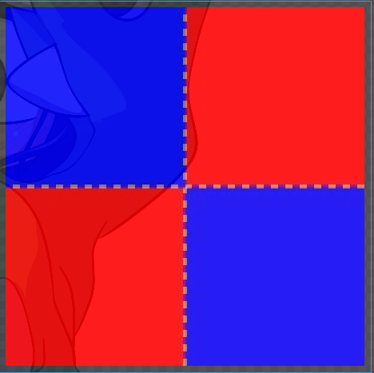
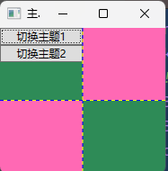
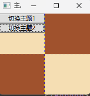
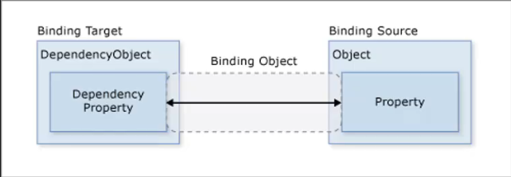
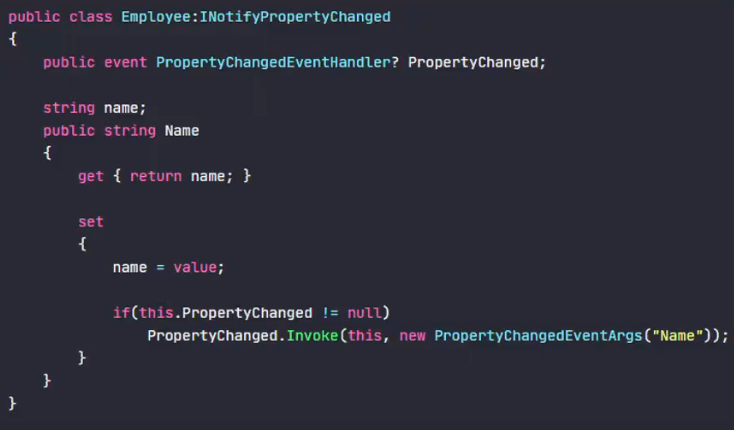
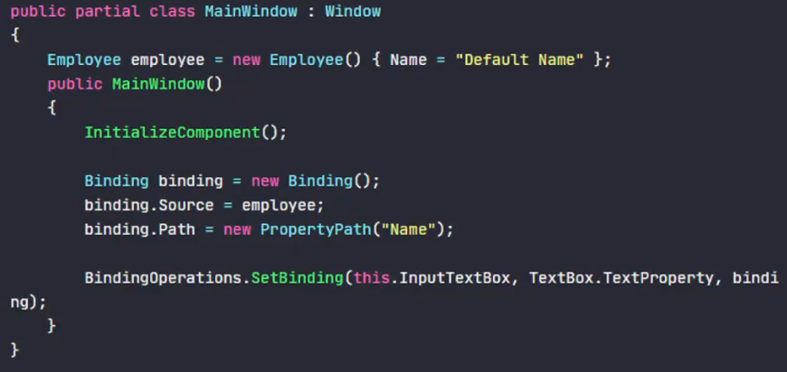
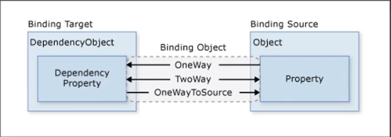
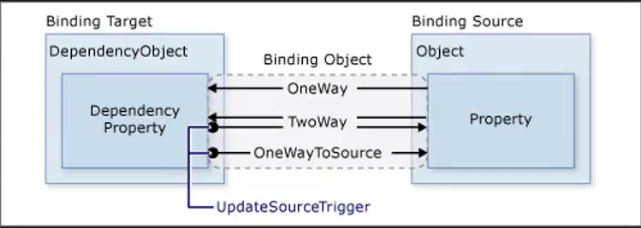

# 概述

> WPF是基于 XAML 、.NET 、向量绘画计算的表现层开发框架

# 架构

### 三层架构

> 以高内聚 、低耦合的思想将程序的功能模块划分为3块


### 数据操作层的划定

> 数据操作层包含公共数据访问代码,是用于操作和交互数据库中数
> 据的逻辑代码
>
> > 将数据操作的逻辑代码置于业务逻辑层时,数据访问成为一种
> > 业务逻辑
> >
> > 表示层对于数据的访问与业务逻辑层对于数据的操
> > 作调用的是相同的方法
>
> > 将所有的数据读取操作存放在数据层时,只需要在业务层再定
> > 义一个方法供表示层调用。

>数据操作在业务逻辑层是应设定数据库操作类
>
>并在业务层定义图书操作类及方法
>
>表示层和业务层都应调用该操作类来驱动数据层
>
>

>数据操作在数据层时应在数据层设定数据操作类
>
>在业务层操作数据层操作类来获取数据
>
>在表现层操作业务层来获取数据
>
>

### 数据交互容器与载体

+ `实体类`

> 在三层架构的各层模块之间,通过对象模型的实体类(Mod)作为数据传
> 递的载体,不同的对象模型的实体类一般对应于数据库的不同表,实体类的属性与数据库表的字段名一致。

> 实体类库是数据表映射的对象,在系统软件开发过程当中,需要建立对象的实例,将关系数据库表采用对象实例化的表示方法来使用,辅助软件开发中对各个系统功能的控制和操作执行,并把数据库表中所有的字段映射为系统对象,进而实现各个层的参数传输

###  三层架构的优点

> + 高内聚、低耦合,可以降低层与层之间的依赖
> + 各层互相独立,完成自己该完成的任务,项目可以多人同
>   时开发,开发人员可以只关注整个结构中的其中某一层
> + 容易移植、维护,如B/S转C/S、SQL Server转Oracle、
>   添加、修改、删除等
> + 有利于标准化和各层逻辑的复用
> + 安全性高,用户端只能通过业务逻辑层来调用数据访问层,
>   减少了入口点

# MVC 和 MVVM 模式

### 表现模式和架构模式

##### 表现模式(Presentation Pattern)

> 通过分离关注点来改进代码的组织方式
>
> 表现模式侧重于解决代码组织,往往使用了多种设计模式,因此其也称作复合设计模式

##### 架构模式(Architecture Pattern)

> 描述软件系统里的基本的结构组织或纲要
>
> 架构模式提供一些呈现定义好的子系统,指定它们的责任,并给出把它们组织在一起的法则和指南

### MVC模式

> MVC模式是GUI界面开发的指导模式
>
> 它基于表现层功能划分的思想把程序分为三大部分：Model--View-Controller,呈三角形结构
>
> Model是数据模型,View是用户界面,Controller是控制器
>
> MVC的设计目的是实现功能结构的规划

+ `模型(Mode)`：处理程序逻辑;获取和存放数据
+ `视图(View)`:显示数据;提供用户交互界面
+ `控制器(Controller)`:处理用户交互;从View读取数据;向Model发送数据

##### MVC之间通信

> 用户请求被路由到控制器,后者负责使用模型来执行用户操作或
> 检索查询结果
>
> 控制器选择要显示给用户的视图,并为其提供所需的任何模型数据


##### MVC和三层架构的关系

> MVC是表现模式(Presentation Pattern),三层架构是典型的架构模式(Architecture Pattern),三层架构的分层模式是典型的上下关系,上层依赖于下层
>
> 但MVC作为表现模式是不存在上下关系的,而是相互协作关系
>
> MVC和三层架构基本没有可比性,是应用于不同领域的技术


### MVVM模式

> MVVM即Model--View-ViewModel,它是一种基于前端开发的表现模式,其核心是提供对 View 和 ViewModel 的双向数据绑定,这使得 ViewModel 的状态改变可以自动传递给View

> ViewModel是MVVM模式的核心,它是连接View和Modell的桥梁
>
> 它有两个方向：
>
> + 将Model转化成View,即将后端传递的数据转化成所看到的页面：`数据绑定`
>
> + 将View转化成Model,即将所看到的页面转化成后端的数据：`事件监听`
>
> 这两个方向都实现的,称之为数据的双向绑定
>
> MVVM在概念上是真正将页面与数据逻辑分离的模式,View和Model彻底分离。


##### MVVM 优点

+ `低耦合`：视图View可以独立于Model变化和修改,一个ViewModel
  可以绑定到不同的View上,当View变化的时候Model可以不变,当
  Model变化的时候View也可以不变
+ `可重用性`：可以把一些视图逻辑放在ViewModel里面,让很多view重用这段视图逻辑
+ `独立开发`：开发人员可以专注业务逻辑和数据的开发,设计人员可以
  专注页面设计
+ `可测试`：界面向来比较难预测时,测试可针对ViewModel来写

### MVC 与 MVVM 的区别

> MVC模型关注的是页面功能的划分,将UI层面上的代码和数据逻辑相
> 关的代码分开,但并不是完全分离,且在于强调控制器的作用

> MVVM在概念上是真正将页面与数据逻辑分离的模式,View和Model
> 彻底分离,核心在于提供对View和ViewModel的双向数据绑定,使
> 得Mode和View数据状态的改变可以自动变更

# 驱动

### 事件驱动

> 事件驱动通过`事件一订阅一事件处理`的关系组织应用程序
>
> 事件驱动下,用户进行每一个操作会激发程序发生的一个事件,事件发生后,用于响应事件的事件处理器就会执行。
>
> MVC模式即使用事件驱动
>
> 事件驱动下界面控件是处于主动地位的,界面逻辑和业务逻辑的桥梁是事件,界面逻辑和业务逻辑间多少会有关联性、依赖性
>
> 而数据是被动的、静态的,等待控件的事件去驱动

### 数据驱动

> MVVM模式则是典型的数据驱动模式
>
> 数据驱动的理念下,数据占主动地位,也就是由内容决定形式
>
> 数据驱动的桥梁是双向数据绑定,通过Data Binding可以实现数据流向界面,界面也可以将数据流回数据源

# XAML

> XAML(Extensible Application Markup Language)是微软创造的一种新的可扩展应用程序标记语言,是WPF中专门用于设计UI的语言,是一种单纯的声明型语言

### 初始默认结构

+ 定义页面 - MainWindow.xaml

```xaml
<Window x:Class="StandardTest.MainWindow"
        xmlns="http://schemas.microsoft.com/winfx/2006/xaml/presentation"
        xmlns:x="http://schemas.microsoft.com/winfx/2006/xaml"
        xmlns:d="http://schemas.microsoft.com/expression/blend/2008"
        xmlns:mc="http://schemas.openxmlformats.org/markup-compatibility/2006"
        xmlns:local="clr-namespace:StandardTest"
        mc:Ignorable="d"
        Title="MainWindow" Height="450" Width="800">
    <Grid>

    </Grid>
</Window>
```

>- `<Window>` 
>
>  元素表示一个窗口
>
>- `x:Class="StandardTest.MainWindow"`
>
>  属性指定窗口的代码访问名称,即隐藏代码文件,在编译时XAML会和指定类合并
>
>- `xmlns="http://schemas.microsoft.com/winfx/2006/xaml/presentation"` 
>
>  属性指定 XAML 命名空间
>
>- `xmlns:x="http://schemas.microsoft.com/winfx/2006/xaml"` 
>
>  属性指定 XAML 扩展命名空间
>
>- `xmlns:d="http://schemas.microsoft.com/expression/blend/2008"` 
>
>  属性指定 Blend 命名空间
>
>- `xmlns:mc="http://schemas.openxmlformats.org/markup-compatibility/2006"` 
>
>  属性指定标记兼容性命名空间
>
>- `xmlns:local="clr-namespace:StandardTest"` 
>
>  属性指定本地命名空间
>
>- `mc:Ignorable="d"` 
>
>  属性指定 Blend 设计器应忽略 `d` 命名空间中的元素
>
>- `Title="MainWindow"` 
>
>  属性指定窗口的标题。
>
>- `Height="450"` 
>
>  属性指定窗口的高度。
>
>- `Width="800"` 
>
>  属性指定窗口的宽度。
>
>- `<Grid>` 
>
>  元素表示一个网格布局。

+ 代码隐藏文件 - MainWindow.xaml.cs

```c#
using System;
using System.Collections.Generic;
using System.Linq;
using System.Text;
using System.Threading.Tasks;
using System.Windows;
using System.Windows.Controls;
using System.Windows.Data;
using System.Windows.Documents;
using System.Windows.Input;
using System.Windows.Media;
using System.Windows.Media.Imaging;
using System.Windows.Navigation;
using System.Windows.Shapes;

namespace StandardTest
{
    /// <summary>
    /// MainWindow.xaml 的交互逻辑
    /// </summary>
    public partial class MainWindow : Window
    {
        public MainWindow()
        {
            // 初始化组件
            InitializeComponent();
        }
    }
}
```

### 标签声明

> 在XAML语言中,使用标签声明一个元素,每个元素对应内存中的一个对象
>
> 可以通过标签的语法进一步声明元素的特征(Attribute)和内容物

### xmlns

> xmlns即XML-Namespace,其一个使用优点是,当要引用的来源不同类重名时,可以使用命名空间加以区分
>
> XAML中命名空间的语法与C#是不同的,在C#中,我们使用usig关键字在代码顶部调用命名空间,在XAML当中的语法格式是：
>
> + xmLns="[命名空间]”  无映射前缀
> + xmlns:[映射前缀]="[命名空间]”  有映射前缀

> 在使用XAML语法声明元素标签时,其对应声明的对象与对象之间的关系要么是包含,要么是并列关系,所以我们又说,XAML的语法结构是一种树形的包含或并列结构
>
> + 界面
>
> 
>
> + 元素表达
>
> 
>
> + 树型关系图
>
> 

### 元素属性赋值

> WPF中用于绘制矩形的类为Rectangle类,该类有一个Fill属性用于对矩形进行颜色填充
>
> Rectangle.Fill的赋值类型式Brush
>
> Brush是画刷,是一个抽象类,其派生类有单色画刷(SolidColorBrush)、线性渐变画刷(LinearGradientBrush)和位图画刷(ImageBrush)等等

```xaml
<Rectangle x:Name="rectangle1 "Width="200" Height="120" Fill="BLue"/>
```


+ 对应的表达形式:

```c#
SolidColorBrush SCB1 new SolidColorBrush();
SCB1.Color = Colors.Blue;
this.rectangle.Fill = SCB1;
```

+ 需要进行复杂赋值时需要精确命中

```xaml
<Rectangle Width="200" Height="120">
    <Rectangle.Fill>
        <SolidColorBrush Color="BLue" />
    </Rectangle.Fill>
</Rectangle>
```

+ 进行镜像渐变填充

```xaml
<Rectangle Width="200" Height="120">
    <Rectangle.Fill>
        <LinearGradientBrush>
            <LinearGradientBrush.StartPoint>
                <Point X="0" Y="1"></Point>
            </LinearGradientBrush.StartPoint>
            <LinearGradientBrush.EndPoint>
                <Point X="1" Y="0"></Point>
            </LinearGradientBrush.EndPoint>
            <LinearGradientBrush.GradientStops>
                <GradientStopCollection>
                    <GradientStop Color="Red" Offset="0"></GradientStop>
                    <GradientStop Color="Yellow" Offset="0.5"></GradientStop>
                    <GradientStop Color="Blue" Offset="1"></GradientStop>
                </GradientStopCollection>
            </LinearGradientBrush.GradientStops>
        </LinearGradientBrush>
    </Rectangle.Fill>
</Rectangle>
```


### XAML属性赋值的简化

+ 能使用直接特征赋值就不使用元素属性赋值的形式
+ 充分利用默认值
+ 允许使用XAML的简写形式

### 标记扩展 - TODO

> XAML标记扩展构成了XAML中的一项重要功能,允许将属性设置为从其他源间接引用的对象或值
>
> XAML标记扩展对于共享对象和引用整个应用程序中使用的常量特别重要,但它们在数据绑定中找到了最大的效用

### 事件处理

> NET的事件处理机制中,可以为对象的某个事件指定一个能与该事件匹配的成员方法,当这个事件发生时,NET运行时就会去调用这个方法,表示对这个事件的响应和处理

```xaml
<!-- Click对应的事件 -->
<Button Click="ShowDialog">点击触发事件</Button>
```

```c#
// 事件处理函数
private void ShowDialog(object sender, RoutedEventArgs e)
{
    Console.WriteLine(sender.ToString());
    Console.WriteLine(e.ToString());
    MessageBox.Show("触发事件!");
}
```

### XAML的注释

+ XAML的注释只能出现在标签的内容区域
+ XAML的注释不能用于注释掉标签的特征赋值
+ XAML的注释不能嵌套

```xaml
<!-- 这是注释 -->
```

### XAML命名空间

> XAML命名空间是一种用于在XAML标记中引用不同的类型和属性的机制
>
> XAML命名空间可以将XAML元素和属性与对应的.NET类和成员映射,从
> 而实现对象构造和属性赋值

| 特征            | 标记扩展 | 指令元素 |
| --------------- | -------- | -------- |
| x:Class         | x:Array  | x:Code   |
| x:ClassModifier | x:Null   | x:XData  |
| x:Name          | x:Static |          |
| x:FieldModifier | x:Type   |          |
| x:Key           |          |          |
| x:Shared        |          |          |
| x:Subclass      |          |          |
| x:TypeArguments |          |          |
| x:Uid           |          |          |

#### 特征功能

---

##### x:Class

> 这个特征功能,适用于告诉编译器将当前XAML标签的编译结果与后台中
> 指定的类进行合并
>
> 在使用这个功能声明时需要满足以下要求：
>
> + 此特征功能仅能在根节点声明
> + 根节点类型要与所指示的合并类型保持一致
> + 所指示的类型在声明时必须使用partial关键字

##### x:ClassModifier

> 告诉XAML编译器该便签生成的类具有怎样的访问级别
>
> 对于整个程序集来说,internal和orivate是等价的

##### x:Name

> 告诉XAML编译器为当前的标签生成一个实例,并为这个
> 实例声明一个引用变量

```xaml
<!-- 在XAML为当前标签声明一个名字 -->
<TextBox x:Name="TextBox"></TextBox>
<Button Click="ButtonBase_OnClick">点击</Button>
```

```c#
private void ButtonBase_OnClick(object sender, RoutedEventArgs e)
{
    // 在这里可以直接引用XAML中的控件名,比如这里的TextBox
    TextBox.Text = "Hello World";
}
```

> 

##### x:FieldModifier

> 为引用变量设置访问级别
>
> 默认情况下,字段的访问级别按照面向对象的封装原则被设置成了internal

##### x:Key 与 x:Shared

> 为XAML定义的资源指定一个唯一的标识符,以便在XAML中引用它
>
> 当多次检索到一个对象时,若得到的都是同一个对象,则x:Shared的值为true
>
> 若得到的是该对象的多个副本,则x:Shared的值为false
>
> XAML编译器会为资源隐式添加x:Shared=“true”


#### 标记扩展功能

---

##### x:Type

> 用于一些需要指定类型的属性或参数
>
> 当需要引用的不是数据类型的实例,而是数据类型本身是使用

+ 主页

```xaml
<Window x:Class="StandardTest.MainWindow"
        xmlns="http://schemas.microsoft.com/winfx/2006/xaml/presentation"
        xmlns:x="http://schemas.microsoft.com/winfx/2006/xaml"
        xmlns:d="http://schemas.microsoft.com/expression/blend/2008"
        xmlns:mc="http://schemas.openxmlformats.org/markup-compatibility/2006"
        xmlns:local="clr-namespace:StandardTest"
        mc:Ignorable="d"
        xmlns:wins="clr-namespace:StandardTest.pages"
        xmlns:pre="clr-namespace:StandardTest.presetUI"
        Title="主页" MinHeight="200" MaxHeight="200" MinWidth="200" MaxWidth="200">
    <!-- 首先声明窗口的命名空间 -->
    <!-- 再声明功能性按钮的命名空间 -->
    <StackPanel>
        <!-- 传入页面类型 -->
        <pre:FeedbackButton pagesWindow="{x:Type TypeName=wins:SuggestionComment}">建议页面</pre:FeedbackButton>
        <pre:FeedbackButton pagesWindow="{x:Type TypeName=wins:PositiveComment}">赞赏页面</pre:FeedbackButton>
    </StackPanel>
</Window>
```

+ presetUI下

按钮实例

```c#
using System;
using System.Windows;
using System.Windows.Controls;

namespace StandardTest.presetUI;

// 继承自Button,这样在XAML中就可以直接使用了
public class FeedbackButton : Button
{
    // 定义 Type 为 FeedbackButton 的附加属性
    public Type pagesWindow { get; set; }

    // 创建激发事件
    protected override void OnClick()
    { 
        // 调用父类的OnClick方法
        base.OnClick();
        // 通过反射创建窗口实例
        var window = Activator.CreateInstance(pagesWindow) as Window;
        // 显示窗口
        if (window != null)
        {
            window.Show();
        }
    }
}
```

+ pages下

赞赏页面

```xaml
<Window x:Class="StandardTest.pages.SuggestionComment"
        xmlns="http://schemas.microsoft.com/winfx/2006/xaml/presentation"
        xmlns:x="http://schemas.microsoft.com/winfx/2006/xaml"
        xmlns:mc="http://schemas.openxmlformats.org/markup-compatibility/2006"
        xmlns:d="http://schemas.microsoft.com/expression/blend/2008"
        xmlns:local="clr-namespace:StandardTest.pages"
        mc:Ignorable="d"
        Title="SuggestionComment" Height="100" Width="100">
    <Grid>
        <TextBox>这是建议窗口</TextBox>
    </Grid>
</Window>
```

建议页面

```xaml
<Window x:Class="StandardTest.pages.PositiveComment"
        xmlns="http://schemas.microsoft.com/winfx/2006/xaml/presentation"
        xmlns:x="http://schemas.microsoft.com/winfx/2006/xaml"
        xmlns:mc="http://schemas.openxmlformats.org/markup-compatibility/2006"
        xmlns:d="http://schemas.microsoft.com/expression/blend/2008"
        xmlns:local="clr-namespace:StandardTest.pages"
        mc:Ignorable="d"
        Title="PositiveComment" Height="100" Width="100">
    <Grid>
        <TextBox>这是展示界面</TextBox>
    </Grid>
</Window>
```


##### x:Null

> 可以显式地对一个特征或属性赋一个空值,常用于清除一些设置
>
> 比如将按钮的背景颜色清空
>
> ```xaml
> <Button Content="Cancel"Background="{x:Null}"/>
> ```

##### x:Static

> 用于一些需要使用静态字段或属性的属性或参数

```c#
// 声明静态成员
// 在隐藏代码文件中声明
public static string staticTitle = "静态标题";
```

```xaml
<Window x:Class="StandardTest.MainWindow"
        xmlns="http://schemas.microsoft.com/winfx/2006/xaml/presentation"
        xmlns:x="http://schemas.microsoft.com/winfx/2006/xaml"
        xmlns:d="http://schemas.microsoft.com/expression/blend/2008"
        xmlns:mc="http://schemas.openxmlformats.org/markup-compatibility/2006"
        xmlns:local="clr-namespace:StandardTest"
        mc:Ignorable="d"
        Title="{x:Static local:MainWindow.staticTitle}" MinHeight="200" MaxHeight="200" MinWidth="200" MaxWidth="200">
    <!-- local 表示的是引用空间,就是你需要引用类所在的namespace -->
    <!-- MainWindow 表示的是你需要的值所在的类名称 -->
    <!-- staticTitle 表示的是那个有你需要值的公共静态属性或字段 -->

    <StackPanel>
        <Button Click="ButtonBase_OnClick">1</Button>
    </StackPanel>
</Window>
```

#### 指令元素功能

---

##### x:Code

> 可以将本该放置在.Cs文件中的后置代码搬移到XAML中,且需要使用XML语言的<[CDATA[...]>转移标签,写法为：
>
> ```apl
> <Window>
> 	<Grid>
> 	</Grid>
>     
> 	<x:Code>
> 		<![CDATA[
> 		 	..代码内容.…
> 		]>
> 	</x:Code>
> </Window>
> ```

##### x:Data

> 在XAML中定义一个XML数据源,以便在XAML中使用数据绑定或数据模板
>
> x:Data可以用于一些需要指定数据源的属性或数,例如 
>
> + XmlDataProvider.Source
> + XmlDataProvider.XPath
> + XmlDataProvider.Document 
>
> 等

### 资源

> 每个WPF的界面元素都具有(Resources)属性,这个属性的类型为ResourceDictionary类型,其能够以键值对的形式存储资源,当我们需要某个资源时,使用键值对可以索引到资源对象
>
> 我们可以在任何元素上去定义资源,可通过：Ky指令来分配唯一键。

#### 静态和动态资源

+ 静态资源使用(StaticResource)指的是在程序载入内存时,对资源的一次性使用,之后就不再去访问这个资源了
+ 动态资源使用(DynamicResource)指的是在程序运行过程中,仍然会去访问该资源

#### 资源管理形式

+ 直接在窗口对应的xaml中定义资源,这样可以方便地在主窗口中使用资源,但是如果资源很多或者需要在其他窗口或用户控件中使用,就不太合适
+ 在App.xaml中定义资源,这样可以让资源在整个应用程序的范围内共享,实现一致的主题和外观,但是如果资源很多或者需要根据不同的窗口或用户控件进行区分,就不太合适
+ 创建文件夹并创建内容元素为ResourceDictionary的xaml页面,这样可以将资源分组和模块化,方便管理和维护,也可以根据需要在不同的窗口或用户控件中引用或合并资源

> ```apl
> 资源定义的位置:
> 定义在 app.xaml 中,则全局可用
> 定义在 window.xaml 中,则只在当前窗口及其子控件中可用
> 定义在 资源字典.xaml 中,则在引用该资源字典的窗口及其子控件中可用
> ```

> ```xaml
> <!-- 全局资源 -->
> <Application.Resources>
>     <SolidColorBrush x:Key="PresetColor1" Color="Wheat"></SolidColorBrush>
>     <SolidColorBrush x:Key="PresetColor2" Color="Sienna"></SolidColorBrush>
> </Application.Resources>
> 
> <!-- 页面资源 -->
> <Window.Resources>
>     <SolidColorBrush x:Key="PresetColor1" Color="Wheat"></SolidColorBrush>
>     <SolidColorBrush x:Key="PresetColor2" Color="Sienna"></SolidColorBrush>
> </Window.Resources>
> 
> <!-- 定义专用的文件夹结构 存放资源 -->
> <ResourceDictionary xmlns="http://schemas.microsoft.com/winfx/2006/xaml/presentation"
>                     xmlns:x="http://schemas.microsoft.com/winfx/2006/xaml">
>     <SolidColorBrush x:Key="PresetColor1" Color="Wheat"></SolidColorBrush>
>     <SolidColorBrush x:Key="PresetColor2" Color="Sienna"></SolidColorBrush>
> </ResourceDictionary>
> 
> <!-- 以相对路径的方式引用并合并资源字典 -->
> <ResourceDictionary>
>     <ResourceDictionary.MergedDictionaries>
>         <ResourceDictionary Source="/Resources/BrushResources/SolidColorBrush.xaml"></ResourceDictionary>
>     </ResourceDictionary.MergedDictionaries>
> </ResourceDictionary>
> ```

#### 资源定义

##### 静态资源

```xaml
<Window x:Class="StandardTest.MainWindow"
        xmlns="http://schemas.microsoft.com/winfx/2006/xaml/presentation"
        xmlns:x="http://schemas.microsoft.com/winfx/2006/xaml"
        xmlns:d="http://schemas.microsoft.com/expression/blend/2008"
        xmlns:mc="http://schemas.openxmlformats.org/markup-compatibility/2006"
        xmlns:local="clr-namespace:StandardTest"
        mc:Ignorable="d"
        Title="主页" MinHeight="200" MaxHeight="200" MinWidth="200" MaxWidth="200">
    <Window.Resources>
        <!-- 定义页面资源 -->
        <SolidColorBrush x:Key="PresetColor1" Color="Wheat"></SolidColorBrush>
        <SolidColorBrush x:Key="PresetColor2" Color="Sienna"></SolidColorBrush>
    </Window.Resources>
    <Grid ShowGridLines="True">
        <Grid.RowDefinitions>
            <RowDefinition></RowDefinition>
            <RowDefinition></RowDefinition>
        </Grid.RowDefinitions>
        <Grid.ColumnDefinitions>
            <ColumnDefinition></ColumnDefinition>
            <ColumnDefinition></ColumnDefinition>
        </Grid.ColumnDefinitions>

        <!-- 使用静态资源 -->
        <Border Background="{StaticResource PresetColor1}"></Border>
        <Border Grid.Row="0" Grid.Column="1" Background="{StaticResource PresetColor2}"></Border>
        <Border Grid.Row="1" Grid.Column="0" Background="{StaticResource PresetColor2}"></Border>
        <Border Grid.Row="1" Grid.Column="1" Background="{StaticResource PresetColor1}"></Border>

    </Grid>
</Window>
```



##### 动态资源

```xaml
<Window x:Class="StandardTest.MainWindow"
        xmlns="http://schemas.microsoft.com/winfx/2006/xaml/presentation"
        xmlns:x="http://schemas.microsoft.com/winfx/2006/xaml"
        xmlns:d="http://schemas.microsoft.com/expression/blend/2008"
        xmlns:mc="http://schemas.openxmlformats.org/markup-compatibility/2006"
        xmlns:local="clr-namespace:StandardTest"
        mc:Ignorable="d"
        Title="主页" MinHeight="200" MaxHeight="200" MinWidth="200" MaxWidth="200">
    <Window.Resources>
        <!-- 定义页面资源 -->
        <SolidColorBrush x:Key="PresetColor1" Color="Wheat"></SolidColorBrush>
        <SolidColorBrush x:Key="PresetColor2" Color="Sienna"></SolidColorBrush>
    </Window.Resources>
    <Grid ShowGridLines="True">
        <Grid.RowDefinitions>
            <RowDefinition></RowDefinition>
            <RowDefinition></RowDefinition>
        </Grid.RowDefinitions>
        <Grid.ColumnDefinitions>
            <ColumnDefinition></ColumnDefinition>
            <ColumnDefinition></ColumnDefinition>
        </Grid.ColumnDefinitions>

        <!-- 使用静态资源 -->
        <Border Grid.Row="0" Grid.Column="0" Background="{DynamicResource PresetColor1}">
            <StackPanel>
                <!-- 切换资源定义 -->
                <Button Click="ChangeToTopic1">切换主题1</Button>
                <Button Click="ChangeToTopic2">切换主题2</Button>
            </StackPanel>
        </Border>
        <Border Grid.Row="0" Grid.Column="1" Background="{DynamicResource PresetColor2}"></Border>
        <Border Grid.Row="1" Grid.Column="0" Background="{DynamicResource PresetColor2}"></Border>
        <Border Grid.Row="1" Grid.Column="1" Background="{DynamicResource PresetColor1}"></Border>

    </Grid>
</Window>
```





```c#
// 触发事件
private void ChangeToTopic1(object sender, RoutedEventArgs e)
{
    // 更改动态资源
    Resources["PresetColor1"] = new SolidColorBrush(Colors.SeaGreen);
    Resources["PresetColor2"] = new SolidColorBrush(Colors.HotPink);
}

private void ChangeToTopic2(object sender, RoutedEventArgs e)
{
    Resources["PresetColor1"] = new SolidColorBrush(Colors.Wheat);
    Resources["PresetColor2"] = new SolidColorBrush(Colors.Sienna);
}
```

#### Style 资源

> 样式(Style)是一种将一组特征属性值应用到多个元素的方法,用于设置控件的外观属性如长宽、颜色、字体、大小等
>
> WPF中的各类控件元素,都可以自由的设置其样式
>
> 在设定 Style 时,我们需要使用 x:Key 声明键名,并设置目标类型 TargetType ,使用 x:Type 将类型传入
>
> 在 Style 标签的内容区通过 Setter 标签,设置 Property 属性和属性值 Value

```xaml
<Application x:Class="StandardTest.App"
             xmlns="http://schemas.microsoft.com/winfx/2006/xaml/presentation"
             xmlns:x="http://schemas.microsoft.com/winfx/2006/xaml"
             xmlns:local="clr-namespace:StandardTest"
             StartupUri="MainWindow.xaml">
    <Application.Resources>
        <!-- 定义样式键及目标类型 -->
        <Style x:Key="EasyBorder" TargetType="{x:Type Border}">
            <!-- 设置样式 -->
            <Setter Property="BorderBrush" Value="Red" />
            <Setter Property="BorderThickness" Value="2" />
            <Setter Property="CornerRadius" Value="5" />
            <Setter Property="Padding" Value="5" />
        </Style>
    </Application.Resources>
</Application>
```

```xaml
<Window x:Class="StandardTest.MainWindow"
        xmlns="http://schemas.microsoft.com/winfx/2006/xaml/presentation"
        xmlns:x="http://schemas.microsoft.com/winfx/2006/xaml"
        xmlns:d="http://schemas.microsoft.com/expression/blend/2008"
        xmlns:mc="http://schemas.openxmlformats.org/markup-compatibility/2006"
        xmlns:local="clr-namespace:StandardTest"
        mc:Ignorable="d"
        Title="主页" MinHeight="200" MaxHeight="200" MinWidth="200" MaxWidth="200">
    <Grid ShowGridLines="True">
        <Grid.RowDefinitions>
            <RowDefinition></RowDefinition>
            <RowDefinition></RowDefinition>
        </Grid.RowDefinitions>
        <!-- 受影响的控件 -->
        <!-- 使用资源 -->
        <Border Grid.Row="0" Style="{StaticResource EasyBorder}">
        </Border>
        <Border Grid.Row="1"></Border>

    </Grid>
</Window>
```

### 控件模板及触发器

> WPF的ControlTemplate是一种用于定义和自定义控件的外观和结构的模板,它可以完全替换控件的默认模板,实现个性化和复杂的效果
>
> WPF的ControlTemplate有以下几个特点：
>
> + ControlTemplate是一个XAML元素,它可以包含任何类型的UI元素,如布局、形状、图像、文本等,这些元素构成了控件的视觉树(VisualTree)
> + ControlTemplate可以使用TemplateBinding或Binding来绑定控件的属性或数据,从而实现动态的显示和更新
> + ControlTemplate可以使用Triggers来定义控件对不同的条件或事件的响应,如改变属性、播放动画、执行操作等
> + ControlTemplate可以使用ContentPresenter或ItemsPresenter来呈现控件的内容或子元素,从而保留控件的基本功能
> + ControlTemplate可以在Style或ResourceDictionary中定义,并应用到一个或多个控件上,从而实现资源的重用和管理

> WPF的Trigger是一种用于定义和管理XAML资源的触发器,它可以根据不同的条件或事件来改变控件的属性或行为。以下是触发器的类型：
>
> + 基本触发器(Trigger):这种触发器是根据控件自身的依赖属性的值来触发的,例如,当鼠标移动到按钮上时,改变按钮的背景色
> + 数据触发器(DataTrigger):这种触发器是根据绑定的数据的值来触发的,例如,当绑定的数据为真时,显示一个图标
> + 事件触发器(EventTrigger):这种触发器是根据控件的路由事件来触发的,例如,当按钮被点击时,播放一个动画
> + 多条件触发器（MultiTrigger、MultiDataTrigger):这种触发器是根据多个条件的组合来触发的,例如,当控件的属性和绑定的数据同时满足某些值时,改变控件的样式

```xaml
<Application x:Class="StandardTest.App"
             xmlns="http://schemas.microsoft.com/winfx/2006/xaml/presentation"
             xmlns:x="http://schemas.microsoft.com/winfx/2006/xaml"
             xmlns:local="clr-namespace:StandardTest"
             StartupUri="MainWindow.xaml">
    <Application.Resources>
        <!-- Button 的控件模板 -->
        <Style x:Key="ButtonTemplate" TargetType="{x:Type Button}">
            <Setter Property="FontSize" Value="16"></Setter>
            <Setter Property="FontFamily" Value="Microsoft YaHei"></Setter>
            <Setter Property="Background" Value="Red"></Setter>
            <!-- 编辑模板 -->
            <!-- 被编辑的模板其默认值、绑定、触发器、样式、事件等都会被清空 -->
            <Setter Property="Template">
                <Setter.Value>
                    <ControlTemplate TargetType="Button">
                        <!-- 使用 TemplateBinding 或 Binding 来绑定模板中的属性 -->
                        <Border Background="{TemplateBinding Background}"
                                BorderBrush="{TemplateBinding BorderBrush}"
                                CornerRadius="22">
                            <ContentPresenter HorizontalAlignment="Center"
                                              VerticalAlignment="Center" />
                        </Border>
                    </ControlTemplate>
                </Setter.Value>
            </Setter>
            <!-- 编辑触发器 -->
            <Style.Triggers>
                <!-- 定义鼠标悬浮时的触发器 -->
                <Trigger Property="IsMouseOver" Value="True">
                    <Setter Property="Background" Value="Blue"></Setter>
                    <Setter Property="Foreground" Value="Red"></Setter>
                </Trigger>
            </Style.Triggers>

        </Style>
    </Application.Resources>
</Application>
```

```xaml
<Window x:Class="StandardTest.MainWindow"
        xmlns="http://schemas.microsoft.com/winfx/2006/xaml/presentation"
        xmlns:x="http://schemas.microsoft.com/winfx/2006/xaml"
        xmlns:d="http://schemas.microsoft.com/expression/blend/2008"
        xmlns:mc="http://schemas.openxmlformats.org/markup-compatibility/2006"
        xmlns:local="clr-namespace:StandardTest"
        mc:Ignorable="d"
        Title="主页" MinHeight="200" MaxHeight="200" MinWidth="200" MaxWidth="200">
    <Grid ShowGridLines="True">
        <Grid.RowDefinitions>
            <RowDefinition></RowDefinition>
            <RowDefinition></RowDefinition>
        </Grid.RowDefinitions>
        <!-- 绑定控件模板 -->
        <Button Style="{StaticResource ButtonTemplate}">1</Button>
        <Button Grid.Row="1">2</Button>
    </Grid>
</Window>
```

### 数据绑定

#### 数据绑定模型

> WPF中的Binding更多地是表达一种桥梁关系
>
> Binding对象的两端分别是源(Source)和目标(Target)
>
> 
>
> 通常情况下,每个绑定具有四个组件：
>
> + 绑定目标对象(Binding Target-Dependency Object)
> + 目标属性(Dependency Property)
> + 绑定源(Binding Source-Object)
> + 指向绑定源中要使用的值的路径(Path-Property)

##### 使源实现通知能力

> 让数据源的类实现 INotifyPropertyChanged 接口,在属性的set块中激发一个 PropertyChanged 事件
>
> 当我们绑定到这个数据源上时,Binding 对象就会自动侦听来自这个接口的 PropertyChanged 事件
>
> 

##### 实现绑定的后置代码
> 实例化Binding对象,并设置源和路径,使用BindingOperations.SetBinding()实现数据源与目标链接,其三个参数为：目标对象、目标的依赖属性、Binding对象
>
> 
>
> 在实现数据绑定时,我们需要注意下面的要点：
>
> + 建立绑定需要使用Binding对象
> + 在建立绑定时,需要设置源和路径,然后将绑定目标绑定到绑定源
> + 目标属性必须为依赖属性
> + 绑定源对象不限于自定义.NET对象

##### 数据流的方向

> 可以通过设置Binding.Mode来控制数据流：
>
> + OneWay:对源属性的更改会自动更新目标属性,但对目标属性的更改不会传播回源属性
> + TwoWay:更改源属性或目标属性时会自动更新另一方,也就是双向数据绑定
> + OneWayToSource:当目标属性更改时,它会更新源属性,反之则不会
> + OneTime:会使源属性初始化目标属性,但不传播后续更改
>
> 

##### 触发源更新的因素

|       UpdateSourceTrigger值       |       源值更新时间       |
| :-------------------------------: | :----------------------: |
| LostFocus( TextBox.Text 的默认值) |  TextBox 控件失去焦点时  |
|          PropertyChanged          |     键入 TextBox 时      |
|             Explicit              | 应用调用 UpdateSource 时 |



#### Binding源的指定

> 一个对象只要通过属性公开自己的数据,就可以作为Binding的源
>
> 作为 Binding 源的对象需要实现 INotifyPropertyChanged 接口并激发 PropertyChanged? 事件才能使属性具有自动通知 Binding 发生了变化的能力
>
> 除了使用自定义类作为源以外,还有其他不同的形式
