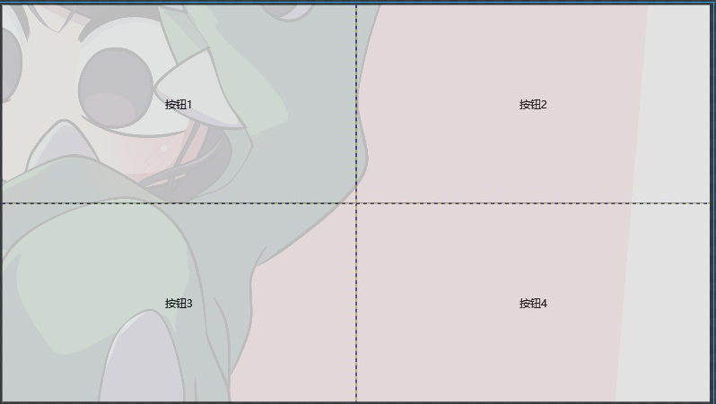

# XAML

# 布局

## Grid 网格布局

#### 基本网格

```xaml
<Window x:Class="StandardTest.MainWindow"
        xmlns="http://schemas.microsoft.com/winfx/2006/xaml/presentation"
        xmlns:x="http://schemas.microsoft.com/winfx/2006/xaml"
        xmlns:d="http://schemas.microsoft.com/expression/blend/2008"
        xmlns:mc="http://schemas.openxmlformats.org/markup-compatibility/2006"
        xmlns:local="clr-namespace:StandardTest"
        mc:Ignorable="d"
        Title="主页" MinHeight="450" MaxHeight="450" MinWidth="800" MaxWidth="800">
    <!-- 基本网格 -->
    <Grid ShowGridLines="True">
        <!-- 行定义 -->
        <Grid.RowDefinitions>
            <!-- 定义行样式 -->
            <RowDefinition></RowDefinition>
            <RowDefinition></RowDefinition>
        </Grid.RowDefinitions>
        <!-- 列定义 -->
        <Grid.ColumnDefinitions>
            <!-- 定义列样式 -->
            <ColumnDefinition></ColumnDefinition>
            <ColumnDefinition></ColumnDefinition>
        </Grid.ColumnDefinitions>

        <!-- 填充内容 -->
        <!-- 默认从左上角开始填充 -->
        <Button Content="按钮1"></Button>
        <Button Content="按钮2" Grid.Row="0" Grid.Column="1"></Button>
        <Button Content="按钮3" Grid.Row="1" Grid.Column="0"></Button>
        <Button Content="按钮4" Grid.Row="1" Grid.Column="1"></Button>
    </Grid>
</Window>
```



#### 行列定位 - 绝对

```xaml
<Window x:Class="StandardTest.MainWindow"
        xmlns="http://schemas.microsoft.com/winfx/2006/xaml/presentation"
        xmlns:x="http://schemas.microsoft.com/winfx/2006/xaml"
        xmlns:d="http://schemas.microsoft.com/expression/blend/2008"
        xmlns:mc="http://schemas.openxmlformats.org/markup-compatibility/2006"
        xmlns:local="clr-namespace:StandardTest"
        mc:Ignorable="d"
        Title="主页" MinHeight="450" MaxHeight="450" MinWidth="800" MaxWidth="800">
    <Grid ShowGridLines="True">
        <Grid.ColumnDefinitions>
            <!-- 绝对值定位 -->
            <!-- 根据 DPI 比例缩放 -->
            <ColumnDefinition Width="100"></ColumnDefinition>
            <ColumnDefinition></ColumnDefinition>
        </Grid.ColumnDefinitions>

        <!-- 填充内容 -->
        <Button Content="按钮1"></Button>
        <Button Content="按钮2" Grid.Column="1"></Button>
    </Grid>
</Window>
```

#### 行列定位 - 星

```xaml
<Window x:Class="StandardTest.MainWindow"
        xmlns="http://schemas.microsoft.com/winfx/2006/xaml/presentation"
        xmlns:x="http://schemas.microsoft.com/winfx/2006/xaml"
        xmlns:d="http://schemas.microsoft.com/expression/blend/2008"
        xmlns:mc="http://schemas.openxmlformats.org/markup-compatibility/2006"
        xmlns:local="clr-namespace:StandardTest"
        mc:Ignorable="d"
        Title="主页" MinHeight="450" MaxHeight="450" MinWidth="800" MaxWidth="800">
    <Grid ShowGridLines="True">
        <Grid.ColumnDefinitions>
            <!-- 比例定位 -->
            <!-- 根据等分比例定位 -->
            <!-- 下面的三个按钮，宽度比例为1:2:3 总共6份 -->
            <ColumnDefinition Width="1*"></ColumnDefinition>
            <ColumnDefinition Width="2*"></ColumnDefinition>
            <ColumnDefinition Width="3*"></ColumnDefinition>
        </Grid.ColumnDefinitions>

        <!-- 填充内容 -->
        <Button Content="按钮1"></Button>
        <Button Content="按钮2" Grid.Column="1"></Button>
        <Button Content="按钮3" Grid.Column="2"></Button>
    </Grid>
</Window> 
```


#### 行列定位 - 自动

```xaml
<Window x:Class="StandardTest.MainWindow"
        xmlns="http://schemas.microsoft.com/winfx/2006/xaml/presentation"
        xmlns:x="http://schemas.microsoft.com/winfx/2006/xaml"
        xmlns:d="http://schemas.microsoft.com/expression/blend/2008"
        xmlns:mc="http://schemas.openxmlformats.org/markup-compatibility/2006"
        xmlns:local="clr-namespace:StandardTest"
        mc:Ignorable="d"
        Title="主页" MinHeight="450" MaxHeight="450" MinWidth="800" MaxWidth="800">
    <Grid ShowGridLines="True">
        <Grid.ColumnDefinitions>
            <!-- 自动定位 -->
            <!-- 根据内容自动定位 -->
            <ColumnDefinition Width="Auto"></ColumnDefinition>
            <ColumnDefinition></ColumnDefinition>
        </Grid.ColumnDefinitions>

        <!-- 填充内容 -->
        <Button Content="按钮1"></Button>
        <Button Content="按钮2" Grid.Column="1"></Button>
    </Grid>
</Window>
```


#### 网格属性

