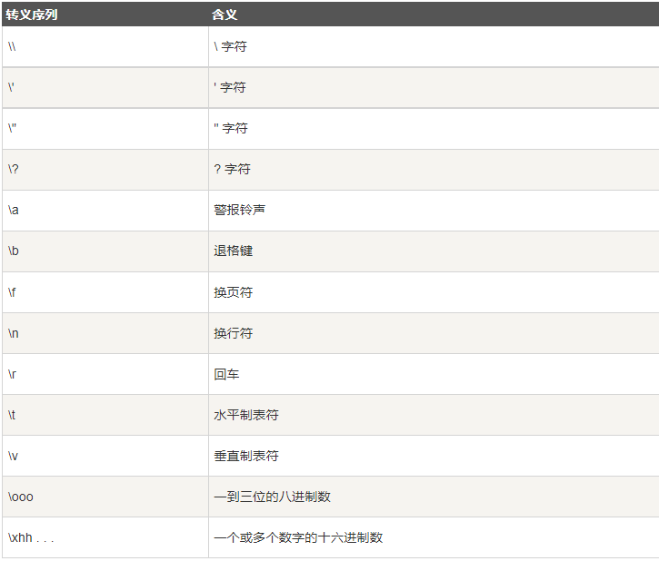

#  	C++ 程序结构

```c++
#include <iostream>
// 引入头文件
using namespace std;
// 命名空间

int main () {  // 程序入口函数
    cout << "Hello World" << endl;
    // 控制台输出
    return 0;
    // 返回值
}
```

```c++
// 与上面等效
#include <iostream>

// 头文件
int main () {
    // 命名空间 :: 控制台输出 \n换行
    std::cout << "Hello World\n";
}
```

# 注释

### 单行注释

```c++
// 命名空间定义
```

### 多行注释

```c++
/*
 * 我是注释耶
 * (＾－＾)V
 */
```

#  变量

```c++
#include <iostream>
using namespace std;

int main () {
    // 变量类型 变量名 = 变量初始值
    int a;
    a = 5;
    int b = 10;
    cout << "a + b = " << a + b  << endl;
}
```

# 常量

```c++
#include <iostream>

using namespace std;
// 常量不可修改
#define day 7
// 宏常量

int main () {
    cout << "一周有 : " << day << " 天" << endl;
    // const 修饰变量
    const int w = 6;
    // w = 9;
    // 修改会报错
}
```

# 基本数据类型

### 整型

```c++
#include <iostream>

int main () {
    // 有符号整型
    int num0 = 10;
    signed int num1 = 10;
    // 无符号整型
    unsigned int num2 = 20;
    // 有符号短整型
    short num3 = 100;
    signed short num4 = 100;
    // 无符号短整型
    short int num5 = 100;
    unsigned short num6 = 100;
    unsigned short int num7 = 100;
    // 有符号长整型
    long num8 = 10000000;
    long int num9 = 10000000;
    signed long int num10 = 100000;
    // 无符号长整型
    unsigned long num11 = 1000000000;
    unsigned long int num12 = 1000000000;
    // 更长整型
    long long num13 = 10000000000000;
}
```

### 字符型

```c++
#include <iostream>

using namespace std;

int main () {
    // 字符型数据
    char str = 'A';
    cout << str << endl;
    char str1 = '3';
    std::cout << str1;
}
```

### 单精度浮点型

```c++
#include <iostream>

int main () {
    // 单精度浮点型
    float f = 0.45f;
}
```

### 双精度浮点型

```c++
#include <iostream>

int main () {
    // 双精度浮点型
    double d = 0.454;
}
```

### 布尔型

```c++
#include <iostream>

int main () {
    // 布尔型
    bool u = true; // 真
    bool d = false; // 假
    std::cout << "true为:" << u << std::endl;
    std::cout << "false为:" << d << std::endl;
}
```

### 无类型

```c++
void
// 指定无类型
```

### 宽字符型

```c++
#include <iostream>

int main () {
    // 宽字符型
    wchar_t A[] = L"ABC";
    std::wcout << A << std::endl;
}
```

### 数据类型内存大小

```c++
#include <iostream>

int main () {
    int num = 10;
    std::cout << "int内存大小为:" << sizeof num << std::endl;
    // 获取数据类型内存大小
    std::cout << "double内存大小为:" << sizeof(double) << std::endl;
}
```

# 转义字符



# 字符串

### 字符串创建使用

```c++
#include <iostream>
using namespace std;

int main () {
    // C 风格
    char str[] = "Hello";
    char str1[] = {'W' , 'o' , 'r' , 'l' , 'd' , '\0'};
    std::cout << str << "\t";
    std::cout << str1 << "\n";
    // C++ 风格
    std::string str2 = "你好世界";
    std::cout << str2 << std::endl;
}
```

### 字符串修改

```c++
#include <iostream>

int main () {
    std::string str = "Hello\tWorld";
    std::cout << str << std::endl;
    str[4] = '!';
    std::cout << str << std::endl;
}
```

# 运算符

### 算数运算符

```c++
#include <iostream>

using namespace std;

// 算数运算符
int main () {
    int sun = 10;
    // 加法运算
    cout << "加法\t" << 1 + 2 << endl;
    // 减法运算
    cout << "减法\t" << 1 - 2 << endl;
    // 乘法运算
    cout << "乘法\t" << 2 * 2 << endl;
    // 除法运算
    cout << "除法\t" << 10 / 2 << endl;
    // 取模运算
    cout << "取模\t" << 10 % 3 << endl;
    // 自增运算
    cout << "自增\t" << ++sun << endl;
    // 自减运算
    cout << "自减\t" << --sun << endl;
    // ++sun 前置  sun-- 后置
}
```

### 赋值运算符

```c++
#include <iostream>

using namespace std;

// 赋值运算符
int main () {
    // 等于运算
    int sun = 10;
    cout << "等于\t" << sun << endl;
    // 加等于运算
    sun += 2;
    cout << "加等于\t" << sun << endl;
    // 减等于运算
    sun -= 4;
    cout << "减等于\t" << sun << endl;
    // 乘等于运算
    sun *= 5;
    cout << "乘等于\t" << sun << endl;
    // 除等于运算
    sun *= 3;
    cout << "除等于\t" << sun << endl;
    // 模等于运算
    sun %= 7;
    cout << "模等于\t" << sun << endl;
    // 左移且赋值运算
    sun <<= 8;
    cout << "左移且赋值\t" << sun << endl;
    // 右移且赋值运算
    sun >>= 2;
    cout << "右移且赋值\t" << sun << endl;
    // 按位与且赋值运算
    sun &= 124;
    cout << "按位与且赋值\t" << sun << endl;
    // 按位异或且赋值运算
    sun ^= 23;
    cout << "按位异或且赋值\t" << sun << endl;
    // 按位或且赋值运算
    sun |= 14;
    cout << "按位或且赋值\t" << sun << endl;
}
```

### 关系运算符

```c++
#include <iostream>

using namespace std;

// 关系运算符
int main () {
    int sun1 = 10;
    int sun2 = 15;
    bool f;
    // 相等
    f = sun1 == sun2;
    cout << "相等\t" << f << endl;
    // 不相等
    f = sun1 != sun2;
    cout << "不相等\t" << f << endl;
    // 大于
    f = sun1 > sun2;
    cout << "大于\t" << f << endl;
    // 小于
    f = sun1 < sun2;
    cout << "小于\t" << f << endl;
    // 大于等于
    f = sun1 >= sun2;
    cout << "大于等于\t" << f << endl;
    // 小于等于
    f = sun1 <= sun2;
    cout << "小于等于\t" << f << endl;
}
```

### 逻辑运算符

```c++
#include <iostream>

using namespace std;

// 逻辑运算符
int main () {
    int sun1 = 1;
    int sun2 = 0;
    int sun3 = 1;
    // 逻辑与
    cout << "逻辑与\t" << (sun1 && sun2) << endl;
    cout << "逻辑与\t" << (sun1 && sun3) << endl;
    // 逻辑或
    cout << "逻辑或\t" << (sun1 || sun2) << endl;
    // 逻辑非
    cout << "逻辑非\t" << (!sun1) << endl;
    cout << "逻辑非\t" << (!!sun1) << endl;
}
```

### 位运算符

```c++
#include <iostream>

int main () {
    unsigned int num1 = 60 , num2 = 13 , num3;
    // 按位与
    num3 = num1 & num2;
    std::cout << num3 << std::endl;
    // 按位或
    num3 = num1 | num2;
    std::cout << num3 << std::endl;
    // 异或
    num3 = num1 ^ num2;
    std::cout << num3 << std::endl;
    // 取反
    num3 = ~num2;
    std::cout << num3 << std::endl;
    // 二进制左移
    num3 = num2 << 2;
    std::cout << num3 << std::endl;
    // 二进制右移
    num3 = num1 >> 5;
    std::cout << num3 << std::endl;
}
```

### 条件运算符

```c++
#include <iostream>

int main () {
    int sun1 = 10;
    int sun2 = 20;
    int sun3 = 0;
    // 表达式1 ？ ture 返回：fales 返回;
    sun3 = (sun1 > sun2 ? sun1 : sun2);
    std::cout << sun3 << std::endl;
    // 对判断成功的变量赋值
    (sun1 > sun2 ? sun1 : sun2) = 100;
    std::cout << sun1 << std::endl;
    std::cout << sun2;
}
```

# 判断

### if  判断

```c++
#include <iostream>

using namespace std;

int main () {
    int feng;
    cin >> feng;
    // if 判断
    if (feng >= 90) {
        cout << "优秀";
    }
}
```

### if  - else 判断

```c++
#include <iostream>

using namespace std;

int main () {
    bool feng;
    cout << "请输入1或0\n";
    cin >> feng;
    // if else 判断
    if (feng) {
        cout << "男";
    } else {
        cout << "女";
    }
}
```

### if -  else if  判断

```c++
#include <iostream>

using namespace std;

int main () {
    int feng;
    cout << "请输入分数\n";
    cin >> feng;
    if (feng >= 600) {
        cout << "优秀";
    } else if (feng >= 500) {
        cout << "还行";
    } else if (feng >= 400){
        cout << "凉凉";
    } else{
        cout << "人生重开吧";
    }
}
```

### switch 判断

```c++
#include <iostream>

int main () {
    int sun;
    std::cout << "打分:" << "5分制";
    std::cin >> sun;
    switch (sun) {
        case 5: {
            std::cout << "佳作";
            break;
        }
        case 4: {
            std::cout << "还行";
            break;
        }
        case 3: {
            std::cout << "一般";
            break;
        }
        case 2: {
            std::cout << "不行";
            break;
        }
        case 1: {
            std::cout << "垃圾";
            break;
        }
        default: {
            std::cout << "5分制看不懂吗?";
        }
    }
}
```

# 循环

### while 循环

```c++
#include <iostream>

int main () {
    int num = 0;
    while (num < 10) {
        std::cout << num << std::endl;
        num++;
    }
}
```

### do - while 循环

```c++
#include <iostream>

int main () {
    int num = 10;
    do {
        std::cout << "先执行，再判断";
    } while (num > 20);
}
```

### for 循环

```c++
#include <iostream>

int main () {
    for (int i = 0 ; i < 10 ; ++i) {
        std::cout << i << std::endl;
    }
}
```

```c++
#include <iostream>

int main () {
    int arr[] = {1 , 2 , 3 , 4 , 5};
    for (int x : arr) {
        std::cout << x << std::endl;
    }
}
```

# 循环控制

### break

```c++
#include <iostream>

int main () {
    int num = 10;
    while (true) {
        if (num == 10) {
            std::cout << "相等";
            // 跳出最近的循环体
            break;
        }
    }
}
```

### continue

```c++
#include <iostream>

int main () {
    int num = 0;
    while (num < 10) {
        if (num % 2 == 1) {
            std::cout << "奇数\n";
            std::cout << num << std::endl;
            num++;
            // 跳过本次循环进入下一次
            continue;
        }
        num++;
    }
}
```

### goto

```c++
#include <iostream>

int main () {
    int num1 = 0 , num2 = 10;
    while (true) {
        if (num1 == num2) {
            // 跳出到标记位置
            goto STOP;
        } else {
            std::cout << num1 << std::endl;
            num1++;
        }
    }
    STOP:
    std::cout << "结束";
}
```

# 数组

### 数组使用

```c++
#include <iostream>

int main () {
    // 数据类型 数组名[大小] = {数组值}
    // 数组初始化时可自动计算大小
    int arr[] = {1 , 2 , 3 , 4 , 5};
    // 数组索引
    std::cout << arr[3] << std::endl;
    arr[3] = 20;
    std::cout << arr[3] << std::endl;;
    // 定义大小却未赋值，0会补位
    int arr1[5] = {1 , 2 , 3};
    for (const auto & item : arr1) {
        std::cout << item << std::endl;
    }
}
```

### 多维数组

```c++
#include <iostream>

int main () {
    // 数据类型 数组名 [行数][列数] = {{数据},{数据}};
    int arr[2][3] = {{1 , 2 , 3} ,
                     {4 , 5 , 6}};
    // 数据类型 数组名 [][列数] = {};
    int arr1[][3] = {1 , 2 , 3 , 4 , 5 , 6};
    // 自动识别行数 示例为 2 X 3
}
```

# 函数

### 函数使用

```c++
#include <iostream>
// 函数声明
int sum (int i1 , int i2);

int main () {
    int s;
    // 调用函数传参
    s = sum(2 , 5);
    std::cout << s << std::endl;
}
// 函数实例
int sum (int i1 , int i2) {
    // 返回值
    return i1 + i2;
}
```

### 函数形参默认值

```c++
#include <iostream>

int sum (int i1 , int i2 = 100);

int main () {
    int s;
    s = sum(2);
    std::cout << s << std::endl;
}

// 形参默认值
int sum (int i1 , int i2) {
    return i1 + i2;
}
```

### 匿名函数

```c++
#include <iostream>

int main () {
    // 匿名函数
    auto arr = [] (int x , int y) -> int { return x + y; };
    std::cout << arr(1 , 2) << std::endl;
}
```

### 函数分文件

+ .h —— 函声明

```c++
int sum (int i1 , int i2);
```

+ .cpp —— 函数实例

```c++
int sum (int i1 , int i2) {
    return i1 + i2;
}
```

+ 导入调用

```c++
#include <iostream>
// 导入
#include "add.h"

int main () {
    // 调用
    std::cout << sum(1 , 2) << std::endl;
}
```

### 函数重载

```c++
#include <iostream>

int num (int i1) {
    std::cout << "int " << i1 << std::endl;
}
// 类型不同个数不同即可调用不同参数
int num (float i1) {
    std::cout << "float " << i1 << std::endl;
}

int main () {
    num(10);
    num(0.4f);
}
```

# 指针

### 指针使用

```c++
#include <iostream>

int main () {
    // 变量创建
    int num = 10;
    // 指针创建
    int * p;
    // 取地址
    p = &num;
    // 输出
    std::cout << *p << std::endl;
}
```

### 空指针

```c++
// 仅初始化使用 不可访问
int * p = NULL;
// 指向系统占用空间
```

### 野指针

```c++
// 非法指向内存空间
int * p = (int *) 0x1100;
```

### 指针常量

```c++
#include <iostream>

int main () {
    int a = 100 , b = 100;
    // 指针常量
    const int * p = &a;
    // 可重新指向，但不能修改指向值
    p = &b;
    // 报错
    *p = 888;
}
```

### 常量指针

```c++
#include <iostream>

int main () {
    int a = 100 , b = 100;
    // 常量指针
    int * const p = &a;
    // 可修改指向值，但不能重新指向
    *p = 666;
    // 报错
    p = &b;
}
```

### 常量指针常量

```c++
#include <iostream>

int main () {
    int a = 100 , b = 100;
    // 常量指针
    const int * const p = &a;
    // 报错
    *p = 666;
    // 报错
    p = &b;
}
```

### 数组指针

```c++
#include <iostream>

int main () {
    int arr[3] = {1 , 2 , 3};
    // 数组指针
    int * p = arr;
    std::cout << *p << std::endl;
    p++;
    std::cout << *p << std::endl;
    std::cout << *(p + 1) << std::endl;
}
```

### 指针数组

```c++
#include <iostream>

int main () {
    int a = 10 , b = 20 , c = 30;
    int * p1[] = {&a , &b , &c};
    std::cout << *p1[2] << std::endl;
}
```

### 指针和函数

```c++
#include <iostream>
// 定义函数指针形参
void add (int * i) {
    *i += 10;
}

int main () {
    int a = 10;
    std::cout << a << std::endl;
    // 传入实参地址
    add(&a);
    std::cout << a << std::endl;
}
```

# 结构体

### 结构体使用

```c++
#include <iostream>

// 结构体定义
struct IG {
    std::string name;
    int age;
    int score;
};
// 别名
typedef struct DB {
    std::string name;
    int age;
    int score;
}yes;

int main () {
    // 实例化
    IG s1 = {.name = "小明" , .age = 22 , .score=100};
    IG s2 = {"小红" , 21 , 99};
    std::cout << s1.name << " - " << s1.age << " - " << s1.score << std::endl;
    std::cout << s2.name << " - " << s2.age << " - " << s2.score << std::endl;

    yes s3 = {"小白" , 21 , 98};
    std::cout << s3.name << " - " << s3.age << " - " << s3.score << std::endl;
}
```

### 结构体数组

```c++
#include <iostream>

// 结构体定义
struct IG {
    std::string name;
    int age;
    int score;
};

int main () {
    // 实例化
    IG s1[] = {{"小明" , 22 , 100} ,
               {"小红" , 22 , 99} ,
               {"小白" , 21 , 98}};
    for (const auto & i : s1) {
        std::cout << i.name << " - " << i.age << " - " << i.score << std::endl;
    }
    IG s2[] = {"小明" , 22 , 100 , "小红" , 22 , 99 , "小白" , 21 , 98};
    for (const auto & i : s1) {
        std::cout << i.name << " - " << i.age << " - " << i.score << std::endl;
    }
}
```

### 结构体指针

```c++
#include <iostream>

struct IG {
    std::string name;
    int age;
    int score;
};

int main () {
    IG s1 = {"小明" , 22 , 100};
    IG * s = &s1;
    // ->型指针
    std::cout << s->name << std::endl;
    std::cout << s->age << std::endl;
    std::cout << s->score << std::endl;
}
```

### 结构体嵌套

```c++
#include <iostream>

// 子结构体
struct student {
    std::string name;
    int age;
    int score;
};


struct teacher {
    int id;
    std::string name;
    int age;
    // 结构体嵌套
    student stu;
};

int main () {
    teacher t1 = {666 , "老王" , 45 , {"小白" , 22 , 99}};
    std::cout << "老师信息:" << std::endl;
    std::cout << "id:" << t1.id << " - 名字:" << t1.name << " - 年龄" << t1.age << std::endl;
    std::cout << "学生姓名:" << t1.stu.name << " - 学生年级:" << t1.stu.age << " - 学生分数:" << t1.stu.score;
}
```

# 引用

### 引用使用

```c++
#include <iostream>

int main () {
    int sum = 10;
    int &A = sum;
    // 引用：和指针相似，但必要引用合法内存
    std::cout << sum << std::endl;
    std::cout << A << std::endl;
    sum = 20;
    std::cout << sum << std::endl;
    std::cout << A << std::endl;
}
```

### 引用函数左值

```c++
#include <iostream>

int & test () {
    // 堆静态引用，程序结束释放
    // 不要返回栈局部引用
    static int a = 100;
    return a;
}

int main () {
    int & A = test();
    std::cout << A << std::endl;
    // 对函数返回值赋值
    test() = 1000;
    std::cout << A << std::endl;
}
```

# 类

### 类使用

```c++
#include <iostream>

#define PI 3.14f

class Cir {
    // 访问权限修饰符
public:
    // 类属性
    int m_r;

    // 方法
    double calcu () {
        return 2 * PI * m_r;
    }
};

int main () {
    // 实例化对象
    Cir c1;
    c1.m_r = 10;
    std::cout << "圆的周长为:" << c1.calcu() << std::endl;
}
```

### 访问修饰符

```c++
class Cir {
public:// 公有成员
    // 公有成员在程序中类的外部是可访问的。您可以不使用任何成员函数来设置和获取公有变量的值
protected:// 受保护成员
    // 私有成员变量或函数在类的外部是不可访问的，甚至是不可查看的。只有类和友元函数可以访问私有成员
private:// 私有成员
    // protected（受保护）成员变量或函数与私有成员十分相似，但有一点不同，protected（受保护）成员在派生类（即子类）中是可访问的
};
```

### 类成员私有化

```c++
#include <iostream>

class Cir {
private:
    // 私有属性
    int Age;
public:
    // 成员函数赋值
    int getAge () const {
        return Age;
    }

    void setAge (int age) {
        Age = age;
    }
};

int main () {
    Cir c;
    c.setAge(19);
    std::cout << c.getAge() << std::endl;
}
```

### 构造函数及析构函数

```c++
#include "Cir.h"

int main () {
    Cir c(10);
    std::cout << c.getAge() << std::endl;
}
```

```c++
#include <iostream>
#pragma once
// 防止头文件重复编译

class Cir {
private:
    int Age;

public:
    Cir (int age);

    int getAge () const;

    void setAge (int age);

    ~Cir ();
};
```

```c++
#include "Cir.h"

int Cir::getAge () const {
    return Age;
}

void Cir::setAge (int age) {
    Age = age;
}

Cir::Cir (int age) {
    Age = age;
    // 创建对象时自动调用
    std::cout << "构造函数调用了" << std::endl;
}

Cir::~Cir () {
    // 销毁对象时自动调用
    std::cout << "析构函数调用了" << std::endl;
}
```

### 拷贝构造函数

```c++
#include <iostream>

class Pi {
private:
    int Age;
public:
    int getAge () const {
        return Age;
    }

    Pi (int age) {
        Age = age;
        std::cout << "普通有参构造函数" << std::endl;
    }

    // 拷贝构造函数
    Pi (const Pi & p) {
        Age = p.Age;
        std::cout << "拷贝构造函数" << std::endl;
    }

};

int main () {
    Pi p1(20);
    Pi p2(p1);
    std::cout << p2.getAge() << std::endl;
}
// 编译器默认提供构造函数
// 自创建了拷贝构造，就不会提供其他构造函数
// 自创建了有参构造，就不会提供无参构造，会提供拷贝构造
// 自创建了无参构造，会提供拷贝构造
```

### 浅拷贝和深拷贝

```c++
#include <iostream>

class Pi {
private:
    int Age;
public:
    int getAge () const {
        return Age;
    }

    Pi (int age) {
        Age = age;
    }
};

int main () {
    Pi p1(20);
    std::cout << "P1 " << p1.getAge() << std::endl;
    /*编译器提供的默认拷贝构造函数
     * 为浅拷贝
     * 如果类内创建了堆区数据
     * 在析构函数释放时，会出现重复释放，导致错误，因为指向的时同一个内存地址
     * Age = new int(*p.age);
     * 如上自定义拷贝构造函数，并深拷贝，就解决了释放的问题
    */
    Pi p2(p1);
    std::cout << "P2 " << p2.getAge() << std::endl;
}
```

### 初始化列表

```c++
class Pi {
private:
    int Age;
    int Sex;
public:
    int getAge () const {
        return Age;
    }
    // 传统有参构造函数
    // Pi (int age , int sex) {
    //     Age = age;
    //     Sex = sex;
    // }
    // 初始化列表
    // 类名(形参1,形参2) : 参数1(形参1),参数2(形参2){ }
    Pi (int age , int sex) : Age(age) , Sex(sex) { }

};
```

###  类嵌套

```c++
#include <iostream>

class P2 {
public:
    std::string Pname;

    explicit P2 (const std::string pname) : Pname(pname) { }
};


class P1 {
public:
    std::string Name;
    P2 Phone;

    P1 (const std::string name , std::string phone) : Name(name) , Phone(phone) { }
};

int main () {
    // 先构造成员类，再构造自己，先析构自己，再析构成员类
    P1 p("张三" , "三星MAX");
    std::cout << p.Name << " 拿着 " << p.Phone.Pname << std::endl;
}
```

### 静态成员 

+ 静态成员变量

```c++
#include <iostream>

class P {
public:
    // 静态成员变量
    // 类内声明
    static int Age;
};

// 类外初始化
int P::Age = 100;
// 所有对象共享

int main () {
    P p1;
    P p2;
    std::cout << "p1 " << p1.Age << std::endl;
    std::cout << "p2 " << p2.Age << std::endl;
    std::cout << "P  " << P::Age << std::endl;
}
```

+ 静态成员函数

```c++
 #include <iostream>

class P {
public:
    // 静态成员函数
    // 所有对象共享
    static void Fun () {
        std::cout << "我是静态成员函数" << std::endl;
        // 静态成员函数只能调用静态成员变量
    }
};

int main () {
    P p1;
    P p2;
    p1.Fun();
    p2.Fun();
    P::Fun();
}
```

### this 指针

```c++
#include <iostream>

class P {
public:
    int age;

    P (int age) {
        // this 指向被调用的成员所属的对象
        this->age = age;
    }

    // 自增
    P & Add (P & p) {
        this->age++;
        // 返回指向自己的地址
        return *this;
    }
};

int main () {
    P p1(20);
    std::cout << p1.age << std::endl;
    // 调用函数返回指向自身的地址再调用返回指向自身的地址
    p1.Add(p1).Add(p1).Add(p1);
    std::cout << p1.age << std::endl;
}
```

### 常函数和常对象

```c++
 #include <iostream>

class P {
public:
    // 成员变量前添加 mutable 即便是常函数也可修改
    int Age;

    P (int age) : Age(age) { }

// 常函数
    // 本质为 const P * const this; 常量指针常量
    int getAge () const {
        // 常函数内无法修改值
        return Age;
    }

    void setAge (int age) {
        Age = age;
    }
};

int main () {
    // 常对象
    const P p1(10);
    // 不可修改
    // p1.Age = 100;
    // 常对象只能调用常函数
    std::cout << p1.getAge() << std::endl;
}
```

### 全局友元函数

```c++
#include <iostream>

class P {
    // 友元函数声明 friend
    friend void Show (P & p);

public:
    int Age; // 公共
    P () {
        Age = 20;
        Sex = "女";
    }

private:
    std::string Sex; // 私有
};

// 友元函数实例
void Show (P & p) {
    std::cout << p.Age << std::endl;
    std::cout << "友元函数访问私有成员" << std::endl;
    std::cout << p.Sex << std::endl;
}

int main () {
    P p;
    Show(p);
}
```

### 友元类

```c++
#include <iostream>

class P;

class B {
public:
    P * p; // 将需要的类导入

    B (); // 构造

    void Show (); // 输出
};


class P {
    // 友元类声明
    friend class B;

public:
    std::string Name; // 公共

    P (); // 构造

private:
    int Age; // 私有

};


// ..............
P::P () {
    Name = "小红";
    Age = 19;
}

B::B () {
    p = new P;
}

void B::Show () {
    std::cout << p->Name << std::endl;
    std::cout << p->Age << std::endl;
}


int main () {
    B b;
    b.Show();
}
```

### 成员友元函数

```c++
#include <iostream>

class G;

class B {
public:
    G * g;

    B ();

    void vis1 (); // 成员友元可访问私有成员

    void vis2 ();
};

class G {
    // 成员友元函数
    friend void B::vis1 ();

public:
    std::string Name;

    G ();

private:
    int Age;
};

B::B () {
    g = new G;
}

void B::vis1 () {
    std::cout << g->Age << std::endl;
}

void B::vis2 () {
    std::cout << g->Name << std::endl;
}

G::G () {
    Name = "小红";
    Age = 19;
}

int main () {
    B b;
    // 非友元
    b.vis2();
    // 成员友元函数
    b.vis1();
}
```

# 运算符重载

### 基本运算符重载

```c++
#include <iostream>

class P {
public:
    int p1;
    int p2;

    P () {
        p1 = 10;
        p2 = 10;
    }

    // 加法重载
    P operator+ (P & p) {
        P temp;
        temp.p1 = this->p1 + p.p1;
        temp.p2 = this->p2 + p.p2;
        return temp;
    }
    // 不同类型也可
    P operator- (int num) {
        P temp;
        temp.p1 = this->p1 - num;
        temp.p2 = this->p2 - num;
        return temp;
    }
};


int main () {
    P p1;
    P p2;
    // 可以为成员重载函数和全局重载函数
    P p3 = p1 + p2;
    std::cout << p3.p1 << std::endl;
    P p4 = p1 - 5;
    std::cout << p4.p1 << std::endl;
}
```

### 移位运算符重载

```c++
#include <iostream>

class P {
public:
    int p1;
    int p2;

    P () {
        p1 = 10;
        p2 = 10;
    }
};
// 移位重载可输出自定义数据类型
std::ostream & operator<< (std::ostream & cout , P & p) {
    cout << "p1:" << p.p1 << "  p2:" << p.p2;
    return cout;
}

int main () {
    P p;
    std::cout << p.p1 << std::endl;
    // 重载
    std::cout << p << std::endl;
}
```

### 递增递减运算符重载

```c++
#include <iostream>

class P {
    friend std::ostream & operator<< (std::ostream & os ,const P & p);

public:
    P () {
        p1 = 0;
    }

    // 前置递增
    P & operator++ () {
        p1++;
        return *this;
    }

    // 后置递增
    P operator++ (int) {
        P t = *this;
        p1++;
        return t;
    }


private:
    int p1;
};

std::ostream & operator<< (std::ostream & os ,const P & p) {
    os << p.p1;
    return os;
}


int main () {
    P p;
    std::cout << p << std::endl;
    std::cout << ++p << std::endl;
    std::cout << p++ << std::endl;
}
```

### 赋值运算符重载

```c++
#include <iostream>

class P {
public:
    P (int p1) : p(p1) { }

    int p;
};

int main ( ) {
    P p1(20);
    P p2(23);
    std::cout << p1.p << std::endl;
    std::cout << p2.p << std::endl;
    p2 = p1;
    // 构造时默认有赋值重载函数
    std::cout << p1.p << std::endl;
    std::cout << p2.p << std::endl;
    // 在堆创建时会出现重复析构同一内存地址的异常
}
```

### 关系运算符重载

```c++
#include <iostream>

class P {
public:
    P (int p1) : p(p1) { }

    int p;
};
// 相等重载
bool operator== (P & p1 , P & p2) {
    if (p1.p == p2.p) {
        return true;
    } else {
        return false;
    }
}

int main ( ) {
    P p1(20);
    P p2(20);
    if (p1 == p2) {
        std::cout << "p1 和 p2 相等" << std::endl;
    }
}
```

### 仿函数

```c++
#include <iostream>

class Print {
public:
    void operator() (const std::string & str) {
        std::cout << "print:" << str << std::endl;
    }

    int operator() (int num1 , int num2) {
        return num1 + num2;
    }
};


int main ( ) {
    Print p;
    // 调用式重载
    p("Hello World");
    std::cout << p(2 , 3) << std::endl;
    // 仿函数运用广泛，可完成各种操作
}
```

# 类 - 继承

### 继承使用

```c++
#include <iostream>

class Print {
public:
    // 父类成员
    int Age;

    Print (int age) : Age(age) { }
};

// 继承
class OBJ : public Print {
public:
    // 派生类独有的成员
    std::string Sex;

    // 派生类会用于父类的所有成员
    OBJ (int age , const std::string & sex) : Print(age) , Sex(sex) { }
};


int main ( ) {
    Print p(20);
    std::cout << "父类的成员 " << p.Age << std::endl;
    OBJ o(21 , "小红");
    std::cout << "继承的成员 " << o.Age << std::endl;
    std::cout << "派生类自己的成员 " << o.Sex << std::endl;
}
```

### 继承方式

```c++
#include <iostream>

class Print {
public:
    Print (int age , const std::string & sex , const std::string & love) : Age(age) , Sex(sex) , Love(love) { }

public: // 公共继承
    int Age;
protected: // 保护继承
    std::string Sex;
private: // 私有
    std::string Love;
};

// 公共继承
class OBJ : public Print {
public:
    // 类内可访问继承的保护属性，私有属性不可访问
    OBJ (int age , const std::string & sex , const std::string & love) : Print(age , sex , love) { }
    // 继承的属性保留原本的访问修饰符
};

// 保护继承
class OBJ1 : protected Print {
public:
    // 类内可访问继承的公共和保护属性，私有属性不可访问
    OBJ1 (int age , const std::string & sex , const std::string & love) : Print(age , sex , love) { }
    // 继承的属性全部变成保护访问修饰符
};

// 私有继承
class OBJ2 : private Print {
public:
    // 类内可访问继承的公共和保护属性，私有属性不可访问
    OBJ2 (int age , const std::string & sex , const std::string & love) : Print(age , sex , love) { }
    // 继承的属性全部变成私有访问修饰符
};

int main ( ) {
    // 公共继承: 类外只可访问继承的公共属性
    OBJ o1(20 , "小红" , "小白");
    std::cout << o1.Age << std::endl;
    // 保护继承: 类外没有访问权限
    OBJ1 o2(21 , "小白" , "小兰");
    // 私有继承: 类外没有访问权限
    OBJ2 o3(20 , "小兰" , "小红");
}
```

### 继承中的对象模型

```c++
#include <iostream>

class Print {
public:
    Print (int a , int b , int c) : A(a) , B(b) , C(c) { }

public: // 公共
    int A;
protected: // 保护
    int B;
private: // 私有
    int C;
};

class Print1 : public Print {
public:
    int D;
};

int main ( ) {
    // 此派生所占内存空间
    std::cout << sizeof(Print1) << std::endl;
    // 私有属性虽然无法访问，但是也会继承并占用内存空间

}
```

### 继承的构造顺序

```c++
#include <iostream>

class Print {
public:
    Print (int age) : Age(age) {
        std::cout << "父类构造" << std::endl;
    }

    ~Print ( ) {
        std::cout << "父类析构" << std::endl;
    }

    int Age;
};

class Print1 : public Print {
public:
    Print1 (int age) : Print(age) {
        std::cout << "派生类构造" << std::endl;
    }

    ~Print1 ( ) {
        std::cout << "派生类析构" << std::endl;
    }

};

int main ( ) {
    Print1(20);
}
```

### 继承同名成员

```c++
#include <iostream>

class Print {
public:
    Print (int age) : Age(age) { }

public:
    int Age;
};

class Print1 : public Print {
public:
    Print1 (int age , int age1) : Print(age) , Age(age1) { }

public:
    int Age;
};

int main ( ) {
    Print1 p(100 , 200);
    // 访问同名优先调用自己的成员
    std::cout << p.Age << std::endl;
    // 访问父类同名成员需要添加作用域
    std::cout << p.Print::Age << std::endl;
}
```

### 多继承

```c++
#include <iostream>

// 基类1
class Print1 {
public:
    Print1 (int a) : A(a) { }

public:
    int A;
};

// 基类2
class Print2 {
public:
    int B;

    Print2 (int b) : B(b) { }
};

// 多继承派生类
class Print3 : public Print1 , public Print2 {
public:
    Print3 (int a , int b , int c) : Print1(a) , Print2(b) , C(c) { }

    int C;

};


int main ( ) {
    Print3 p(100 , 200 , 300);
    std::cout << sizeof(Print3) << std::endl;
} 
```

### 虚继承

```c++
#include <iostream>

// 基类
class Print1 {

public:
    int A;
};

// 派生类1
// virtual指定为虚继承
class S1 : virtual public Print1 {
public:
    S1 ( ) {
        A = 100;
    }


};

// 派生类2
class S2 : virtual public Print1 {
public:
    S2 ( ) {
        A = 200;
    }

};

// 菱形继承派生类
// 虚继承时同名成员只会保留一个
class P : public S1 , public S2 {
};

int main ( ) {
    P p;
    std::cout << p.A << std::endl;
}
```

# 类 - 多态

### 动态多态

```c++
#include <iostream>

// 运算符重载和函数重载为静态多态
// 基类
class Print {
public:
    // 添加虚函数，实现多态
    virtual void speak ( ) {
        std::cout << "动物说话" << std::endl;
    }
};

// 派生类1
class Cat : public Print {
public:
    void speak ( ) {
        std::cout << "小猫说话" << std::endl;
    }
};

// 派生类2
class Dog : public Print {
public:
    void speak ( ) {
        std::cout << "小狗说话" << std::endl;
    }
};

// 多态
void Speak (Print & w) { //父子类之间引用自动类型转换
    w.speak( );
    // 虚函数值传入对象时，调用对象的函数
    // 非虚函数则调用声明类型的函数
}

int main ( ) {
    Cat c;
    // 根据传入类型调用不同函数
    Speak(c);
    Dog g;
    Speak(g);
}
```

### 多态开闭原则

```c++
#include <iostream>

// 基类
class Print {
public:
    int Num1;
    int Num2;

    Print ( ) {
        Num1 = 10;
        Num2 = 20;
    }

    virtual int getRes ( ) {
        return 0;
    }
};

// 加法类
class Add : public Print {
public:
    int getRes ( ) {
        return Num1 + Num2;
    }
};

// 减法类
class Sub : public Print {
public:
    int getRes ( ) {
        return Num1 - Num2;
    }
};

// 乘法类
class Mul : public Print {
public:
    int getRes ( ) {
        return Num1 * Num2;
    }
};

int main ( ) {
    Print * i = new Add;
    std::cout << i->getRes( ) << std::endl;
    delete i;
    i = new Sub;
    std::cout << i->getRes( ) << std::endl;
    delete i;
    i = new Mul;
    std::cout << i->getRes( ) << std::endl;
}
```

### 纯虚函数和抽象类

```c++
#include <iostream>

// 抽象类
class Print {
public:
    int Num1;
    int Num2;

    Print ( ) {
        Num1 = 10;
        Num2 = 20;
    }
 
    // 纯虚函数
    virtual int getRes ( ) = 0;
    // 定义了纯虚函数，类变为抽象类，抽象类无法实例化对象
    // 抽象类的派生类必须重新纯虚函数
};

// 加法类
class Add : public Print {
public:
    int getRes ( ) {
        return Num1 + Num2;
    }
};

// 减法类
class Sub : public Print {
public:
    int getRes ( ) {
        return Num1 - Num2;
    }
};

// 乘法类
class Mul : public Print {
public:
    int getRes ( ) {
        return Num1 * Num2;
    }
};

void text (Print & b) {
    std::cout << b.getRes( ) << std::endl;
}

int main ( ) {
    Add l1;
    text(l1);
    Sub l2;
    text(l2);
    Mul l3;
    text(l3);
}
```

### 虚析构

```c++
#include <iostream>

// 抽象类
class Print {
public:
    std::string * Name;

    Print ( ) {
        std::cout << "基类构造" << std::endl;
    }

    // 虚析构
    virtual ~Print ( ) {
        std::cout << "基类析构" << std::endl;
    }

    virtual void speak ( ) = 0;
};

class Cat : public Print {
public:
    Cat (std::string name) {
        std::cout << "派生类构造" << std::endl;
        Name = new std::string(name);
    }

    ~Cat ( ) {
        delete Name;
        std::cout << "派生类析构:释放内存" << std::endl;
    }

    void speak ( ) {
        std::cout << *Name << "喵喵喵" << std::endl;
    }
};

void text (Print & w) {
    w.speak( );
}


int main ( ) {
    Cat c("汤姆");
    text(c);
}
```

# 函数模板

### 使用

```c++
#include <iostream>

using namespace std;

// 函数模板
// 声明创建模板<表示为数据类型 通用数据类型>
template<typename T>
void Swap (T & a , T & b) {
    T temp = a;
    a = b;
    b = temp;
}

int main ( ) {
    int sum1 = 10 , sum2 = 20;
    cout << sum1 << "\t" << sum2 << endl;
    // 自动类型推导
    Swap(sum1,sum2);
    cout << sum1 << "\t" << sum2 << endl;
    double s1 = 10.14 , s2 = 24.21;
    cout << s1 << "\t" << s2 << endl;
    // 指定类型
    Swap<double>(s1,s2);
    cout << s1 << "\t" << s2 << endl;
}
```

### 函数模板重载

```c++
#include <iostream>

using namespace std;

template<typename T>
void Swap(T &i1, T &i2) {
    T t = i1;
    i1 = i2;
    i2 = t;
}

//重载
template<typename C>
void Swap(C &i1, C &i2, C &i3) {
    C t = i1;
    i1 = i2;
    i2 = i3;
    i3 = t;
}

int main() {
    int q1 = 10, q2 = 20;
    cout << "q1 " << q1 << endl;
    cout << "q2 " << q2 << endl;
    Swap(q1, q2);
    cout << "q1 " << q1 << endl;
    cout << "q2 " << q2 << endl;
    cout << "------------------" << endl;
    int c1 = 10, c2 = 20, c3 = 30;
    cout << "c1 " << c1 << endl;
    cout << "c2 " << c2 << endl;
    cout << "c3 " << c3 << endl;
    Swap(c1, c2, c3);
    cout << "c1 " << c1 << endl;
    cout << "c2 " << c2 << endl;
    cout << "c3 " << c3 << endl;
}
```

### 匹配具体化

```c++
#include <iostream>

using namespace std;

//类
class Pon {
public:
    Pon(int age, const string &name) : Age(age), Name(name) {}

    int Age;
    string Name;
};

template<typename T>
bool My(T &p1, T &p2) {}

//模板具体化
template<>
bool My(Pon &p1, Pon &p2) {
    if (p1.Age == p2.Age && p1.Name == p2.Name) {
        return true;
    }
}

int main() {
    Pon p1(22, "小白");
    Pon p2(22, "小白");
    cout << My(p1, p2) << endl;
}
```

# 类模板

### 使用

```c++
#include <iostream>

using namespace std;

//类模板
template<class NameT, class AgeT>
class Person {
public:
    NameT Name;
    AgeT Age;

    Person(NameT name, AgeT age) : Name(name), Age(age) {}

    void Show() {
        cout << "姓名 " << this->Name << endl;
        cout << "年龄 " << this->Age << endl;
    }
};


int main() {
    Person<string, int> p1("小白", 22);
    p1.Show();
}
```

### 类模板相关

```c++
#include <iostream>

using namespace std;

// 类模板没有自动类型推导
template<class NameT, class AgeT>
class Person {
public:
    NameT Name;
    AgeT Age;

    Person(NameT name, AgeT age) : Name(name), Age(age) {}

    void Show() {
        cout << "姓名 " << this->Name << endl;
        cout << "年龄 " << this->Age << endl;
    }
};


int main() {
    // 创建时必须自动类型
    Person<string, int> p1("小白", 22);
    // 新标准中已支持
    Person p2("小李", 21);
    p1.Show();
    p2.Show();
}
```

### 类模板传参

```c++
#include <iostream>

using namespace std;

template<class NameT, class AgeT>
class Person {
public:
    NameT Name;
    AgeT Age;

    Person(NameT name, AgeT age) : Name(name), Age(age) {}

    void Show() {
        cout << "姓名 " << this->Name << endl;
        cout << "年龄 " << this->Age << endl;
    }
};

// 受传参函数
// 1.指定传入类型
void Print1(Person<string, int> &p) {
    p.Show();
}

// 2.参数模板化
template<typename T1, typename T2>
void Print2(Person<T1, T2> &p) {
    p.Show();
}

// 3.整个类模板化
template<typename T>
void Print3(T &p) {
    p.Show();
}

int main() {
    Person<string, int> p1("小白", 1005);
    // 1.指定传入类型
    Print1(p1);
    // 2.参数模板化
    Person<string, int> p2("小青", 1003);
    Print2(p2);
    // 3.整个类模板化
    Person<string, int> p3("许仙", 24);
    Print3(p3);
}
```

### 类模板继承

```c++
#include <iostream>

using namespace std;

// 基类
template<class T>
class Base {
public:
    T m;
};

// 派生类
// 派生类继承模板必须指定数据类型
class Son : public Base<int> {

};

// 想要灵活继承类模板,子类也必须是类模板
template<class T1, class T2>
class Son2 : public Base<T2> {
public:
    T1 obj;

    void Show() {
        cout << "T1的数据类型 " << typeid(T1).name() << endl;
        cout << "T2的数据类型 " << typeid(T2).name() << endl;
    }
};


int main() {
    Son s1;
    Son2<int, char> s2;
    s2.Show();
}
```

### 类模板成员类外实现

```c++
#include <iostream>

using namespace std;

template<class T1, class T2>
class Base {
public:
    Base(T1 name, T2 age);

    T1 Name;
    T2 Age;

    void Show();
};

// 构造函数类外实现
template<class T1, class T2>
Base<T1, T2>::Base(T1 name, T2 age) {
    this->Name = name;
    this->Age = age;
};

// 成员函数类外实现
template<class T1, class T2>
void Base<T1, T2>::Show() {
    cout << "姓名 " << this->Name << endl;
    cout << "年龄 " << this->Age << endl;
}

int main() {
    Base b("小白", 22);
    b.Show();
}
```

### 模板类文件

+ xxx hpp

```c++
#pragma once

#include <iostream>

using namespace std;

template<class T1, class T2>
class Base {
public:
    Base(T1 name, T2 age);

    T1 Name;
    T2 Age;

    void Show();
};

template<class T1, class T2>
Base<T1, T2>::Base(T1 name, T2 age) {
    this->Name = name;
    this->Age = age;
}

template<class T1, class T2>
void Base<T1, T2>::Show() {
    cout << "姓名 " << this->Name << endl;
    cout << "年龄 " << this->Age << endl;
}
```

+ main

```c++
#include "Base.hpp"

int main() {
    Base b("小白", 22);
    b.Show();
}
```

### 类模板友元

```c++
#include <iostream>

using namespace std;

template<typename T1, typename T2>
class Base;

// 类外实现友元
template<typename T1, typename T2>
void Print2(Base<T1, T2> p) {
    cout << "姓名 " << p.Name << endl;
    cout << "年龄 " << p.Age << endl;
}


template<class T1, class T2>
class Base {
    // 类内实现友元
    friend void Print1(Base<T1, T2> p) {
        cout << "姓名 " << p.Name << endl;
        cout << "年龄 " << p.Age << endl;
    }

    // 类外实现友元
    friend void Print2<>(Base<T1, T2> p);

public:
    Base(T1 name, T2 age) : Name(name), Age(age) {}

private:
    T1 Name;
    T2 Age;
};

int main() {
    Base b("小白", 22);
    Print1(b);
    Print2(b);
}
```

### 封装数组模板类

+ hpp

```c++
#pragma once

#include <iostream>

using namespace std;

template<class T>
class Arr {
public:
    // 容量构造
    Arr(int cap) : Cap(cap) {
        // 初始大小
        this->Size = 0;
        // 指向创建数组地址
        this->Parr = new T[cap];
    }

    // 拷贝构造
    Arr(const Arr &arr) {
        this->Size = arr.Size;
        this->Cap = arr.Cap;
        // 深拷贝
        this->Parr = new T[arr.Cap];
        for (int i = 0; i < arr.Size; ++i) {
            this->Parr[i] = arr.Parr[i];
        }
    }

    // 析构
    ~Arr() {
        if (this->Parr != NULL) {
            delete[] this->Parr;
            this->Parr = NULL;
        }
    }

    // 赋值重载
    Arr &operator=(const Arr &arr) {
        if (this->Parr != NULL) {
            delete[] this->Parr;
            this->Parr = NULL;
            this->Size = 0;
            this->Cap = 0;
        }
        this->Cap = arr.Cap;
        this->Size = arr.Size;
        this->Parr = new T[arr.Cap];
        for (int i = 0; i < arr.Size; ++i) {
            this->Parr[i] = arr.Parr[i];
        }
        return *this;
    }

    // 输出
    void Show() {
        cout << "数组容量 " << this->Cap << endl;
        cout << "数组长度 " << this->Size << endl;
        cout << "数组内存地址 " << this->Parr << endl;
    }

    // 尾插法
    void Pushback(const T &i) {
        if (this->Cap == this->Size) {
            cout << "数组已满" << endl;
            return;
        }
        this->Parr[this->Size] = i;
        this->Size++; // 更新数组大小
    }

    // 尾删法
    void Popback() {
        if (this->Size == 0) {
            cout << "数组为空" << endl;
            return;
        }
        this->Size--;
    }

    // 数组访问 需重载[]
    T &operator[](int index) {
        if (index < this->Size) {
            return this->Parr[index];
        }
        cout << "索引超限" << endl;
        return this->Parr[NULL];
    }

    // 返回数组容量
    int getCap() const {
        return Cap;
    }

    // 返回数组大小
    int getSize() const {
        return Size;
    }

private:
    // 指向数组
    T *Parr;
    // 数组容量
    int Cap;
    // 数组大小
    int Size;
};
```

+ main

```c++
#include "Arr.hpp"

int main() {
    // 实例化
    Arr<int> arr(5);
    // 赋值
    for (int i = 0; i < 5; ++i) {
        // 尾加
        arr.Pushback(i);
    }
    // 输出
    for (int i = 0; i < 5; ++i) {
        cout << arr[i] << endl;
    }
    // 数组容量及大小
    cout << arr.getCap() << endl;
    cout << arr.getSize() << endl;
    // 尾删
    arr.Popback();
    cout << arr.getSize() << endl;
}
```


