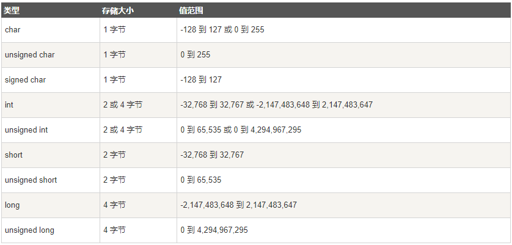
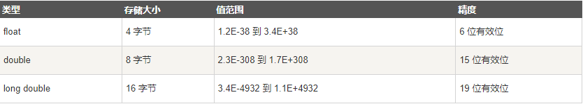

#  C语言基础

### C程序结构

```c
// 预处理器指令 告诉编译器先编译导入的文件
#include
<stdio.h>
// 主函数程序的入口，程序从这里运行
int main() {
// C 函数
printf("Hello, World!\n");
// 终止main函数并返回0
return 0;
}
```

### C 令牌

```c
// 令牌可以是关键字、标识符、常量、字符串值，或者是一个符号
printf("Hell, World!\n");
// 上面 C 语句有5个令牌，分别是：
printf
(
"Hell, World!\n"
);
```

### 分号

```c
// 分号是语句结束符
// 每个语句必须以分号结束
// 它表明一个逻辑实体的结束
return 0;
```

# 基本数据类型

### 整数类型



### 浮点类型



### void类型

```c
// void 类型指定没有可用的值
```

### 布尔类型

```c
#include <stdio.h>

int main () {
    // C99 新增布尔类型
    _Bool a = 2 , b = 0;
    printf("%d\n" , a);
    printf("%d" , b);
}
```

# 变量

### 变量定义

```c
// 类型 变量名 赋初始值
int a = 10; // 可不赋值
// 运算赋值
int b = 10 + 20;
// 赋新值
b = 60;
// 多重定义
int c = 3 , d = 4;
```

### 变量声明

```c
// 变量声明，有此变量但不在这里
extern int i;
```

### 格式化字符变量

```c
// 使用占位符导入变量
double a = 0.4 , b = 0.7;
printf("a : %f" , a * b);
```

```c
double a = 0.4 , b = 0.7;
// 长度设定，定义在格式符前
printf("a : %lf" , a * b);
```

```c
double a = 0.4 , b = 0|.7;
// 精度符，定义在 % 后
printf("a : %.1lf" , a * b);
```

### 转义字符


# 常量

```c
// 定义常量
const int a = 1;
// 使用 #define 预处理器定义常量
#define A 10
```

# 类型转换

### 隐式类型转换

```c
float a = 3;
char b = a;
int c = a;
```

### 强制类型转换

```c
int main() {
    // (转换类型)值或变量
    int a = (int) 2.5;
    printf("%d" , a);
}
```

# 运算符

### 算数运算符

```c
#include <stdio.h>

int main () {
    int a = 10 , b = 10;
    // 加法运算
    printf("%d\n" , a + b);
    // 减法运算
    printf("%d\n" , a - b);
    // 乘法运算
    printf("%d\n" , a * b);
    // 除法运算
    printf("%d\n" , 1 / b);
    // 取模运算
    printf("%d\n" , a % 3);
    // 自增运算
    printf("%d\n" , a++);
    // 自减运算
    printf("%d\n" , b--);
}
```

### 关系运算符

```c
#include <stdio.h>

int main () {
    int a = 10 , b = 10 , c = 11;
    // 等于运算
    if (a == b) {
        printf("等于运算成立\n");
    }
    // 不等于运算
    if (a != c) {
        printf("不等于运算成立\n");
    }
    // 大于运算
    if (c > a) {
        printf("大于运算成立\n");
    }
    // 小于运算
    if (b < c) {
        printf("小于运算成立\n");
    }
    // 大于等于运算
    if (c >= b) {
        printf("大于等于运算成立\n");
    }
    // 小于等于运算
    if (a <= c) {
        printf("小于等于运算成立\n");
    }
}
```

### 逻辑运算符

```c
#include <stdio.h>

int main () {
    int a = 1 , b = 1 , c = 0;
    // 与运算
    if (a && b) {
        printf("与运算成立\n");
    }
    // 或运算
    if (a || c) {
        printf("或运算成立\n");
    }
    // 非运算
    if (!(a && c)) {
        printf("非运算成立\n");
    }
}
```

### 赋值运算符
```c
#include <stdio.h>

int main () {
    // 等于
    int a = 12 , b = 42 , c = 0;
    // 加等于
    printf("%d\n" , a += 2);
    // 减等于
    printf("%d\n" , b -= 1);
    // 乘等于
    printf("%d\n" , a *= b);
    // 除等于
    printf("%d\n" , a /= 1);
    // 取模等于
    printf("%d\n" , a %= b);
    // 左移等于
    printf("%d\n" , a <<= 3);
    // 右移等于
    printf("%d\n" , b >>= 2);
    // 按位与等于
    printf("%d\n" , a &= 3);
    // 按位或等于
    printf("%d\n" , a |= 2);
    // 按位异或等于
    printf("%d\n" , a ^= 5);
}
```

### 位运算符

```c
#include <stdio.h>

int main () {
    // 等于
    int a = 10 , b = 15 , c = 5;
    // 与运算
    printf("%d\n" , a & b);
    // 或运算
    printf("%d\n" , b | c);
    // 异或运算
    printf("%d\n" , a ^ c);
    // 取反运算
    printf("%d\n" , ~a);
    // 左移运算
    printf("%d\n" , a << 2);
    // 右移运算
    printf("%d\n" , a >> 3);
}
```

### 三元运算符
```c
#include <stdio.h>

int main () {
    int a = 10 , b = 4;
    // 三元运算
    char c = a > b ? 'A' : 'B';
    // 判断 + ？ + 真值 + 假值
    printf("%d" , c);
}
```

### sizeof 运算符

```c
#include <stdio.h>

int main () {
    // 获得变量的大小
    int a = 5;
    printf("%llu" , sizeof(a));
}
```

### & 运算符

### * 运算符

```c
#include <stdio.h>

int main () {
    int a = 5;
    // 指向一个变量
    int * b;
    printf("%d\n" , a);
    // 返回变量的地址
    b = &a;
    printf("%d" , *b);
}
```

# 判断

### if  语句
```c
#include <stdio.h>

int main () {
    int a = 10;
    // if (判断表达式){判断成立执行的代码}
    if (a > 5) {
        printf("Hello world\n");
    }
    printf("和平\n");
    // if 可省略{}只执行紧随的一行代码
    if (a < 20)
        printf("哎嘿嘿");
}
```

### if...else 语句

```c
#include <stdio.h>

int main () {
    _Bool a = 0;
    int b = 2;
    // 基础 if...else
    if (a) {
        printf("真\n");
    } else {
        printf("假\n");
    }
    // 进阶 if...else...else if
    if (b == 1) {
        printf("1\n");
    } else if (b == 2) {
        printf("2\n");
    } else if (b == 3) {
        printf("3\n");
    } else {
        printf("4\n");
    }
}
```

### if 嵌套语句

```c
#include <stdio.h>

int main () {
    _Bool a = 1;
    int b = 2;
    // if 嵌套
    if (a) {
        if (b > 1) {
            printf("哎嘿嘿");
        }
    }
}
```

### switch 语句

```c
#include <stdio.h>

int main () {
    char a = 'D';
    switch (a) {
        // 精准匹配固定值执行
        case 'A':
            printf("A\n");
            break;
        case 'B':
            printf("B\n");
            break;
        case 'C':
            printf("C\n");
            break;
        // 使用 case 不为真是执行
        default:
            printf("哈哈哈");
    }
}
```

# 循环

### for 语句

```c
#include <stdio.h>

int main () {
    // （初始化循环控制变量;判断;更新循环控制变量）
    for (int i = 0 ; i < 100 ; ++i) {
        if (i == 90) {
            // 跳过本次循环
            continue;
        } else {
            printf("%d哎嘿嘿\n" , i);
        }
    }
}
```

### while 语句

```c
#include <stdio.h>

int main () {
    int i = 100;
    // 任意表达式，为true选择循环
    while (i > 0) {
        printf("%d\n" , i);
        i /= 2;
    }
}
```

### do...while 语句

```c
#include <stdio.h>

int main () {
    int i = 10;
    // 保证循环一次，在进行判断
    do {
        printf("%d" , i);
    } while (i > 20);
}
```

### 循环控制语句

```c
#include <stdio.h>

int main () {
    for (int i = 0 ; i < 10 ; ++i) {
        LOOP:
        printf("hhh");
        switch (i) {
            case 2:
                printf("A");
                // 跳过本次循环
                continue;
            case 5:
                printf("B");
                // 结束循环
                break;
            case 8:
                printf("C");
                // 跳转到标记循环
                goto LOOP;
        }
    }
}
```

# 数组

### 数组定义

```c
#include <stdio.h>

int main () {
    // 定义：数组名称[数组大小] = {值}
    int arr[12] = {1 , 2 , 3 , 4 , 5 , 6};
    // 指定位置定义值
    int aff[12] = {[4]=4 , [7]=7};
    // 可由赋值绝对长度
    int aww[] = {1 , 2 , 3 , 4 , 5};
    // 不一样初始值会随机
    int add[12];
    for (int i = 0 ; i < 12 ; ++i) {
        printf("%d\n" , add[i]);
    }
}
```

### 数组值修改

```c
#include <stdio.h>

int main () {
    int arr[3] = {1 , 2 , 3};
    printf("%d\n" , arr[1]);
    // 修改指定索引值
    arr[1] = 5;
    printf("%d\n" , arr[1]);
}
```

### 多维数组

```c
#include <stdio.h>

int main () {
    // 多维数组
    int arr[2][5] = {{1 , 2 , 3 , 4 , 5} ,
                     {6 , 7 , 8 , 9 , 10}};
    for (int i = 0 ; i < 2 ; ++i) {
        for (int j = 0 ; j < 5 ; ++j) {
            printf("%d\n" , arr[i][j]);
        }
    }
}
```

### 冒泡排序

```c
#include <stdio.h>

int main () {
    int arr[10] = {5 , 2 , 7 , 13 , 8 , 0 , 14 , 3 , 6 , 9};
    int add;
    for (int i = 0 ; i < 9 ; ++i) {
        _Bool flag = 1;
        for (int j = 0 ; j < 9 - i ; ++j) {
            if (arr[j] > arr[j + 1]) {
                add = arr[j];
                arr[j] = arr[j + 1];
                arr[j + 1] = add;
                flag = 0; 
            }
        }
        if (flag) {
            break;
        }
    }
    for (int i = 0 ; i < 10 ; ++i) {
        printf("%d\n" , arr[i]);
    }
}
```

### 斐波那契数列

```c
#include <stdio.h>

int main () {
    int id = 10;
    int arr[id];
    arr[1] = arr[0] = 1;
    for (int i = 2 ; i < id ; ++i) {
        arr[i] = arr[i - 1] + arr[i - 2];
    }
    printf("%d" , arr[id - 1]);
}
```

# 字符串

### 字符串创建

```c
#include <stdio.h>

int main () {
    // 创建字符串:必须以 \0结尾
    char arr[] = {'h' , 'e' , 'l' , 'l' , 'o' , '\0'};
    printf("%s\n" , arr);
    // 也可以这样创建
    char add[] = "HELLO";
    printf("%s\n" , add);
}
```

### 字符串索引

```c
#include <stdio.h>

int main () {
    char add[] = "HELLO";
    // 输出为 ASCII 表值
    printf("%d" , add[2]);
}
```

# 函数

### 函数定义

```c
#include <stdio.h>

// 定义函数原型 void 类型可不返回值
void add ();

// 程序入口函数
int main () {
    // 函数调用
    add();
}

// 函数实际功能
void add () {
    printf("hello world!");
}
```

### 变量作用域

```c
// 全局变量
int b = 30;

// 程序入口函数
int main () {
    // 局部变量
    int a = 10;
    if (1) {
        a++;
        b++;
    }
    a++;
}

void arr () {
    // 互不干扰
    int a = 20;
    b++;
}
```

### 函数参数

```c
#include <stdio.h>

// 函数形参
void arr (int i1 , int i2) {
    printf("%d" , i1 + i2);
}

int main () {
    // 调用传实参
    arr(10 , 20);
}
```

### 函数返回

```c
#include <stdio.h>

// 函数返回
int arr (int i1 , int i2) {
    return i1 + i2;
}

int main () {
    // 调用传实参并赋值
    int c = arr(10 , 20);
    printf("%d" , c);
}
```

### 函数递归

```c
#include <stdio.h>

// 递归
int arr (int i1) {
    if (i1 == 1) {
        return 1;
    }
    // 反复调用自己，直到条件不满足
    return arr(i1 - 1) * i1;
}

int main () {
    printf("%d" , arr(5));
}
```

# C 储存类

```c
```

# C 指针

### 指针使用

```c
#include <stdio.h>

int main () {
    // 定义变量
    int a = 10;
    // *定义指针指向变量地址
    // & 取变量地址
    int * p = &a;
    // 使用 %p 输出地址
    printf("%p\n" , p);
    // 输出指向的变量
    printf("%d" , *p);
}
```

### 指针常量

```c
#include <stdio.h>

int main () {
    int a = 100 , b = 100;
    // 指针常量
    const int * p = &a;
    // 可重新指向，但不能修改指向值
    p = &b; 
    // 报错
    *p = 888;
}
```

### 常量指针

```c
#include <stdio.h>

int main () {
    int a = 100 , b = 100;
    // 常量指针
    int * const p = &a;
    // 可修改指向值，但不能重新指向
    *p = 666;
    // 报错
    p = &b;
}
```

### 指针与数组

```c
#include <stdio.h>

int main () {
    char arr[] = "hello";
    // 数组名本身就是指针，指向数组第一个值
    char * p = arr;
    printf("%c" , *p);
}
```

```c
#include <stdio.h>

int main () {
    char arr[] = "hello";
    char * p = arr;
    // 指针表示法
    printf("%c" , *(p + 1));
}
```

### 多级指针

```c
#include <stdio.h>

int main () {
    // 多级指针
    int a = 10;
    int * p = &a;
    int ** pp = &p;
    int *** ppp = &pp;
    // 指向上一级
    printf("%d\n" , **pp);
    // 指向指针的指针
    printf("%p\n" , *pp);
    // 指向指针的指针的指针
    printf("%p" , **ppp);
}
```

### 指针数组

```c
#include <stdio.h>

int main () {
    int a = 10 , b = 20 , c = 30;
    // 指针数组
    int * arr[] = {&a , &b , &c};
    // 指针数组修改
    *arr[0] = 40;
    printf("%d\n" , a);
    // 指向指针数组
    int ** p = arr;
    printf("%d\n" , **p);
    printf("%d\n" , **(p + 1));
}
```

### 数组指针

```c
#include <stdio.h>

int main () {
    int arr[3] = {1 , 2 , 3};
    // 数组指针
    // 不再指向首元素，而是指向整个数组
    int (* p)[3] = &arr;
    printf("%d,%d,%d" , *(*p + 0) , *(*p + 1) , *(*p + 2));
}
```

```c
#include <stdio.h>

int main () {
    int arr[2][3] = {{1 , 2 , 3} ,
                     {4 , 5 , 6}};
    // 多维数组指针
    // 不需要取地址了，多维数组指向第一个数组地址
    int (* p)[3] = arr;
    // 先指向第二个数组地址，在地址在加N取值
    printf("%d\n" , *(*(p + 1) + 2));
    // 可使用数组表示法
    printf("%d" , p[1][2]);
}
```

### 指针函数

```c
#include <stdio.h>

int * text (int * A) {
    // 函数指针接收地址返回指针
    return A;
}

int main () {
    int A = 10;
    // 传递内存地址
    int * B = text(&A);
    printf("%d" , *B);
    // 不能返回局部变量的指针
}
```

### 函数指针

```c
#include <stdio.h>

int arr (int a , int b) {
    return a + b;
}

int main () {
    // 指向相同返回值类型及相同形参类型的函数
    int (* p) (int , int) = arr;
    int sun = p(2 , 3);
    printf("%d" , sun);
}
```

### 函数回调

```c
#include <stdio.h>

// 执行函数
int sun (int (* p) (int , int) , int a , int b) {
    // 调用传入指针函数
    return p(a , b);
}

// 回调函数
int add (int a , int b) {
    return a + b;
}

int main () {
    // 指向相同返回值类型及相同形参类型的函数
    int (* p) (int , int) = add;
    // 接收执行函数返回的回调函数值
    int res = sun(p , 2 , 5);
    printf("%d" , res);
}
```

#  结构体

### 创建使用结构体

```c
#include <stdio.h>

// 创建结构体
struct Stu {
    int id;
    int age;
    char * name;
};

int main () {
    // 生成结构体
    struct Stu str = {1 , 18 , "小麦"};
    struct Stu btr = {1 , 19 , .name="小明"};
    str.age = 20;
    // 获取结构体值或修改
    int a = str.age;
    printf("%d" , a);
}
```

### 结构体数组

```c
#include <stdio.h>

struct Stu {
    int id;
    int age;
    char * name;
};

int main () {
    // 结构体数组
    struct Stu arr[] = {{1 , 18 , "小明"} ,
                        {2 , 20 , "小红"} ,
                        {3 , 19 , "小白"}};
    // 取值
    printf("%d" , arr[1].age);
}
```

### 结构体指针

```c
#include <stdio.h>

struct Stu {
    int id;
    int age;
    char * name;
};

int main () {
    struct Stu aa = {1 , 18 , "小明"};
    struct Stu aw[] = {{1 , 18 , "小明"} ,
                       {2 , 19 , "小白"} ,
                       {3 , 20 , "小红"}};
    // 结构体指针
    struct Stu * bb = &aa;
    struct Stu * bw = aw;
    // 取值
    printf("%d\n" , (*bb).age);
    printf("%d\n" , bb->age);
    printf("%d\n" , (*(bw + 1)).age);
    printf("%d\n" , bw[2].age);
}
```

# 联合体

### 创建使用联合体

```c
#include <stdio.h>

// 定义联合体
union Stu {
    int id;
    int age;
    char na;
};

int main () {
    // 创建联合体
    union Stu str = {10};
    // 联合体中共有内存空间
    printf("%d\n" , str.age);
    str.na = 'A';
    printf("%c\n" , str.id);
}
```

### 联合体数组和指针

```c
#include <stdio.h>

// 定义联合体
union Stu {
    int id;
    int age;
    char na;
};

int main () {
    // 联合体数组
    union Stu arr[] = {{'A'} ,
                       {10} ,
                       {.age = 19}};
    printf("%d\n" , arr[1].age);
    arr[2].id = 20;
    printf("%d\n" , arr[2].age);

    // 联合体指针
    union Stu * add = arr;
    printf("%d\n" , add->age);
    (*(add + 1)).na = 'B';
    printf("%d\n" , add[1].age);
}
```

# 枚举

```c
#include <stdio.h>

// 定义枚举
enum Star {
    // 不设定初始值则从 0 依次自增
    low = 1 , middle = 2 , high = 3
};

int main () {
    enum Star s = low;
    printf("%d" , s);
}
```

# 预处理器

```c
#include <stdio.h>

// 预处理 stdio.h 头文件
// 预定义 内置函数
// 将头文件提供的信息包含到C语言源文件中
int main () {
    printf("Hello World!");
}
```

### 头文件建立

```c
#include <stdio.h>
// 自建头文件
#include "text.h"

int main () {
    int c = sum(10 , 20);
    printf("%d" , c);
}
```

### 头文件内容创建

```c
int sum (int a , int b);
```

### 头文件源文件创建

```c
#include "text.h"

int sum (int a , int b) {
    return a + b;
}
```

# 宏

### 宏定义

```c
#include <stdio.h>
// 宏定义
#define PI 3.1415
#define M a + b

int main () {
    int a = 10 , b = 20;
    // 替换
    printf("%f\n" , PI);
    // 直接文本替换
    printf("%d" , M * a);
    // 变成了 a + b * a
}
```

### 宏参数

```c
#include <stdio.h>
// 宏参数
#define M(x) x * x
#define pr(i) printf("我是替换的%d\n",i)
#define pd(i) printf("我是替换的"#i"\n")
#define TE(n) x##n

int main () {
    printf("%d\n" , M(9));
    pr(10);
    pd(20);
    // 宏变量
    int TE(1) = 10;
    x1 = 30;
    printf("%d" , x1);
}
```

### 取消宏

```c
#include <stdio.h>

#define PI 3.1415
// 取消宏
#undef PI

int main () {
    // 会报错
    printf("%d" , PI);
}
```

### 条件编译

```c
#include <stdio.h>
// 条件编译
#ifdef PI
#define M 666
#else
#define M 777
#endif

int main () {
    printf("%d" , M);
}
```

# 编译文件

### 将gcc添加进环境变量


### 对源文件进行预处理

```apl
gcc -E main.c -o main.i
```

### 编译为汇编

```apl
gcc -S main.i -o main.s
```

### 转换为二进制

```apl
gcc -c main.s -o main.o
```

### 连接到系统

```apl
gcc main.o -o main
```

### 运行

```apl
.\main.exe
```

### 简化编译

```apl
gcc main.c -o main
.\main
```

