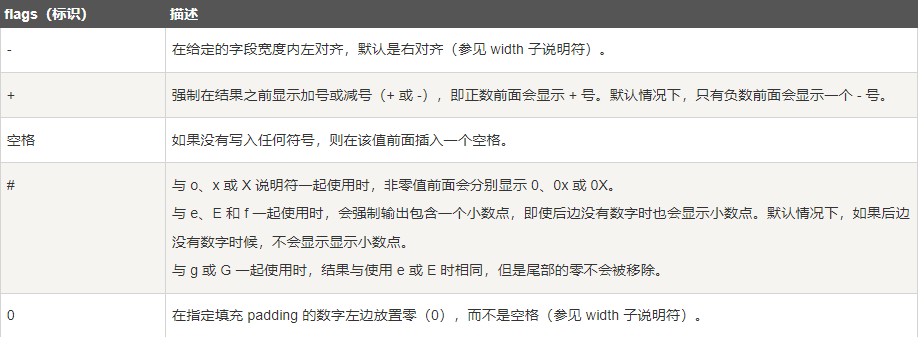

## printf -- 发送格式化输出到标准输出 stdout

```c
#include <stdio.h>

int main () {
    // printf("格式化字符串",参量表)
    printf("%d" , 1);
}
```

```c
#include <stdio.h>

int main () {
    char str[] = "Hello";
    printf("%s" , str);
}
```




```c
#include <stdio.h>

int main () {
    float a = 3.1415926;
    printf("%.2f" , a);
}
```


## scanf -- 标准输入 stdin 读取格式化输入

```c
#include <stdio.h>

int main () {
    char str[20];
    // scanf("输入格式",储存)
    scanf("%s" , str);
    printf("%s" , str);
}
```


```c
#include <stdio.h>

int main () {
    int a;
    // 非数组类型，需在储存变量前添加取址符
    scanf("%d" , &a);
    printf("%d" , a);
}
```

## gets -- 标准输入 stdin 读取一行，并把它存储在 str 所指向的字符串中

```c
#include <stdio.h>

int main () {
    char str[20];
    // 仅能接收字符串
    gets(str);
    printf("%s" , str);
}
```

## puts -- 把一个字符串写入到标准输出 stdout，并换行

```c
#include <stdio.h>

int main () {
    char str[20] = "Hello World";
    // 仅能输出字符串
    puts(str);
}
```


