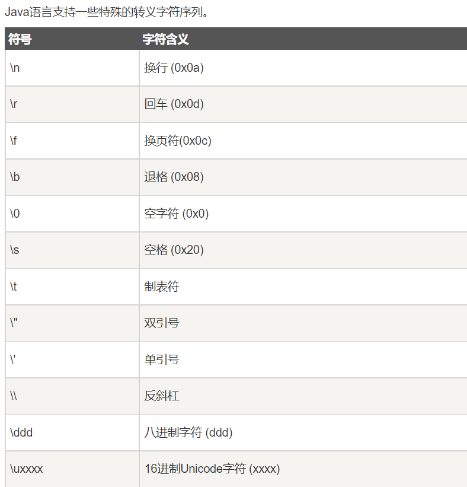
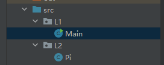
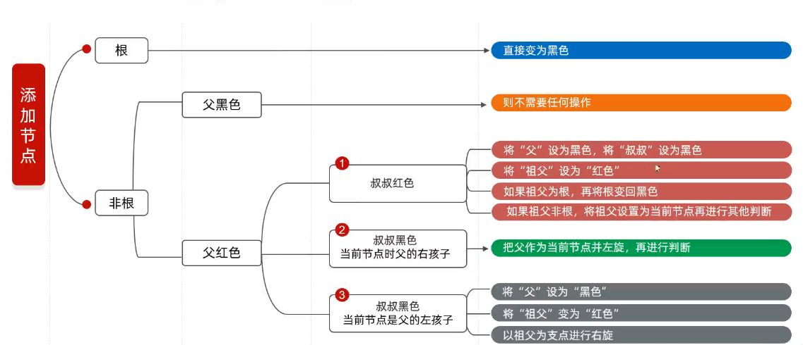

# 基本语法

```java
// 访问修饰符 类 类名
public class Main {
    // 访问修饰符 关键字 返回类型 方法名(String类[] 字符串数组)
    public static void main(String[] args) { // 程序主入口
        System.out.println("Hello world!");
    }
}
```

# 数据类型

### 基础使用

```java
public class Main {
    public static void main(String[] args) {
        // 整数
        System.out.println(666);
        // 小数
        System.out.println(0.14);
        // 字符串
        System.out.println("你好");
        // 字符
        System.out.println('A');
        // 布尔
        System.out.println(true);
        // 空
        // null
    }
}
```

### 内置数据类型

```java
public class Main {
    public static void main(String[] args) {
        // 字节
        byte sum1 = 12;
        // 取值范围:-128 ~ 127
        System.out.println(sum1);
        // 短整形
        short sum2 = 123;
        // 取值范围:-32768 ~ 32767
        System.out.println(sum2);
        // 整形
        int sum3 = 1234;
        // 取值范围:-2147483648 ~ 2147483647
        System.out.println(sum3);
        // 长整形末尾加L
        long sum4 = 999999999L;
        // 取值范围:-(-2^63) ~ (2^63-1)
        System.out.println(sum4);
        // 单精度浮点数
        float sum5 = 0.46F;
        System.out.println(sum5);
        // 双精度浮点数
        double sum6 = 0.1641212;
        System.out.println(sum6);
        // 布尔
        boolean o = true;
        System.out.println(o);
        // 字符
        char str = 'A';
        System.out.println(str);
    }
}
```

### 引用数据类型

```apl
引用类型指向一个对象，指向对象的变量是引用变量。这些变量在声明时被指定为一个特定的类型
String 、Date 、Void 、Object 等
对象、数组都是引用数据类型
```

# 变量

```java
public class Main {
    public static void main(String[] args) {
        // 数据类型 变量名 = 初始值;
        int sum = 10, age = 20;
        System.out.println(sum);
        System.out.println(sum + age);
    }
}
```

# 常量

```java
public class Main {
    public static void main(String[] args) {
        // 常量,定义后无法修改
        // 使用 final 关键字
        final int Age = 21;
    }
}
```

# 转义字符



# 类型装换

### 自动类型装换

```java
public class Main {
    public static void main(String[] args) {
        byte b = 'A';
        int i = b;
        // 自动类型装换
        System.out.println(i);
    }
}
```

### 强制类型装换

```java
public class Main {
    public static void main(String[] args) {
        int i = 95;
        char b = (char) i;
        // 强制类型装换
        System.out.println(b);
    }
}
```

# 运算符

### 算术运算符

```java
public class Main {
    public static void main(String[] args) {
        int sum1 = 10, sum2 = 5;
        // 加法运算符
        System.out.println(sum1 + sum2);
        // 减法运算符
        System.out.println(sum1 - sum2);
        // 乘法运算符
        System.out.println(sum1 * sum2);
        // 除法运算符
        System.out.println(sum1 / sum2);
        // 取余运算符
        System.out.println(sum1 % sum2);
        // 前置自增运算符
        System.out.println(++sum1); // 先自增再输出
        // 后置自增运算符
        System.out.println(sum1++); // 先输出再自增
        // 前置自减运算符
        System.out.println(--sum2); // 先自减再输出
        // 后置自减运算符
        System.out.println(sum2--); // 先输出再自减
    }
}
```

### 关系运算符

```java
public class Main {
    public static void main(String[] args) {
        int sum1 = 10, sum2 = 5;
        // 相等运算符
        System.out.println(sum1 == sum2);
        // 不相等运算符
        System.out.println(sum1 != sum2);
        // 大于运算符
        System.out.println(sum1 > sum2);
        // 小于运算符
        System.out.println(sum1 < sum2);
        // 大于等于运算符
        System.out.println(sum1 >= sum2);
        // 小于等于运算符
        System.out.println(sum1 <= sum2);
        // 返回布尔值
    }
}
```

### 位运算符

```java
public class Main {
    public static void main(String[] args) {
        int sum1 = 60, sum2 = 13;
        // 位与运算符
        System.out.println(sum1 & sum2);
        // 位或运算符
        System.out.println(sum1 | sum2);
        // 位异或运算符
        System.out.println(sum1 ^ sum2);
        // 位取反运算符
        System.out.println(~sum2);
        // 位左移运算符
        System.out.println(sum2 << 2);
        // 位右移运算符
        System.out.println(sum2 >> 2);
        // 位右移补零
        System.out.println(sum1 >>> 2);
    }
}
```

### 赋值运算符

```java
public class Main {
    public static void main(String[] args) {
        int sum1 = 60, sum2 = 13;
        // 等于运算符
        System.out.println(sum1 = sum2);
        // 加等于运算符
        System.out.println(sum1 += sum2);
        // 减等于运算符
        System.out.println(sum1 -= 2);
        // 乘等于运算符
        System.out.println(sum1 *= 2);
        // 除等于运算符
        System.out.println(sum1 /= 3);
        // 取模等于运算符
        System.out.println(sum2 %= 3);
        // 位左移等于
        System.out.println(sum1 <<= 2);
        // 位右移等于
        System.out.println(sum1 >>= 2);
        // 位与等于
        System.out.println(sum1 &= 5);
        // 位或等于
        System.out.println(sum1 |= 2);
        // 位异或等于
        System.out.println(sum1 ^= 2);
    }
}
```

### 逻辑运算符

```java
public class Main {
    public static void main(String[] args) {
        boolean sum1 = true, sum2 = false;
        // 逻辑与运算符
        System.out.println(sum1 && sum2);
        // 逻辑或运算符
        System.out.println(sum1 || sum2);
        // 逻辑非运算符
        System.out.println(!sum1);
    }
}
```

### 条件运算符

```java
public class Main {
    public static void main(String[] args) {
        int a = 10, b;
        // (条件判断) ? 真值:假值
        b = (a > 5) ? 20 : 30;
        System.out.println(b);
    }
}
```

### 对象判断运算符

```java
public class Main {
    public static void main(String[] args) {
        String name = "小红";
        // 实例对象 instanceof 类型
        // 返回布尔值
        boolean res = name instanceof String;
        System.out.println(res);
    }
}
```

# 判断

### if -- 判断

```java
public class Main {
    public static void main(String[] args) {
        int Age = 20;
        if (Age > 18) {
            // 真执行
            System.out.println("你成年了");
        }
    }
}
```

### if -- else 判断

```java
public class Main {
    public static void main(String[] args) {
        int Age = 16;
        if (Age > 18) {
            // 真执行
            System.out.println("你成年了");
        } else {
            // 假执行
            System.out.println("你未成年");
        }
    }
}
```

### if -- else -- else if 判断

```java
public class Main {
    public static void main(String[] args) {
        int Age = 84;
        if (Age > 90) {
            // 真1执行
            System.out.println("优秀");
        } else if (Age > 60) {
            // 真2执行
            System.out.println("及格");
        } else {
            // 假执行
            System.out.println("寄了");
        }
    }
}
```

### switch 分支

```java
public class Main {
    public static void main(String[] args) {
        int sum = 4;
        // switch (判断值)
        switch (sum) {
            // 分支
            // 和判断值匹配真则执行
            case 1:
                System.out.println("男");
                // 结束分支
                break;
            case 2:
                System.out.println("女");
                break;
            case 3:
                System.out.println("中间");
                break;
            case 4:
                System.out.println("我不知道呀");
                break;
            // 都为假时执行
            default:
                System.out.println("麻了");
        }
    }
}
```

```java
public class Main {
    public static void main(String[] args) {
        int sum = 4;
        // JDK12后的switch新特性
        switch (sum) {
            case 1 -> System.out.println("男");
            case 2 -> System.out.println("男");
            case 3 -> System.out.println("中间");
            case 4 -> {
                System.out.println("我不知道呀");
            }
            default -> System.out.println("麻了");
        }
    }
}
```

```java
// 测试 switch yield
@Test
public void switchYield() {
    int num = 1;
    String result = switch (num) {
        case 1:
            // yield 作用类似 return
            yield "1";
        case 2:
            yield "2";
        default:
            yield "default";
    };
    System.out.println(result);
}
```

```java
// 测试 switch 代码块
@Test
public void switchBlock() {
    int num = 1;
    String result = switch (num) {
        case 1 -> {
            // 代码块
            String str = "Hello World";
            str = str.toUpperCase();
            yield str;
        }
        case 2 -> "2";
        default -> "default";
    };
    System.out.println(result);
}
```

# 循环

### while 循环

```java
public class Main {
    public static void main(String[] args) {
        int Age = 0;
        // while (布尔表达式)
        while (Age <= 18) {
            // 循环体
            System.out.println("你" + Age + "岁了");
            Age++;
        }
    }
}
```

### do -- while 循环

```java
public class Main {
    public static void main(String[] args) {
        // 先执行一次循环体再判断
        /*
        do {
            循环体
        }while (布尔表达式)
         */
        int x = 10;
        do {
            System.out.println(x);
        } while (x < 10);
    }
}
```

### for 循环

```java
public class Main {
    public static void main(String[] args) {
        // for (初始化语句;条件判断;条件控制)
        for (int i = 0; i <= 18; i++) {
            System.out.println("你" + i + "岁了");
        }
    }
}
```

### 增强 for 循环

```java
public class Main {
    public static void main(String[] args) {
        // 针对数组类型
        int[] num = {1, 2, 3, 4, 5};
        // for (局部变量 : 遍历数组)
        for (int x : num) {
            System.out.println(x);
        }
    }
}
```

### 控制语句

```java
public class Main {
    public static void main(String[] args) {
        // break 跳出
        int i = 10;
        boolean f = true;
        while (f) {
            if (i > 15) {
                System.out.println("到了");
                f = false;
                break;
            }
            System.out.println("快到了");
            i++;
        }
        // continue 跳过
        int[] sum = {1, 2, 3, 4, 5, 6};
        for (int x : sum) {
            if (x == 4) {
                continue;
            }
            System.out.println(x);
        }
    }
}
```

# 变量的作用域

```java
public class Var {
    static int All = 10; // 类变量
    /*
    类变量也称为静态变量，在类中以 static 关键字声明
    但必须在方法之外
    类未实例化时，通过类名就可以调用静态变量
     */
    
    String str = "Hello"; // 实例变量
    /*
     实例变量声明在一个类中，但在方法、构造方法和语句块之外
     实例变量在对象创建的时候创建，在对象被销毁的时候销毁
     */
    
    public void met() {
        int i = 10; // 局部变量
        /*
        局部变量声明在方法、构造方法或者语句块中
        局部变量在方法、构造方法、或者语句块被执行的时候创建
        当它们执行完成后，变量将会被销毁
         */
    }
}
```

# 数组

### 数组使用

```java
public class Main {
    public static void main(String[] args) {
        // 数据类型[] 数组名 = new 数据类型[] {初始化值}
        int[] arr = new int[5];
        arr[0] = 1;
        arr[1] = 2;
        arr[2] = 3;
        arr[3] = 4;
        arr[4] = 5;
        // 简化 自动判断数组长度
        int[] arr1 = {6, 7, 8, 9, 10};
    }
}
```

### for -- each 循环遍历

```java
public class Main {
    public static void main(String[] args) {
        int[] arr = {1, 2, 3, 4, 5};
        for (int x : arr) {
            System.out.println(x);
            // 遍历数组
        }
    }
}
```

### 多维数组

```java
public class Main {
    public static void main(String[] args) {
        // 多维数组
        int[][] arr = {{1, 2, 3}, {4, 5, 6}};
        System.out.println(arr[0][0]);
        System.out.println(arr[0][2]);
        System.out.println(arr[1][0]);
        System.out.println(arr[1][2]);
    }
}
```

### 同指向数组

```java
public class Main {
    public static void main(String[] args) {
        // 创建数组
        int[] arr1 = {11, 22};
        // 将数组地址赋值
        int[] arr2 = arr1;
        System.out.println(arr1[0]);
        System.out.println(arr2[0]);
        // 通过地址修改
        arr2[0] = 33;
        
        System.out.println(arr1[0]);
        System.out.println(arr2[0]);
    }
}
```

# 方法

### 方法使用

```java
public class Main {
    public static void main(String[] args) {
        Show();
        Show1(2, 5);
        System.out.println(Sum(5, 5));
    }
    
    /*
        修饰符 返回值类型 方法名(参数类型 参数名){
            方法体
            return 返回值;
        }
         */
    // 无参无返
    public static void Show() {
        System.out.println("麻了");
        System.out.println("不麻了");
    }
    
    // 有参无返
    public static void Show1(int i1, int i2) {
        System.out.println(i1 + i2);
    }
    
    // 有参有返
    public static int Sum(int i1, int i2) {
        return i1 + i2;
    }
}
```

### 方法重载

```java
public class Main {
    public static void main(String[] args) {
        Add(4, 5);
        Add(0.4, 2.4);
    }
    
    // 方法相同,形参不同即可重载,与返回值无关
    public static void Add(int i1, int i2) {
        System.out.println("int " + (i1 + i2));
    }
    
    public static void Add(double i1, double i2) {
        System.out.println("double " + (i1 + i2));
    }
}
```

### 可变参数

```java
public class Main {
    public static void main(String[] args) {
        print(1, 2, 3, 4, 5, 6, 7);
        int[] w = {1, 4, 74, 14};
        print(w);
    }
    
    // 数据类型... 形参名
    public static void print(int... arr) {
        for (int x : arr) {
            System.out.println(x);
        }
    }
}
```

# 修饰符

### 访问修饰符

```apl
default : 默认,在同一包内可见
private : 在同一类内可见
public : 对所以类可见
protected : 对同一包内的类和子类可见
```

### 非访问修饰符

```apl
static : 静态变量,无论实例了多少对象,静态变量只存在一份
static : 静态方法,用于声明独立于对象的静态方法
final : 变量 被赋值后不能再赋值,必须显式指定初始值
final : 方法 可以被子类继承,但不能重写
final : 类 不能继承
abstract : 抽象类 指定类为抽象类,
abstract : 抽象方法 抽象方法没有实现,具体实现由子类实现
synchronized : 声明的方法同一时间只能被一个线程访问
transient : JVM会跳过特定的变量
volatile : 线程之间共享数据
```

# 类

### 类使用

```java
// 修饰符 class 类名
public class Phone {
    // 成员变量
    String Name;
    double Price;
    
    // 成员方法
    public void call() {
        System.out.println("手机打电话");
    }
    
    public void playGame() {
        System.out.println("手机打游戏");
    }
}
```

```java
public class Main {
    public static void main(String[] args) {
        // 实例化
        Phone p = new Phone();
        // 成员变量赋值
        p.Name = "小米";
        p.Price = 1999.9;
        System.out.println("品牌 " + p.Name);
        System.out.println("价格 " + p.Price);
        // 成员方法调用
        p.call();
        p.playGame();
    }
}
```

### 成员类

```java
// 修饰符 class 类名
public class Phone {
    // 成员变量
    public String Name;
    public int Age;
    // 将其他类成为成员
    public Circle cir = new Circle();
    
    
    // 成员方法
    public void call() {
        System.out.println("人吃饭");
    }
    
    public void playGame() {
        System.out.println("人睡觉");
    }
}
```

```java
public class Circle {
    double radius;
    
    public void draw() {
        System.out.println("画半径" + radius + "的园");
    }
}
```

```java
public class Main {
    public static void main(String[] args) {
        Phone p = new Phone();
        p.Name = "小红";
        p.Age = 21;
        p.cir.radius = 4.5;
        p.call();
        p.playGame();
        p.cir.draw();
    }
}
```

### 封装

```java
// 封装
public class Phone {
    // 成员变量方法私有化
    private String Name;
    private int Age;
    
    // 赋值读取函数
    public String getName() {
        return Name;
    }
    
    public void setName(String name) {
        Name = name;
    }
    
    public int getAge() {
        return Age;
    }
    
    public void setAge(int age) {
        Age = age;
    }
}
```

```java
public class Main {
    public static void main(String[] args) {
        Phone p = new Phone();
        p.setAge(21);
        p.setName("小红");
        System.out.println("名字 " + p.getName());
        System.out.println("年龄 " + p.getAge());
    }
}
```

### this 指向

```java
public class Phone {
    private String Name = "小红";
    private int Age = 20;
    
    void Show() {
        // this 指向调用位置
        System.out.println("姓名 " + this.Name);
        System.out.println("年纪 " + this.Age);
    }
}
```

```java
public class Main {
    public static void main(String[] args) {
        Phone p = new Phone();
        p.Show();
    }
}
```

### 构造方法

```java
public class Phone {
    private String Name;
    private int Age;
    
    // 构造方法在类实例时触发
    public Phone(String name, int age) {
        Name = name;
        Age = age;
    }
    
    void Show() {
        System.out.println("姓名 " + this.Name);
        System.out.println("年纪 " + this.Age);
    }
}
```

```java
public class Main {
    public static void main(String[] args) {
        // 实例化对象时,使用构造方法给类私有成员赋值
        Phone p = new Phone("小白", 21);
        p.Show();
    }
}
```

### 继承

```java
// 父类
public class Person {
    public void eat() {
        System.out.println("吃饭");
    }
    
    public void drink() {
        System.out.println("喝水");
    }
}
```

```java
// 子类
public class Cat extends Person {
    // 子类独特的方法
    public void catc() {
        System.out.println("抓老鼠");
    }
}
```

```java
public class Main {
    public static void main(String[] args) {
        Cat c = new Cat();
        // 继承来的方法
        c.eat();
        c.drink();
        // 自己独特的方法
        c.catc();
    }
}
```

### this 和 super 

```java
public class Main {
    public static void main(String[] args) {
        Cat c = new Cat();
        c.show();
    }
}

// 父类
class Person {
    public void eat() {
        System.out.println("吃饭");
    }
}

// 子类
class Cat extends Person {
    public void eat() {
        System.out.println("吃饭啦");
    }
    
    public void show() {
        // 调用自己的方法
        this.eat();
        // 调用父类的方法
        super.eat();
    }
}
```

### 重写

```java
class A {
    public void eat() {
        System.out.println("父类的方法");
    }
}

class B extends A {
    @Override // 重写标识并检查语法
    public void eat() {
        System.out.println("子类的方法");
    }
}
```

### 多态

```java
public class Main {
    public static void main(String[] args) {
        // 多态 父类引用执行子类对象
        // 父类类型 对象名称 = 子类对象
        A a1 = new B();
        A a2 = new C();
        // 调用吧不同对象方法
        a1.eat();
        a2.eat();
    }
}

class A {
    public void eat() {
        System.out.println("父类的方法");
    }
}

class B extends A {
    @Override
    public void eat() {
        System.out.println("子类1的方法");
    }
}

class C extends A {
    @Override
    public void eat() {
        System.out.println("子类2的方法");
    }
}
```

### 静态代码块

```java
public class Main {
    public static void main(String[] args) {
        P p = new P();
        System.out.println(p.getAge());
    }
}

class P {
    private static int age;
    
    static {
        // 随着类加载而执行,并且只执行一次
        System.out.println("静态代码块");
        age = 18;
    }
    
    public static int getAge() {
        return age;
    }
}
```

### 抽象类

### 抽象方法

```java
public class Main {
    public static void main(String[] args) {
        P p = new P();
        System.out.println(p.getAge());
    }
}
// 抽象类需要构造方法
// 为了在创建子类对象时给属性赋值

class P {
    private static int age;
    
    static {
        // 随着类加载而执行,并且只执行一次
        System.out.println("静态代码块");
        age = 18;
    }
    
    public static int getAge() {
        return age;
    }
}
```

### 内部类

```java
class Car {
    private String Name;
    private int Age;
    private String Color;
    
    class Engine {
        String engName;
        int engAge;
        
        public void show() {
            // 内部类可访问外部类所有成员
            // 外部类无法访问内部类
            System.out.println(Name);
            System.out.println(Age);
            System.out.println(Color);
        }
    }
}
```

### 匿名内部类

```c++
public class Main {
    public static void main(String[] args) {
        // 匿名内部类
        S(new A() {
            @Override
            public void show() {
                System.out.println("Hello");
            }
        });
        // 赋值
        A a = new A() {
            @Override
            public void show() {
                System.out.println("World");
            }
        };
        a.show();
    }
    
    // 传入并调用
    public static void S(A a) {
        a.show();
        
    }
}

interface A {
    public void show();
}
```

# 接口

### 接口实现

```java
public class Main {
    public static void main(String[] args) {
        Frog f = new Frog("青蛙", 2);
        f.eat();
        f.swim(); 
    }
}

// 抽象父类
abstract class Animal {
    private String name;
    private int age;
    
    public Animal() {
    }
    
    public Animal(String name, int age) {
        this.name = name;
        this.age = age;
    }
    
    public String getName() {
        return name;
    }
    
    public void setName(String name) {
        this.name = name;
    }
    
    public int getAge() {
        return age;
    }
    
    public void setAge(int age) {
        this.age = age;
    }
    
    // 抽象方法
    public abstract void eat();
}

// 接口
interface Swim {
    public abstract void swim();
}
// 接口为用于定义具体的抽象事件

// 继承抽象类和接口
class Frog extends Animal implements Swim {
    public Frog() {
    }
    
    public Frog(String name, int age) {
        super(name, age);
    }
    
    @Override
    public void eat() {
        System.out.println("青蛙吃虫子");
    }
    
    @Override
    public void swim() {
        System.out.println("青蛙游泳");
    }
}
```

### implements 多继承接口

```java
interface A {
    public void eat();
    
    public void sleep();
}

interface B {
    public void show();
}

class C implements A, B {
    // 必须重写继承的方法
    @Override
    public void eat() {
        
    }
    
    @Override
    public void sleep() {
        
    }
    
    @Override
    public void show() {
        
    }
}
```

### 接口间继承

```java
// 接口1
interface Swim1 {
    public abstract void swim1();
}

// 接口2
interface Swim2 extends Swim1 {
    public abstract void swim2();
}


// 继承抽象类和接口
class Frog implements Swim2 {
    @Override
    public void swim1() {
        System.out.println("继承接口2父类接口1");
    }
    
    @Override
    public void swim2() {
        System.out.println("继承接口2");
    }
}
```

# 包

### 包使用

```java
// 包范围声明
package L1;
// 导入使用

import L2.Pi;

public class Main {
    public static void main(String[] args) {
        // 使用其他包类
        L2.Pi p;
    }
}
```




# 泛型

### 泛型标记符

```apl
E : 集合
T : Type Java类
K : Key 键
V : Value 值
N : Number 数值类型
? : 表示不确定的Java类型
```

### 泛型方法

```java
public class Main {
    public static void main(String[] args) {
        Integer[] A1 = {1, 2, 3, 4, 5, 6};
        Double[] A2 = {1.4, 12.65, 43.3};
        Character[] A3 = {'J', '2', 'V'};
        print(A1);
        print(A2);
        print(A3);
    } 
    
    public static <E> void print(E[] arr) {
        for (E e : arr) {
            System.out.println(e);
        }
    }
}
```

### 泛型类

```java
public class Circle<T> {
    private T key;
    
    public Circle(T key) {
        this.key = key;
    }
    
    public T getKey() {
        return key;
    }
    
    public void setKey(T key) {
        this.key = key;
    }
}
```

```java
public class Main {
    public static void main(String[] args) {
        // 创建泛型类
        // 实例化时指定实际数据类型
        Circle<Integer> c = new Circle<>(233);
        System.out.println(c.getKey());
    }
}
```

### 类型通配符

```java
import java.util.ArrayList;
import java.util.List;

public class Main {
    public static void main(String[] args) {
        List<String> name = new ArrayList<>();
        List<Integer> age = new ArrayList<>();
        name.add("icon");
        age.add(23);
        show(name);
        show(age);
    }
    // ? 替代所以类型
    public static void show(List<?> data) {
        System.out.println(data.get(0));
    }
}
```

# 包装类

### 自动拆装箱

```java
public class Main {
    public static void main(String[] args) {
        // JDK 5 前需要通过构造来实现包装类
        Integer i1 = new Integer(10);
        Integer i2 = new Integer("10");
        System.out.println(i1);
        System.out.println(i2);
        // 自动装箱
        Integer i3 = 10;
        System.out.println(i3);
        // 自动装箱
        int i4 = i3;
        System.out.println(i4);
    }
}
```

# Lambda 表达式

```java
import java.util.Arrays;

public class Main {
    public static void main(String[] args) {
        Integer[] arr = {1, 56, 9, 3, 45, 65, 2};
        // Lambda表达式
        Arrays.sort(arr, (Integer o1, Integer o2) -> {
            return o1 - o2;
        });
        System.out.println(Arrays.toString(arr));
    }
}
```

```java
import java.util.Arrays;

public class Main {
    public static void main(String[] args) {
        Integer[] arr = {1, 56, 9, 3, 45, 65, 2};
        // Lambda省略写法
        Arrays.sort(arr, (o1, o2) -> o1 - o2);
        System.out.println(Arrays.toString(arr));
    }
}
```

# 数据结构

### 栈

```apl
后进先出,先进后出
```

### 队列

```apl
先进先出,后进后出
```

### 数组

```apl
通过地址值和索引定位,查询快
内存空间连续
删除添加效率低,需要移位
```

### 链表

```apl
节点[当前节点数据,下节点地址]
在内存中不连续
查询查询慢
删除修改方便
```

### 二叉树

```apl
以父节点(左子节点,右子节点)格式
每个节点中保存[父节点地址,值,左子节点地址,右子节点地址]
```

### 红黑树

```apl
是一个二叉查找树,不需要高度平衡
红黑树规则:
1.每个节点必须是红色或黑色
2.根节点必须是黑色
3.叶节点是黑色
4.两个红色节点不能相连
5.任意节点到所有后代叶节点的简单路径上,黑色节点数量相同
```



# 方法引用

```java
import java.util.Arrays;

public class Main {
    public static void main(String[] args) {
        Integer[] arr = new Integer[]{1, 2, 3, 4, 5, 6, 7, 8};
        // 方法引用
        Arrays.sort(arr, Main::sub);
        System.out.println(Arrays.toString(arr));
    }
    
    public static int sub(int n1, int n2) {
        return n2 - n1;
    }
}
```

# 异常

### 异常捕获

```java
public class Main {
    public static void main(String[] args) {
        int[] arr = new int[]{1, 2, 3};
        
        // 可能出现异常的代码
        try {
            System.out.println(arr[3]);
        } catch (ArrayIndexOutOfBoundsException e) {
            // (异常类型 异常名)
            System.out.println("索引越界");
            // 出现异常后执行体
            // 可嵌套多层
        }finally {
            // 无论是否异常都会执行
            System.out.println("必定执行");
        }
    }
}
```

### 异常抛出

```java
public class Main {
    public static void main(String[] args) throws ArrayIndexOutOfBoundsException {
        // 声明异常,使用方法是可能有什么异常
        int[] arr = new int[]{1, 2, 3};
        try {
            Show(arr, 3);
        } catch (ArrayIndexOutOfBoundsException e) {
            System.out.println("索引越级");
        }
        System.out.println("结束了 ");
    }
    
    public static void Show(int[] arr, int index) {
        // 抛出异常结束方法
        // 交给调用者
        if (index > arr.length) {
            throw new ArrayIndexOutOfBoundsException();
        }
        System.out.println(arr[index]);
    }
}
```

### 自定义异常

+ 定义异常类

```java
public class AgeExce extends Exception {
    public AgeExce() {
    }
    
    public AgeExce(String message) {
        super(message);
    }
}
```

+ 调用

```java
public class Main {
    public static void main(String[] args) throws AgeExce {
        int age = 40;
        if (age > 30) {
            throw new AgeExce("年龄超出范围");
        }
    }
}
```

# 多线程

### 线程使用

```java
public class Main {
    public static void main(String[] args) {
        // 创建线程
        Thread thread = new Thread(() -> {
            // 线程执行内容
            for (int i = 0; i < 100; i++) {
                System.out.println(i);
            }
        });
        // 启动线程
        thread.start();
    }
}
```

### 线程休眠

```java
public class Main {
    public static void main(String[] args) {
        // 线程1
        Thread thread1 = new Thread(() -> {
            while (true) {
                System.out.println("播放音乐");
                try {
                    // 线程休眠N毫秒
                    Thread.sleep(100);
                } catch (InterruptedException e) {
                    throw new RuntimeException(e);
                }
            }
        });
        // 线程2
        Thread thread2 = new Thread(() -> {
            while (true) {
                System.out.println("看小说");
                try {
                    Thread.sleep(100);
                } catch (InterruptedException e) {
                    throw new RuntimeException(e);
                }
            }
        });
        thread1.start();
        thread2.start();
    }
}
```

### 线程中断

```java
public class Main {
    public static void main(String[] args) {
        // 线程1
        Thread thread1 = new Thread(() -> {
            while (true) {
                // 捕获中断标记
                if (Thread.currentThread().isInterrupted()){
                    System.out.println("我获得中断标记,正在停止");
                    break;
                }
            }
            System.out.println("已停止");
        });
        // 线程2
        Thread thread2 = new Thread(() -> {
            try {
                Thread.sleep(3000);
                // 进行中断标记
                thread1.interrupt();
            } catch (InterruptedException e) {
                throw new RuntimeException(e);
            }

        });
        thread1.start();
        thread2.start();
    }
}
```

### 线程优先级

```java
public class Main {
    public static void main(String[] args) {
        // 线程1
        Thread thread1 = new Thread(() -> {
            while (true) {
                System.out.println("播放音乐");
            }
        });
        // 线程2
        Thread thread2 = new Thread(() -> {
            while (true) {
                System.out.println("播放小说");
            }
        });
        thread1.start();
        thread1.setPriority(Thread.MIN_PRIORITY);
        thread2.start();
        // 优先级
        // Thread.MAX_PRIORITY      最高优先级
        // Thread.MIN_PRIORITY      最低优先级
        // Thread.NORM_PRIORITY     常规优先级
    }
}
```

### 线程锁

```java
public class Main {
    private static int k = 0;
    public static void main(String[] args) throws InterruptedException {
        Object o = new Object();
        // 线程1
        Thread thread1 = new Thread(() -> {
            for (int i = 0; i < 10000; i++) {
                // 锁
                synchronized (o){
                    k++;
                }
            }
        });
        // 线程2
        Thread thread2 = new Thread(() -> {
            for (int i = 0; i < 10000; i++) {
                // 执行代码块时,只能有一个线程在执行
                synchronized (o){
                    k++;
                }
            }
        });
        thread1.start();
        thread2.start();
        Thread.sleep(100);
        System.out.println(k);
    }
}
```

### 守护线程

```java
public class Main {
    private static int k = 0;
    public static void main(String[] args) throws InterruptedException {
        // 守护线程
        Thread thread1 = new Thread(() -> {
            while (true){
                System.out.println("我是守护线程!");
            }
        });
        thread1.setDaemon(true);
        thread1.start();
        Thread.sleep(100);
        // 主线程结束,守护线程跟着结束
    }
}
```

# 反射

### 反射创建

```java
import java.util.ArrayList;

public class Main {
    public static void main(String[] args) throws InterruptedException {
        // 获取类对象
        Class<?>[] cla = ArrayList.class.getInterfaces();
        // 获取继承的类和接口
        for (Class<?> aClass : cla) {
            System.out.println(aClass);
        }
    }
}
```

### 反射创建类对象

```java
import java.lang.reflect.Constructor;
import java.lang.reflect.InvocationTargetException;

public class Main {
    public static void main(String[] args) throws ReflectiveOperationException{
        Class<Puont> clazz = Puont.class;
        // 通过反射创建对象
        Puont puont = clazz.newInstance();
        System.out.println(puont);
        // 通过构造器反射有参构造
        Constructor<Puont> Constr = clazz.getConstructor(int.class,String.class);
        Puont puont1 = Constr.newInstance(18,"小白");
        System.out.println(puont1);
        puont1.text();
    }
}
```

### 反射调用类方法

```java
import java.lang.reflect.Method;

public class Main {
    public static void main(String[] args) throws ReflectiveOperationException {
        // 获得类对象
        Class<Pouth> pouthClass = Pouth.class;
        // 获取方法
        Method text = pouthClass.getMethod("text");
        // 调用
        text.invoke(new Pouth("小明",22)); // 输入对象
    }
}
```

### 反射修改类属性

```java
import java.lang.reflect.Field;

public class Main {
    public static void main(String[] args) throws ReflectiveOperationException {
        // 获得类对象
        Class<Pouth> pouthClass = Pouth.class;
        // 获得类成员
        Field name = pouthClass.getField("name");
        // 构造访问
        System.out.println(name.get(new Pouth("小白", 22)));
    }
}
```

# Record - 不可变类

### 构造与参数

```java
package org.zzk.record;

// 括号内的内容是 Record 的构造器参数
public record Studet(Integer id, String name) {

}
```

```java
// 测试 Record
@Test
public void name() {
    // 创建 Record 对象
    Studet studet = new Studet(1, "zzk");
    System.out.println(studet);
    // 通过公共方法获取属性
    System.out.println(studet.id());
}
```

### 实例方法与静态方法

```java
package org.zzk.record;

import java.util.Optional;

// 括号内的内容是 Record 的构造器参数
public record Studet(Integer id, String name) {
    // 静态方法
    public static String toUpperCase(String email) {
        return Optional.ofNullable(email).orElse("no email").toUpperCase();
    }

    // 实例方法
    public String concat() {
        return String.format("ID: %s\nname: %s", id, name);
    }
}
```

```java
// 测试 Record 的实例方法
@Test
public void concat() {
    Studet studet = new Studet(1, "zzk");
    // 字符串拼接
    System.out.println(studet.concat());
}

// 测试 Record 的静态方法
@Test
public void toUpperCase() {
    // 转换为大写
    System.out.println(Studet.toUpperCase("1192469846@qq.com"));
}
```

### Record 构造方法

```java
package org.zzk.record;

import java.util.Optional;

// 括号内的内容是 Record 的构造器参数
public record Studet(Integer id, String name) {
    // 静态方法
    public static String toUpperCase(String email) {
        return Optional.ofNullable(email).orElse("no email").toUpperCase();
    }

    // 实例方法
    public String concat() {
        return String.format("ID: %s\nname: %s", id, name);
    }
}
```

```java
// 测试 Record 的紧凑构造器
@Test
public void compactConstructor() {
    // 紧凑构造器
    // 所有构造方法执行前执行紧凑构造器
    Person person = new Person("zzk", 0);
    // 抛出异常
}
```

### Record 实现接口

```java
package org.zzk.record;

public interface Print {
    // 打印
    void print();
}
```

```java
package org.zzk.record;

public record PringtRecord(String name, int age) implements Print {
    @Override
    public void print() {
        System.out.println("name: " + name + ", age: " + age);
    }
}
```

```java
// 测试 Record 的实现接口
@Test
public void print() {
    PringtRecord pringtRecord = new PringtRecord("zzk", 20);
    pringtRecord.print();
}
```

### Local Record 

```java
// 测试 局部 Record
@Test
public void localRecord() {
    // 局部 Record
    record LocalRecord(String name, int age) {
        // 局部 Record 的构造器
        public LocalRecord {
            System.out.println("局部 Record 的构造器");
        }
    }
    LocalRecord localRecord = new LocalRecord("zzk", 20);
    System.out.println(localRecord);
}
```

### 嵌套 Record

```java
package org.zzk.record;

public record Address(String city, String address, String zipCode) {
    
}
```

```java
package org.zzk.record;

public record Role(String name, int age, Address address) {
}
```

```java
// 测试 嵌套 Record
@Test
public void nestedRecord() {
    // 嵌套 Record
    Address address = new Address("北京", "朝阳区", "100000");
    Role role = new Role("zzk", 20, address);
    System.out.println(role);
}
```

# Sealed 密闭类

```java
package org.zzk.sealed;

// 密闭类
// 密闭类的子类只能是密闭类
public sealed class Shape permits Circle {
    private final Integer width;
    private final Integer height;

    public Shape(Integer width, Integer height) {
        this.width = width;
        this.height = height;
    }

    public void Print() {
        System.out.println("width: " + width + ", height: " + height);
    }
}
```

```java
package org.zzk.sealed;

// 密闭类的子类
public final class Circle extends Shape {
    public Circle(Integer width, Integer height) {
        super(width, height);
    }
}
```

```java
// 测试 Sealed 密闭类
@Test
public void sealed() {
    // 密闭类
    // 密闭类的子类只能是密闭类
    Shape shape = new Circle(10, 20);
    shape.Print();
}
```


