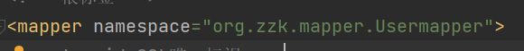

# MyBatis

### 作用

> 持久层框架,用于简化JDBC开发

### 基本使用

##### mybatis配置文件

```xml
<?xml version="1.0" encoding="UTF-8" ?>
<!DOCTYPE configuration
        PUBLIC "-//mybatis.org//DTD Config 3.0//EN"
        "http://mybatis.org/dtd/mybatis-3-config.dtd">
<configuration>
    <environments default="development">
        <environment id="development">
            <transactionManager type="JDBC"/>
            <dataSource type="POOLED">
                <!-- 数据库连接信息 -->
                <property name="driver" value="org.gjt.mm.mysql.Driver"/>
                <property name="url" value="jdbc:mysql://127.0.0.1:6666/text?useSSL=false"/>
                <property name="username" value="root"/>
                <property name="password" value="root"/>
            </dataSource>
        </environment>
    </environments>
    <mappers>
        <!-- SQL映射文件 -->
        <mapper resource="UserMapper.xml"/>
    </mappers>
</configuration>
```

##### SQL 映射文件

```xml
<?xml version="1.0" encoding="UTF-8" ?>
<!DOCTYPE mapper
        PUBLIC "-//mybatis.org//DTD Mapper 3.0//EN"
        "http://mybatis.org/dtd/mybatis-3-mapper.dtd">
<!-- 根标签 -->
<mapper namespace="text">
    <!-- id:SQL唯一标识 -->
    <!-- resultType:返回值类型 -->
    <select id="selectBlog" resultType="org.zzk.User">
        -- SQL语句
        select * from list;
    </select>
</mapper>
```

##### 返回值类型

```java
package org.zzk;

public class User {
    private Integer id;
    private String name;
    private Integer age;

    public Integer getId() {
        return id;
    }

    public void setId(Integer id) {
        this.id = id;
    }

    public String getName() {
        return name;
    }

    public void setName(String name) {
        this.name = name;
    }

    public Integer getAge() {
        return age;
    }

    public void setAge(Integer age) {
        this.age = age;
    }

    @Override
    public String toString() {
        return "User{" +
                "id=" + id +
                ", name='" + name + '\'' +
                ", age=" + age +
                '}';
    }
}
```

##### 测试类

```java
package org.zzk;


import org.apache.ibatis.io.Resources;
import org.apache.ibatis.session.SqlSession;
import org.apache.ibatis.session.SqlSessionFactory;
import org.apache.ibatis.session.SqlSessionFactoryBuilder;

import java.io.InputStream;
import java.util.List;

public class Main {
    public static void main(String[] args) throws Exception {
        // 加载Mybatis核心配置文件
        String resource = "mybatis-config.xml";
        InputStream inputStream = Resources.getResourceAsStream(resource);
        SqlSessionFactory sqlSessionFactory = new SqlSessionFactoryBuilder().build(inputStream);
        // 获取SQL对象
        SqlSession sql = sqlSessionFactory.openSession();
        // 执行sql语句
        List<User> user = sql.selectList("text.show");
        System.out.println(user);
        // 释放资源
        sql.close();
    }
}
```

### Mapper 代理开发

##### 定义Mapper接口

```apl
将 mapper 代理接口与 mybatis 映射文件设置为同目录
使用 / 分割文件目录
将命名空间设定为接口的全限定名
```



```java
import org.zzk.User;

import java.util.List;

public interface Usermapper {
    // 定义指定返回值的 ID 方法
    List<User> show();
}
```

##### 测试

```java
package org.zzk;

import org.apache.ibatis.io.Resources;
import org.apache.ibatis.session.SqlSession;
import org.apache.ibatis.session.SqlSessionFactory;
import org.apache.ibatis.session.SqlSessionFactoryBuilder;
import org.zzk.mapper.Usermapper;

import java.io.InputStream;
import java.util.List;

public class Main {
    public static void main(String[] args) throws Exception {
        // 加载Mybatis核心配置文件
        String resource = "mybatis-config.xml";
        InputStream inputStream = Resources.getResourceAsStream(resource);
        SqlSessionFactory sqlSessionFactory = new SqlSessionFactoryBuilder().build(inputStream);
        // 获取SQL对象
        SqlSession sql = sqlSessionFactory.openSession();
        // 获取代理对象
        Usermapper mapper = sql.getMapper(Usermapper.class);
        List<User> show = mapper.show();
        System.out.println(show);
        // 释放资源
        sql.close();
    }
}
```

##### 包扫描方式加载 SQL 映射

```xml
<mappers>
    <!-- SQL映射文件 -->
    <!-- <mapper resource="org/zzk/mapper/UserMapper.xml"/> -->
    <!-- Mapper 代理式导入 -->
    <package name="org.zzk.mapper"/>
</mappers>
```

### 核心配置文件

```xml
 <!-- 数据库环境配置,可配置多个数据库 -->
    <environments default="development">
        <!-- 配置多个 environment 来切换数据库 -->
        <environment id="development">
            <!-- 事务管理配置 -->
            <transactionManager type="JDBC"/>
            <!-- 数据库连接池 -->
            <dataSource type="POOLED">
                <!-- 数据库连接信息 -->
                <property name="driver" value="com.mysql.jdbc.Driver"/>
                <property name="url" value="jdbc:mysql://127.0.0.1:2333/list?useSSL=false"/>
                <property name="username" value="root"/>
                <property name="password" value="666666"/>
            </dataSource>
        </environment>
    </environments>
    <mappers>
        <!-- SQL映射文件 -->
        <!-- <mapper resource="org/zzk/mapper/UserMapper.xml"/> -->
        <!-- Mapper 代理式导入 -->
        <package name="org.zzk.mapper"/>
    </mappers>
```

### 配置文件完成增删改查

##### mapper接口

```java
package org.zzk.mapper;

import org.apache.ibatis.annotations.Param;
import org.zzk.User;

import java.util.List;
import java.util.Map;

public interface Usermapper {
    // 查询所有
    public List<User> selectAll();
    
    // 查询详情
    public User selectbyid(int id);
    
    // 多条件查询 - 散装参数
    public List<User> selectbycond(@Param("name") String name, @Param("age") int age);
    
    // 多条件查询 - 对象参数
    public List<User> selectbycond(User user);
    
    // 多条件查询 - Map集合参数
    public List<User> selectbycond(Map user);
    
    // 动态条件查询
    public List<User> selectcondtion(User user);
    
    // 添加
    public void setuser(User user);
    
    // 修改
    public void update(User user);
    
    // 修改动态字段
    public void updatepass(User user);
    
    // 删除
    public void del(int id);
    
    // 批量删除
    public void delbyarr(@Param("idr") int[] idr);
}
```

##### mapper代理配置

```xml
<?xml version="1.0" encoding="UTF-8" ?>
<!DOCTYPE mapper
        PUBLIC "-//mybatis.org//DTD Mapper 3.0//EN"
        "http://mybatis.org/dtd/mybatis-3-mapper.dtd">
<!-- 根标签 -->
<mapper namespace="org.zzk.mapper.Usermapper">
    <!-- 查询所有 -->
    <select id="selectAll" resultType="org.zzk.User">
        select *
        from list;
    </select>
    <!-- 查询详情 -->
    <select id="selectbyid" resultType="org.zzk.User">
        select *
        from list
        where id = #{id};
    </select>
    <!--多条件查询-->
    <select id="selectbycond" resultType="org.zzk.User">
        select *
        from list
        where name like #{name}
          and age <![CDATA[
        >
        ]]>
        #{age};
    </select>
    <!--动态条件查询-->
    <select id="selectcondtion"
            resultType="org.zzk.User">
        select *
        from list
        <where>
            <if test="name != null and name != ''">
                and name like #{name}
            </if>
            <if test="age != null">
                and age <![CDATA[
                >
                ]]>
                #{age}
            </if>
        </where>
        ;
    </select>
    <!--添加-->
    <insert id="setuser">
        insert into list (name, age)
        values (#{name}, #{age});
    </insert>
    <!--修改-->
    <update id="update">
        update list
        set name = #{name},
            age  = #{age}
        where id = #{id};
    </update>
    <!--修改动态字段-->
    <update id="updatepass">
        update list
        <set>
            <if test="name != null and name != ''">
                name = #{name},
            </if>
            <if test="age != null">
                age = #{age}
            </if>
        </set>
        where id = #{id};
    </update>
    <!--删除-->
    <delete id="del">
        delete
        from list
        where id = #{id};
    </delete>
    <!--批量删除-->
    <delete id="delbyarr">
        delete
        from list
        where id in (<foreach collection="idr" item="id"
                              separator=",">
        #{id}</foreach>);
    </delete>
</mapper>
```

##### 测试

```java
package org.zzk;

import org.apache.ibatis.io.Resources;
import org.apache.ibatis.session.SqlSession;
import org.apache.ibatis.session.SqlSessionFactory;
import org.apache.ibatis.session.SqlSessionFactoryBuilder;
import org.zzk.mapper.Usermapper;

import java.io.InputStream;
import java.util.HashMap;
import java.util.List;
import java.util.Map;

public class Main {
    public static void main(String[] args) throws Exception {
        // 加载Mybatis核心配置文件
        String resource = "mybatis-config.xml";
        InputStream inputStream = Resources.getResourceAsStream(resource);
        SqlSessionFactory sqlSessionFactory = new SqlSessionFactoryBuilder().build(inputStream);
        // 获取SQL对象
        SqlSession sql = sqlSessionFactory.openSession();
        // 获取代理对象
        Usermapper mapper = sql.getMapper(Usermapper.class);
        // 查询所有
        List<User> selectAll = mapper.selectAll();
        System.out.println("查询所有");
        System.out.println(selectAll);
        System.out.println("________________");
        // 查询详情
        User selectbyid = mapper.selectbyid(2);
        System.out.println("查询详情");
        System.out.println(selectbyid);
        System.out.println("________________");
        // 多条件查询 - 散装参数
        List<User> bycond = mapper.selectbycond("张三", 20);
        System.out.println("多条件查询 - 散装参数");
        System.out.println(bycond);
        System.out.println("________________");
        // 多条件查询 - 对象参数
        User user = new User(3, "王五", 22);
        List<User> byconduser = mapper.selectbycond(user);
        System.out.println("多条件查询 - 对象参数");
        System.out.println(byconduser);
        System.out.println("________________");
        // 多条件查询 - Map集合参数
        Map map = new HashMap<>();
        map.put("name", "张三");
        map.put("age", 22);
        List<User> bycondmap = mapper.selectbycond(map);
        System.out.println("多条件查询 - Map集合参数");
        System.out.println(bycondmap);
        System.out.println("________________");
        // 动态条件查询
        User user1 = new User(null, null, 20);
        List<User> selectcondtion = mapper.selectcondtion(user1);
        System.out.println("动态条件查询");
        System.out.println(selectcondtion);
        System.out.println("________________");
        // 添加
        User user2 = new User(null, "赵六", 30);
        mapper.setuser(user2);
        sql.commit();
        List<User> user2set = mapper.selectAll();
        System.out.println("添加");
        System.out.println(user2set);
        System.out.println("________________");
        // 修改
        User user3 = new User(1, "急急急", 30);
        mapper.update(user3);
        sql.commit();
        List<User> user3up = mapper.selectAll();
        System.out.println("修改");
        System.out.println(user3up);
        System.out.println("________________");
        // 修改动态字段
        User user4 = new User(1, "张三", null);
        mapper.updatepass(user4);
        sql.commit();
        List<User> user4up = mapper.selectAll();
        System.out.println("修改动态字段");
        System.out.println(user4up);
        System.out.println("________________");
        // 删除
        mapper.del(15);
        sql.commit();
        List<User> del = mapper.selectAll();
        System.out.println("删除");
        System.out.println(del);
        System.out.println("________________");
        // 批量删除
        int index[] = {16,17};
        mapper.delbyarr(index);
        List<User> delarr = mapper.selectAll();
        System.out.println("批量删除");
        System.out.println(delarr);
        System.out.println("________________");
        
        // 释放资源
        sql.close();
    }
}
```

### 注解SQL

##### 代理

```java
// 注解查询
@Select("select * from list where id = #{id};")
public User selectbyid_annotation(int id);
```

##### 测试

```java
// 注解SQL
User user5 = mapper.selectbyid_annotation(3);
System.out.println("注解SQL");
System.out.println(user5);
System.out.println("________________");
```


# MyBatis

------

# 快速入门

### mybatis 配置文件

```xml
<?xml version="1.0" encoding="UTF-8" ?>
<!DOCTYPE configuration
        PUBLIC "-//mybatis.org//DTD Config 3.0//EN"
        "http://mybatis.org/dtd/mybatis-3-config.dtd">
<configuration>
    <!-- 数据库环境配置,可配置多个数据库 -->
    <environments default="development">
        <!-- 配置多个 environment 来切换数据库 -->
        <environment id="development">
            <!-- 事务管理配置 -->
            <transactionManager type="JDBC"/>
            <!-- 数据库连接池 -->
            <dataSource type="POOLED">
                <!-- 数据库连接信息 -->
                <property name="driver" value="com.mysql.jdbc.Driver"/>
                <property name="url"
                          value="jdbc:mysql://127.0.0.1:2333/list?useSSL=false&amp;useUnicode=true&amp;characterEncoding=UTF-8"/>
                <property name="username" value="root"/>
                <property name="password" value="666666"/>
            </dataSource>
        </environment>
    </environments>
    <mappers>
        <!-- SQL映射文件 -->
        <mapper resource="org/zzk/mapper/UserMapper.xml"/>
    </mappers>
</configuration>
```

### Mapper.xml

```xml
<?xml version="1.0" encoding="UTF-8" ?>
<!DOCTYPE mapper
        PUBLIC "-//mybatis.org//DTD Mapper 3.0//EN"
        "http://mybatis.org/dtd/mybatis-3-mapper.dtd">
<!-- 根标签 -->
<mapper namespace="userMapper">
    <!-- 查询所有 -->
    <select id="selectAll" resultType="org.zzk.domain.User">
        select *
        from text;
    </select>
</mapper>
```

### 实体类

```java
package org.zzk.domain;

public class User {
    private Integer id;
    private String name;
    private Integer age;

    public Integer getId() {
        return id;
    }

    public void setId(Integer id) {
        this.id = id;
    }

    public String getName() {
        return name;
    }

    public void setName(String name) {
        this.name = name;
    }

    public Integer getAge() {
        return age;
    }

    public void setAge(Integer age) {
        this.age = age;
    }

    @Override
    public String toString() {
        return "User{" +
                "id=" + id +
                ", name='" + name + '\'' +
                ", age=" + age +
                '}';
    }
}
```

### 测试

```java
@Test
public void text1() throws IOException {
    // 获得核心配置文件
    InputStream resource = Resources.getResourceAsStream("mybatis-config.xml");
    // 获得session工厂对象
    SqlSessionFactory sessionFactory = new SqlSessionFactoryBuilder().build(resource);
    // 获得会话对象
    SqlSession sqlSession = sessionFactory.openSession();
    // 执行操作
    List<User> list = sqlSession.selectList("userMapper.selectAll");
    System.out.println(list);
    sqlSession.close();
}
```

# Mapper 代理开发

### 定义 Mapper 接口

```apl
将 mapper 代理接口与 mybatis 映射文件设置为同目录
使用 / 分割文件目录
将命名空间设定为接口的全限定名
```

```java
package org.zzk.mapper;

import org.zzk.domain.User;

import java.util.List;

public interface UserMapper {
    // 查询所有
    public List<User> selectAll();
}
```

### Mapper 配置

```xml
<?xml version="1.0" encoding="UTF-8" ?>
<!DOCTYPE mapper
        PUBLIC "-//mybatis.org//DTD Mapper 3.0//EN"
        "http://mybatis.org/dtd/mybatis-3-mapper.dtd">
<!-- 根标签 -->
<mapper namespace="org.zzk.mapper.UserMapper">  <!-- 修改为代理类 -->
    <!-- 查询所有 -->
    <select id="selectAll" resultType="org.zzk.domain.User">
        select *
        from text;
    </select>
</mapper>
```

### 测试

```java
@Test
public void text2() throws IOException {
    // 获得核心配置文件
    InputStream resource = Resources.getResourceAsStream("mybatis-config.xml");
    // 获得session工厂对象
    SqlSessionFactory sessionFactory = new SqlSessionFactoryBuilder().build(resource);
    // 获得会话对象
    SqlSession sqlSession = sessionFactory.openSession();
    // 获取代理对象
    UserMapper mapper = sqlSession.getMapper(UserMapper.class);
    // 执行操作
    List<User> list = mapper.selectAll();
    System.out.println(list);
    // 释放资源
    sqlSession.close();
}
```

# 包扫描加载 SQL 映射

```xml
<mappers>
    <!-- SQL映射文件 -->
    <!-- <mapper resource="org/zzk/mapper/UserMapper.xml"/> -->
    <!-- Mapper 代理式导入 -->
    <package name="org.zzk.mapper"/>
</mappers>
```

# xml 加载 properties

```properties
#驱动
driverClassName=com.mysql.jdbc.Driver
#地址
url=jdbc:mysql://127.0.0.1:6666/text?useSSL=false&amp;useUnicode=true&amp;characterEncoding=UTF-8
#用户名
username=root
#密码
password=root
#初始大小
initialSize=5
#大小上限
maxActive=10
#超时时间
maxWait=3000
```

```xml
<configuration>
    <!-- 加载外部文件 -->
    <properties resource="jdbc.properties"/>
    <!-- 数据库环境配置,可配置多个数据库 -->
    <environments default="development">
        <!-- 配置多个 environment 来切换数据库 -->
        <environment id="development">
            <!-- 事务管理配置 -->
            <transactionManager type="JDBC"/>
            <!-- 数据库连接池 -->
            <dataSource type="POOLED">
                <!-- 数据库连接信息 -->
                <property name="driver" value="${driverClassName}"/>
                <property name="url" value="${url}"/>
                <property name="username" value="${username}"/>
                <property name="password" value="${password}"/>
            </dataSource>
        </environment>
    </environments>
    <mappers>
        <!-- SQL映射文件 -->
        <!-- <mapper resource="org/zzk/mapper/UserMapper.xml"/> -->
        <!-- Mapper 代理式导入 -->
        <package name="org.zzk.mapper"/>
    </mappers>
</configuration>
```

# 返回值别名

```xml
<!-- 自定义别名 -->
<typeAliases>
    <typeAlias type="org.zzk.domain.User" alias="user"/>
</typeAliases>
```

```xml
<!-- 查询所有 -->
<select id="selectAll" resultType="user">
    select *
    from text;
</select>
```

# 动态SQL

### 普通测试

```java
// 动态SQL
@Test
public void text3() throws IOException {
    InputStream resource = Resources.getResourceAsStream("mybatis-config.xml");
    SqlSessionFactory sessionFactory = new SqlSessionFactoryBuilder().build(resource);
    SqlSession sqlSession = sessionFactory.openSession();
    UserMapper mapper = sqlSession.getMapper(UserMapper.class);
    // 全参查询
    User cond1 = new User();
    cond1.setId(18);
    cond1.setName("小白");
    cond1.setAge(31);
    // 执行操作
    List<User> list1 = mapper.findCondition(cond1);
    System.out.println(list1);
    // 不定参查询
    User cond2 = new User();
    cond2.setId(18);
    List<User> list2 = mapper.findCondition(cond2);
    System.out.println(list2);

    User cond3 = new User();
    cond3.setName("风清扬");
    cond3.setAge(23);
    List<User> list3 = mapper.findCondition(cond3);
    System.out.println(list3);

    sqlSession.close();
}
```

```xml
<!-- 动态SQL -->
<select id="findCondition" resultType="user">
    select *
    from text
    <where>
        <if test="id!=null">
            and id=#{id}
        </if>
        <if test="name!=null">
            and name=#{name}
        </if>
        <if test="age!=null">
            and age=#{age}
        </if>
    </where>
</select>
```

### 数组

```java
// 动态SQL(数组)
@Test
public void text4() throws IOException {
    InputStream resource = Resources.getResourceAsStream("mybatis-config.xml");
    SqlSessionFactory sessionFactory = new SqlSessionFactoryBuilder().build(resource);
    SqlSession sqlSession = sessionFactory.openSession();
    UserMapper mapper = sqlSession.getMapper(UserMapper.class);
    Integer[] integers = {15, 18, 21};
    // 执行操作
    List<User> list = mapper.findarray(integers);
    System.out.println(list);
    sqlSession.close();
}
```

```xml
<!-- 动态SQL数组 -->
<select id="findarray" resultType="user">
    select *
    from text
    where
    <foreach collection="array" open="id in(" close=")" item="id" separator=",">
        #{id}
    </foreach>
</select>
```

### SQL片段抽取

```java
// 动态SQL(片段抽取)
@Test
public void text5() throws IOException {
    InputStream resource = Resources.getResourceAsStream("mybatis-config.xml");
    SqlSessionFactory sessionFactory = new SqlSessionFactoryBuilder().build(resource);
    SqlSession sqlSession = sessionFactory.openSession();
    UserMapper mapper = sqlSession.getMapper(UserMapper.class);
    List<User> list = mapper.extraction(19);
    System.out.println(list);
    sqlSession.close();
}
```

```xml
<!-- 动态SQL(片段抽取) -->
<sql id="select">select *
    from text</sql>

<select id="extraction" resultType="user">
    -- 片段引用
    <include refid="select"/>
    where id=#{id}
</select>
```

# 常用标签

```xml
<!-- 查询 -->
<select/>
<!-- 插入 -->
<insert/>
<!-- 修改 -->
<update/>
<!-- 删除 -->
<delete/>
<!-- 判断标识 -->
<where/>
<!-- 判断 -->
<if/>
<!-- 遍历 -->
<foreach/>
<!-- SQL片段抽取 -->
<sql/>
```

# 插件使用

### 配置

```xml
<!-- 分页插件配置 -->
<plugins>
    <plugin interceptor="com.github.pagehelper.PageInterceptor"/>
</plugins>
```

```java
// 插件:分页测试
@Test
public void text6() throws IOException {
    InputStream resource = Resources.getResourceAsStream("mybatis-config.xml");
    SqlSessionFactory sessionFactory = new SqlSessionFactoryBuilder().build(resource);
    SqlSession sqlSession = sessionFactory.openSession();
    UserMapper mapper = sqlSession.getMapper(UserMapper.class);

    // 设置分页参数
    PageHelper.startPage(1, 3);
    List<User> list = mapper.paging();

    for (User user : list) {
        System.out.println(user);
    }
    // 获得分页参数
    PageInfo<User> pageInfo = new PageInfo<>(list);
    System.out.println("当前页:" + pageInfo.getPageNum());
    System.out.println("每页条数:" + pageInfo.getPageSize());
    System.out.println("总条数:" + pageInfo.getTotal());
    System.out.println("总页数:" + pageInfo.getPages());
    System.out.println("上一页:" + pageInfo.getPrePage());
    System.out.println("下一页:" + pageInfo.getNextPage());
    System.out.println("是否为最后一页:" + pageInfo.isIsFirstPage());
    System.out.println("是否为最后一页:" + pageInfo.isIsLastPage());
    sqlSession.close();
}
```

# xml配置增删改查

### Mapper 接口

```java
package org.zzk.mapper;

import org.apache.ibatis.annotations.Param;
import org.apache.ibatis.annotations.Select;
import org.zzk.domain.User;

import java.util.List;
import java.util.Map;

public interface TextMapper {
    // 查询所有
    public List<User> text_selectAll();

    // 查询详情
    public User text_selectbyid(int id);

    // 多条件查询 - 散装参数
    public List<User> text_selectbycond(@Param("name") String name, @Param("age") int age);

    // 多条件查询 - 对象参数
    public List<User> text_selectbycond(User user);

    // 多条件查询 - Map集合参数
    public List<User> text_selectbycond(Map user);

    // 动态条件查询
    public List<User> text_selectcondtion(User user);

    // 添加
    public void text_setuser(User user);

    // 修改
    public void text_update(User user);

    // 修改动态字段
    public void text_updatepass(User user);

    // 删除
    public void text_del(int id);

    // 批量删除
    public void text_delbyarr(@Param("idr") int[] idr);
}
```

### Mapper 代理sql

```xml
<?xml version="1.0" encoding="UTF-8" ?>
<!DOCTYPE mapper
        PUBLIC "-//mybatis.org//DTD Mapper 3.0//EN"
        "http://mybatis.org/dtd/mybatis-3-mapper.dtd">
<!-- 根标签 -->
<mapper namespace="org.zzk.mapper.TextMapper">  <!-- 修改为代理类 -->
    <!-- 抽取片段 -->
    <sql id="text_select">select *
                          from text</sql>
    <!-- 查询所有 -->
    <select id="text_selectAll" resultType="user">
        <include refid="text_select"></include>
    </select>
    <!-- 查询详情 -->
    <select id="text_selectbyid" resultType="user">
        <include refid="text_select"></include>
        where id = #{id};
    </select>
    <!--多条件查询-->
    <select id="text_selectbycond" resultType="user">
        <include refid="text_select"></include>
        where name like #{name}
        and age <![CDATA[
        >
        ]]>
        #{age};
    </select>
    <!--动态条件查询-->
    <select id="text_selectcondtion"
            resultType="user">
        <include refid="text_select"></include>
        <where>
            <if test="name != null and name != ''">
                and name like #{name}
            </if>
            <if test="age != null">
                and age=
                #{age}
            </if>
        </where>
        ;
    </select>
    <!--添加-->
    <insert id="text_setuser">
        insert into text (name, age)
        values (#{name}, #{age});
    </insert>
    <!--修改-->
    <update id="text_update">
        update text
        set name = #{name},
            age  = #{age}
        where id = #{id};
    </update>
    <!--修改动态字段-->
    <update id="text_updatepass">
        update text
        <set>
            <if test="name != null">
                name = #{name}
            </if>
            <if test="age != null">
                age = #{age}
            </if>
        </set>
        where id = #{id};
    </update>
    <!--删除-->
    <delete id="text_del">
        delete
        from text
        where id = #{id};
    </delete>
    <!--批量删除-->
    <delete id="text_delbyarr">
        delete
        from text
        where id in (<foreach collection="idr" item="id"
                              separator=",">
        #{id}</foreach>);
    </delete>
</mapper>
```

### 测试

```java
import org.apache.ibatis.io.Resources;
import org.apache.ibatis.session.SqlSession;
import org.apache.ibatis.session.SqlSessionFactory;
import org.apache.ibatis.session.SqlSessionFactoryBuilder;
import org.junit.Test;
import org.zzk.domain.User;
import org.zzk.mapper.TextMapper;

import java.io.IOException;
import java.io.InputStream;
import java.util.List;

public class TextBatis {

    // 获得核心配置文件
    InputStream resource = Resources.getResourceAsStream("mybatis-config.xml");
    // 获得session工厂对象
    SqlSessionFactory sessionFactory = new SqlSessionFactoryBuilder().build(resource);
    // 获得会话对象
    SqlSession sqlSession = sessionFactory.openSession();
    // 获取代理对象
    TextMapper mapper = sqlSession.getMapper(TextMapper.class);

    public TextBatis() throws IOException {
    }

    // 查询所有
    @Test
    public void batis_text1() {
        List<User> list = mapper.text_selectAll();
        System.out.println(list);
    }

    // 查询详情
    @Test
    public void batis_text2() {
        User user = mapper.text_selectbyid(15);
        System.out.println(user);
    }

    // 多条件查询
    @Test
    public void batis_text3() {
        List<User> users = mapper.text_selectbycond("小白", 18);
        System.out.println(users);
    }

    // 动态条件查询
    @Test
    public void batis_text4() {
        User user = new User();
        user.setAge(16);
        List<User> users = mapper.text_selectcondtion(user);
        System.out.println(users);
    }

    // 添加
    @Test
    public void batis_text5() {
        User user = new User();
        user.setName("晓燕");
        user.setAge(40);
        mapper.text_setuser(user);
        List<User> users = mapper.text_selectAll();
        sqlSession.commit();
        System.out.println(users);
    }

    // 修改
    @Test
    public void batis_text6() {
        User user = new User();
        user.setId(21);
        user.setName("晓燕");
        user.setAge(60);
        mapper.text_update(user);
        List<User> users = mapper.text_selectAll();
        sqlSession.commit();
        System.out.println(users);
    }

    // 修改动态字段
    @Test
    public void batis_text7() {
        User user = new User();
        user.setId(21);
        user.setAge(40);
        mapper.text_updatepass(user);
        List<User> users = mapper.text_selectAll();
        sqlSession.commit();
        System.out.println(users);
    }

    // 删除
    @Test
    public void batis_text8() {
        mapper.text_del(21);
        List<User> users = mapper.text_selectAll();
        sqlSession.commit();
        System.out.println(users);
    }

    // 批量删除
    @Test
    public void batis_text9() {
        int[] i = {1, 2, 3, 4};
        mapper.text_delbyarr(i);
        List<User> users = mapper.text_selectAll();
        sqlSession.commit();
        System.out.println(users);
    }
}
```

# MyBatis 多表操作

### 环境搭建

```java
import org.apache.ibatis.io.Resources;
import org.apache.ibatis.session.SqlSession;
import org.apache.ibatis.session.SqlSessionFactory;
import org.apache.ibatis.session.SqlSessionFactoryBuilder;

import java.io.IOException;
import java.io.InputStream;

public class TextMultilist {
    // 获得核心配置文件
    InputStream resource = Resources.getResourceAsStream("mybatis-config.xml");
    // 获得session工厂对象
    SqlSessionFactory sessionFactory = new SqlSessionFactoryBuilder().build(resource);
    // 获得会话对象
    SqlSession sqlSession = sessionFactory.openSession();
    // 获取代理对象
    TextMultilist mapper = sqlSession.getMapper(TextMultilist.class);

    public TextMultilist() throws IOException {
    }
}
```

```java
package org.zzk.domain;

import java.util.Date;

public class Order {
    private int id;
    private Date ordertime;
    private int total;
    private User user;

    public int getId() {
        return id;
    }

    public void setId(int id) {
        this.id = id;
    }

    public Date getOrdertime() {
        return ordertime;
    }

    public void setOrdertime(Date ordertime) {
        this.ordertime = ordertime;
    }

    public int getTotal() {
        return total;
    }

    public void setTotal(int total) {
        this.total = total;
    }

    public User getUser() {
        return user;
    }

    public void setUser(User user) {
        this.user = user;
    }

    @Override
    public String toString() {
        return "Order{" +
                "id=" + id +
                ", ordertime=" + ordertime +
                ", total=" + total +
                ", user=" + user +
                '}';
    }
}
```

```java
package org.zzk.domain;

import java.util.List;

public class User {
    private Integer id;
    private String name;
    private Integer age;

    // 描述映射
    private List<Order> orderList;

    public List<Order> getOrderList() {
        return orderList;
    }

    public void setOrderList(List<Order> orderList) {
        this.orderList = orderList;
    }

    public Integer getId() {
        return id;
    }

    public void setId(Integer id) {
        this.id = id;
    }

    public String getName() {
        return name;
    }

    public void setName(String name) {
        this.name = name;
    }

    public Integer getAge() {
        return age;
    }

    public void setAge(Integer age) {
        this.age = age;
    }

    @Override
    public String toString() {
        return "User{" +
                "id=" + id +
                ", name='" + name + '\'' +
                ", age=" + age +
                ", orderList=" + orderList +
                '}';
    }
}
```

# 一对一

### 配置

```xml
<!-- 一对一 -->
<!-- 手动指定字段与实体属性的映射关系 -->
<resultMap id="orderMap" type="org.zzk.domain.Order">
    <result column="id" property="id"/>
    <result column="ordertime" property="ordertime"/>
    <result column="total" property="total"/>
    <result column="uid" property="user.id"/>
    <result column="name" property="user.name"/>
    <result column="age" property="user.age"/>
</resultMap>

<!-- 查询全部 -->
<select id="findAll" resultMap="orderMap">
    select *
    from multilist o,
    text u
    where o.uid = u.id
</select>

<!-- 指定字段与实体属性的映射关系 -->
<resultMap id="order_propMap" type="org.zzk.domain.Order">
    <result column="id" property="id"/>
    <result column="ordertime" property="ordertime"/>
    <result column="total" property="total"/>
    <association property="user" javaType="user">
        <id column="id" property="id"/>
        <result column="name" property="name"/>
        <result column="age" property="age"/>
    </association>
</resultMap>

<!-- 查询全部 -->
<select id="findALL_prop" resultMap="order_propMap">
    select *
    from multilist o,
    text u
    where o.uid = u.id
</select>
```

### 代理接口

```java
// 查询全部
public List<Order> findAll();

public List<Order> findALL_prop();
```

### 测试

```java
/*
    一对一
*/
// 查询所有
@Test
public void MuText1() {
    List<Order> all = mapper.findAll();
    System.out.println(all);
}

// 查询所有
@Test
public void MuText2() {
    List<Order> all = mapper.findALL_prop();
    System.out.println(all);
}
```

# 一对多

### 配置

```xml
<!-- 一对多 -->
<!-- 映射 -->
<resultMap id="userMap" type="user">
    <id column="id" property="id"/>
    <result column="name" property="name"/>
    <result column="age" property="age"/>
    <!-- 配置集合 -->
    <collection property="orderList" ofType="org.zzk.domain.Order">
        <!-- 封装数据 -->
        <id column="oid" property="id"/>
        <result column="ordertime" property="ordertime"/>
        <result column="total" property="total"/>
    </collection>
</resultMap>

<!-- 查询 -->
<select id="UfindAll" resultMap="userMap">
    select *, o.id oid
    from text u,
    multilist o
    where u.id = o.uid
</select>
```

### 代理接口

```java
// 一对多
public List<User> UfindAll();
```

### 测试

```java
/*
    一对多
*/
@Test
public void MuText3() {
    List<User> all = mapper.UfindAll();
    for (User user : all) {
        System.out.println(user);
    }
}
```

# 多对多

### 环境搭建

```java
package org.zzk.domain;

import java.util.List;

public class Staff {
    private int id;
    private String name;
    private int age;
    // 描述具备那些角色
    private List<Role> roleList;

    public int getId() {
        return id;
    }

    public void setId(int id) {
        this.id = id;
    }

    public String getName() {
        return name;
    }

    public void setName(String name) {
        this.name = name;
    }

    public int getAge() {
        return age;
    }

    public void setAge(int age) {
        this.age = age;
    }

    public List<Role> getRoleList() {
        return roleList;
    }

    public void setRoleList(List<Role> roleList) {
        this.roleList = roleList;
    }

    @Override
    public String toString() {
        return "Staff{" +
                "id=" + id +
                ", name='" + name + '\'' +
                ", age=" + age +
                ", roleList=" + roleList +
                '}';
    }
}
```

```java
package org.zzk.domain;

public class Role {
    private int id;
    private String roleName;
    private String roleDesc;

    public int getId() {
        return id;
    }

    public void setId(int id) {
        this.id = id;
    }

    public String getRoleName() {
        return roleName;
    }

    public void setRoleName(String roleName) {
        this.roleName = roleName;
    }

    public String getRoleDesc() {
        return roleDesc;
    }

    public void setRoleDesc(String roleDesc) {
        this.roleDesc = roleDesc;
    }

    @Override
    public String toString() {
        return "Role{" +
                "id=" + id +
                ", roleName='" + roleName + '\'' +
                ", roleDesc='" + roleDesc + '\'' +
                '}';
    }
}
```

```java
// 多对多
public List<Staff> findUserRoleAll();
```

```xml
<!-- 多对多 -->
<resultMap id="userRole" type="org.zzk.domain.Staff">
    <id column="userId" property="id"/>
    <result column="name" property="name"/>
    <result column="age" property="age"/>
    <collection property="roleList" ofType="org.zzk.domain.Role">
        <id column="roleId" property="id"/>
        <result column="roleName" property="roleName"/>
        <result column="roleDesc" property="roleDesc"/>
    </collection>
</resultMap>

<select id="findUserRoleAll" resultMap="userRole">
    select *
    from user u,
    user_role ur,
    role r
    where u.id = ur.userId
    and ur.roleId = r.id
</select>
```

### 测试

```java
/*
    多对多(内联)
*/
@Test
public void MuText4() {
    List<Staff> all = mapper.findUserRoleAll();
    for (Staff staff : all) {
        System.out.println(staff);
    }
}
```

# 注解开发

### 常用注解

> // 新增
> @Insert
> // 更新
> @Update
> // 删除
> @Delete
> // 查询
> @Select
> // 结果集封装
> @Result
> // 封装多个结果集
> @Results
> // 实现一对一
> @One
> // 实现一对多
> @Many

### 注解接口

```java
// 注解开发 - 简单SQL使用注解,复杂SQL使用XML
// 注解增
@Insert("insert into user values (#{id}, #{name}, #{age})")
public int ann_add(Staff user);

// 注解删
@Delete("delete from user where id = #{id}")
public int ann_del(int i);

// 注解改
@Update("update user set name=#{name}, age=#{age} where id = #{id}")
public int ann_update(Staff user);

// 注解查
@Select("select * from user")
public List<Staff> ann_find();
```

### 测试

```java
/*
    注解开发
*/

// 注解增
@Test
public void MuText5() {
    Staff sta = new Staff();
    sta.setName("雨辰");
    sta.setAge(22);
    int i = mapper.ann_add(sta);
    sqlSession.commit();
    System.out.println(i);
}

// 注解删
@Test
public void MuText6() {
    int i = mapper.ann_del(9);
    sqlSession.commit();
    System.out.println(i);
}

// 注解改
@Test
public void MuText7() {
    Staff sta = new Staff();
    sta.setId(4);
    sta.setName("夏兰");
    sta.setAge(22);
    int i = mapper.ann_update(sta);
    sqlSession.commit();
    System.out.println(i);
}

// 注解查
@Test
public void MuText8() {
    List<Staff> staff = mapper.ann_find();
    for (Staff staff1 : staff) {
        System.out.println(staff1);
    }
}
```


​	


​	
