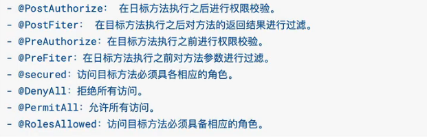

# Security

### 依赖

```xml
<dependency>
    <groupId>org.springframework.boot</groupId>
    <artifactId>spring-boot-starter-security</artifactId>
</dependency>
```

### 默认界面

> http://localhost:xxxx/login
>
> 默认账户user
>
> 密码控制台输出

