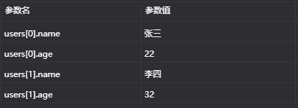

# SpringMVC 框架

------

# SpringMVC 开发步骤

### Maven 包

```xml
<dependencies>
    <dependency>
        <groupId>org.springframework</groupId>
        <artifactId>spring-context</artifactId>
        <version>6.0.3</version>
    </dependency>
    <dependency>
        <groupId>org.springframework</groupId>
        <artifactId>spring-web</artifactId>
        <version>6.0.3</version>
    </dependency>
    <dependency>
        <groupId>org.springframework</groupId>
        <artifactId>spring-webmvc</artifactId>
        <version>6.0.3</version>
    </dependency>
    <dependency>
        <groupId>org.springframework</groupId>
        <artifactId>spring-test</artifactId>
        <version>6.0.3</version>
    </dependency>
    <dependency>
        <groupId>com.alibaba</groupId>
        <artifactId>fastjson</artifactId>
        <version>2.0.22</version>
    </dependency>
    <dependency>
        <groupId>com.fasterxml.jackson.core</groupId>
        <artifactId>jackson-core</artifactId>
        <version>2.14.1</version>
    </dependency>
    <dependency>
        <groupId>com.fasterxml.jackson.core</groupId>
        <artifactId>jackson-databind</artifactId>
        <version>2.14.1</version>
    </dependency>
    <dependency>
        <groupId>com.fasterxml.jackson.core</groupId>
        <artifactId>jackson-annotations</artifactId>
        <version>2.14.1</version>
    </dependency>
    <dependency>
        <groupId>jakarta.servlet</groupId>
        <artifactId>jakarta.servlet-api</artifactId>
        <version>5.0.0</version>
    </dependency>
    <dependency>
        <groupId>mysql</groupId>
        <artifactId>mysql-connector-java</artifactId>
        <version>5.1.48</version>
    </dependency>
    <dependency>
        <groupId>com.alibaba</groupId>
        <artifactId>druid</artifactId>
        <version>1.2.15</version>
    </dependency>
    <dependency>
        <groupId>org.springframework</groupId>
        <artifactId>spring-jdbc</artifactId>
        <version>6.0.3</version>
    </dependency>
    <dependency>
        <groupId>org.springframework</groupId>
        <artifactId>spring-tx</artifactId>
        <version>6.0.3</version>
    </dependency>
    <dependency>
        <groupId>junit</groupId>
        <artifactId>junit</artifactId>
        <version>4.13.2</version>
        <scope>test</scope>
    </dependency>
    <dependency>
        <groupId>com.alibaba</groupId>
        <artifactId>druid</artifactId>
        <version>1.2.15</version>
    </dependency>
</dependencies>
```

### web.xml配置

```xml
<!-- 配置SpringMVC的前端控制器 -->
<servlet>
    <!-- 控制器名称 -->
    <servlet-name>DispatcherServlet</servlet-name>
    <!-- 控制器实例 -->
    <servlet-class>org.springframework.web.servlet.DispatcherServlet</servlet-class>
    <init-param>
        <!-- 加载配置 -->
        <param-name>contextConfigLocation</param-name>
        <param-value>classpath:spring-mvc.xml</param-value>
    </init-param>
    <!-- 启动时加载 -->
    <load-on-startup>1</load-on-startup>
</servlet>
<!-- 映射地址 -->
<servlet-mapping>
    <!-- 映射名 -->
    <servlet-name>DispatcherServlet</servlet-name>
    <!-- Url模式 -->
    <url-pattern>/</url-pattern>
</servlet-mapping>
```

### mvc.xml 配置

```xml
<!-- 组件扫描 -->
<context:component-scan base-package="Text1.controller"/>
```

### 控制器实例

```java
package Text1.controller;

import org.springframework.stereotype.Controller;
import org.springframework.web.bind.annotation.RequestMapping;

@Controller
public class UserController {
    // 请求设置
    @RequestMapping("/quick")
    public String save() {
        System.out.println("前端控制器运转中");
        // 返回跳转资源
        return "index.jsp";
    }
}
```

### 注解解析

```java
// 请求映射
// @RequestMapping(请求路径,指定请求方式,指定包含请求参数)
@RequestMapping(value = "/quick", method = RequestMethod.GET, params = {"username"})
```

# SpringMCV 数据响应

### 页面跳转

##### 返回字符串

```java
package Text1.controller;

import org.springframework.stereotype.Controller;
import org.springframework.web.bind.annotation.RequestMapping;

@Controller
public class UserController {
    // 请求设置
    @RequestMapping(value = "/quick")
    public String save() {
        System.out.println("前端控制器运转中");
        // 返回调整资源
        return "index.jsp";
    }
}
```

##### 返回对象

```java
package Text1.controller;

import org.springframework.stereotype.Controller;
import org.springframework.web.bind.annotation.RequestMapping;
import org.springframework.web.servlet.ModelAndView;

@Controller
public class UserController {
    @RequestMapping(value = "/quick")
    public ModelAndView save() {
        System.out.println("前端控制器运转中");
        ModelAndView modelAndView = new ModelAndView();
        // 设置模型数据
        modelAndView.addObject("username", "lishi");
        // 设置视图
        modelAndView.setViewName("index.jsp");
        return modelAndView;
    }
}
```

```java
// 可直接在形参中定义,让Spring注入
public ModelAndView save(ModelAndView modelAndView) {
    System.out.println("前端控制器运转中");
    // 设置模型数据
    modelAndView.addObject("username", "lishi");
    // 设置视图
    modelAndView.setViewName("index.jsp");
    return modelAndView;
}
```

```java
public String  save(Model model) {
    System.out.println("前端控制器运转中");
    // 设置模型数据
    model.addAttribute("username", "小白");
    return "index.jsp";
}
```

```jsp
<%@ page contentType="text/html;charset=UTF-8" language="java" isELIgnored="false" %>
<html>
<body>

<h2>Hello ${username}</h2>
</body>
</html>
```

### 回显数据

##### 返回字符串

```java
package Text1.controller;

import org.springframework.stereotype.Controller;
import org.springframework.web.bind.annotation.RequestMapping;
import org.springframework.web.bind.annotation.ResponseBody;


@Controller
public class UserController {
    @RequestMapping(value = "/quick")
    @ResponseBody // 告知SpringMVC框架,该方法不进行调整,直接回显
    public String save() {
        return "Hello";
    }
}
```

##### 返回JSON

```java
package Text1.controller;

import com.alibaba.fastjson.JSON;
import org.springframework.stereotype.Controller;
import org.springframework.web.bind.annotation.RequestMapping;
import org.springframework.web.bind.annotation.ResponseBody;

@Controller
public class UserController {
    @RequestMapping(value = "/quick")
    @ResponseBody
    public String save() {
        User user = new User("小白", 24);
        // Json转换
        return JSON.toJSONString(user);
    }
}
```

### 返回对象或集合

##### xml 配置

```xml
<!-- MCV注解驱动 -->
<mvc:annotation-driven/>
```

##### 测试

```java
package Text1.controller;

import org.springframework.stereotype.Controller;
import org.springframework.web.bind.annotation.RequestMapping;
import org.springframework.web.bind.annotation.ResponseBody;

@Controller
public class UserController {
    @RequestMapping(value = "/quick")
    @ResponseBody
    public User save() {
        // 直接回显对象并转为JSON
        return new User("小白", 24);
    }
}
```

# SpringMVC 请求

### 获得基本类型参数

```java
package Text1.controller;

import org.springframework.stereotype.Controller;
import org.springframework.web.bind.annotation.RequestMapping;
import org.springframework.web.bind.annotation.ResponseBody;

@Controller
public class UserController {
    // 传输:quick?username=李四&age=23
    @RequestMapping(value = "/quick")
    @ResponseBody
    public void save(String username, Integer age) {
        // SpringMVC对应形参传入实参
        System.out.println(username);
        System.out.println(age);
    }
}
```

### 获得POJO类型

```java
package Text1.controller;

import org.springframework.stereotype.Controller;
import org.springframework.web.bind.annotation.RequestMapping;
import org.springframework.web.bind.annotation.ResponseBody;

@Controller
public class UserController {
    // 传输:quick?name=李四&age=23
    @RequestMapping(value = "/quick")
    @ResponseBody
    public void save(User user) {
        // SpringMVC自动封装
        System.out.println(user.toString());
    }
}
```

### 获得数组类型数据

```java
package Text1.controller;

import org.springframework.stereotype.Controller;
import org.springframework.web.bind.annotation.RequestMapping;
import org.springframework.web.bind.annotation.ResponseBody;

import java.util.Arrays;

@Controller
public class UserController {
    // 请求:quick?stars=aaa&stars=bbb&stars=ccc
    @RequestMapping(value = "/quick")
    @ResponseBody
    public void request3(String [] stars) {
        System.out.println("前端请求控制器3运转中");
        // SpringMVC自动封装
        System.out.println(Arrays.asList(stars));
    }
}
```

### 获得集合类型数据

```java
package Text1.controller;

import java.util.List;

// VO 封装集合类
public class VO {
    private List<User> users;

    public List<User> getUsers() {
        return users;
    }

    public void setUsers(List<User> users) {
        this.users = users;
    }

    @Override
    public String toString() {
        return "VO{" +
                "users=" + users +
                '}';
    }
}
```



```java
package Text1.controller;

import org.springframework.stereotype.Controller;
import org.springframework.web.bind.annotation.RequestMapping;
import org.springframework.web.bind.annotation.ResponseBody;

@Controller
public class UserController {
    @RequestMapping(value = "/quick")
    @ResponseBody
    public void save(VO vo) { // VO对象封装集合
        System.out.println(vo);
    }
}
```

### 获取JSON类型数据

```json
// 数据
[
    {
        "name":"张三",
        "age":33
    },
    {
        "name":"王五",
        "age":22
    }
]
```

```java
package Text1.controller;

import org.springframework.stereotype.Controller;
import org.springframework.web.bind.annotation.RequestBody;
import org.springframework.web.bind.annotation.RequestMapping;
import org.springframework.web.bind.annotation.ResponseBody;

import java.util.List;

@Controller
public class UserController {
    @RequestMapping(value = "/quick")
    @ResponseBody
    public void save(@RequestBody List<User> userList) {
                    // 请求注解解析数据
        System.out.println(userList);
    }
}
```

### 参数绑定注解

```java
package Text1.controller;

import org.springframework.stereotype.Controller;
import org.springframework.web.bind.annotation.RequestMapping;
import org.springframework.web.bind.annotation.RequestParam;
import org.springframework.web.bind.annotation.ResponseBody;

@Controller
public class UserController {
    // 请求:quick?name=李四
    @RequestMapping(value = "/quick")
    @ResponseBody     // 指定参数名别名
    public void save(@RequestParam(value = "name",defaultValue = "init") String username) {
        // @RequestParam(请求参数名,是否必须,默认值)
        System.out.println(username);
    }
}
```

### 获得Restful风格参数

```java
package Text1.controller;

import org.springframework.stereotype.Controller;
import org.springframework.web.bind.annotation.PathVariable;
import org.springframework.web.bind.annotation.RequestMapping;
import org.springframework.web.bind.annotation.ResponseBody;

@Controller
public class UserController {
    @RequestMapping(value = "/quick/{name}") // 占位符
    @ResponseBody
    public void save(@PathVariable(value = "name") String username) {
        // @PathVariable(占位符名,是否必须)
        System.out.println(username);
    }
}
```

### 自定义类型转换器

##### 自定义转换器类

```java
package Text1.controller;

import org.springframework.core.convert.converter.Converter;

import java.text.ParseException;
import java.text.SimpleDateFormat;
import java.util.Date;

// 自定义数据转换器
public class DateConverter implements Converter<String, Date> {
    // <输入类型,输出类型>
    @Override
    public Date convert(String source) {
        // 解析字符串
        SimpleDateFormat format = new SimpleDateFormat("yyyy-MM-dd");
        Date date = new Date();
        try {
            date = format.parse(source);
        } catch (ParseException e) {
            e.printStackTrace();
        }
        return date;
    }
}
```

##### xml 配置

```xml
<!-- MCV注解驱动 -->
<mvc:annotation-driven conversion-service="connectorServer"/> <!-- 添加转换器 -->
<!-- 声明转换器 -->
<bean id="connectorServer" class="org.springframework.context.support.ConversionServiceFactoryBean">
    <property name="converters">
        <list>
            <bean class="Text1.controller.DateConverter"></bean>
        </list>
    </property>
</bean>
```

##### 测试

```java
package Text1.controller;

import org.springframework.stereotype.Controller;
import org.springframework.web.bind.annotation.RequestMapping;
import org.springframework.web.bind.annotation.ResponseBody;

import java.util.Date;

@Controller
public class UserController {
    // 请求:quick?date=2018-12-21
    @RequestMapping(value = "/quick")
    @ResponseBody
    public void save(Date date) {
        System.out.println(date);
    }
}
```

### 获得 Servlet 相关API

```java
package Text1.controller;

import jakarta.servlet.http.HttpServletRequest;
import jakarta.servlet.http.HttpServletResponse;
import jakarta.servlet.http.HttpSession;
import org.springframework.stereotype.Controller;
import org.springframework.web.bind.annotation.RequestMapping;
import org.springframework.web.bind.annotation.ResponseBody;

@Controller
public class UserController {
    @RequestMapping(value = "/quick")
    @ResponseBody
    public void save(HttpServletRequest request, HttpServletResponse response, HttpSession session) {
        // SpringMVC框架自动注入
        System.out.println(request);
        System.out.println(response);
        System.out.println(session);
    }
}
```

### 获取请求头

```java
package Text1.controller;

import org.springframework.stereotype.Controller;
import org.springframework.web.bind.annotation.CookieValue;
import org.springframework.web.bind.annotation.RequestHeader;
import org.springframework.web.bind.annotation.RequestMapping;
import org.springframework.web.bind.annotation.ResponseBody;

@Controller
public class UserController {
    @RequestMapping(value = "/quick")
    @ResponseBody
    public void save(@RequestHeader(value = "user-agent") String user_agent, @CookieValue("JSESSIONID") String jsessid) {
        // 获取指定请求头
        // @RequestHeader(请求头参数名,是否必要)
        // 获取指定cookie
        // @CookieValue(cookie名,是否必要)
        System.out.println(user_agent);
        System.out.println(jsessid);
    }
}
```

# Spring JdbcTemplate

### JDBCTemplate开发步骤

```java
@Test
// JDBCTemplate开发步骤
public void text1() throws Exception {
    // 数据源对象
    DriverManagerDataSource dataSource = new DriverManagerDataSource();
    dataSource.setDriverClassName("com.mysql.jdbc.Driver");
    dataSource.setUrl("jdbc:mysql://localhost:2333/list?useSSL=false");
    dataSource.setUsername("root");
    dataSource.setPassword("666666");
    JdbcTemplate jdbcTemplate = new JdbcTemplate();
    // 设置数据源对象
    jdbcTemplate.setDataSource(dataSource);
    // 执行操作
    int row = jdbcTemplate.update("insert into text values (?,?,?)", null, "tom", 22);
    System.out.println(row);
}
```

### Spring 产生模板对象

##### JDBC.xml

```xml
<!-- 数据源对象 -->
<bean id="dataSource" class="org.springframework.jdbc.datasource.DriverManagerDataSource">
    <property name="driverClassName" value="com.mysql.jdbc.Driver"/>
    <property name="url" value="jdbc:mysql://localhost:2333/list?useSSL=false"/>
    <property name="username" value="root"/>
    <property name="password" value="666666"/>
</bean>
<!-- JDBC模板对象 -->
<bean id="jdbcTemp" class="org.springframework.jdbc.core.JdbcTemplate">
    <property name="dataSource" ref="dataSource"/>
</bean>
```

##### JDBC.properties

```properties
driverClassName=com.mysql.jdbc.Driver
url=jdbc:mysql://localhost:2333/list?useSSL=false
username=root
password=666666
```

##### 测试

```java
// Spring 产生模板对象
@Test
public void text2() {
    ApplicationContext app = new ClassPathXmlApplicationContext("JDBCContext.xml");
    JdbcTemplate jdbcTemplate = app.getBean(JdbcTemplate.class);
    int row = jdbcTemplate.update("insert into text values (?,?,?)", null, "lisi", 33);
    System.out.println(row);
}
```

### JDBCTemplate 常用操作

```java
package domtext;

import domain.User;
import org.junit.Test;
import org.junit.runner.RunWith;
import org.springframework.beans.factory.annotation.Autowired;
import org.springframework.jdbc.core.BeanPropertyRowMapper;
import org.springframework.jdbc.core.JdbcTemplate;
import org.springframework.test.context.ContextConfiguration;
import org.springframework.test.context.junit4.SpringJUnit4ClassRunner;

import java.util.List;

// 运行测试类
@RunWith(SpringJUnit4ClassRunner.class)
// 读取上下文配置
@ContextConfiguration("classpath:JDBCContext.xml")
public class SpringJDBCText {
    @Autowired
    // 自动注入
    private JdbcTemplate jdbcTemplate;

    /*
    增加
     */
    @Test
    public void textAdd() {
        int row = jdbcTemplate.update("insert into text values (?,?,?)", null, "bool", 39);
        System.out.println(row);
    }

    /*
    更新
     */
    @Test
    public void textUpdate() {
        int row = jdbcTemplate.update("update text set age=? where id=?", 1000, 3);
        System.out.println(row);
    }

    /*
    删除
     */
    @Test
    public void textDelete() {
        int row = jdbcTemplate.update("delete from text where id=?", 2);
        System.out.println(row);
    }

    /*
    查询全部
     */
    @Test
    public void textQueryAll() {
        List<User> query = jdbcTemplate.query("select * from text", new BeanPropertyRowMapper<User>(User.class));
        System.out.println(query);
    }

    /*
    查询单个
     */
    @Test
    public void textQueryOne() {
        User user = jdbcTemplate.queryForObject("select * from text where id=?", new BeanPropertyRowMapper<User>(User.class), 6);
        System.out.println(user);
    }

    /*
    聚合查询
     */
    @Test
    public void textQueryCount() {
        Long aLong = jdbcTemplate.queryForObject("select count(*) from text", Long.class);
        System.out.println(aLong);
    }
}
```

# SpringMVC 拦截器

### 快速入门

##### 访问接口

```java
@RequestMapping("/target")
public String  target() {
    System.out.println("资源运行.....");
    return "index.jsp";
}
```

##### 拦截器实例

```java
package interceptor;

import jakarta.servlet.http.HttpServletRequest;
import jakarta.servlet.http.HttpServletResponse;
import org.springframework.web.servlet.HandlerInterceptor;
import org.springframework.web.servlet.ModelAndView;

public class MyInterceptor1 implements HandlerInterceptor {
    // 目标方法执行前
    @Override
    public boolean preHandle(HttpServletRequest request, HttpServletResponse response, Object handler) throws Exception {
        System.out.println("preHandle1执行...");
        String username = request.getParameter("username");
        if ("tom".equals(username)) {
            return true;
        } else {
            request.getRequestDispatcher("/error.jsp").forward(request, response);
            return false;
        }

    }

    // 目标方法执行后 数据返回之前
    @Override
    public void postHandle(HttpServletRequest request, HttpServletResponse response, Object handler, ModelAndView modelAndView) throws Exception {
        System.out.println("postHandle1执行...");
    }

    // 流程执行完毕后执行
    @Override
    public void afterCompletion(HttpServletRequest request, HttpServletResponse response, Object handler, Exception ex) throws Exception {
        System.out.println("afterCompletion1执行...");
    }
}
```

```java
package interceptor;

import jakarta.servlet.http.HttpServletRequest;
import jakarta.servlet.http.HttpServletResponse;
import org.springframework.web.servlet.HandlerInterceptor;
import org.springframework.web.servlet.ModelAndView;

// 多拦截器
public class MyInterceptor2 implements HandlerInterceptor {
    @Override
    public boolean preHandle(HttpServletRequest request, HttpServletResponse response, Object handler) throws Exception {
        System.out.println("preHandle2执行...");
        return true;
    }

    @Override
    public void postHandle(HttpServletRequest request, HttpServletResponse response, Object handler, ModelAndView modelAndView) throws Exception {
        System.out.println("postHandle2执行...");
    }

    @Override
    public void afterCompletion(HttpServletRequest request, HttpServletResponse response, Object handler, Exception ex) throws Exception {
        System.out.println("afterCompletion2执行...");
    }
}
```

##### xml配置

```xml
<!-- 配置拦截器 -->
<mvc:interceptors>
    <mvc:interceptor>
        <!-- 拦截指定 -->
        <mvc:mapping path="/**"/>
        <bean class="interceptor.MyInterceptor1"/>
    </mvc:interceptor>
    <mvc:interceptor>
        <mvc:mapping path="/**"/>
        <bean class="interceptor.MyInterceptor2"/>
    </mvc:interceptor>
</mvc:interceptors>
```

### 拦截配置

```xml
<mvc:interceptor>
    <mvc:mapping path="/**"/>
    <!-- 指定资源不拦截 -->
    <mvc:exclude-mapping path="/user/*"/>
    <bean class="interceptor.MyInterceptor2"/>
</mvc:interceptor>
```

# SpringMVC 异常处理

### 使用

##### 处理器配置

```xml
<!-- 异常处理器 -->
<bean class="org.springframework.web.servlet.handler.SimpleMappingExceptionResolver">
    <property name="defaultErrorView" value="error.jsp"/>
    <property name="exceptionMappings">
        <map>
            <entry key="exception.MyException" value="error.jsp"/>
        </map>
    </property>
</bean>
```

##### 触发异常Bean

```java
package exception;

import org.springframework.stereotype.Service;

import java.io.FileInputStream;
import java.io.FileNotFoundException;
import java.io.InputStream;

@Service
public class ExecpSerice {
    public void show1() {
        System.out.println("抛出类型转换异常...");
        Object str = "Hello";
        Integer i = (Integer) str;
    }

    public void show2() {
        System.out.println("抛出除零异常...");
        int i = 3 / 0;
    }

    public void show3() throws FileNotFoundException {
        System.out.println("抛出文件找不到异常...");
        InputStream in = new FileInputStream("C:xxx/xxx/xxx/xxx");
    }

    public void show4() {
        System.out.println("抛出空指针异常...");
        String str = null;
        str.length();
    }

    public void show5() throws MyException {
        System.out.println("抛出自定义异常...");
        throw new MyException();
    }
}
```

```java
package exception;

import org.springframework.beans.factory.annotation.Autowired;
import org.springframework.stereotype.Controller;
import org.springframework.web.bind.annotation.RequestMapping;

@Controller
public class ExecpController {
    @Autowired
    private ExecpSerice execpSerice;

    @RequestMapping("/execp")
    public void execp() throws Exception {
        System.out.println("资源运行.....");
        // 触发异常
        execpSerice.show1();
        execpSerice.show2();
        execpSerice.show3();
        execpSerice.show4();
        execpSerice.show5();
    }
}
```

### 自定义异常处理

##### 异常处理类

```java
package exception;

import jakarta.servlet.http.HttpServletRequest;
import jakarta.servlet.http.HttpServletResponse;
import org.springframework.web.servlet.HandlerExceptionResolver;
import org.springframework.web.servlet.ModelAndView;

public class ExecpResolver implements HandlerExceptionResolver {
    @Override
    public ModelAndView resolveException(HttpServletRequest request, HttpServletResponse response, Object handler, Exception ex) {
        // 自定义异常处理
        ModelAndView modelAndView = new ModelAndView();
        if (ex instanceof MyException) {
            modelAndView.addObject("info", "自定义异常");
        } else if (ex instanceof ClassCastException) {
            modelAndView.addObject("info", "类转换异常");
        }
        modelAndView.setViewName("error.jsp");
        return modelAndView;
    }
}
```

##### 配置 

```xml
<!-- 自定义异常处理器 -->
<bean class="exception.ExecpResolver"/>
```

