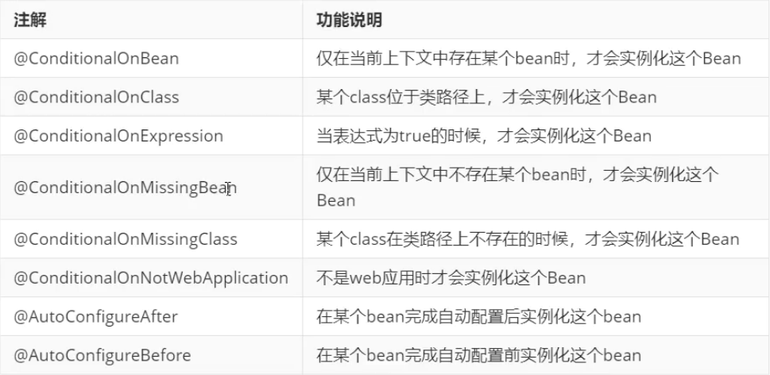
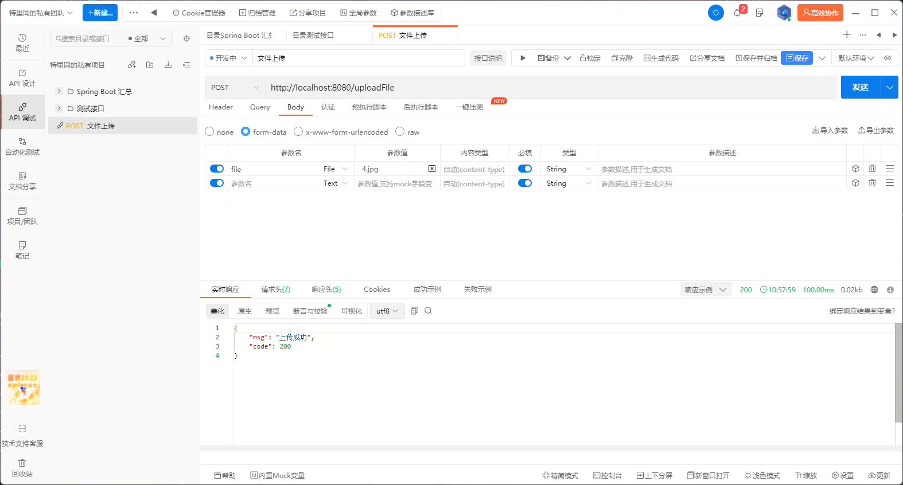

# Spring Boot 

------

# Spring Boot 快速使用

### 入口

```java
package com.zzk;

import org.springframework.boot.SpringApplication;
import org.springframework.boot.autoconfigure.SpringBootApplication;

@SpringBootApplication
public class Boot1Application {
    
    public static void main(String[] args) {
        // Spring Boot 主入口
        SpringApplication.run(Boot1Application.class, args);
    }
}
```

### 接口

```java
package com.zzk.controller;

import org.springframework.web.bind.annotation.GetMapping;
import org.springframework.web.bind.annotation.RequestMapping;
import org.springframework.web.bind.annotation.RestController;

@RestController // 控制器
@RequestMapping("/books") // 映射地址
public class BookController {
    @GetMapping  // 获取映射
    public String getById() {
        System.out.println("springboot run");
        return "springboot run";
    }
}
```

# 基础配置

### 默认配置文件

##### application.properties

```properties
#服务器端口
server.port = 9090

#修改banner是否显示
#spring.main.banner-mode = off

#修改banner显示标志
spring.banner.image.location = logo.png

#日志
logging.level.com.zzk=info
```

##### application.yml

```yml
#服务器端口
server:
  port: 9090
#修改banner是否显示
#spring:
#  main:
#    banner-mode: off

#修改banner显示标志
spring:
  banner:
    image:
      location: logo.png
#日志
logging:
  level:
    com.zzk: info
```

##### application.yaml

```yaml
#服务器端口
server :
  port : 9090

spring :
  # main :
  #修改banner是否显示
  # banner-mode : off
  banner :
    # 修改banner显示标志
    image :
      location : logo.png
#日志
logging :
  level :
    com.zzk : info
```

# yaml

### yaml 数据读取

```yaml
#测试数据
text : 测试
name :
  uname : 小白
likes :
- 小红
- 小青
- 小白
```

```java
package com.zzk.controller;

import org.springframework.beans.factory.annotation.Value;
import org.springframework.web.bind.annotation.GetMapping;
import org.springframework.web.bind.annotation.RequestMapping;
import org.springframework.web.bind.annotation.RestController;

@RestController
@RequestMapping("/books")
public class BookController {
    @Value("${text}") // 注入yaml数据
    private String text;
    
    @Value("${name.uname}") // 多级yaml数据
    private String uname;
    @Value("${likes[1]}") // 数组yaml数据
    private String like;
    
    @GetMapping
    public String getById() {
        System.out.println("springboot run");
        // 输出yaml数据
        System.out.println(text);
        System.out.println(uname);
        System.out.println(like);
        return "springboot run";
    }
}
```

### yaml 变量

```yaml
#测试数据
baseDir : c:\windows
#引用数据
tempDir : ${baseDir}\temp
```

```java
@RestController
@RequestMapping("/books")
public class BookController {
    @Value("${tempDir}") // 注入yaml数据
    private String temp;
    
    @GetMapping
    public String getById() {
        System.out.println("springboot run");
        // 输出yaml数据
        System.out.println(temp);
        return "springboot run";
    }
}
```

### yaml 全数据读取

```java
package com.zzk.controller;

import org.springframework.beans.factory.annotation.Autowired;
import org.springframework.core.env.Environment;
import org.springframework.web.bind.annotation.GetMapping;
import org.springframework.web.bind.annotation.RequestMapping;
import org.springframework.web.bind.annotation.RestController;

@RestController
@RequestMapping("/books")
public class BookController {
    
    @Autowired
    // yaml数据注入成对象
    private Environment env;
    
    @GetMapping
    public String getById() {
        System.out.println("springboot run");
        // 调用
        System.out.println(env.getProperty("tempDir"));
        return "springboot run";
    }
}
```

### yaml 指定数据封装对象

##### 数据对象

```java
package com.zzk;

import org.springframework.boot.context.properties.ConfigurationProperties;
import org.springframework.stereotype.Component;

@Component
// 指定加载的数据
@ConfigurationProperties(prefix = "datasource")
public class DataSource {
    private String driver;
    private String url;
    private String username;
    private String password;
    
    public String getDriver() {
        return driver;
    }
    
    public void setDriver(String driver) {
        this.driver = driver;
    }
    
    public String getUrl() {
        return url;
    }
    
    public void setUrl(String url) {
        this.url = url;
    }
    
    public String getUsername() {
        return username;
    }
    
    public void setUsername(String username) {
        this.username = username;
    }
    
    public String getPassword() {
        return password;
    }
    
    public void setPassword(String password) {
        this.password = password;
    }
    
    @Override
    public String toString() {
        return "DataSource{" +
                "driver='" + driver + '\'' +
                ", url='" + url + '\'' +
                ", username='" + username + '\'' +
                ", password='" + password + '\'' +
                '}';
    }
}
```

##### 配置

```yaml
#测试数据
datasource :
  driver : com.mysql.jdbc.Driver
  url : jdbc:mysql://127.0.0.1:6666/text?useSSL=false&useUnicode=true&characterEncoding=UTF-8
  username : root
  password : root
```

```java
package com.zzk.controller;

import com.zzk.DataSource;
import org.springframework.beans.factory.annotation.Autowired;
import org.springframework.web.bind.annotation.GetMapping;
import org.springframework.web.bind.annotation.RequestMapping;
import org.springframework.web.bind.annotation.RestController;

@RestController
@RequestMapping("/books")
public class BookController {
    
    @Autowired
    // 指定yaml数据注入成对象
    private DataSource dataSource;
    
    @GetMapping
    public String getById() {
        System.out.println("springboot run");
        System.out.println(dataSource);
        return "springboot run";
    }
}
```

# Boot Text

### 测试类

```java
package com.zzk.dao;

public interface BookDao {
    public void save();
}
```

```java
package com.zzk.dao.Impl;

import com.zzk.dao.BookDao;
import org.springframework.stereotype.Repository;

@Repository // DaoBean 注解
public class BookDaoImpl implements BookDao {
    
    @Override
    public void save() {
        System.out.println("book dao run...");
    }
}
```

### 测试

```java
package com.zzk;

import com.zzk.dao.BookDao;
import org.junit.jupiter.api.Test;
import org.springframework.beans.factory.annotation.Autowired;
import org.springframework.boot.test.context.SpringBootTest;

@SpringBootTest
class Boot1ApplicationTests {
    @Autowired
    BookDao bookDao;
    
    @Test
    void contextLoads() {
        System.out.println("text..");
        bookDao.save();
    }
}
```

# Boot 数据库

### 配置

```yaml
#配置数据库
spring :
  datasource :
    #druid数据库连接池
    druid :
      driver-class-name : com.mysql.cj.jdbc.Driver
      url : jdbc:mysql://127.0.0.1:6666/text
      username : root
      password : 666666
      initial-size : 5
      max-active : 10
      max-wait : 3000
```

### Mapper 代理类

```java
package com.zzk.dao;

import com.zzk.domain.Book;
import org.apache.ibatis.annotations.Mapper;
import org.apache.ibatis.annotations.Select;

@Mapper // DaoMapper代理注解
public interface BookDao {
    @Select("select * from base where id = #{id}")
    public Book getById(Integer id);
}
```

### MyBatisPlus 继承

```java
package com.zzk.dao;

import com.baomidou.mybatisplus.core.mapper.BaseMapper;
import com.zzk.domain.Base;
import org.apache.ibatis.annotations.Mapper;

@Mapper
public interface BaseDao extends BaseMapper<Base> {
    // 继承代理
}
```

### 测试

```java
package com.zzk;

import com.zzk.dao.BaseDao;
import com.zzk.dao.BookDao;
import org.junit.jupiter.api.Test;
import org.springframework.beans.factory.annotation.Autowired;
import org.springframework.boot.test.context.SpringBootTest;

@SpringBootTest
class Boot2ApplicationTests {
    @Autowired
    private BookDao bookDao;
    
    @Autowired
    private BaseDao baseDao;
    
    @Test
    void contextLoads() {
        // 整合MyBatis
        System.out.println(bookDao.getById(1));
        // 整合MyBatisPlus
        System.out.println(baseDao.selectById(2));
    }
}
```

# SSMP 整合

### 文件配置

```yaml
server :
  # 访问端口
  port : 15680

spring :
  datasource :
    druid :
      driver-class-name : com.mysql.cj.jdbc.Driver
      url : jdbc:mysql://127.0.0.1:6666/text
      username : root
      password : 666666
      initial-size : 5
      max-active : 10
      max-wait : 3000

mybatis-plus :
  global-config :
    db-config :
      # 数据库自增策略
      id-type : auto
  configuration :
    # MP标准输出日志
    log-impl : org.apache.ibatis.logging.stdout.StdOutImpl
```

### domain 数据库实体类

```xml
<dependency>
    <groupId>org.projectlombok</groupId>
    <artifactId>lombok</artifactId>
</dependency>
```

```java
package com.zzk.domain;

import lombok.Data;
import lombok.Getter;
import lombok.Setter;

// 数据库实体类
// 使用lombok生成POJO实体类
// @Getter // 生成get方法
// @Setter // 生成set方法
@Data // 生成get,set,toString方法
public class Book {
    private Integer id;
    private String type;
    private String name;
    private String state;
}
```

### 配置类

```java
package com.zzk.config;

import com.baomidou.mybatisplus.extension.plugins.MybatisPlusInterceptor;
import com.baomidou.mybatisplus.extension.plugins.inner.PaginationInnerInterceptor;
import org.springframework.context.annotation.Bean;
import org.springframework.context.annotation.Configuration;

// 配置类
@Configuration
public class MPConfig {
    @Bean // 拦截器
    public MybatisPlusInterceptor mybatisPlusInterceptor() {
        MybatisPlusInterceptor interceptor = new MybatisPlusInterceptor();
        // 添加分页拦截器
        interceptor.addInnerInterceptor(new PaginationInnerInterceptor());
        return interceptor;
    }
}
```

### Dao 持久层

```java
package com.zzk.dao;

import com.baomidou.mybatisplus.core.mapper.BaseMapper;
import com.zzk.domain.Book;
import org.apache.ibatis.annotations.Mapper;
// Dao层接口

@Mapper // Mapper代理             // 继承MP接口获得基础CRUD
public interface BookMapper extends BaseMapper<Book> {
}
```

### Dao 测试

```java
package com.zzk.dao;

import com.baomidou.mybatisplus.core.conditions.query.LambdaQueryWrapper;
import com.baomidou.mybatisplus.core.metadata.IPage;
import com.baomidou.mybatisplus.extension.plugins.pagination.Page;
import com.zzk.domain.Book;
import org.junit.jupiter.api.Test;
import org.springframework.beans.factory.annotation.Autowired;
import org.springframework.boot.test.context.SpringBootTest;

import java.util.List;

// Dao 测试类
@SpringBootTest
public class BookDaoText {
    @Autowired // 注入Dao类
    private BookMapper bookMapper;
    
    @Test
    void getByIdText() {
        // 查询
        System.out.println(bookMapper.selectById(2));
    }
    
    @Test
    void SaveText() {
        // 保存
        Book book = new Book();
        book.setName("IGS-2142");
        book.setType("圆形");
        book.setState("备用中");
        bookMapper.insert(book);
    }
    
    @Test
    void UpdateText() {
        // 修改
        Book book = new Book();
        book.setId(7);
        book.setName("IGS-2122");
        book.setType("圆形");
        book.setState("使用中");
        bookMapper.updateById(book);
    }
    
    @Test
    void GetAllText() {
        // 查询全部
        List<Book> books = bookMapper.selectList(null);
        System.out.println(books);
    }
    
    @Test
    void DeleteText() {
        // 删除
        bookMapper.deleteById(7);
    }
    
    @Test
    void GetPageText() {
        // 分页
        IPage page = new Page(1, 5);
        bookMapper.selectPage(page, null);
        List records = page.getRecords();
        System.out.println(records);
    }
    
    @Test
    void GetByText() {
        String name = "4";
        // 条件查询
        LambdaQueryWrapper<Book> qw = new LambdaQueryWrapper<>();
        qw.like(name != null, Book::getName, name);
        bookMapper.selectList(qw);
    }
}
```

### Service 业务层

```java
package com.zzk.service;

import com.zzk.domain.Book;

import java.util.List;

// Service 业务层接口
public interface BookService {
    
    Boolean Save(Book book);
    
    Boolean update(Book book);
    
    Boolean delete(Integer id);
    
    Book getById(Integer id);
    
    List<Book> getAll();
}
```

```java
package com.zzk.service.Impl;

import com.baomidou.mybatisplus.core.mapper.BaseMapper;
import com.zzk.domain.Book;
import com.zzk.service.BookService;
import org.springframework.beans.factory.annotation.Autowired;
import org.springframework.stereotype.Service;

import java.util.List;

// Service 业务层实现类
@Service
public class BookServiceImpl implements BookService {
    @Autowired // 注入Dao
    private BaseMapper<Book> baseMapper;
    
    @Override
    public Boolean Save(Book book) {
        return baseMapper.insert(book) > 0;
    }
    
    @Override
    public Boolean update(Book book) {
        return baseMapper.updateById(book) > 0;
    }
    
    @Override
    public Boolean delete(Integer id) {
        return baseMapper.deleteById(id) > 0;
    }
    
    @Override
    public Book getById(Integer id) {
        return baseMapper.selectById(id);
    }
    
    @Override
    public List<Book> getAll() {
        return baseMapper.selectList(null);
    }
}
```

### Service 测试

```java
package com.zzk.service;

import com.zzk.domain.Book;
import org.junit.jupiter.api.Test;
import org.springframework.beans.factory.annotation.Autowired;
import org.springframework.boot.test.context.SpringBootTest;

// Service 业务层测试类
@SpringBootTest
public class BookServiceText {
    @Autowired
    private BookService bookService;
    
    @Test
    void SaveText() {
        // 保存
        Book book = new Book();
        book.setName("IGS-2142");
        book.setType("圆形");
        book.setState("备用中");
        System.out.println(bookService.Save(book));
    }
    
    @Test
    void UpdateText() {
        // 修改
        Book book = new Book();
        book.setId(8);
        book.setName("IGS-2122");
        book.setType("圆形");
        book.setState("使用中");
        System.out.println(bookService.update(book));
    }
    
    @Test
    void Delete() {
        // 删除
        System.out.println(bookService.delete(8));
    }
    
    @Test
    void GetByIdText() {
        // 查询
        System.out.println(bookService.getById(3));
    }
    
    @Test
    void GetAll() {
        // 查询所以
        System.out.println(bookService.getAll());
    }
}
```

### Servive MP 业务层

```java
package com.zzk.service;

import com.baomidou.mybatisplus.extension.service.IService;
import com.zzk.domain.Book;

// Service MP生成基础业务层接口
public interface IBookService extends IService<Book> {
}
```

```java
package com.zzk.service.Impl;

import com.baomidou.mybatisplus.extension.service.impl.ServiceImpl;
import com.zzk.dao.BookMapper;
import com.zzk.domain.Book;
import com.zzk.service.IBookService;
import org.springframework.stereotype.Service;

// Service MP生成基础业务层实现类
@Service
public class IBookServiceImpl extends ServiceImpl<BookMapper, Book> implements IBookService {
    // ServiceImpl<Dao, domain>
}
```

### Service MP 测试

```java
package com.zzk.service;

import com.zzk.domain.Book;
import org.junit.jupiter.api.Test;
import org.springframework.beans.factory.annotation.Autowired;
import org.springframework.boot.test.context.SpringBootTest;

@SpringBootTest
public class IBookServiceText {
    @Autowired
    private BookService bookService;
    
    @Test
    void SaveText() {
        // 保存
        Book book = new Book();
        book.setName("IGS-2142");
        book.setType("圆形");
        book.setState("备用中");
        System.out.println(bookService.Save(book));
    }
    
    @Test
    void UpdateText() {
        // 修改
        Book book = new Book();
        book.setId(8);
        book.setName("IGS-2122");
        book.setType("圆形");
        book.setState("使用中");
        System.out.println(bookService.update(book));
    }
    
    @Test
    void Delete() {
        // 删除
        System.out.println(bookService.delete(8));
    }
    
    @Test
    void GetByIdText() {
        // 查询
        System.out.println(bookService.getById(3));
    }
    
    @Test
    void GetAll() {
        // 查询所以
        System.out.println(bookService.getAll());
    }
}
```

### 数据类

```java
package com.zzk.controller.utlis;

import lombok.Data;

// 通用返回数据
@Data // 数据类
public class R {
    private Boolean code;
    private Object data;
    
    public R() {
    }
    
    public R(Boolean code) {
        this.code = code;
    }
    
    public R(Boolean code, Object data) {
        this.code = code;
        this.data = data;
    }
}
```

### Controller 前端控制器

```java
package com.zzk.controller;

import com.zzk.controller.utlis.R;
import com.zzk.domain.Book;
import com.zzk.service.IBookService;
import org.springframework.beans.factory.annotation.Autowired;
import org.springframework.web.bind.annotation.*;


// 前端控制器
@RestController // 声明控制器
@RequestMapping("/books") // 请求映射
public class BookController {
    @Autowired // 注入Service业务层
    IBookService bookService;
    
    // 查询
    @GetMapping("/getAll")
    public R getAll() { // 返回值统一封装为数据类
        return new R(true, bookService.list());
    }
    
    // 增
    @PostMapping("/setBook")
    public R save(@RequestBody Book book) {
        // RequestBody 获取实体数据
        return new R(bookService.save(book));
    }
    
    // 改
    @PutMapping("/updateBook")
    public R update(@RequestBody Book book) {
        return new R(bookService.updateById(book));
    }
    
    // 删
    @DeleteMapping("/deleteBook/{id}")
    public R delete(@PathVariable Integer id) {
        // PathVariable 获取路径参数
        return new R(bookService.removeById(id));
    }
}
```

### 测试

> GET http://localhost:9090/books/getAll

> POST http://localhost:9090/books/setBook
>
> ```json	
> {
>   "type":"圆形",
>   "name": "IGS-8541",
>   "state":"备用中"
> }
> ```

> PUT http://localhost:9090/books/updateBook
>
> ```java
> {
>     "id":10,
>     "type":"方形",
>     "name": "IGS-8541",
>     "state":"备用中"
> }
> ```

> DELETE http://localhost:9090/books/deleteBook/10

# 打包运行

> 使用 Maven 打包
>
> > java -jar .\jar包

# 配置高级

### 配置文件覆盖

> resources 目录 config 下创建 application.yaml
>
> ```yaml
> #该配置文件为内部覆盖文件
> server :
>   # 访问端口
>   port : 15680
> ```

> 打包后的工程目录 config 下创建 application.yaml
>
> ```yaml
> #该配置文件为外部覆盖文件
> server :
>   # 访问端口
>   port : 2333
> ```

### 多环境配置

```yaml
#多环境配置
spring :
  profiles :
    # 设置使用环境
    active : pro
    
# 分割线
---
#开发环境
spring :
  config :
    activate :
      on-profile : dev
server :
  # 访问端口
  port : 9090

---
#测试环境
spring :
  config :
    activate :
      on-profile : text
server :
  # 访问端口
  port : 9091

---
# 生产环境
spring :
  config :
    activate :
      on-profile : pro
server :
  # 访问端口
  port : 9092
```

### 多环境多文件配置

> 主环境
>
> ```yaml
> #多环境配置
> spring :
>   profiles :
>     # 设置使用环境
>     active : pro
> ```
>
> application-dev.yaml
>
> ```yaml
> #开发环境
> server :
>   # 访问端口
>   port : 9090
> ```
>
> application-text.yaml
>
> ```yaml
> #测试环境
> server :
>   # 访问端口
>   port : 9091
> ```
>
> application-pro.yaml
>
> ```yaml
> # 生产环境
> server :
>   # 访问端口
>   port : 9092
> ```

### 多环境分组

> Maven配置
>
> ```xml
> <!--设置多设置多环境-->
> <profiles>
>     <profile>
>         <id>env_dev</id>
>         <properties>
>             <!--指定使用环境-->
>             <profile.active>dev</profile.active>
>         </properties>
>         <activation>
>             <!--启动指定环境-->
>             <activeByDefault>true</activeByDefault>
>         </activation>
>     </profile>
>     <profile>
>         <id>env_text</id>
>         <properties>
>             <profile.active>text</profile.active>
>         </properties>
>     </profile>
>     <profile>
>         <id>env_pro</id>
>         <properties>
>             <profile.active>pro</profile.active>
>         </properties>
>     </profile>
> </profiles>
> ```
>
> 主环境
>
> ```yaml
> #多环境分组
> spring :
>   profiles :
>     # 设置使用环境
>     active : @profile.active@ # 读取指定使用环境
>     # 设置包含配置
>     group :
>       "dev" : devDB,devMP
>       "pro" : proDB,proMP
> ```
>
> application-dev.yaml
>
> ```yaml
> #开发环境
> server :
>   # 访问端口
>   port : 9090
> ```
>
> application-devDB.yaml
>
> ```yaml
> #数据库配置
> spring :
>   datasource :
>     druid :
>       driver-class-name : com.mysql.cj.jdbc.Driver
>       url : jdbc:mysql://127.0.0.1:6666/text
>       username : root
>       password : 666666
>       initial-size : 5
>       max-active : 10
>       max-wait : 3000
> ```
>
> application-devMP.yaml
>
> ```yaml
> #MP配置
> mybatis-plus :
>   global-config :
>     db-config :
>       # 数据库自增策略
>       id-type : auto
>   configuration :
>     # MP标准输出日志
>     log-impl : org.apache.ibatis.logging.stdout.StdOutImpl
> ```

# 日志操作

### 日志配置输出

```java
package com.zzk.controller;

import com.zzk.controller.utlis.R;
import com.zzk.domain.Book;
import com.zzk.service.IBookService;
import org.slf4j.Logger;
import org.slf4j.LoggerFactory;
import org.springframework.beans.factory.annotation.Autowired;
import org.springframework.web.bind.annotation.*;

// 前端控制器
@RestController // 声明控制器
@RequestMapping("/books") // 请求映射
public class BookController {
    // 创建记录日志对象
    private static final Logger log = LoggerFactory.getLogger(BookController.class);
    
    @Autowired // 注入Service业务层
    IBookService bookService;
    
    // 查询
    @GetMapping("/getAll")
    public R getAll() { // 返回值统一封装为数据类
        log.warn("hello");
        return new R(true, bookService.list());
    }
}
```

### 注解配置

```java
package com.zzk.controller;

import com.zzk.controller.utlis.R;
import com.zzk.domain.Book;
import com.zzk.service.IBookService;
import lombok.extern.slf4j.Slf4j;
import org.springframework.beans.factory.annotation.Autowired;
import org.springframework.web.bind.annotation.*;


// 前端控制器
@Slf4j // 定义日志
@RestController
@RequestMapping("/books")
public class BookController {
    
    @Autowired // 注入Service业务层
    IBookService bookService;
    
    // 查询
    @GetMapping("/getAll")
    public R getAll() {
        // 注解日志对象默认为log
        log.warn("hello");
        return new R(true, bookService.list());
    }
}
```

### 日志记录

```yaml
#日志配置
logging :
  #日志输出名
  file :
    name : server.log
  logback :
    rollingpolicy :
      #日志大小上限
      max-file-size : 10MB
      #日志输出名格式
      file-name-pattern : server.%d{yyyy-MM-dd}.%i.log
```

# 第三方Bean加载

### 配置

```yaml
#Bean属性
servers :
  ipAddress : 192.168.0.1
  prot : 2345
  timeout : -1
```

### 注入

```java
package com.zzk.config;

import lombok.Data;
import org.springframework.boot.context.properties.ConfigurationProperties;
import org.springframework.stereotype.Component;

// Bean属性绑定
@Component
@Data
@ConfigurationProperties(prefix = "servers")
public class ServerConfig {
    private String ipAddress;
    private Integer port;
    private long timeout;
}
```

```java
package com.zzk.config;

import org.junit.jupiter.api.Test;
import org.springframework.beans.factory.annotation.Autowired;
import org.springframework.boot.test.context.SpringBootTest;

// Bean测试类
@SpringBootTest
public class ServerText {
    @Autowired
    ServerConfig serverConfig;
    
    @Test
    void Text1() {
        System.out.println(serverConfig);
    }
}
```

### 启用配置属性

```java
package com.zzk;

import com.zzk.config.ServerConfig;
import org.springframework.boot.SpringApplication;
import org.springframework.boot.autoconfigure.SpringBootApplication;
import org.springframework.boot.context.properties.EnableConfigurationProperties;

@SpringBootApplication
@EnableConfigurationProperties(ServerConfig.class) // 启用
public class BootIntegrationApplication {

	public static void main(String[] args) {
		SpringApplication.run(BootIntegrationApplication.class, args);
	}
}
```

```java
package com.zzk.config;

import lombok.Data;
import org.springframework.boot.context.properties.ConfigurationProperties;

// Bean属性绑定
@Data
@ConfigurationProperties(prefix = "servers")
public class ServerConfig {
    private String ipAddress;
    private Integer port;
    private long timeout;
}
```

```java
package com.zzk.config;

import org.junit.jupiter.api.Test;
import org.springframework.beans.factory.annotation.Autowired;
import org.springframework.boot.test.context.SpringBootTest;

// Bean测试类
@SpringBootTest

public class ServerText {
    @Autowired
    ServerConfig serverConfig;
    
    @Test
    void Text1() {
        System.out.println(serverConfig);
    }
}
```

### 计量类型

```java
@DurationUnit(ChronoUnit.HOURS) // 自定义时间类型
private Duration timeout;
@DataSizeUnit(DataUnit.KILOBYTES) // 自定义大小
private DataSize dataSize;
```

```yaml
timeout : 1
dataSize : 1
```

# Spring cache 缓存

```xml
<dependency>
    <groupId>org.springframework.boot</groupId>
    <artifactId>spring-boot-starter-cache</artifactId>
</dependency>
```

### 开启缓存

```java
package com.zzk;

import com.zzk.config.ServerConfig;
import org.springframework.boot.SpringApplication;
import org.springframework.boot.autoconfigure.SpringBootApplication;
import org.springframework.boot.context.properties.EnableConfigurationProperties;
import org.springframework.cache.annotation.EnableCaching;

@SpringBootApplication
@EnableCaching // 开启缓存
@EnableConfigurationProperties(ServerConfig.class) // 启用自动配置Bean
public class BootIntegrationApplication {
    
    public static void main(String[] args) {
        SpringApplication.run(BootIntegrationApplication.class, args);
    }
}
```

```java
// Service 业务层设置使用缓存
@Cacheable(key = "#id", value = "cacheSpace")
// @Cacheable(缓存索引,缓存名)
default Book getById(Serializable id) {
    return IService.super.getById(id);
}
```

# 任务

### Quartz 

```xml
<dependency>
    <groupId>org.springframework.boot</groupId>
    <artifactId>spring-boot-starter-quartz</artifactId>
</dependency>
```

##### 具体任务

```java
package com.zzk.quatz;

import org.quartz.JobExecutionContext;
import org.quartz.JobExecutionException;
import org.springframework.scheduling.quartz.QuartzJobBean;

public class MyQuartz extends QuartzJobBean {
    @Override // 任务内容
    protected void executeInternal(JobExecutionContext context) throws JobExecutionException {
        System.out.println("quartz task run...");
    }
}
```

##### 任务配置类

```java
package com.zzk.confing;

import com.zzk.quatz.MyQuartz;
import org.quartz.*;
import org.springframework.context.annotation.Bean;
import org.springframework.context.annotation.Configuration;

@Configuration // quartz配置类
public class QuartzConfig {
    @Bean
    public JobDetail printJobDetail() {
        // 绑定具体任务
        return JobBuilder
                .newJob(MyQuartz.class)
                .storeDurably()
                .build();
    }
    
    @Bean
    public Trigger printTrigger() {
        // 计划生成器
        CronScheduleBuilder scheduleBuilder = CronScheduleBuilder.cronSchedule("0/5 * * * * ? ");
        // 绑定具体的任务明细
        return TriggerBuilder
                .newTrigger()
                .forJob(printJobDetail())
                .withSchedule(scheduleBuilder)
                .build();
        // return 触发器生成器.新触发器().绑定任务(任务生成器).绑定时间表(计划生成器).build();
    }
}
```

### spring task

```java
package com.zzk;

import org.springframework.boot.SpringApplication;
import org.springframework.boot.autoconfigure.SpringBootApplication;
import org.springframework.scheduling.annotation.EnableScheduling;

@SpringBootApplication
@EnableScheduling // 开启定时器功能
public class Boot4TaskApplication {
    
    public static void main(String[] args) {
        SpringApplication.run(Boot4TaskApplication.class, args);
    }
}
```

```java
package com.zzk.task;

import org.springframework.scheduling.annotation.Scheduled;
import org.springframework.stereotype.Component;

@Component
public class MyTask {
    @Scheduled(cron = "0/5 * * * * ? ") // 具体任务及cron时间
    public void print() {
        System.out.println("spring task run...");
    }
}
```

# Mail

```xml
<dependency>
    <groupId>org.springframework.boot</groupId>
    <artifactId>spring-boot-starter-mail</artifactId>
</dependency>
```

```yaml
spring :
  # 邮件配置
  mail :
    # 主机
    host : smtp.qq.com
    # 账户
    username : 1192469846@qq.com
    # smtp授权码
    password : rcjdbgaunfibihji
```

```java
package com.zzk.service;

// 邮件接口
public interface SendMailService {
    void sendMail();
}
```

### 简单邮件

```java
package com.zzk.service.impl;

import com.zzk.service.SendMailService;
import org.springframework.beans.factory.annotation.Autowired;
import org.springframework.mail.SimpleMailMessage;
import org.springframework.mail.javamail.JavaMailSender;
import org.springframework.stereotype.Service;

@Service
public class SendMailServiceImpl implements SendMailService {
    @Autowired // 注入邮件对象
    private JavaMailSender mailSender;
    
    // 发送人
    private String from = "1192469846@qq.com";
    // 接收人
    private String to = "qq1192469846@163.com";
    // 标签
    private String subject = "测试邮件";
    // 正文
    private String context = "测试邮件正文内容";
    
    @Override
    // 简单邮件
    public void sendMail() {
        SimpleMailMessage message = new SimpleMailMessage();
        message.setFrom(from + "(机器人)");
        message.setTo(to);
        message.setSubject(subject);
        message.setText(context);
        // 发送
        mailSender.send(message);
    }
}
```

```java
package com.zzk;

import com.zzk.service.SendMailService;
import org.junit.jupiter.api.Test;
import org.springframework.beans.factory.annotation.Autowired;
import org.springframework.boot.test.context.SpringBootTest;

@SpringBootTest
public class SendMailServiceText {
    @Autowired // 注入邮件业务
    private SendMailService sendMailService;
    
    @Test // 简单邮件
    public void sendText() {
        // 发送
        sendMailService.sendMail();
    }
}
```

### 复杂邮件

```java
package com.zzk.service.impl;

import com.zzk.service.SendMailService;
import jakarta.mail.MessagingException;
import jakarta.mail.internet.MimeMessage;
import org.springframework.beans.factory.annotation.Autowired;
import org.springframework.mail.javamail.JavaMailSender;
import org.springframework.mail.javamail.MimeMessageHelper;
import org.springframework.stereotype.Service;

import java.io.File;

@Service
public class ComplexSendMailServiceImpl implements SendMailService {
    @Autowired // 注入邮件对象
    private JavaMailSender mailSender;
    // 发送人
    private String from = "1192469846@qq.com";
    // 接收人
    private String to = "qq1192469846@163.com";
    // 标签
    private String subject = "测试邮件";
    // 正文(复杂邮件支持HTML
    private String context = "<a href='https://www.baidu.com'>链接</a>";
    
    @Override
    public void sendMail() {
        try {
            // 模拟信息
            MimeMessage message = mailSender.createMimeMessage();
            // 信息助手
            MimeMessageHelper helper = new MimeMessageHelper(message, true); // 为true可附件
            helper.setFrom(from + "(机器人)");
            helper.setTo(to);
            helper.setSubject(subject);
            helper.setText(context, true); // 为true支持html
            // 添加附件
            File file = new File("C:\\Users\\zhaozikui\\Pictures\\logo.png");
            helper.addAttachment("图片.png", file);
            
            mailSender.send(message);
        } catch (MessagingException e) {
            e.printStackTrace();
        }
    }
}
```

```java
package com.zzk;

import com.zzk.service.SendMailService;
import org.junit.jupiter.api.Test;
import org.springframework.beans.factory.annotation.Autowired;
import org.springframework.boot.test.context.SpringBootTest;

@SpringBootTest
public class SendMailServiceText {
    @Autowired // 注入邮件业务
    private SendMailService sendMailService;
    
    @Test // 复杂邮件
    public void sendComplexText() {
        // 发送
        sendMailService.sendMail();
    }
}
```

# 消息队列

### ActiveMQ

> 启动
>
> > activemq.bat
>
> 管理界面
>
> > http://127.0.0.1:8161/admin/
>
> 端口
>
> > 服务端口：61616，管理后台端口：8161

```xml
<dependency>
    <groupId>org.springframework.boot</groupId>
    <artifactId>spring-boot-starter-activemq</artifactId>
</dependency>
```

##### 配置

```yaml
server :
  port : 9090

# activemq 配置
spring :
  activemq :
    # activemq地址
    broker-url : tcp://localhost:61616
# 默认为点对点模型
#  jms:
#    pub-sub-domain : true # 为true开启定义模型
#  jms :
#    template :
#      # 指定存储目的地
#      default-destination : zzk
```

##### 前端控制器

```java
package com.zzk.controller;

import com.zzk.service.OrderService;
import org.springframework.beans.factory.annotation.Autowired;
import org.springframework.web.bind.annotation.*;

// 前端控制器
@RestController
@RequestMapping("/orders")
public class OrderController {
    @Autowired // 注入服务
    private OrderService orderService;
    
    @PostMapping("/{id}")
    public void order(@PathVariable String id) {
        orderService.order(id);
    }
    
    @GetMapping("/send")
    public String send() {
        return orderService.send();
    }
}
```

##### 消息队列添加

```java
package com.zzk.service;

// 服务Service层接口
public interface OrderService {
    void order(String id);
    
    String send();
}
```

```java
import org.springframework.beans.factory.annotation.Autowired;
import org.springframework.stereotype.Service;

// 服务Service层实现
@Service
public class OrderServiceImpl implements OrderService {
    @Autowired
    private ActivemqService activemqService;
    
    @Override
    public void order(String id) {
        // 操作,包含服务的调用
        System.out.println("订单开始处理");
        activemqService.sendMessage(id);
        // 短信消息处理
        System.out.println("订单处理结束");
        System.out.println();
    }
    
    @Override
    public String send() {
        System.out.println();
        return activemqService.doMessage();
    }
}
```

```java
package com.zzk.service;

// Activemq消息队列 Service层接口
public interface ActivemqService {
    void sendMessage(String id);
    
    String doMessage();
}
```

```java
package com.zzk.service.impl.activemg;

import com.zzk.service.ActivemqService;
import org.springframework.beans.factory.annotation.Autowired;
import org.springframework.jms.core.JmsMessagingTemplate;
import org.springframework.stereotype.Service;

// Activemq消息队列 Service 实现类
@Service
public class ServiceActivemqImpl implements ActivemqService {
    @Autowired // 注入消息传递模板
    JmsMessagingTemplate messagingTemplate;
    
    @Override
    public void sendMessage(String id) {
        System.out.println("待发送消息订单已纳入队列,id:" + id);
        // 存储消息
        messagingTemplate.convertAndSend("order.queue.id", id);
        // messagingTemplate.convertAndSend(id);
    }
    
    @Override
    public String doMessage() {
        // 手动消息处理
        // messagingTemplate.receiveAndConvert("order.queue.id",String.class);
        String id = messagingTemplate.receiveAndConvert(String.class);
        System.out.println("消息订单 id:" + id + " 已处理");
        return id;
    }
}
```

##### 消息队列监听器

```java
package com.zzk.service.impl.activemg.listener;

import org.springframework.jms.annotation.JmsListener;
import org.springframework.messaging.handler.annotation.SendTo;
import org.springframework.stereotype.Component;

// Activemq消息队列 Message监听器
@Component
public class MessageListener {
    // 自动取消息执行处理
    @JmsListener(destination = "order.queue.id")
    @SendTo("order.queue.mail.id") // 转发消息
    public String receive(String id) {
        System.out.println("消息订单 id:" + id + " 已处理");
        return "main" + id;
    }
}
```

```java
package com.zzk.service.impl.activemg.listener;

import org.springframework.jms.annotation.JmsListener;
import org.springframework.stereotype.Component;

// Activemq消息队列 Mail监听器
@Component
public class MailListener {
    // 自动取消息执行处理
    @JmsListener(destination = "order.queue.mail.id")
    public void receive(String id) {
        System.out.println("消息订单 id:" + id + " 邮件已处理");
    }
}
```

# 监控

```xml
<dependency>
    <groupId>de.codecentric</groupId>
    <!-- 服务端 -->
    <artifactId>spring-boot-admin-starter-server</artifactId>
</dependency>
<dependency>
    <groupId>org.springframework.boot</groupId>
    <artifactId>spring-boot-starter-web</artifactId>
</dependency>
```

```xml
<dependency>
    <groupId>de.codecentric</groupId>
    <artifactId>spring-boot-admin-starter-client</artifactId>
</dependency>
```

### 配置

```yaml
#监控服务器设置
server :
  port : 12500
```

```yaml
server :
  port : 9090
#被监控服务器配置
spring :
  boot :
    admin :
      client :
        # 指定监控服务器地址
        url : http://localhost:12500
management :
  endpoint :
    # 开发健康监控
    health :
      show-details : always
  # 开放信息
  info :
    env :
      enabled : true
  endpoints :
    web :
      # 开放所以配置
      exposure :
        include : "*"
# 自定义信息
info :
  appName : @project.artifactId@
  function : 测试服务
  author : zzk
```

### 信息端点

```java
package com.zzk.actuator;

import org.springframework.boot.actuate.info.Info;
import org.springframework.boot.actuate.info.InfoContributor;
import org.springframework.stereotype.Component;

import java.util.HashMap;
import java.util.Map;

@Component
public class InfoConfig implements InfoContributor {
    @Override
    // 自定义监视指标
    public void contribute(Info.Builder builder) {
        builder.withDetail("runTime", (int) System.currentTimeMillis());
        Map infoMap = new HashMap();
        infoMap.put("buildTime", "2023");
        builder.withDetails(infoMap);
    }
}
```

### 健康端点

```java
package com.zzk.actuator;

import org.springframework.boot.actuate.health.AbstractHealthIndicator;
import org.springframework.boot.actuate.health.Health;
import org.springframework.boot.actuate.health.Status;
import org.springframework.stereotype.Component;

import java.util.HashMap;
import java.util.Map;

@Component
public class HealthConfig extends AbstractHealthIndicator {
    @Override
    protected void doHealthCheck(Health.Builder builder) throws Exception {
        builder.withDetail("runTime", (int) System.currentTimeMillis());
        Map infoMap = new HashMap();
        infoMap.put("buildTime", "2023");
        builder.withDetails(infoMap);
        builder.status(Status.UP);
    }
}
```

### 自定义端点

```java
package com.zzk.actuator;

// 自定义端点

import org.springframework.boot.actuate.endpoint.annotation.Endpoint;
import org.springframework.boot.actuate.endpoint.annotation.ReadOperation;
import org.springframework.stereotype.Component;

@Component
@Endpoint(id = "pay", enableByDefault = true) // 开启端点
public class PayEndPrint {
    @ReadOperation // 读取端点调用标志
    public Object getPay() {
        return "Hello World";
    }
}
```

# 注解总结

> @Component
>
> > 把普通 pojo 实例化到 spring 容器中 
> >
> > 泛指各种组件
> >
> > ```java
> > @Component(value = "指定组件名")
> > ```

> @Controller
>
> > 标识一个该类是Spring MVC controller处理器，用来创建处理http请求的对象
> >
> > ```java
> > @Controller(value = "指定控制器名称")
> > ```

>  @Service
>
>  > 用于标注业务层组件，以注解的方式把这个类注入到spring配置中
>  >
>  > ```java
>  > @Service(value = "指定业务层名称")
>  > ```

> @Repository
>
> > 用于标注持久层组件，以注解的方式把这个类注入到spring配置中
> >
> > ```java
> > @Repository(value = "指定持久层名称")
> > ```

> @RestController   	
>
> > 原来在 Controller中返回json需要 @ResponseBody来配合，如果直接用 @RestController 替代 @Controller就不需要再配置 @ResponseBody，默认返回json格式
> >
> > ```java
> > @RestController(value = "指定控制器名") 
> > ```

> @Autowired		
>
> > 用来装配bean，都可以写在字段上，或者方法上
> >
> > 自动注入
> >
> > ```java
> > @Autowired(required = false)
> > // required 是否必须
> > ```

> @RequestMapping
>
> > 提供初步的请求映射信息，相对于 WEB 应用的根目录
> >
> > 请求映射
> >
> > ```java
> > @RequestMapping()
> > // value = 指定请求的实际地址
> > // method = 指定请求方式
> > // consumes = 指定请求提交内容
> > // produces = 指定返回类型
> > // params = 指定请求参数必须包含的值
> > // headers = 指定请求头必须包含的值
> > ```
>
> 继承注解
>
> ```java
> @GetMapping
> @PostMapping
> @PutMapping
> @DeleteMapping
> @PatchMapping
> ```

> @RequestParam
>
> > 用于将请求参数区数据映射到功能处理方法的参数上
> >
> > ```java
> > @RequestParam(value = "请求参数名", required = 是否必须, defaultValue = 默认值)
> > ```

> @PathVariable
>
> > 获取路径参数
> >
> > ```java
> > @PathVariable(value = "路径参数名",required = 是否必须)
> > ```

> @RequestBody
>
> > 接收传输的实体
> >
> > ```java
> > @RequestBody(required = 是否必须)
> > ```

> @NonNull
>
> > 标注在方法、字段、参数上，表示对应的值可以为空

> @Nullable
>
> > 标注在方法、字段、参数上，表示对应的值不能为空

> @Scope	
>
> > springIoc容器中的一个作用域
> >
> > 使用范围

> @Bean			 
>
> > 将组件交给Spring容器管理

> @Aspect
>
> > 作用是标记一个切面类（spring不会将切面注册为Bean也不会增强，但是需要扫描）

> @Pointcut
>
> > 定义切点，切点表达式(execution(权限访问符 返回值类型 方法所属的类名包路径.方法名(形参类型) 异常类型))

> @Before
>
> > 前置增强，配合@Pointcut一起使用

> @AfterReturning
>
> > 后置增强，配合@Pointcut一起使用

> @Around
>
> > 环绕增强，配合@Pointcut一起使用

> @AfterThrowing
>
> > 异常抛出增强，配合@Pointcut一起使用

> @After
>
> > 最终增强(最后执行)，配合@Pointcut一起使用

> @Cacheable
>
> > 用来标记缓存查询。可用用于方法或者类中

> @CacheEvict
>
> > 用来标记要清空缓存的方法，当这个方法被调用后，即会清空缓存

> @ComponentScan    	
>
> > 组件扫描

> @Qualifier		
>
> > 限定注入

> @Value			
>
> > 注入值

> @PostConstructor  
>
> > 生命周期前

> @PreDestroy	  
>
> > 生命周期后

> @Slf4j
>
> > 开启日志

> @ExceptionHandler
>
> > 异常处理器
> >
> > ```java
> > @ExceptionHandler(处理的异常)
> > ```


# 项目结构

> aspect
>
> > AOP类,面向切面编程

> config
>
> > 配置类

> filter         
>
> > 过滤器

> constant       
>
> > 存放常量

> utils          
>
> > 工具类

> exception      
>
> > 异常类

> controller     
>
> > 前端控制器(请求)

> service        
>
> > 业务层接口
>
> /impl
>
> > 业务层实现

> mapper/repository
>
> > DAO层接口

> entity/domain
>
> > 实体类
>
> /dto
>
> > 持久层需要的实体对象(用于服务层与持久层之间的数据传输对象)
>
> /vo
>
> > 视图层需要的实体对象(用于服务层与视图层之间的数据传输对象)
>
> /po
>
> > 数据库实体对象



# starter 开发

### 环境配置

```xml
<!-- 继承spring父类 -->
<parent>
    <groupId>org.springframework.boot</groupId>
    <artifactId>spring-boot-starter-parent</artifactId>
    <version>2.7.8</version>
</parent>
<dependencies>
    <!-- spring启动器 -->
    <dependency>
        <groupId>org.springframework.boot</groupId>
        <artifactId>spring-boot-starter</artifactId>
    </dependency>
    <!-- spring自动配置 -->
    <dependency>
        <groupId>org.springframework.boot</groupId>
        <artifactId>spring-boot-autoconfigure</artifactId>
    </dependency>
</dependencies>
```

### 配置类

```java
package org.itcast.config;

import org.springframework.boot.context.properties.ConfigurationProperties;

/**
 * 配置属性类
 * 读取配置文件
 */

@ConfigurationProperties(prefix = "hello")
public class HelloProperties {
    private String name;
    private String address;

    public String getName() {
        return name;
    }

    public void setName(String name) {
        this.name = name;
    }

    public String getAddress() {
        return address;
    }

    public void setAddress(String address) {
        this.address = address;
    }

    @Override
    public String toString() {
        return "HelloProperties{" +
                "name='" + name + '\'' +
                ", address='" + address + '\'' +
                '}';
    }
}
```

### 服务类

```java
package org.itcast.service;

/**
 * 服务类
 */
public class HelloService {
    private String name;
    private String address;

    public HelloService(String name, String address) {
        this.name = name;
        this.address = address;
    }

    public String sayHello() {
        return "姓名: " + this.name + "  我来自: " + this.address;
    }
}
```

### 自动配置类

```java
package org.itcast.config;

import org.itcast.service.HelloService;
import org.springframework.boot.autoconfigure.condition.ConditionalOnMissingBean;
import org.springframework.boot.context.properties.EnableConfigurationProperties;
import org.springframework.context.annotation.Bean;
import org.springframework.context.annotation.Configuration;

/**
 * 自动配置类
 */
@EnableConfigurationProperties(value = HelloProperties.class)
@Configuration
public class HelloServiceAutoConfiguration {

    private HelloProperties helloProperties;

    // 通过构造方法注入
    public HelloServiceAutoConfiguration(HelloProperties helloProperties) {
        this.helloProperties = helloProperties;
    }

    // 配置
    @ConditionalOnMissingBean
    @Bean
    public HelloService helloService() {
        return new HelloService(this.helloProperties.getName(), this.helloProperties.getAddress());
    }
}
```

```apl
org.springframework.boot.autoconfigure.EnableAutoConfiguration=org.itcast.config.HelloServiceAutoConfiguration
```

# 参数解析器


# Formateer 自定义格式转换器


# MultipartResolver 文件上传

```java
package com.zzk.multipartresolver.controller;

import org.springframework.web.bind.annotation.RequestMapping;
import org.springframework.web.bind.annotation.RequestParam;
import org.springframework.web.bind.annotation.RestController;
import org.springframework.web.multipart.MultipartFile;

import java.io.File;
import java.io.IOException;
import java.util.HashMap;
import java.util.Map;
import java.util.UUID;

@RestController
public class UploadFileController {
    // 单文件上传
    @RequestMapping("/uploadFile")
    public Map<String, Object> uploadFile(@RequestParam("file") MultipartFile file) throws IOException {
        // 返回信息
        Map<String, Object> info = new HashMap<>();
        // 判断文件是否为空
        if (!file.isEmpty()) {
            this.save(info, file);
        } else {
            info.put("code", 500);
            info.put("msg", "上传失败");
        }
        return info;
    }

    // 多文件上传
    @RequestMapping("/uploadFiles")
    public Map<String, Object> uploadFiles(@RequestParam("file") MultipartFile[] files) throws IOException {
        // 返回信息
        Map<String, Object> info = new HashMap<>();
        // 判断文件是否为空
        if (files.length > 0) {
            for (MultipartFile file : files) {
                this.save(info, file);
            }
        } else {
            info.put("code", 500);
            info.put("msg", "上传失败");
        }
        return info;
    }

    public void save(Map<String, Object> info, MultipartFile file) throws IOException {
        String Filename = file.getOriginalFilename();
        // 文件保存路径
        String filePath;
        if (Filename != null) {
            filePath = "D:\\下载\\2333\\" + UUID.randomUUID() + Filename.substring(Filename.lastIndexOf("."));
            // 转存文件
            file.transferTo(new File(filePath));
            info.put("code", 200);
            info.put("msg", "上传成功");
        } else {
            info.put("code", 500);
            info.put("msg", "上传失败");
        }
    }
}
```



# 全局异常处理

```java
package com.zzk.multipartresolver.exception;

import org.springframework.web.bind.annotation.GetMapping;
import org.springframework.web.bind.annotation.RestController;

@RestController
public class ExceptionController {
    @GetMapping("/exception")
    public String exception() {
        // 触发算数异常
        int i = 1 / 0;
        return "exception";
    }
}
```

```java
package com.zzk.multipartresolver.exception;

import org.springframework.web.bind.annotation.ExceptionHandler;
import org.springframework.web.bind.annotation.RestControllerAdvice;

// 控制器增强
@RestControllerAdvice
public class GlobalExceptionHandler {
    // 捕获异常
    @ExceptionHandler(ArithmeticException.class)
    public String handleException() {
        return "算数异常触发";
    }
}
```

# 远程访问

```xml
<!-- webflux -->
<dependency>
    <groupId>org.springframework.boot</groupId>
    <artifactId>spring-boot-starter-webflux</artifactId>
</dependency>
```

```java
package com.zzk.multipartresolver.http;

import com.fasterxml.jackson.annotation.JsonProperty;
import lombok.Data;
import lombok.NoArgsConstructor;

@NoArgsConstructor
@Data
public class ToDo {
    @JsonProperty("userId")
    private Integer userId;
    @JsonProperty("id")
    private Integer id;
    @JsonProperty("title")
    private String title;
    @JsonProperty("completed")
    private Boolean completed;
}
```

```java
package com.zzk.multipartresolver.http;

import org.springframework.http.MediaType;
import org.springframework.web.bind.annotation.PathVariable;
import org.springframework.web.bind.annotation.RequestBody;
import org.springframework.web.service.annotation.GetExchange;
import org.springframework.web.service.annotation.PostExchange;

public interface ToDoService {
    // 远程 GET 请求
    @GetExchange("https://jsonplaceholder.typicode.com/todos/{id}")
    ToDo getToDoById(@PathVariable("id") Integer id);

    // 远程 POST 请求
    @PostExchange(value = "https://jsonplaceholder.typicode.com/todos", accept = MediaType.APPLICATION_JSON_VALUE)
    ToDo createToDo(@RequestBody ToDo toDo);
}
```

```java
package com.zzk.multipartresolver.http;

import io.netty.channel.ChannelOption;
import io.netty.handler.timeout.ReadTimeoutHandler;
import io.netty.handler.timeout.WriteTimeoutHandler;
import org.springframework.context.annotation.Bean;
import org.springframework.context.annotation.Configuration;
import org.springframework.http.HttpStatusCode;
import org.springframework.http.client.reactive.ReactorClientHttpConnector;
import org.springframework.web.reactive.function.client.WebClient;
import org.springframework.web.reactive.function.client.support.WebClientAdapter;
import org.springframework.web.service.invoker.HttpServiceProxyFactory;
import reactor.core.publisher.Mono;
import reactor.netty.http.client.HttpClient;

@Configuration
public class HttpConfig {
    // 通过 Bean 注入的方式，将远程调用的接口注入到 Spring 容器中
    @Bean
    public ToDoService remoteService() {
        // 超时
        HttpClient httpClient = HttpClient.create()
                // 连接超时
                .option(ChannelOption.CONNECT_TIMEOUT_MILLIS, 30000)
                .doOnConnected(connection -> {
                    // 读取超时
                    connection.addHandlerLast(new ReadTimeoutHandler(3000));
                    // 写入超时
                    connection.addHandlerLast(new WriteTimeoutHandler(3000));
                });
        // 创建 WebClient 对象
        WebClient webClient = WebClient.builder()
                // 设置HTTP客户端
                .clientConnector(new ReactorClientHttpConnector(httpClient))
                // 异常处理
                .defaultStatusHandler(HttpStatusCode::isError, clientResponse -> {
                    // 业务异常处理
                    return Mono.error(new RuntimeException("业务异常"));
                })
                .build();
        // 代理工厂
        HttpServiceProxyFactory proxyFactory = HttpServiceProxyFactory.builder(WebClientAdapter.forClient(webClient))
                .build();
        // 创建远程调用接口的代理对象
        return proxyFactory.createClient(ToDoService.class);
    }
}
```

```java
package com.zzk.multipartresolver.http;

import org.junit.jupiter.api.Test;
import org.springframework.beans.factory.annotation.Autowired;
import org.springframework.boot.test.context.SpringBootTest;

@SpringBootTest
public class HttpTexts {

    @Autowired
    private ToDoService toDoService;

    // 测试远程调用 GET 请求
    @Test
    void textToDoService() {
        ToDo toDo = toDoService.getToDoById(1);
        System.out.println(toDo);
    }

    // 测试远程调用 POST 请求
    @Test
    void textCreateToDo() {
        ToDo toDo = new ToDo();
        toDo.setUserId(1111);
        toDo.setTitle("Test");
        toDo.setCompleted(false);
        ToDo result = toDoService.createToDo(toDo);
        System.out.println(result);
    }
}
```


