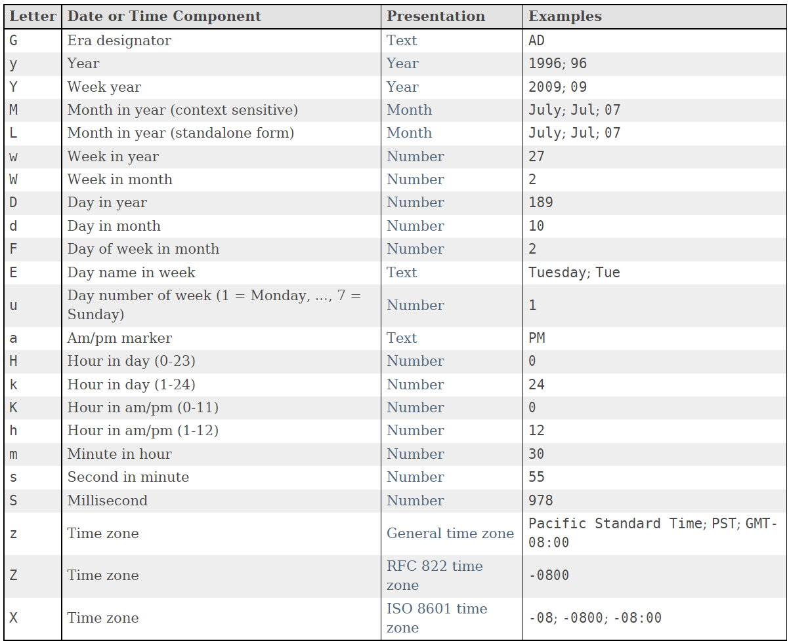
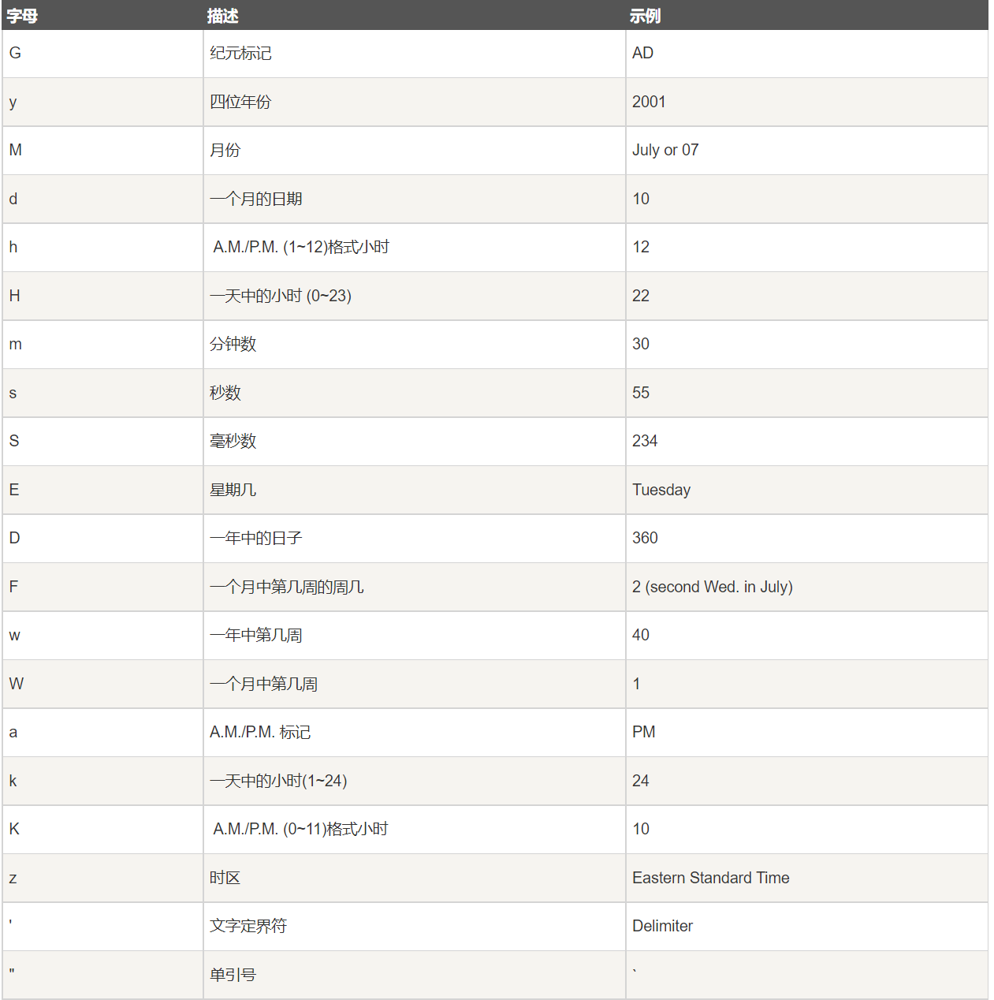

[TOC]

# SimpleDateFormat 区域敏感格式化解析日期类概述

```apl
允许格式化（日期 → 文本），解析（文本 → 日期）和规范化
日期和时间格式由日期和时间模式字符串指定
```

# SimpleDateFormat - 格式化表





# SimpleDateFormat 嵌套类

```apl
DateFormat.Field
```

# SimpleDateFormat 构造

```java
import java.text.DateFormatSymbols;
import java.text.SimpleDateFormat;
import java.util.Locale;

public class Main {
    public static void main(String[] args) {
        // 默认构造
        SimpleDateFormat simp = new SimpleDateFormat();
        // 描述日期时间格式构造
        SimpleDateFormat simp1 = new SimpleDateFormat("yyyy");
        // 描述日期时间格式与区域构造
        SimpleDateFormat simp2 = new SimpleDateFormat("yyyy", Locale.US);
        // 描述日期时间格式与区域构造
        SimpleDateFormat simp3 = new SimpleDateFormat("yyyy", new DateFormatSymbols());
    }
}
```

# SimpleDateFormat 方法

### format - 格式日期

```java
import java.text.SimpleDateFormat;
import java.util.Date;

public class Main {
    public static void main(String[] args) {
        SimpleDateFormat simp = new SimpleDateFormat("yyyy-MM-dd HH:mm:ss");
        Date date = new Date();
        // 格式日期
        System.out.println(simp.format(date));
    }
}
```

### parse - 解析日期

```java
import java.text.ParseException;
import java.text.SimpleDateFormat;
import java.util.Date;

public class Main {
    public static void main(String[] args) throws ParseException {
        SimpleDateFormat simp = new SimpleDateFormat("yyyy-MM-dd HH:mm:ss");
        Date parse = simp.parse("1998-12-15 00:00:00");
        // 解析日期
        System.out.println(simp.format(parse));
    }
}
```

### toPattern - 返回标识格式的字符串

### toLocalizedPattern - 返回标识格式的本地化字符串

```java
import java.text.SimpleDateFormat;

public class Main {
    public static void main(String[] args) {
        SimpleDateFormat simp = new SimpleDateFormat("yyyy-MM-dd HH:mm:ss");
        // 返回标识格式的字符串
        System.out.println(simp.toPattern());
        // 返回标识格式的本地化字符串
        System.out.println(simp.toLocalizedPattern());
    }
}
```

### applyPattern - 替换格式

### applyLocalizedPattern - 本地化替换格式

```java
import java.text.SimpleDateFormat;
import java.util.Date;

public class Main {
    public static void main(String[] args) {
        SimpleDateFormat simp = new SimpleDateFormat("yyyy-MM-dd");
        Date date = new Date();
        System.out.println(simp.format(date));
        // 替换格式
        simp.applyPattern("HH:mm:ss");
        System.out.println(simp.format(date));
        // 本地化替换格式
        simp.applyLocalizedPattern("HH:mm:ss");
        System.out.println(simp.format(date));
    }
}
```

### getDateFormatSymbols - 获取此日期格式的日期和时间格式符号的副本

```java
import java.text.SimpleDateFormat;

public class Main {
    public static void main(String[] args) {
        SimpleDateFormat simp = new SimpleDateFormat("yyyy-MM-dd");
        // 获取此日期格式的日期和时间格式符号的副本
        System.out.println(simp.getDateFormatSymbols());
    }
}
```

### hashCode - 获取哈希值

```java
import java.text.SimpleDateFormat;

public class Main {
    public static void main(String[] args) {
        SimpleDateFormat simp = new SimpleDateFormat("yyyy-MM-dd");
        // 获取哈希值
        System.out.println(simp.hashCode());
    }
}
```

