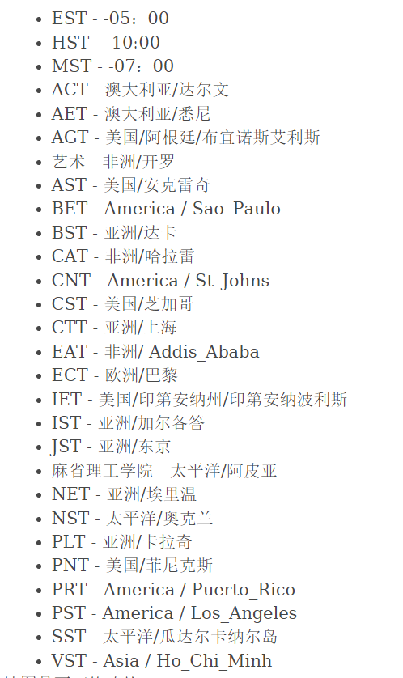

# ZoneId 时区ID类概述

```apl
用于查找从UTC / 格林威治的偏移量的特定规则集适用的区域
时区ID，例如Europe / Paris 
```

# ZoneId 字段

```java
public static final Map<String,String> SHORT_IDS
// 区域覆盖映射以启用短时区名称 
import java.time.ZoneId;

public class Main {
    public static void main(String[] args) {
        System.out.println(ZoneId.SHORT_IDS);
    }
}
```



# 方法

### systemDefault - 获得系统当前默认时区

```java
import java.time.ZoneId;

public class Main {
    public static void main(String[] args) {
        // 获得系统当前默认时区
        ZoneId zon = ZoneId.systemDefault();
        System.out.println(zon);
    }
}
```

### getAvailableZoneIds - 获得可用时区ID的集合

```java
import java.time.ZoneId;

public class Main {
    public static void main(String[] args) {
        // 获得可用时区ID的集合
        System.out.println(ZoneId.getAvailableZoneIds());
        System.out.println(ZoneId.getAvailableZoneIds().size());
    }
}
```

### ofOffset

```java
```

### from

```java
```

### getId - 获得唯一的时区ID

```java
import java.time.ZoneId;

public class Main {
    public static void main(String[] args) {
        // 获得唯一的时区ID
        System.out.println(ZoneId.systemDefault().getId());
    }
}
```

### getDisplayName

```java
```

### getRules - 获取此ID的时区规则

```java
import java.time.ZoneId;

public class Main {
    public static void main(String[] args) {
        // 获取此ID的时区规则
        System.out.println(ZoneId.systemDefault().getRules());
    }
}
```

### normalized - 规范化时区ID

```java
import java.time.ZoneId;

public class Main {
    public static void main(String[] args) {
        // 规范化时区ID
        System.out.println(ZoneId.systemDefault().normalized());
    }
}
```

### hashCode - 此时区ID的哈希码

```java
import java.time.ZoneId;

public class Main {
    public static void main(String[] args) {
        // 此时区ID的哈希码
        System.out.println(ZoneId.getAvailableZoneIds().hashCode());
    }
}
```

### toString - 输出为字符串

```java
import java.time.ZoneId;

public class Main {
    public static void main(String[] args) {
        // 使用ID将此区域输出为 String
        System.out.println(ZoneId.systemDefault().toString());
    }
}
```

### toArray - 转换为数组

```java
import java.time.ZoneId;

public class Main {
    public static void main(String[] args) {
        // 装换为数组并输出
        System.out.println(ZoneId.getAvailableZoneIds().toArray()[3]);
    }
}
```


