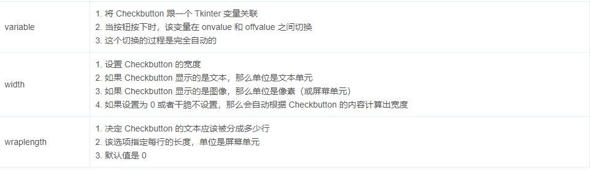

# Tkinter

## 窗口主体框架

```py
from tkinter import ttk,Tk

win = Tk()
# 实例化窗口
win.title('测试')
# 窗口标题
win.geometry('200x200')
# 窗口尺寸
win.resizable(0,0)
# 限制窗口拉伸
win.mainloop()
# 窗口显示
```

## 标签

+ 标签简单用法

```py
from tkinter import ttk as t,Tk
win = Tk()

w = t.Label(win,text='你好!')
# 显示框架，显示文本
w.pack()

win.mainloop()
```

+ 定义样式

```py
from tkinter import ttk as t,Tk
win = Tk()

w = t.Label(win,text='你好!',font=('华文细楷',20),foreground='green',background='red')
                            # 字体及大小         # 前景色及后景色
w.pack()
win.mainloop()
```

+ 文本换行

```py
from tkinter import ttk as t,Tk
win = Tk()
win.geometry('200x200')
win.resizable(0,0)
a = '''假如我是一只鸟，我也应该用嘶哑的喉咙歌唱：这被暴风雨所打击的土地，这永远汹涌着我们的悲愤的河流，这无止息地吹刮着的激怒的风，
和那来自林间的无比温柔的黎明——然后我死了，连羽毛也腐烂在土地里面。为什么我的眼里常含泪水？因为我对这土地爱得深沉'''
w = t.Label(win,text=a,anchor= 'w',wraplength = 150,justify='left')
                      # 指定文本显示位置 指定多少单位换行   指定换行的对齐方式
w.pack()
win.mainloop()
```

+ anchor参数值表

  

+ 标签图像

```py
from tkinter import ttk as t,Tk,PhotoImage
win = Tk()
a = PhotoImage(file='233.png')
# 导入图片
w = t.Label(win,image=a)
# 显示图像
w.pack()

win.mainloop()
```

+ 标签参数表


## 按钮

```py
b = t.Button(win,text='变',command=bian)
# 选择窗口，按钮文本，链接函数，长宽可跟随字体大小
b.pack()
```

+ 禁用按钮

```py
from tkinter import ttk as t,Tk,PhotoImage
win = Tk()

b = t.Button(win,text='停用',state='disabled')
# state 停用按钮
b.pack()

win.mainloop()
```

+ 按钮参数


+ 按钮方法


## 字节变量储存器

```py
from tkinter import ttk as t,Tk,StringVar

win = Tk()
win.title('测试')
win.geometry('200x200')
win.resizable(0,0)

var = StringVar(value='2333')
# 字节变量储存器
l = t.Label(win,textvariable=var,background='green',font=('Arial',12))
l.pack()

c = False
def bian():
    global c
    if c == False:
        c = True
        var.set(value='nmd')
    else:
        c = False
        var.set(value='2333')

b = t.Button(win,text='变',command=bian)
b.pack()
win.mainloop()
```

## 选择按钮

```py
from tkinter import ttk as t,Tk,PhotoImage,StringVar
win = Tk()

var = StringVar()
var.set('T')
c = t.Checkbutton(win,text='你好',variable=var,onvalue='T',offvalue='O')
                                 # 状态默认值   设定ON时默认  设定OFF时默认
c.pack()
win.mainloop()
```

+ 选择按钮参数




+ 选择按钮方法


