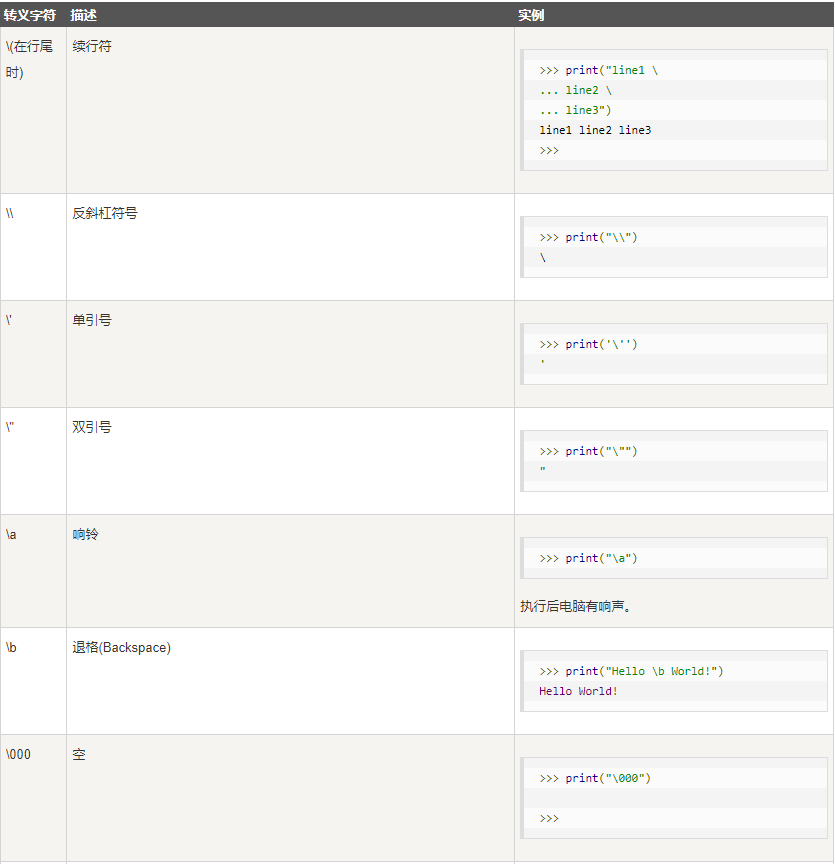
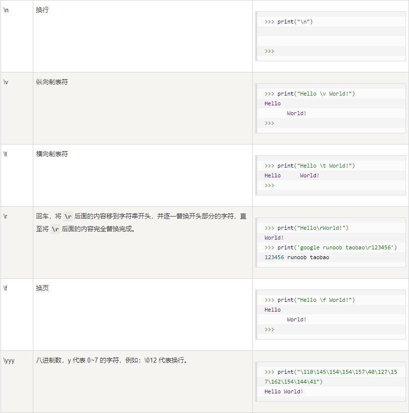
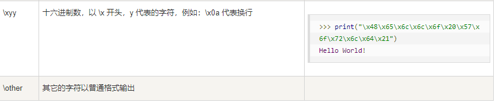
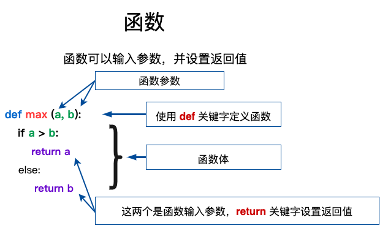

# 注释

```py
# 单行注释
'''
这个是
多行注释
'''
```

# 变量定义

```py
# 使用 = 将右边赋值给左边
a = 12
b, c = 21, '你好'
d = e = f = 1
print(a,b,c,d,e,f)
```

# 标准数据类型

### Numbers 数值

```apl
数据类型是不允许改变的,这就意味着如果改变 Number 数据类型的值，将重新分配内存空间
```

```apl
整型(Int) - 通常被称为是整型或整数，是正或负整数，不带小数点。

浮点型(floating point real values) - 浮点型由整数部分与小数部分组成，浮点型也可以使用科学计数法表示（2.5e2 = 2.5 x 102 = 250）

复数(complex numbers) - 复数由实数部分和虚数部分构成，可以用a + bj,或者complex(a,b)表示， 复数的实部a和虚部b都是浮点型。
```

```py
# 数字数据类型用于存储数值
# 整型
a = 21
# 布尔类型
b = True
# 浮点型
c = 0.21
# 复数
d = 3.14j
print(a,b,c,d)
```

### String 字符串

```apl
使用引号 ( ' 或 " ) 来创建字符串
```

```py
# 字符串或串(String)是由数字、字母、下划线组成的一串字符
# 定义字符串
a = 'Hello worid'
# 输出字符串
print(a)
# 输出索引字符串
print(a[2])
print(a[2:5])
print(a[3:])
# 字符串与数值运算
print(a * 2)
# 字符串拼接
print(a + '2333')
```

### List 列表

```apl
列表可以完成大多数集合类的数据结构实现。它支持字符，数字，字符串甚至可以包含列表（即嵌套）
```

```py
# 定义列表
a = [1, 2, '3', '4']
b = [5, '6']
# 输出列表
print(a)
# 输出列表索引
print(a[1])
print(a[0:2])
print(a[1:])
# 列表与数值运算
print(a * 2)
# 列表拼接
print(a + b)
```

### Tuple 元组

```apl
元组不能二次赋值，相当于只读列表
```

```py
# 定义元组
a = (1, 2, 3, '4', '5')
b = ('6', 7)
# 输出元组
print(a)
# 输出元组索引
print(a[2])
print(a[1:3])
print(a[2:])
# 元组与数值运算
print(a * 2)
# 元组拼接
print(a + b)
```

### dictionary 字典

```apl
列表是有序的对象集合，字典是无序的对象集合
字典当中的元素是通过键来存取的，而不是通过偏移存取
```

```py
# 定义字典，以键：值对的形式
a = {"name": '刘佳辉', "age": 18, "sex": '男', 666: 233}
# 输出字典
print(a)
# 输出指定键对应值
print(a['name'])
# 输出所有键
print(a.keys())
# 输出所有值
print(a.values())
```

### set 集合

```apl
一个或数个形态各异的大小整体组成的，构成集合的事物或对象称作元素或是成员
基本功能是进行成员关系测试和删除重复元素
```

```py
# 创建集合
a = {'1','2','3','4'}
b = set('1')
# 输出集合，重复元素会自动去掉
print(a)
```

# 数据类型转换

```py
a = 12
b = str(a)
print(b,type(b))
```

# 推导式

### 列表推导式

```apl
[表达式 for 变量 in 列表] 
[表达式 for 变量 in 列表 if 条件]
```

 ```py
 a = [1, 2, 3, 5, 2, 4, 5, 2, 3, 5, 73, 3, 42, 2, 3, 4]
 b = [i for i in a if i > 3]
 print(b)
 ```

# 运算符

### 算数运算符

```py
a, b, c = 10, 15, 5
# 加法运算
print(a + b)
# 减法运算
print(b - a)
# 乘法运算
print(a * c)
# 除法运算
print(b / c)
# 取模运算
print(b % a)
# 幂运算
print(a ** b)
# 取整除
print(a // c)
```

### 比较（关系）运算符

```py
a, b, c = 10, 15, 5
# 等于运算
print(a == b)
# 不等于运算
print(a != b)
# 大于运算
print(b > c)
# 小于运算
print(b < c)
# 大于等于运算
print(b >= c)
# 小于等于运算
print(a <= b)
```

###  赋值运算符

```py
a, b = 10, 5
# 等于
a = 10
# 加等于
a += 10
# 减等于
a -= 10
# 乘等于
a *= b
# 除等于
a /= 2
# 取整除等于
a //= 2
# 幂等于
a **= 2
# 取模等于
a %= 5
```

### 位运算符

```py
# a = 1010 b = 1100
a, b = 10, 6
# 按位与
print(a & b)
# 按位或
print(a | b)
# 按位异或
print(a ^ b)
# 按位取反
print(~a)
# 按位左移
print(a << 2)
# 按位右移
print(a >> 2)
```

### 逻辑运算符

```py
a, b = 1, 6
# and 如果 a 为True 则返回 b ，反之返回 a
print(a and b)
# or 从左开始，谁True返回谁
print(a or b)
# not 取反
print(not(False))
```

### 成员运算符

```py
a = 10
b = 15
c = [10,11,12,13]
# in  如果在指定的序列中找到值返回 True，否则返回 False
print(a in c)
print(b in c)
# not in 如果在指定的序列中没有找到值返回 True，否则返回 False
print(a not in c)
print(b not in c)
```

### 身份运算符

```py
a, b, c = 10, 10, 11
# is  判断两个标识符是不是引用自一个对象
print(a is b)
print(a is c)
# is not 判断两个标识符是不是引用自不同对象
print(a is not b)
print(a is not c)
```

# 转义符







# 条件控制

### if 单项分支

```python
baozi = 10
#判断是否成立
if True:
    print(baozi)
```
### if else 双向分支

```python
na = '女'
if na =='女':
    print('你好')
else:
    print('借个火')
```
### if elif else 多项分支

```python
fs = 90
if fs >= 100 and fs <= 150:
    print('优秀')
elif fs >= 60 and fs < 100:
    print('挺好')
else:
    print('大嘴巴子')
```
### 巢状分支

```python
nl = 25
sg = 175
xb = '女'
if xb == '女':
    print('可能')
    if sg == 175 :
        print('不错哦')
        if nl == 25 :
            print('可以了')    
else:
    print('不合适')
```
# 循环结构
### while 循环

```python
a = 1
while a <= 10:
    print(a)
    a += 1
```
### while else 循环

```py
a = 1
while a <= 10:
    print(a)
    a += 1
else:
    print('完')
```

### for in 循环

```python
a = '315513213'
for b in a:
    print(b)
```
### for in else 循环

```py
a = '315513213'
for b in a:
    print(b)
else:
    print('完')
```

### range 迭代

```python
#迭代
for a in range(0,20):
    print(a)
```
### continue 跳过循环

```python
#跳过循环
a = 0
while a <= 10:
    a += 1
    if a %2 == 0 :
        continue
    else:
        print(a)
```
### break 结束循环

```python
#结束循环
a = 0
while a <= 10:
    if a == 7:
        break
    else:
        print(a)
    a += 1
```
# 函数

### 定义函数



```python
# 定义函数
def nam():
    print('xxxx')
# 调用函数
nam()
```
### 函数形参定义

```python
def a(w,wa):
    print(f'{wa} love {w}')
    # 传入实参
a ('哈哈哈','狗子')
```
### 函数默认形参

```python
# 定义默认形参
def a (x,y,q=23):
    print(x,y,q)
a(1,5)
a(1,5,6)
```
### 不定长形参

```python
# 加了 * 的形参会以元组的形式导入，存放所有为命名的实参
def a(x='+', *a2):
    if x == '+':
        print('加', a2)
    else:
        print('减', a2)
a('+', 300, 41, 41, 41, 24, 2)
```
### 关键字形参收集

```python
# 加 ** 形参会将未定义形参的关键字参数以字典的形式保存
def a (a,b,c=2,**b1):
    print(a,b,c)
    print(b1)
a(1,5,na='1',da='d1',gg='dda')
```
### return 退出函数并返回值

```python
def a(a, b):
    c = f'{a}nmd{b}麻了'
    print(c)
    return b
# 获得返回值
b = a('233', '666')
print(b)
```
### lambda 匿名函数

```py
ra = lambda x,y:x+y
print(ra(3,6))
```

```py
res = lambda sex:'麻了' if sex == '男' else '好耶'
print(res('女'))
```

# 变量的作用域

### 全局变量

```python
# 函数内可用全局变量，但不能在函数中更改
a = 23
def c ():
    print(a)
c()
```
### global 创建全局变量

```python
a = 20
def c():
    global b
    b = 10
    print(a + b)
c()
print(b)
```
### nonlocal 函数内引入变量

在内函数中使用 来引用外函数

```python
def c ():
    a = 12
    def ca():
        nonlocal a
        a += 1
        print(a)
    ca()
c()
```
### 递归函数 - 调用自己

```python
def a(ds):
    print(ds)
    if ds>1:
        a(ds-1)
a(32)
```
### 回调函数 - 通过函数指针调用的函数

```python
def a(d):
    d()
def s():
    print('i love you')
a(s)
```
# 迭代器

```python
da = ['da','2','21s','21']
# 创建迭代器
sd = iter(da)
# 输出迭代器下一个元素
print(next(sd))
print(next(sd))
print(list(sd))
```
# 面向对象

```py
class xyj():      # 类名
    def jias(self):
        print('加水')

haer = xyj()
# 实例对象
haer.jias()
# 对象.方法
```

### self

```py
class xyf():
    def shui(self):
        print('水')
        print(self)
a = xyf()
b = xyf()
# self 实例化后谁调用就指向谁
a.shui() 
b.shui()
```

### 类外添加和获取对象属性

```py
class xyf():
    def shui(self):
        print('水')
a = xyf()
a.wo = 500
# 类外添加对象属性
print(a.wo)
# 类外获取对象属性
```

### 类内获取对象属性

```py
class xyf():
    def shui(self):
        print(self.wo)
a = xyf()
a.wo = 500
a.shui()
```

### init( ) - 初始化对象

```py
class xyf():
    def __init__(self):
    	# 定义类属性
        self.wo = 500
    def shui(self):
        print(self.wo)
a = xyf()
a.shui()
```

### 带参数的 init ( )

```py
class xyf():
    def __init__(self,wo):
        self.wo = wo
    def shui(self):
        print(self.wo)
a = xyf(500)
a.shui()
```

# 类---继承

+ 继承父类所有属性和方法

### 单继承

```py
# object 为基类
# 其他类为派生类
class a(object):
    def __init__(self):
        self.name = '刘佳辉'
# 定义父类属性

    def a1(self):
        print(self.name)
# 定义父类方法
class b(a):
    pass
# 定义子类并继承父类

w = b()
w.a1()
```

### super （） 继承

```py
# 父类
class a:
    def __init__(self,name):
        self.name = name
# 子类
class b(a):
    def __init__(self,name):
        # 调用父类属性函数
        super().__init__(name)
        # 并创建自己的属性函数
        self.age = 18
q = b('刘佳辉')
print(q.age,q.name)
```

### 多继承

+ 相同属性或方法，只继承前面的类

```py
class a(object):
    def __init__(self):
        self.name = '刘佳辉'

    def a1(self):
        print(self.name)

class xx(object):
    def __init__(self):
        self.name = '孙楠'

    def sk(self):
        print(self.name)
class b(a,xx):
    pass

w = b()
print(w.name)
```

### 查看继承类

```py
print(b.__mro__)
```

### 多继承并调用

```py
class a(object):
    def __init__(self):
        self.name = '刘佳辉'

    def a1(self):
        print(f'{self.name}的煎饼果子')

class xx(object):
    def __init__(self):
        self.name = '孙楠'

    def a1(self):
        print(f'{self.name}的煎饼果子')
class b(a,xx):
    def __init__(self):
        self.name = '李浩勇'

    def a1(self):
        print(f'{self.name}的煎饼果子')

    def a2(self):
        a.__init__(self)
        # 初始化父类参数
        a.a1(self)

    def a3(self):
        xx.__init__(self)
        xx.a1(self)

w = b()
w.a1()
w.a2()
w.a3()
```

### 多层继承

```py
class a(object):
    def __init__(self):
        self.name = '刘佳辉'

    def a1(self):
        print(f'{self.name}的煎饼果子')

class xx(object):
    def __init__(self):
        self.name = '孙楠'

    def a1(self):
        print(f'{self.name}的煎饼果子')
class b(a,xx):
    def __init__(self):
        self.name = '李浩勇'

    def a1(self):
        print(f'{self.name}的煎饼果子')

    def a2(self):
        a.__init__(self)
        a.a1(self)

    def a3(self):
        xx.__init__(self)
        xx.a1(self)
class c(b):
    pass
# 再次继承

q = c()
q.a1()
q.a2()
q.a3()
```

### 库安装

```apl
pip install -i https://pypi.tuna.tsinghua.edu.cn/simple 
```

# asyncio

### 协程

```py
import asyncio

# 定义协程
async def f1():
    print('hello')

    await asyncio.sleep(1)
    print('world')
# 运行协程入口函数
asyncio.run(f1())
```

### 并发协程

```py
import asyncio

async def fa(data,ma):
    await asyncio.sleep(data)
    print(ma)

async def f1():
    # 定义并发多协程
    task1 = asyncio.create_task(fa(1,'hello'))
    task2 = asyncio.create_task(fa(2,'world'))
    # 俩协程同时执行
    await task1
    await task2

# 运行协程入口函数
asyncio.run(f1())
```


