# CSS 层叠样式表

+ CSS结构

选择器，以及一条或多条声明

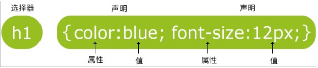

# CSS 注释

```css
/*这是个注释*/
```

# 内部样式表

当单个文档需要特殊的样式时，就应该使用内部样式表。你可以使用 <style> 标签在文档头部定义内部样式表

```html
<head>
    <style>   
        p {
            color: red;
        }
    </style>
</head>
```

# 行内样式表

需要在相关的标签内使用样式（style）属性

```html
<!doctype html>
<html lang="zh-cn">
    <head>
        <meta charset="UTF-8">
    </head>
    <body>

        <p style="color: red;">朝辞白帝彩云间，</p>

    </body>
</html>
```

# 外部样式表

使用link导入css

```html
<link rel="stylesheet" href="HHHH.css">
```

# CSS 三大特性

## 层叠性

```apl
样式冲突，遵循就近原则，那个样式离得近就执行那个
样式不冲突，不会层叠
```

```html
<!doctype html>
<html lang="en">
    <head>
        <meta charset="UTF-8">
        <title>Document</title>
        <style>
            div {
                color: violet;
                font-size: 20px;
            }
            div {
                color: red;
            }
        </style>
    </head>
    <body>
        <div>红红火火恍恍惚惚哈哈哈哈</div>
    </body>
</html>
```

## 继承性

```apl
子标签会继承父标签的某些样式，如文本颜色和字号
```

```html
<!doctype html>
<html lang="en">
    <head>
        <meta charset="UTF-8">
        <title>Document</title>
        <style>
            div {
                color: violet;
                font-size: 20px;
            }
        </style>
    </head>
    <body>
        <div>
            <p>红红火火恍恍惚惚哈哈哈哈</p>
        </div>
    </body>
</html>
```

## 优先级

```apl
当同一个元素指定多个选择器，就会有优先级的产生
```

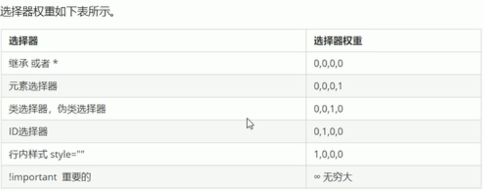

```html
<!doctype html>
<html lang="en">
    <head>
        <meta charset="UTF-8">
        <title>Document</title>
        <style>
            * {
                color: yellow!important;
            }
            div {
                color: violet;
            }
            .c1 {
                color: brown;
            }
            #d1 {
                color: aquamarine;
            }
        </style>
    </head>
    <body>
        <div class="c1" id="d1" style="color: chartreuse">红红火火恍恍惚惚哈哈哈哈</div>
    </body>
</html>
```

# 外部样式表

当样式需要应用于很多页面时，外部样式表将是理想的选择。在使用外部样式表的情况下，你可以通过改变一个文件来改变整个站点的外观。每个页面使用 <link> 标签链接到样式表。

```html
<!doctype html>
<html lang="zh-cn">
    <head>
        <meta charset="UTF-8">
        <link rel="stylesheet" href="HHHH.css">
        /*使用link导入css文件*/
    </head>
    <body>

        <p>朝辞白帝彩云间，</p>

    </body>
</html>
```

# CSS选择器

## [CSS 选择器链接](https://www.runoob.com/cssref/css-selectors.html)

## 基础选择器

### 标签选择器

将同一类型标签统一设定样式

```html
<style>
    p {
        color: red;
        font-size: 22px;
    }
    div {
        color: seagreen;
        font-size: 22px;
    }
</style>
```

### 类选择器

将同一类中标签统一设定样式

```html
<!doctype html>
<html lang="zh-cn"> 
    <head>
        <meta charset="UTF-8">
        <style>
            .hong {
                color: red;
                font-size: 22px;
            }
            .fa {
                color: blue;
                font-size: 12px;
            }
        </style>
    </head>
    <body>
        <ul>
            <li class="hong">苹果</li>
            <li class="fa">梨</li>
            <li class="hong">榴莲</li>
            <li class="fa">柚子</li>
        </ul>
    </body>
</html>
```

### 类选择器---多类继承

```html
<!doctype html>
<html lang="zh-cn">
    <head>
        <meta charset="UTF-8">
        <style>
            .zhiti {
                font-size: 22px;
            }
            .yanshe {
                color: red;
            }

        </style>
    </head>
    <body>

        <div class="zhiti yanshe">刘德华</div>

    </body>
</html>
```

### ID 选择器

使用#来定义，如果已经调用过，别人就无法在使用

```html
<!doctype html>
<html lang="zh-cn">
    <head>
        <meta charset="UTF-8">
        <style>
            #ch {
                font-size: 22px;
                color: red;
            }

        </style>
    </head>
    <body>

        <div id="ch">刘德华</div>

    </body>
</html>
```

### 通配符选择器

应用到所有元素，但权重最低

```html
<!doctype html>
<html lang="zh-cn">
    <head>
        <meta charset="UTF-8">
        <style>
            * {
                color: red;
            }

        </style>
    </head>
    <body>

        <div>刘德华</div>
        <div>刘德华</div>
        <div>刘德华</div>
    </body>
</html>
```

## 复合选择器

### 后代选择器

后代选择器用于选取某元素的后代元素

```html
<!doctype html>
<html lang="en">
    <head>
        <meta charset="UTF-8">
        <title>Document</title>
        <style>
            ui li {
                color: red;
            }
            div p {
                color: blue;
            }
            div span p {
                color: darksalmon;
            }
            .h span p {
                color: aqua;
            }
        </style>
    </head>
    <body>
        <ui>
            <li>name1</li>
        </ui>
        <ol>
            <li>name2</li>
        </ol>
        <div>
            <p>name3</p>
            <span>name4</span>
            <span>
                <p>name5</p>
            </span>
        </div>
        <div class="h">
            <p>name6</p>
            <span>name7</span>
            <span>
                <p>name8</p>
            </span>
        </div>
    </body>
</html>
```

### 子选择器

与后代选择器相比，子元素选择器只能选择作为某元素直接一级子元素的元素

```html
<!doctype html>
<html lang="en">
    <head>
        <meta charset="UTF-8">
        <title>Document</title>
        <style>
            div > a {
                color: red;
            }
            div > span > a {
                color: darkgreen;
            }
        </style>
    </head>
    <body>
        <div>
            <a href="#">a</a>
            <p>
                <a href="#">b</a>
            </p>
        </div>
        <div>
            <a href="">c</a><br>
            <span>
                <a href="">d</a>
            </span>
        </div>
        </div>
    </body>
</html>
```

### 并集选择器

并集选择器可以选择多组标签，同时为它们定义相同的样式

```html
<!doctype html>
<html lang="en">
    <head>
        <meta charset="UTF-8">
        <title>Document</title>
        <style>
            div,p,.pig li {
                color: red;
            }
        </style>
    </head>
    <body>
        <div>熊大</div>
        <p>熊二</p>
        <span>光头强</span>
        <ul class="pig">
            <li>佩奇</li>
            <li>乔治</li>
        </ul>
    </body>
</html>
```

### 伪类选择器

伪类选择器是用来添加一些选择器的特殊效果，比如给链接添加特殊效果，或选择第一个，第N个元素

[CSS伪类选择器链接](https://www.runoob.com/css/css-pseudo-classes.html)

+ 链接伪类选择器

```html
<!doctype html>
<html lang="en">
    <head>
        <meta charset="UTF-8">
        <title>Document</title>
        <style>
            /*鼠标滑过的链接*/
            a:hover {
                color: coral;
            }
        </style>
    </head>
    <body>
        <a href="#">佩奇</a><br>
    </body>
</html>
```

+ 链接 focus 伪类选择器

```html
<!doctype html>
<html lang="en">
    <head>
        <meta charset="UTF-8">
        <title>Document</title>
        <style>
            /*获得焦点时的样式*/
            input:focus {
                background-color: pink;
            }
        </style>
    </head>
    <body>
        <input type="text">
        <input type="text">
        <input type="text">
    </body>
</html>
```

# CSS 元素显示模式

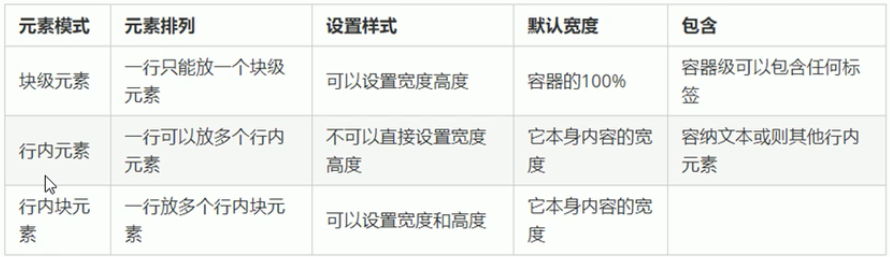

# CSS 继承

### inherit —— 指定一个属性应从父元素继承它的值

```html
<!doctype html>
<html lang="zh-cn">
    <head>
        <meta charset="UTF-8">
        <style>
            div {
                color: darkorange;
            }
            span {
                font-size: 40px;
            }
            /*子元素将继承父元素值*/
        </style>
    </head>
    <body>
        <div>
            <span>
                红红火火恍恍惚惚哈哈哈哈
            </span>
        </div>
    </body>
</html>
```

# CSS 字体属性

### [CSS 字体属性方法链接](https://www.runoob.com/css/css-font.html)

### font-family —— 字体系列

+ 该属性为设置文本的字体系列

可定义多个字体来避免未安装设定字体

```html
<!doctype html>
<html lang="zh-cn">
    <head>
        <meta charset="UTF-8">
        <style>
            /*指定字体系列*/
            div {
                font-family: "Microsoft YaHei UI Light";
            }
        </style>
    </head>
    <body>
        <div>刘德华</div>
        <div>刘德华</div>
        <div>刘德华</div>
    </body>
</html>
```

### font-style —— 字体样式

+ 用于指定斜体文字的字体样式属性

```html
<!doctype html>
<html lang="zh-cn">
<head>
    <meta charset="UTF-8">
    <style>
        /*定义斜体字体样式*/
        .d1 {
            font-style: italic;
        }
        /*定义倾斜的字体样式*/
        .d2 {
            font-style: oblique;
        }
        /*默认值为：normal  显示浏览器默认标准样式*/
    </style>
</head>
<body>
<div class="d1">刘德华</div>
<div class="d2">刘德华</div>
<div class="d3">刘德华</div>
</body>
</html>
```

### font-size —— 文本大小

+ 设置文本的大小

```html
<!doctype html>
<html lang="zh-cn">
    <head>
        <meta charset="UTF-8">
        <style>
            #h1 {
                font-size: 22px;
            }
            #h2 {
                font-size: 150%;
            }
            /*默认值为：normal */
        </style>
    </head>
    <body>
        <div id="h1">刘德华</div>
        <div id="h2">刘德华</div>
    </body>
</html>
```

### font-weight —— 文本粗细

+ 设置文本的粗细

```html
<!doctype html>
<html lang="zh-cn">
    <head>
        <meta charset="UTF-8">
        <style>
            /*bold：定义粗体字符*/
            #h1 {
                font-weight: bold;
            }
            /*bolder：定义更粗的字符*/
            #h2 {
                font-weight: bolder;
            }
            /*lighter：定义更细的字符*/
            #h3 {
                font-weight: lighter;
            }
            /*100~900：不同数值不同大小*/
            #h4 {
                font-weight: 300;
            }
            /*默认值为：normal 定义浏览器标准大小*/
        </style>
    </head>
    <body>
        <div id="h1">刘德华</div>
        <div id="h2">刘德华</div>
        <div id="h3">刘德华</div>
        <div id="h4">刘德华</div>
    </body>
</html>
```

### font-variant —— 字母大小写切换

+ 设置小型大写字母的字体显示文本

```html
<!doctype html>
<html lang="zh-cn">
    <head>
        <meta charset="UTF-8">
        <style>
            /*小写字母均会被转换为小型大写*/
            div {
                font-variant: small-caps;
            }
            /*默认值为：normal 浏览器默认字体*/
        </style>
    </head>
    <body>
        <div>刘德dfsfs华</div>
        <div>刘德FSDFS华</div>
    </body>
</html>
```

### font —— 声明中所有字体属性

+  简写属性在一个声明中设置所有字体属性

```html
<!doctype html>
<html lang="zh-cn">
    <head>
        <meta charset="UTF-8">
        <style>
            /*以 样式 粗细 大小/行高 字体 的顺序书写，大小和字体不可省略*/
            div {
                font: italic 700 22px "Microsoft YaHei UI Light";
            }
        </style>
    </head>
    <body>
        <div>刘德dfsfs华</div>
        <div>刘德fdsfs华</div>
    </body>
</html>
```

# CSS 文本格式

### [CSS 文本格式方法链接](https://www.runoob.com/css/css-text.html)

### color —— 文字颜色

+ 设置文字的颜色

```html
<!doctype html>
<html lang="zh-cn">
    <head>
        <meta charset="UTF-8">
        <style>
            /*预定义颜色值*/
            #h1 {
                color: red;
            }
            /*十六进制颜色值*/
            #h2 {
                color: #9BBB41;
            }
            /*RGB代码颜色值*/
            #h3 {
                color: rgb(238,162,164);
            }
            /*RGBA代码颜色：增加了alpha通道，功能为指定透明度*/
            /*Alpha参数是一个介于0.0（完全透明）和1.0（完全不透明）之间的参数*/
            #h4 {
                color: rgba(255,201,12,0.3);
            }
        </style>
    </head>
    <body>
        <div id="h1">国破山河在，城春草木深。</div>
        <div id="h2">感时花溅泪，恨别鸟惊心。</div>
        <div id="h3">烽火连三月，家书抵万金。</div>
        <div id="h4">白头搔更短，浑欲不胜簪。</div>
    </body>
</html>
```

### text-align —— 文本水平对齐方式

+ 用来设置文本的水平对齐方式

```html
<!doctype html>
<html lang="zh-cn">
    <head>
        <meta charset="UTF-8">
        <style>
            /*水平左对齐(默认值)*/
            #h1 {
                text-align: left;
            }
            /*水平左对齐*/
            #h2 {
                text-align: right;
            }
            /*水平居中*/
            #h3 {
                text-align: center;
            }
            /*水平两端对齐*/
            #h4 {
                text-align: justify;
            }
        </style>
    </head>
    <body>
        <div id="h1">国破山河在，城春草木深。</div>
        <div id="h2">感时花溅泪，恨别鸟惊心。</div>
        <div id="h3">烽火连三月，家书抵万金。</div>
        <div id="h4">白头搔更短，浑欲不胜簪。</div>
    </body>
</html>
```

### text-decoration —— 设置或删除文本的装饰

+ 用来设置或删除文本的装饰

```html
<!doctype html>
<html lang="zh-cn">
    <head>
        <meta charset="UTF-8">
        <style>
            /*定义文本下的一条线*/
            #h1 {
                text-decoration: underline;
            }
            /*定义文本上的一条线*/
            #h2 {
                text-decoration: overline;
            }
            /*定义穿过文本下的一条线*/
            #h3 {
                text-decoration: line-through;
            }
            /*定义颜色的波浪下划线*/
            #h4 {
                text-decoration: underline wavy red;
            }
            /*定义颜色的虚线下划线*/
            #h5 {
                text-decoration: underline dotted red;
            }
            /*默认值为：none*/
        </style>
    </head>
    <body>
        <div id="h1">国破山河在，城春草木深。</div>
        <br>
        <div id="h2">感时花溅泪，恨别鸟惊心。</div>
        <br>
        <div id="h3">烽火连三月，家书抵万金。</div>
        <br>
        <div id="h4">白头搔更短，浑欲不胜簪。</div>\
        <br>
        <div id="h5">国破山河在，城春草木深。</div>
    </body>
</html>
```

### text-indent —— 文本的缩进

+ 规定文本块中首行文本的缩进

```html
<!doctype html>
<html lang="zh-cn">
    <head>
        <meta charset="UTF-8">
        <style>
            /*定义固定的缩进*/
            #h1 {
                text-indent: 20px;
            }
            /*定义缩进当前元素文字的大小*/
            #h2 {
                text-indent: 2em;
            }
            /*定义基于父元素宽度的百分比的缩进*/
            #h3 {
                text-indent: 10%;
            }
        </style>
    </head>
    <body>
        <p id="h1">先帝创业未半而中道崩殂，今天下三分，益州疲弊，此诚危急存亡之秋也。然侍卫之臣不懈于内，忠志之士忘身于外者，盖追先帝之殊遇，欲报之于陛下也。诚宜开张圣听，以光先帝遗德，恢弘志士之气，不宜妄自菲薄，引喻失义，以塞忠谏之路也。
        </p>
        <p id="h2">宫中府中，俱为一体；陟罚臧否，不宜异同。若有作奸犯科及为忠善者，宜付有司论其刑赏，以昭陛下平明之理，不宜偏私，使内外异法也。
        </p>
        <p id="h3">侍中、侍郎郭攸之、费祎、董允等，此皆良实，志虑忠纯，是以先帝简拔以遗陛下。愚以为宫中之事，事无大小，悉以咨之，然后施行，必能裨补阙漏，有所广益。
        </p>
    </body>
</html>
```

### line-height —— 行间距

+ 定义行间距

```html
<!doctype html>
<html lang="zh-cn">
    <head>
        <meta charset="UTF-8">
        <style>
            div {
                height: 50px;
                background-color: slategrey;
                border: 1px solid red;
            }
            /*设定固定的行间距*/
            .p1 {
                line-height: 50px;
            }
            /*设定数值，数值乘以字体尺寸来设定行间距*/
            .p2 {
                line-height: 0.5;
            }
            /*基于字体尺寸设定百分百间距*/
            .p3 {
                line-height: 200%;
            }
            /*默认值：normal 自动设定合理的行间距*/
        </style>
    </head>
    <body>
        <div class="p1">红红火火恍恍惚惚哈哈哈哈</div>
        <div class="p2">红红火火恍恍惚惚哈哈哈哈 <br> 红红火火恍恍惚惚哈哈哈哈</div>
        <div class="p3">红红火火恍恍惚惚哈哈哈哈 <br> 红红火火恍恍惚惚哈哈哈哈</div>
    </body>
</html>
```

### letter-spacing —— 字符间距

+ 增加或减少字符间的空白（字符间距）

```html
<!doctype html>
<html lang="zh-cn">
    <head>
        <meta charset="UTF-8">
        <style>
            /*定义字符间的固定空间（允许使用负值)*/
            #h1 {
                letter-spacing: 5px;
            }
            /*默认值：normal*/
        </style>
    </head>
    <body>
        <p id="h1">朝辞白帝彩云间，</p>
    </body>
</html>
```

### direction —— 文本方向/书写方向

+ 指定文本方向/书写方向

```html
<!doctype html>
<html lang="zh-cn">
    <head>
        <meta charset="UTF-8">
        <style>
            /*从左到右*/
            #h1 ,#h3 {
                direction: ltr;
            }
            /*从右到左*/
            #h2 ,#h4 {
                direction: rtl;
            }
            /*默认值：ltr*/
        </style>
    </head>
    <body>
        <div id="h1">国破山河在，城春草木深。</div>
        <div id="h2">感时花溅泪，恨别鸟惊心。</div>
        <div id="h3">烽火连三月，家书抵万金。</div>
        <div id="h4">白头搔更短，浑欲不胜簪。</div>
    </body>
</html>
```

### text-shadow —— 文本阴影

```html
<!doctype html>
<html lang="zh-cn">
    <head>
        <meta charset="UTF-8">
        <style>
            /*定义文本阴影*/
            div {
                text-shadow: 0px 0px 10px red;
            }
            /*text-shadow:水平阴影位置、垂直阴影位置、模糊距离、阴影颜色 来定义*/
        </style>
    </head>
    <body>
        <div>红红火火恍恍惚惚哈哈哈哈</div>
    </body>
</html>
```

### text-transform —— 控制文本的大小写

```html
<!doctype html>
<html lang="zh-cn">
    <head>
        <meta charset="UTF-8">
        <style>
            /*定义文本每个单词都有大写字母开头*/
            .d1 {
                text-transform: capitalize;
            }
            /*定义只有大写字母*/
            .d2 {
                text-transform: uppercase;
            }
            /*定义只有小写字母*/
            .d3 {
                text-transform: lowercase;
            }
            /*默认值：none 定义浏览器标准文本*/
        </style>
    </head>
    <body>
        <div class="d1">hello</div>
        <div class="d2">hello</div>
        <div class="d3">HELLO</div>
    </body>
</html>
```

### unicode-bidi —— 设置或返回文本是否被重写

+ 用于内容同时包含有从左到右书写和从右到左书写的文本

```html
<!doctype html>
<html lang="zh-cn">
    <head>
        <meta charset="UTF-8">
        <style>
            /*创建一个附加的嵌入层面*/
            .d1 {
                direction: rtl;
                unicode-bidi: embed;
            }
            /*创建一个附加的嵌入层面。重新排序取决于 direction 属性*/
            .d2 {
                direction: rtl;
                unicode-bidi: bidi-override;
            }
            /*默认值：normal 不使用附加的嵌入层面*/
        </style>
    </head>
    <body>
        <div class="d1">hello</div>
        <div class="d2">hello</div>
    </body>
</html>
```

### vertical-align —— 元素的垂直对齐方式

```html
<!doctype html>
<html lang="zh-cn">
    <head>
        <meta charset="UTF-8">
        <style>
            div {
                background-color: slategrey;
                border: 1px solid red;
                height: 50px;
                padding: 2px;
            }
            /*垂直对齐文本的下标*/
            .d1 {
                vertical-align: sub;
            }
            /*垂直对齐文本的上标*/
            .d2 {
                vertical-align: super;
            }
            /*把元素的顶端与行中最高元素的顶端对齐*/
            .d3 {
                vertical-align: top;
            }
            /*把元素的顶端与父元素字体的顶端对齐*/
            .d4 {
                vertical-align: text-top;
            }
            /*把此元素放置在父元素的中部*/
            .d5 {
                vertical-align: middle;
            }
            /*使元素及其后代元素的底部与整行的底部对齐*/
            .d6 {
                vertical-align: bottom;
            }
            /*把元素的底端与父元素字体的底端对齐*/
            .d7 {
                vertical-align: text-bottom;
            }
            /*将元素升高或降低指定的高度，可以是负数*/
            .d8 {
                vertical-align:-4px;
            }
            /*默认：baseline  元素放置在父元素的基线上*/
        </style>
    </head>
    <body>
        <div>
            <span class="d1">hello1</span>
            <span class="d2">hello2</span>
            <span class="d3">hello3</span>
            <span class="d4">hello4</span>
            <span class="d5">hello5</span>
            <span class="d6">hello6</span>
            <span class="d7">hello7</span>
            <span class="d8">hello8</span>
        </div>
    </body>
</html>
```

### white-space —— 指定元素内的空白怎样处理

```html
<!doctype html>
<html lang="zh-cn">
    <head>
        <meta charset="UTF-8">
        <style>
            div {
                height: 50px;
                width: 200px;
                margin: 0px 10px ;
                line-height: 50px;
            }
            /*空白会被浏览器保留*/
            .d1 {
                white-space: pre;
            }
            /*文本不会换行，文本会在在同一行上继续，直到遇到 <br> 标签为止*/
            .d2 {
                white-space: nowrap;
            }
            /*保留空白符序列，但是正常地进行换行*/
            .d3 {
                white-space: pre-wrap;
            }
            /*合并空白符序列，但是保留换行符*/
            .d4 {
                white-space: pre-line;
            }
            /*默认值：normal  空白会被浏览器忽略*/
        </style>
    </head>
    <body>
        <div>
            <div class="d1">hel        lo1</div>
            <div class="d2">十大啊啊啊啊啊啊啊啊啊啊啊啊</div>
            <div class="d3">十大啊啊啊啊啊啊啊啊          啊啊</div><br>
            <div class="d4">十大啊啊啊啊啊啊啊  啊啊啊啊啊啊啊啊啊</div>
        </div>
    </body>
</html>
```

### word-spacing —— 增加或减少字与字之间的空白

```html
<!doctype html>
<html lang="zh-cn">
    <head>
        <meta charset="UTF-8">
        <style>
            /*定义单词间的固定空间*/
            .d1 {
                word-spacing: 30px;
            }
            /*默认值：normal 单词间标准空间*/
        </style>
    </head>
    <body>
        <div class="d1">hello link text</div>
    </body>
</html>
```

# CSS 尺寸

### height —— 设定元素高度

```html
<!doctype html>
<html lang="en">
    <head>
        <meta charset="UTF-8">
        <title>Document</title>
        <style>
            div {
                border: 1px solid red;
            }
            /*使用px、cm、em等单位定义高度*/
            .p1 {
                height: 50px;
            }
            /*基于父元素的百分比高度*/
            .p2 {
                height: 50%;
            }
            /*默认值 auto 自动计算高度*/
        </style>
    </head>
    <body>
        <div class="p1">
            <div class="p2"></div>
        </div>
    </body>
</html>
```

### max-height —— 设置元素最大高度

```html
<!doctype html>
<html lang="en">
    <head>
        <meta charset="UTF-8">
        <title>Document</title>
        <style>
            div {
                border: 1px solid red;
                height: 60px;
            }
            /*使用px、cm、em等单位定义最大高度*/
            .p1 {
                max-height: 10px;
            }
            /*基于父元素的百分比最大高度*/
            .p2 {
                max-height: 50%;
            }
        </style>
    </head>
    <body><div>
        <div class="p1"></div>
        <div class="p2"></div>
        </div>
    </body>
</html>
```

### min-height —— 设置元素最小高度 

```html
<!doctype html>
<html lang="en">
    <head>
        <meta charset="UTF-8">
        <title>Document</title>
        <style>
            div {
                border: 1px solid red;
            }
            .p3 {
                height: 60px;
            }
            /*使用px、cm、em等单位定义最低高度*/
            .p1 {
                min-height: 10px;
            }
            /*基于父元素的百分比最低高度*/
            .p2 {
                min-height: 50%;
            }
        </style>
    </head>
    <body>
        <div class="p3">
            <div class="p1"></div>
            <div class="p2"></div>
        </div>
    </body>
</html>
```

### width —— 设置元素宽度

```html
<!doctype html>
<html lang="en">
    <head>
        <meta charset="UTF-8">
        <title>Document</title>
        <style>
            div {
                border: 1px solid red;
            }
            .p3 {
                height: 60px;
            }
            /*使用px、cm、em等单位定义宽度*/
            .p1 {
                width: 10px;
            }
            /*基于父元素的百分比宽度*/
            .p2 {
                width: 50%;
            }
        </style>
    </head>
    <body>
        <div class="p3">
            <div class="p1"></div>
            <div class="p2"></div>
        </div>
    </body>
</html>
```

### max-width —— 设置元素最大宽度

```html
<!doctype html>
<html lang="en">
    <head>
        <meta charset="UTF-8">
        <title>Document</title>
        <style>
            div {
                border: 1px solid red;
            }
            .p3 {
                height: 60px;
                width: 100px;
            }
            /*使用px、cm、em等单位定义最大宽度*/
            .p1 {
                max-width: 20px;
            }
            /*基于父元素的百分比最大宽度*/
            .p2 {
                max-width: 50%;
            }
        </style>
    </head>
    <body>
        <div class="p3">
            <div class="p1"></div>
            <div class="p2"></div>
        </div>
    </body>
</html>
```

### min-width —— 设置元素最小宽度

```html
<!doctype html>
<html lang="en">
    <head>
        <meta charset="UTF-8">
        <title>Document</title>
        <style>
            div {
                border: 1px solid red;
            }
            .p3 {
                height: 60px;
                width: 50px;
            }
            /*使用px、cm、em等单位定义最大宽度*/
            .p1 {
                min-width: 60px;
            }
            /*基于父元素的百分比最大宽度*/
            .p2 {
                min-width: 50%;
            }
        </style>
    </head>
    <body>
        <div class="p3">
            <div class="p1"></div>
            <div class="p2"></div>
        </div>
    </body>
</html>
```

# CSS 背景

### [background-image 方法链接](https://www.runoob.com/cssref/pr-background-image.html)

### background-color —— 背景颜色

```html
<!doctype html>
<html lang="en">
    <head>
        <meta charset="UTF-8">
        <title>Document</title>
        <style>
            /*设定预定义颜色名称*/
            .p1 {
                width: 200px;
                height: 100px;
                background-color: yellow;
            }
            /*定义RGB值、RGBA值、十六进制颜色、HSL颜色、HSLA颜色*/ 
            .p2 {
                width: 200px;
                height: 100px;
                background-color: rgba(255,0,183,0.93);
            }
             /*RGBA及HSLA可定义透明度*/ 
            /*默认值为：transparent（透明的）*/
        </style>
    </head>
    <body>
        <div class="p1"></div>
        <div class="p2"></div>
    </body>
</html>
```

### background-image —— 背景图片

```html
<!doctype html>
<html lang="en">
    <head>
        <meta charset="UTF-8">
        <title>Document</title>
        <style>
            /*图像的URL*/
            .p1 {
                width: 300px;
                height: 188px;
                background-image: url("3.jpg");
            }
            /*创建一个线性渐变的图像（从上到下）*/
            .p2 {
                width: 300px;
                height: 200px;
                background-image: linear-gradient(red,darksalmon,fuchsia);
                /*还可设定角度*/
            }
            /*创建一个径向渐变的图像*/
            .p3 {
                width: 300px;
                height: 200px;
                background-image: radial-gradient(red,violet,saddlebrown);
            }
            /*默认值为：none*/
        </style>
    </head>
    <body>
        <div class="p1"></div>
        <div class="p2"></div>
        <div class="p3"></div>
    </body>
</html>
```

### background-repeat —— 背景图像是否及如何重复

```html
<!doctype html>
<html lang="en">
    <head>
        <meta charset="UTF-8">
        <title>Document</title>
        <style>
            /*不重复*/
            .p1 {
                width: 400px;
                height: 300px;
                background-image: url("3.jpg");
                background-repeat: no-repeat;
            }
            /* x 轴重复*/
            .p2 {
                width: 400px;
                height: 300px;
                background-image: url("3.jpg");
                background-repeat: repeat-x;
            }
            /* y 轴重复*/
            .p3 {
                width: 400px;
                height: 300px;
                background-image: url("3.jpg");
                background-repeat: repeat-y;
            }
            /*默认值为：x 轴及 y轴同时重复*/
        </style>
    </head>
    <body>
        <div class="p1"></div>
        <div class="p2"></div>
        <div class="p3"></div>
    </body>
</html>
```

### background-position —— 设置背景图像的起始位置

```html
<!doctype html>
<html lang="en">
    <head>
        <meta charset="UTF-8">
        <title>Document</title>
        <style>
            /*关键字指定位置*/
            .p1 {
                width: 400px;
                height: 300px;
                background-image: url("3.jpg");
                background-repeat: no-repeat;
                background-position: center center;
                /*left top：左上       left center：左中     left bottom：左下*/
                /*right top：右上      right center：右中    right bottom：右下*/
                /*center top：居中顶   center center：居中    center bottom：居中底*/
            }
            /*精准单位指定位置*/
            .p2 {
                width: 400px;
                height: 300px;
                background-image: url("3.jpg");
                background-repeat: no-repeat;
                background-position: 100px 200px;
                /*必须以先定义 x 再定义 y*/
            }
            /*混合单位指定位置*/
            .p3 {
                width: 400px;
                height: 300px;
                background-image: url("3.jpg");
                background-repeat: no-repeat;
                background-position: 100px center;
                /*必须以先定义 x 再定义 y*/
            }
            /*百分百单位指定位置*/
            .p4 {
                width: 400px;
                height: 300px;
                background-image: url("3.jpg");
                background-repeat: no-repeat;
                background-position: 95% 95%;
            }
            /*必须以先定义 x 再定义 y*/

        </style>
    </head>
    <body>
        <div class="p1"></div>
        <div class="p2"></div>
        <div class="p3"></div>
        <div class="p4"></div>
    </body>
</html>
```

### background-attachment —— 背景附着

```html
<!doctype html>
<html lang="en">
    <head>
        <meta charset="UTF-8">
        <title>Document</title>
        <style>
            /*背景图片不会随着页面的滚动而滚动*/
            .p1 {
                width: 1887px;
                height: 1200px;
                background-image: url("2.jpg");
                background-repeat: no-repeat;
                background-position: center center;
                background-attachment: fixed;
            }
            /*默认值为：scroll 会随着页面的滚动而滚动*/
        </style>
    </head>
    <body>
        <div class="p1"></div>
    </body>
</html>
```

### background-clip —— 规定背景的绘制区域

```html
<!doctype html>
<html lang="zh">
    <head>
        <meta charset="UTF-8">
        <title>666</title>
        <style>
            div {
                background-color: darkorange;
                border: 2px dotted red;
                width: 200px;
                height: 50px;
                margin-bottom: 20px;
                padding: 10px;
            }
            /*默认值 背景绘制在边框内*/
            .p1 {
                background-clip: border-box;
            }
            /*背景绘制在边框内边内*/
            .p2 {
                background-clip: padding-box;
            }
            /*背景绘制在内容方框内*/
            .p3 {
                background-clip: content-box;
            }
        </style>
    </head>
    <body>
        <div class="p1"><p>1</p></div>
        <div class="p2"><p>2</p></div>
        <div class="p3"><p>3</p></div>
    </body>
</html>
```

### background-origin —— 规定背景图片的定位区域

```html
<!doctype html>
<html lang="zh">
    <head>
        <meta charset="UTF-8">
        <title>666</title>
        <style>
            div {
                background-image: url("tag.png");
                background-size: 40px 40px;
                background-repeat: no-repeat;
                background-position: left;
                border: 1px solid red;
                padding: 50px;
                width: 200px;
                height: 200px;
            }
            p {
                width: 30px;
                margin: auto;
            }
            /*默认值 背景图像填充框的相对位置*/
            .p1 {
                background-origin: padding-box;
            }
            /*背景图像边界框的相对位置*/
            .p2 {
                background-origin: border-box;
            }
            /*背景图像的相对位置的内容框*/
            .p3 {
                background-origin: content-box;
            }
        </style>
    </head>
    <body>
        <div class="p1"><p>666666</p></div>
        <div class="p2"><p>666666</p></div>
        <div class="p3"><p>666666</p></div>
    </body>
</html>
```

### background-size —— 规定背景图片的尺寸

```html
<!doctype html>
<html lang="zh">
    <head>
        <meta charset="UTF-8">
        <title>666</title>
        <style>
            div {
                background-image: url("favicon.ico");
                background-repeat: no-repeat;
                margin: 50px;
                width: 300px;
                height: 300px;
                border: 1px solid red;
            }
            /*定义固定距离*/
            .p1 {
                background-size: 100px;
            }
            /*定义百分百*/
            .p2 {
                background-size: 100%;
            }
            /*定义图像的纵横比并将图像缩放成将完全覆盖背景定位区域的最小大小*/
            .p3 {
                background-size: cover;
            }
            /*定义图像的纵横比并将图像缩放成将适合背景定位区域的最大大小*/
            .p4 {
                background-size: contain;
            }
        </style>
    </head>
    <body>
        <div class="p1"><p>666666</p></div>
        <div class="p2"><p>666666</p></div>
        <div class="p3"><p>666666</p></div>
        <div class="p4"><p>666666</p></div>
    </body>
</html>
```

# CSS 盒子模型

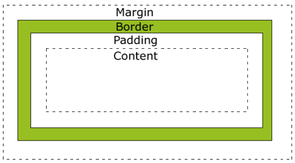

```apl
Margin：外边距————清除边框外的区域，外边距是透明的
Border：边框————围绕在内边距和内容外的边框
Padding：内边距————清除内容周围的区域，内边距是透明的
Content：内容————盒子的内容，显示文本和图像	
——————————————————————————————————————————————————————————————————————
最终元素的总宽度计算公式是这样的：
总元素的宽度=宽度+左填充+右填充+左边框+右边框+左边距+右边距
元素的总高度最终计算公式是这样的：
总元素的高度=高度+顶部填充+底部填充+上边框+下边框+上边距+下边距
```

### box-sizing —— 盒子适应

```html
<!doctype html>
<html lang="zh">
    <head>
        <meta charset="UTF-8">
        <title>666</title>
        <style>
            div {
                width: 100px;
                height: 100px;
                padding: 20px;
                border: 10px solid red;
            }
            /*默认值 任何边框和内边距的宽度都会被增加到盒子的大小*/
            .p1 {
                box-sizing: content-box;
            }
            /*不会增加到盒子的大小*/
            .p2 {
                box-sizing: border-box;
            }
        </style>
    </head>
    <body>
        <div class="p1">1</div>
        <div class="p2">2</div>
    </body>
</html>
```


# CSS 边框

### [CSS 边框方法链接](https://www.runoob.com/css/css-border.html)

### border-width —— 边框宽度

```html
<!doctype html>
<html lang="en">
    <head>
        <meta charset="UTF-8">
        <title>Document</title>
        <style>
            div {
                width: 300px;
                height: 200px;
                border-style: solid;
            }
            /*数值定义边框宽度*/
            .d1 {
                border-width: 1px;
            }
            /*以上、右、下、左的顺序定义不同预定义值或自定义值*/
            .d2 {
                border-width: thin medium thick 2px;
                /*thin：定义细的边框*/
                /*medium：默认，定义中等的边框*/
                /*thick：定义粗的边框*/
            }
        </style>
    </head>
    <body>
        <div class="d1"></div>
        <br>
        <div class="d2"></div>
    </body>
</html>
```

### border-style —— 边框样式

```html
<!doctype html>
<html lang="en">
    <head>
        <meta charset="UTF-8">
        <title>Document</title>
        <style>
            ui {
                border-width: 10px;
            }
            /*定义实线边框*/
            .d1 {
                border-style: solid;
            }
            /*定义点状边框*/
            .d2 {
                border-style: dotted;
            }
            /*定义虚线边框*/
            .d3 {
                border-style: dashed;
            }
            /*定义双线边框*/
            .d4 {
                border-style: double;
            }
            /*定义 3D 凹槽边框*/
            .d5 {
                border-style: groove;
            }
            .d6 {
                border-style: ridge;
            }
            /*定义 inset 边框*/
            .d7 {
                border-style: inset;
            }
            /*定义 outset边框*/
            .d8 {
                border-style: outset;
            }
            /*以上、右、下、左的顺序复合定义边框*/
            .d9 {
                border-style: dotted solid double dashed ;
            }
            /*默认为none：无边框*/
        </style>
    </head>
    <body>
        <ui>
            <li class="d1">实线边框</li>
            <br>
            <li class="d2">点状边框</li>
            <br>
            <li class="d3">虚线边框</li>
            <br>
            <li class="d4">双线边框</li>
            <br>
            <li class="d5">3D 凹槽边框</li>
            <br>
            <li class="d6">3D 垄状边框</li>
            <br>
            <li class="d7">3D inset边框</li>
            <br>
            <li class="d8">3D outset边框</li>
            <br>
            <li class="d9">复合边框</li>
        </ui>
    </body>
</html>
```

### border-color —— 边框颜色

```html
<!doctype html>
<html lang="en">
    <head>
        <meta charset="UTF-8">
        <title>Document</title>
        <style>
            li {
                border-width: 10px;
                border-style: solid;
            }
            /*以 RGB颜色、RGBA颜色、HSL颜色、HSLA颜色、十六进制颜色、预定义颜色 定义边框颜色*/
            .d1 {
                border-color: red;
            }
            /*以 上、右、下、左 的顺序定义边框颜色*/
            .d2 {
                border-color: red darksalmon violet aqua;
            }
        </style>
    </head>
    <body>
        <ui>
            <li class="d1"></li>
            <br>
            <li class="d2"></li>
        </ui>
    </body>
</html>
```

### border-radius —— 定义圆角边框

```html
<!doctype html>
<html lang="en">
    <head>
        <meta charset="UTF-8">
        <title>Document</title>
        <style>
            li {
                border-width: 10px;
                border-style: solid;
                border-color: red;
            }
            /*定义圆角*/
            .d1 {
                border-radius: 25px;
            }
            /*以 左上、右上、右下、左下顺序定义圆角*/
            .d2 {
                border-radius: 15px 35px 55px 75px;
            }

        </style>
    </head>
    <body>
        <ui>
            <li class="d1"></li>
            <br>
            <li class="d2"></li>
        </ui>
    </body>
</html>
```

### border-bottom —— 元素下边框

```apl
border-bottom:简写-指定下边框颜色宽度样式
border-bottom-width：设置元素的下边框宽度
border-bottom-style：设置元素下边框样式
border-bottom-color:设置元素的下边框颜色
```

```html
<!doctype html>
<html lang="zh-cn">
    <head>
        <meta charset="UTF-8">
        <style>
            /*简写-指定下边框颜色宽度样式*/
            .d1 {
                border-bottom: 1px solid red;
            }
            .p1 {
                /*border-bottom-width：设置元素的下边框宽度*/
                border-bottom-width: 1px;
                /*thin：细的       medium：中等的*/
                /*thick：粗的      length：xxpx 自定义*/

                /*——————————————————————————————————————*/

                /*border-bottom-style：设置元素下边框样式*/
                border-bottom-style:solid;
                /*dotted：点状边框      dashed：虚线边框*/
                /*solid:实线边框       double：双线边框*/
                /*groove：双线宽度等于边框宽度*/
                /*ridge:三维菱形边框    inset：三维凹边框*/
                /*outser：三维凸边框*/

                /*——————————————————————————————————————*/

                /*border-bottom-color:设置元素的下边框颜色*/
                border-bottom-color: red;
                /*以 RGB颜色、RGBA颜色、HSL颜色、HSLA颜色、十六进制颜色、预定义颜色 定义边框颜色*/
            }
        </style>
    </head>
    <body>
        <div class="d1">hello link text</div>
        <div>
            <span class="p1">hello</span>
        </div>
    </body>
</html>
```

### border-left —— 元素左边框

```apl
border-left：简写-指定左边框颜色宽度样式
border-left-width：设置元素的左边框宽度
border-left-style：设置元素左边框样式
border-left-color:设置元素的左边框颜色
```

```html
<!doctype html>
<html lang="zh-cn">
    <head>
        <meta charset="UTF-8">
        <style>
            /*简写-指定左边框颜色宽度样式*/
            .d1 {
                border-left: 1px solid red;
            }
            .p1 {
                /*border-left-width：设置元素的左边框宽度*/
                border-left-width: 2px;
                /*thin：细的       medium：中等的*/
                /*thick：粗的      length：xxpx 自定义*/

                /*——————————————————————————————————————*/

                /*border-left-style：设置元素左边框样式*/
                border-left-style:dotted;
                /*dotted：点状边框      dashed：虚线边框*/
                /*solid:实线边框       double：双线边框*/
                /*groove：双线宽度等于边框宽度*/
                /*ridge:三维菱形边框    inset：三维凹边框*/
                /*outser：三维凸边框*/

                /*——————————————————————————————————————*/

                /*border-left-color:设置元素的左边框颜色*/
                border-left-color: red;
                /*以 RGB颜色、RGBA颜色、HSL颜色、HSLA颜色、十六进制颜色、预定义颜色 定义边框颜色*/
            }
        </style>
    </head>
    <body>
        <div class="d1">hello link text</div>
        <div>
            <span class="p1">hello</span>
        </div>
    </body>
</html>
```

### border-right —— 元素右边框

```apl
border-right:简写-指定右边框颜色宽度样式
border-left-width：设置元素的右边框宽度
border-left-style：设置元素右边框样式
border-left-color:设置元素的右边框颜色
```

```html
<!doctype html>
<html lang="zh-cn">
    <head>
        <meta charset="UTF-8">
        <style>
            /*简写-指定右边框颜色宽度样式*/
            .d1 {
                border-right: 2px solid red;
            }
            .p1 {
                /*border-left-width：设置元素的右边框宽度*/
                border-right-width: 2px;
                /*thin：细的       medium：中等的*/
                /*thick：粗的      length：xxpx 自定义*/

                /*——————————————————————————————————————*/

                /*border-left-style：设置元素右边框样式*/
                border-right-style:dashed;
                /*dotted：点状边框      dashed：虚线边框*/
                /*solid:实线边框       double：双线边框*/
                /*groove：双线宽度等于边框宽度*/
                /*ridge:三维菱形边框    inset：三维凹边框*/
                /*outser：三维凸边框*/

                /*——————————————————————————————————————*/

                /*border-left-color:设置元素的右边框颜色*/
                border-right-color: red;
                /*以 RGB颜色、RGBA颜色、HSL颜色、HSLA颜色、十六进制颜色、预定义颜色 定义边框颜色*/
            }
        </style>
    </head>
    <body>
        <div class="d1">hello link text</div>
        <div>
            <span class="p1">hello</span>
        </div>
    </body>
</html>
```

### border-top —— 元素上边框

```apl
border-top:简写-指定上边框颜色宽度样式
border-left-width：设置元素的上边框宽度
border-left-style：设置元素上边框样式
border-left-color:设置元素的上边框颜色
```

```html
<!doctype html>
<html lang="zh-cn">
    <head>
        <meta charset="UTF-8">
        <style>
            /*简写-指定上边框颜色宽度样式*/
            .d1 {
                border-top: 2px solid red;
            }
            .p1 {
                /*border-left-width：设置元素的上边框宽度*/
                border-top-width: 2px;
                /*thin：细的       medium：中等的*/
                /*thick：粗的      length：xxpx 自定义*/

                /*——————————————————————————————————————*/

                /*border-left-style：设置元素上边框样式*/
                border-top-style:dotted;
                /*dotted：点状边框      dashed：虚线边框*/
                /*solid:实线边框       double：双线边框*/
                /*groove：双线宽度等于边框宽度*/
                /*ridge:三维菱形边框    inset：三维凹边框*/
                /*outser：三维凸边框*/

                /*——————————————————————————————————————*/

                /*border-left-color:设置元素的上边框颜色*/
                border-top-color: red;
                /*以 RGB颜色、RGBA颜色、HSL颜色、HSLA颜色、十六进制颜色、预定义颜色 定义边框颜色*/
            }
        </style>
    </head>
    <body>
        <div class="d1">hello link text</div>
        <div>
            <span class="p1">hello</span>
        </div>
    </body>
</html>
```

# CSS 内边距

### [CSS 内边距方法链接](https://www.runoob.com/css/css-padding.html)

### padding —— 简写上下左右的内边距

```html
<!doctype html>
<html lang="en">
    <head>
        <meta charset="UTF-8">
        <title>Document</title>
        <style>
            /*以 上、右、下、左的顺序定义内边距*/
            .d1 {
                width: 200px;
                height: 200px;
                padding: 50px 50px 50px 50px;
            }
            /*定义内边距*/
            .d2 {
                width: 200px;
                height: 200px;
                padding: 25px;
            }
        </style>
    </head>
    <body>
        <div class="d1">
            我
        </div>
        <br>
        <div class="d2">
            我
        </div>
    </body>
</html>
```

### padding-bottom —— 元素下内边距

```html
<!doctype html>
<html lang="en">
    <head>
        <meta charset="UTF-8">
        <title>Document</title>
        <style>
            /*定义下内边距*/
            .d1 {
                width: 50px;
                height: 50px;
                border: 1px solid red;
                padding-bottom: 25px;
            }
        </style>
    </head>
    <body>
        <div class="d1">我</div>
    </body>
</html>
```

### padding-left —— 元素左内边距

```html
<!doctype html>
<html lang="en">
    <head>
        <meta charset="UTF-8">
        <title>Document</title>
        <style>
            /*定义左内边距*/
            .d1 {
                width: 50px;
                height: 50px;
                border: 1px solid red;
                padding-left: 25px;
            }
        </style>
    </head>
    <body>
        <div class="d1">我</div>
    </body>
</html>
```

### padding-right —— 元素右内边距

```html
<!doctype html>
<html lang="en">
    <head>
        <meta charset="UTF-8">
        <title>Document</title>
        <style>
            /*定义右内边距*/
            .d1 {
                width: 50px;
                height: 50px;
                border: 1px solid red;
                padding-right: 25px;
            }
        </style>
    </head>
    <body>
        <div class="d1">我</div>
    </body>
</html>
```

### padding-top —— 元素上内边距

```html
<!doctype html>
<html lang="en">
    <head>
        <meta charset="UTF-8">
        <title>Document</title>
        <style>
            /*定义上内边距*/
            .d1 {
                width: 50px;
                height: 50px;
                border: 1px solid red;
                padding-top: 25px;
            }
        </style>
    </head>
    <body>
        <div class="d1">我</div>
    </body>
</html>
```

# CSS 外边距

### [CSS 外边距方法链接](https://www.runoob.com/css/css-margin.html)

### margin —— 简写上下左右的外边距

```html
<!doctype html>
<html lang="en">
    <head>
        <meta charset="UTF-8">
        <title>Document</title>
        <style>
            div {
                border: 1px solid;
            }
            /*以 上、右、下、左的顺序定义外边距*/
            .d1 {
                width: 200px;
                height: 200px;
                margin: 25px 50px 50px 25px;
            }
            /*定义外边距*/
            .d2 {
                width: 200px;
                height: 200px;
                margin: 25px;
            }
            /*定义浏览器自动计算外边距*/
            .d3 {
                width: 200px;
                height: 200px;
                margin: 0 auto;
            }
        </style>
    </head>
    <body>
        <div class="d1">
            我
        </div>
        <div class="d2">
            我
        </div>
        <div class="d3">
            我
        </div>
    </body>
</html>
```

### margin-bottom —— 元素下外边距

```html
<!doctype html>
<html lang="en">
    <head>
        <meta charset="UTF-8">
        <title>Document</title>
        <style>
            /*定义下外边距*/
            .d1 {
                width: 50px;
                height: 50px;
                border: 1px solid red;
                margin-bottom: 25px;
            }
        </style>
    </head>
    <body>
        <div class="d1">我</div>
    </body>
</html>
```

### margin-left —— 元素左外边距

```html
<!doctype html>
<html lang="en">
    <head>
        <meta charset="UTF-8">
        <title>Document</title>
        <style>
            /*定义左外边距*/
            .d1 {
                width: 50px;
                height: 50px;
                border: 1px solid red;
                margin-left: 25px;
            }
        </style>
    </head>
    <body>
        <div class="d1">我</div>
    </body>
</html>
```

### margin-right —— 元素右外边距

```html
<!doctype html>
<html lang="en">
    <head>
        <meta charset="UTF-8">
        <title>Document</title>
        <style>
            /*定义右外边距*/
            .d1 {
                width: 50px;
                height: 50px;
                border: 1px solid red;
                margin-right: 25px;
            }
        </style>
    </head>
    <body>
        <div class="d1">我</div>
    </body>
</html>
```

### margin-top —— 元素上外边距

```html
<!doctype html>
<html lang="en">
    <head>
        <meta charset="UTF-8">
        <title>Document</title>
        <style>
            /*定义上外边距*/
            .d1 {
                width: 50px;
                height: 50px;
                border: 1px solid red;
                margin-top: 25px;
            }
        </style>
    </head>
    <body>
        <div class="d1">我</div>
    </body>
</html>
```

# CSS 图像透明

### opacity —— 元素的透明度

```html
<!doctype html>
<html lang="zh">
    <head>
        <meta charset="UTF-8">
        <title>666</title>
        <style>
            /*元素的透明度*/
            img {
                width: 100%;
                opacity: 0.5;
            }
        </style>
    </head>
    <body>
        
    </body>
</html>
```

# 盒子阴影

### box-shadow —— 设置设置一个或多个下拉阴影的框

```html
<!doctype html>
<html lang="en">
    <head>
        <meta charset="UTF-8">
        <title>Document</title>
        <style>
            div {
                width: 300px;
                height: 300px;
                margin: 50px auto;
                border-radius: 50%;
                background-color: darkorange;
            }
            /*外阴影*/
            .d1:hover {
                box-shadow: 0px 0px 10px 10px rgba(0,0,0,0.3);
            }
            /*内阴影*/
            .d2:hover {
                box-shadow: 0px 0px 10px 10px rgba(0,0,0,0.3) inset;
            }
            /*box-shadow:水平阴影位置、垂直阴影位置、模糊距离、阴影大小、阴影颜色、内外阴影 来定义*/
        </style>
    </head>
    <body>
        <div class="d1"></div>
        <div class="d2"></div>
    </body>
</html>
```

# CSS 列表

### [CSS 列表方法链接](https://www.runoob.com/css/css-list.html)

### list-style-type —— 设置列表项标记的类型

```html
<!doctype html>
<html lang="en">
    <head>
        <meta charset="UTF-8">
        <title>Document</title>
        <style>
            /*定义为无标记*/
            .e1,.q1 {
                list-style-type: none;
            }
            /*定义为空心圆*/
            .e2,.q2 {
                list-style-type: circle;
            }
            /*定义为实心方块*/
            .e3,.q3 {
                list-style-type: square;
            }
            /*定义为数字，有序列表默认是decimal*/
            .e4,.q4 {
                list-style-type: decimal;
            }
            /*定义为实心圆，无序列表默认是disc*/
            .e5,.q5 {
                list-style-type: disc;
            }
            /*定义为0开头的数字标记*/
            .e6,.q6 {
                list-style-type: decimal-leading-zero;
            }
            /*定义为小写罗马数字*/
            .e7,.q7 {
                list-style-type: lower-roman;
            }
            /*定义为大写罗马数字*/
            .e8,.q8 {
                list-style-type: upper-roman;
            }
            /*定义为小写英文字母*/
            .e9,.q9 {
                list-style-type: lower-alpha;
            }
            /*定义为大写英文字母*/
            .e10,.q10 {
                list-style-type: upper-alpha;
            }
            /*定义为小写希腊字母*/
            .e11,.q11 {
                list-style-type: lower-greek;
            }
            /*定义为小写拉丁字母*/
            .e12,.q12 {
                list-style-type: lower-latin;
            }
            /*定义为大写拉丁字母*/
            .e13,.q13 {
                list-style-type: upper-latin;
            }
            /*定义为传统的希伯来编号方式*/
            .e14,.q14 {
                list-style-type: hebrew;
            }
            /*定义为传统的亚美尼亚编号方式*/
            .e15,.q15 {
                list-style-type: armenian;
            }
            /*定义为传统的乔治亚编号方式*/
            .e16,.q16 {
                list-style-type: georgian;
            }
            /*定义为简单的表意数字*/
            .e17,.q17 {
                list-style-type: cjk-ideographic;
            }
            /*定义为日文平假名字符*/
            .e18,.q18 {
                list-style-type: hiragana;
            }
            /*定义为日文片假名字符*/
            .e19,.q19 {
                list-style-type: katakana;
            }
            /*定义为日文平假名序号*/
            .e20,.q20 {
                list-style-type: hiragana-iroha;
            }
            /*定义为日文片假名序号*/
            .e21,.q21 {
                list-style-type: katakana-iroha;
            }
        </style>
    </head>
    <body>
        <ul>
            无序列表
            <li class="q1">无标记</li>
            <li class="q2">空心圆</li>
            <li class="q3">实心方块</li>
            <li class="q4">数字</li>
            <li class="q5">实心圆</li>
            <li class="q6">0开头的数字标记</li>
            <li class="q7">小写罗马数字</li>
            <li class="q8">大写罗马数字</li>
            <li class="q9">小写英文字母</li>
            <li class="q10">大写英文字母</li>
            <li class="q11">小写希腊字母</li>
            <li class="q12">小写拉丁字母</li>
            <li class="q13">大写拉丁字母</li>
            <li class="q14">传统的希伯来编号方式</li>
            <li class="q15">传统的亚美尼亚编号方式</li>
            <li class="q16">传统的乔治亚编号方式</li>
            <li class="q17">简单的表意数字</li>
            <li class="q18">日文平假名字符</li>
            <li class="q19">日文片假名字符</li>
            <li class="q20">日文平假名序号</li>
            <li class="q21">日文片假名序号</li>
        </ul>
        <ol>
            有序列表
            <li class="e1">无标记</li>
            <li class="e2">空心圆</li>
            <li class="e3">实心方块</li>
            <li class="e4">数字</li>
            <li class="e5">实心圆</li>
            <li class="e6">0开头的数字标记</li>
            <li class="e7">小写罗马数字</li>
            <li class="e8">大写罗马数字</li>
            <li class="e9">小写英文字母</li>
            <li class="e10">大写英文字母</li>
            <li class="e11">小写希腊字母</li>
            <li class="e12">小写拉丁字母</li>
            <li class="e13">大写拉丁字母</li>
            <li class="e14">传统的希伯来编号方式</li>
            <li class="e15">传统的亚美尼亚编号方式</li>
            <li class="e16">传统的乔治亚编号方式</li>
            <li class="e17">简单的表意数字</li>
            <li class="e18">日文平假名字符</li>
            <li class="e19">日文片假名字符</li>
            <li class="e20">日文平假名序号</li>
            <li class="e21">日文片假名序号</li>
        </ol>
    </body>
</html>
```

### list-style-position —— 指示相对于对象的内容绘制列表项标记

```html
<!doctype html>
<html lang="en">
    <head>
        <meta charset="UTF-8">
        <title>Document</title>
        <style>
            li {
                border: 1px solid red;
            }
            /*定义标记放置在文本以内，且环绕文本根据标记对齐*/
            .q1 {
                list-style-position: inside;
            }
            /*默认值为outside 标记位于文本左侧*/
        </style>
    </head>
    <body>
        <ul>
            <li class="q1">1</li>
        </ul>
    </body>
</html>
```

### list-style-image —— 使用图像来替换列表项的标记

```html
<!doctype html>
<html lang="en">
    <head>
        <meta charset="UTF-8">
        <title>Document</title>
        <style>
            li {
                border: 1px solid red;
            }
            /*定义图像的路径*/
            .q1 {
                list-style-image: url('3.jpg');
            }
            /*默认值为none 无图形被显示*/
        </style>
    </head>
    <body>
        <ul>
            <li class="q1">1</li>
        </ul>
    </body>
</html>
```

### list-style —— 简写设置所有的列表属性

```html
<!doctype html>
<html lang="en">
    <head>
        <meta charset="UTF-8">
        <title>Document</title>
        <style>
            li {
                border: 1px solid red;
            }
            /*简写设定列表属性*/
            .q1 {
                list-style: square inside;
            }
            /*简写设定列表属性*/
            .q2 {
                list-style: inside url("3.jpg");
            }
        </style>
    </head>
    <body>
        <ul>
            <li class="q1">1</li>
            <li class="q2">2</li>
        </ul>
    </body>
</html>
```

# CSS 表格

### border-collapse —— 边框是否合一

```html
<!doctype html>
<html lang="en">
    <head>
        <meta charset="UTF-8">
        <title>Document</title>
        <style>
            /*合并单元格*/
            table,
            td {
                border-style: solid;
                border-collapse: collapse;
            }
            /*默认为separate：不合并*/
        </style>
    </head>
    <body>
        <table>
            <tr>
                <td>性别</td> <td>姓名</td> <td>年龄</td>
            </tr>
            <tr>
                <td>男</td> <td>刘佳辉</td> <td>24</td>
            </tr>
            <tr>
                <td>女</td> <td>胡莹莹</td> <td>23</td>
            </tr>
        </table>
    </body>
</html>
```

### border-spacing —— 设置相邻单元格的边框间的距离

```html
<!doctype html>
<html lang="en">
    <head>
        <meta charset="UTF-8">
        <title>Document</title>
        <style>
            /*设定单元格间距*/
            table ,td{
                border: 1px solid red;
                border-spacing: 20px;
            }
        </style>
    </head>
    <body>
        <table>
            <tr>
                <td>性别</td> <td>姓名</td> <td>年龄</td>
            </tr>
            <tr>
                <td>男</td> <td>刘佳辉</td> <td>24</td>
            </tr>
            <tr>
                <td>女</td> <td>胡莹莹</td> <td>23</td>
            </tr>
        </table>
    </body>
</html>
```

### caption-side —— 设置表格标题的位置

```html
<!doctype html>
<html lang="en">
    <head>
        <meta charset="UTF-8">
        <title>Document</title>
        <style>
            table ,td{
                border: 1px solid red;
            }
            /*默认值放在顶部*/
            table {
                caption-side: top;
            }
            /*定位在表格下面*/
            table {
                caption-side: bottom;
            }
        </style>
    </head>
    <body>
        <table>
            <caption>2333</caption>
            <tr>
                <td>性别</td> <td>姓名</td> <td>年龄</td>
            </tr>
            <tr>
                <td>男</td> <td>刘佳辉</td> <td>24</td>
            </tr>
            <tr>
                <td>女</td> <td>胡莹莹</td> <td>23</td>
            </tr>
        </table>
    </body>
</html>
```

### empty-cells —— 设置是否显示表格中的空单元格

```html
<!doctype html>
<html lang="en">
    <head>
        <meta charset="UTF-8">
        <title>Document</title>
        <style>
            table ,td{
                border: 1px solid red;
            }
            /*默认值绘制边框*/
            table {
                empty-cells: show;
            }
            /*不绘制边框*/
            table {
                empty-cells: hide;
            }
        </style>
    </head>
    <body>
        <table>
            <caption>2333</caption>
            <tr>
                <td>性别</td> <td>姓名</td> <td>年龄</td>
            </tr>
            <tr>
                <td>男</td> <td>刘佳辉</td> <td>24</td>
            </tr>
            <tr>
                <td>女</td> <td>胡莹莹</td> <td></td>
            </tr>
        </table>
    </body>
</html>
```

# CSS 轮廓

### [CSS 轮廓方法链接](https://www.runoob.com/css/css-outline.html)

```apl
绘制于元素周围的一条线，位于边框边缘的外围，可起到突出元素的作用，不会改变元素大小
```

### outline-style ——  轮廓的样式

```html
<!doctype html>
<html lang="en">
    <head>
        <meta charset="UTF-8">
        <title>Document</title>
        <style>
            div {
                background-color: darkorange;
                margin: 20px;
                height: 50px;
                outline-width: 5px;
            }
            /*定义为点状轮廓*/
            .p1 {
                outline-style: dotted;
            }
            /*定义为虚线轮廓*/
            .p2 {
                outline-style: dashed;
            }
            /*定义为实线轮廓*/
            .p3 {
                outline-style: solid;
            }
            /*定义为双线轮廓*/
            .p4 {
                outline-style: double;
            }
            /*定义为3D 凹槽轮廓*/
            .p5 {
                outline-style: groove;
            }
            /*定义为3D 凸槽轮廓*/
            .p6 {
                outline-style: ridge;
            }
            /*定义为3D 凹边轮廓*/
            .p7 {
                outline-style: inset;
            }
            /*定义为3D 凸边轮廓*/
            .p8 {
                outline-style: outset;
            }
            /*默认值 none：无轮廓*/
        </style>
    </head>
    <body>
        <div class="p1"></div>
        <div class="p2"></div>
        <div class="p3"></div>
        <div class="p4"></div>
        <div class="p5"></div>
        <div class="p6"></div>
        <div class="p7"></div>
        <div class="p8"></div>
    </body>
</html>
```

### outline-width —— 轮廓的宽度

```html
<!doctype html>
<html lang="en">
    <head>
        <meta charset="UTF-8">
        <title>Document</title>
        <style>
            div {
                background-color: darkorange;
                margin: 20px;
                height: 50px;
                outline-style: dashed;
            }
            /*定义数值*/
            .p1 {
                outline-width: 10px;
            }
            /*定义细轮廓*/
            .p2 {
                outline-width: thin;
            }
            /*定义中等轮廓*/
            .p3 {
                outline-width: medium;
            }
            /*定义粗轮廓*/
            .p4 {
                outline-width: thick;
            }
        </style>
    </head>
    <body>
        <div class="p1"></div>
        <div class="p2"></div>
        <div class="p3"></div>
        <div class="p4"></div>
    </body>
</html>
```

### outline-color —— 轮廓颜色

```html
<!doctype html>
<html lang="en">
    <head>
        <meta charset="UTF-8">
        <title>Document</title>
        <style>
            div {
                background-color: darkorange;
                margin: 20px;
                height: 50px;
                outline-style: dashed;
                outline-width: 5px;
            }
            /*以 RGB颜色、RGBA颜色、HSL颜色、HSLA颜色、十六进制颜色、预定义颜色 定义边框颜色*/
            .p1 {
                outline-color: rgba(0,0,0,0.3);
            }
        </style>
    </head>
    <body>
        <div class="p1"></div>
    </body>
</html>
```

### outline —— 简写设置所有的轮廓属性

```html
<!doctype html>
<html lang="en">
    <head>
        <meta charset="UTF-8">
        <title>Document</title>
        <style>
            div {
                background-color: darkorange;
                margin: 20px;
                height: 50px;
            }
            /*简写定义所有轮廓属性*/
            .p1 {
                outline: 5px dotted red;
            }
        </style>
    </head>
    <body>
        <div class="p1"></div>
    </body>
</html>
```

# CSS 显示

### [CSS display显示方法链接](https://www.runoob.com/cssref/pr-class-display.html)

### display —— 规定元素应该生成的框的类型

```html
<!doctype html>
<html lang="en">
    <head>
        <meta charset="UTF-8">
        <title>Document</title>
        <style>
            div {
                border: 1px solid red;
                margin-bottom: 10px;
                margin-left: 5px;
            }
            /*定义元素不显示*/
            .p1 {
                display: none;
            }
            /*将元素转换为块级元素*/
            .p2 {
                display: block;
            }
            /*将块级元素转换为内联元素*/
            .p3 {
                display: inline;
            }
            /*将元素转换为行内块元素*/
            .p4 {
                display: inline-block;
            }
            /*将元素作为列表显示*/
            .p5 {
                display: list-item;
            }
            /*元素会根据上下文作为块级元素或者内联元素显示*/
            .p6 {
                display: run-in;
            }
            /*元素会作为块级表格显示*/
            .p7{
                display: table;
            }
            /*元素会作为内联表格显示*/
            .p8 {
                display: inline-table;
            }
        </style>
    </head>
    <body>
        <div class="p1">1</div>
        <span class="p2">2</span>
        <div class="p3">3</div>
        <div class="p4">4</div>
        <div class="p5">5</div>
        <div class="p6">6</div>
        <div class="p7">7</div>
        <div class="p8">8</div>
    </body>
</html>
```

# CSS 可见性

### [CSS 可见性方法链接](https://www.runoob.com/cssref/pr-class-visibility.html)

### visibility —— 元素是否是可见

```html
<!doctype html>
<html lang="en">
    <head>
        <meta charset="UTF-8">
        <title>Document</title>
        <style>
            div {
                border: 1px solid red;
                margin-bottom: 10px;
                margin-left: 5px;
            }
            /*定义元素不显示*/
            .p1 {
                visibility: hidden;
            }
            /*当在表格元素中使用时，此值可删除一行或一列*/
            .q1 {
                visibility: collapse;
            }
            /*默认值 visible：元素是可见的*/
        </style>
    </head>
    <body>
        <div class="p1">1</div>
        <table>
            <tr>
                <td>性别</td> <td>姓名</td> <td>年龄</td>
            </tr>
            <tr class="q1">
                <td>男</td> <td>刘佳辉</td> <td>24</td>
            </tr>
            <tr>
                <td>女</td> <td>胡莹莹</td> <td>23</td>
            </tr>
        </table>
    </body>
</html>
```

# CSS 浮动

### float —— 指定一个盒子（元素）是否应该浮动

```html
<!doctype html>
<html lang="en">
    <head>
        <meta charset="UTF-8">
        <title>Document</title>
        <style>
            div {
                width: 50px;
                height: 50px;
                background-color: darkorange;
            }
            /*定义左浮动*/
            .d1 {
                float: left;
            }
            /*定义右浮动*/
            .d2 {
                float: right;
            }
            /*默认值：none  元素不浮动，以原本的位置显示*/
        </style>
    </head>
    <body>
        <div class="d1"></div>
        <div class="d1"></div>
        <div class="d2"></div>
        <div class="d2"></div>
    </body>
</html>
```

### clear —— 指定左侧或右侧不允许浮动的元素

+ 在左右两侧均不允许浮动元素

```html
<!doctype html>
<html lang="en">
    <head>
        <meta charset="UTF-8">
        <title>Document</title>
        <style>
            .q1 {
                background-color: darkorange;
            }
            .d1,.d2,.d3 {
                border: 1px solid red;
                width: 50px;
                height: 50px;
            }
            /*左浮动*/
            .d1 {
                float: left;
            }
            /*清除左右浮动*/
            .d2 {
                clear: both;
            }
            /*左浮动*/
            .d3 {
                float: left;
            }
        </style>
    </head>
    <body>
        <div class="q1">
            <div class="d1"></div>
            <div class="d2"></div>
            <div class="d3"></div>
        </div>
    </body>
</html>
```

+ 在左侧不允许浮动元素

```html
<!doctype html>
<html lang="en">
    <head>
        <meta charset="UTF-8">
        <title>Document</title>
        <style>
            .q1 {
                background-color: darkorange;
            }
            .d1,.d2,.d3 {
                border: 1px solid red;
                width: 50px;
                height: 50px;
            }
            /*左浮动*/
            .d1 {
                float: left;
            }
            /*清除左右浮动*/
            .d2 {
                clear: left;
            }
            /*左浮动*/
            .d3 {
                float: left;
            }
        </style>
    </head>
    <body>
        <div class="q1">
            <div class="d1"></div>
            <div class="d2"></div>
            <div class="d3"></div>
        </div>
    </body>
</html>
```

+ 在右侧不允许浮动元素

```html
<!doctype html>
<html lang="en">
    <head>
        <meta charset="UTF-8">
        <title>Document</title>
        <style>
            .q1 {
                background-color: darkorange;
            }
            .d1,.d2,.d3 {
                border: 1px solid red;
                width: 50px;
                height: 50px;
            }
            /*左浮动*/
            .d1 {
                float: left;
            }
            /*清除右浮动*/
            .d2 {
                clear: right;
            }
            /*左浮动*/
            .d3 {
                float: left;
            }
        </style>
    </head>
    <body>
        <div class="q1">
            <div class="d1"></div>
            <div class="d2"></div>
            <div class="d3"></div>
        </div>
    </body>
</html>
```

# CSS 元素塌陷

### clear —— 使用清除浮动来解决元素塌陷

```html
<!doctype html>
<html lang="en">
    <head>
        <meta charset="UTF-8">
        <title>Document</title>
        <style>
            .q1 {
                background-color: darkorange;
            }
            .d1,.d2,.d3 {
                border: 1px solid red;
                width: 50px;
                height: 50px;
            }
            /*左浮动*/
            .d1 {
                float: left;
            }
            /*左浮动*/
            .d2 {
                float: left;
            }
            /*左浮动*/
            .d3 {
                clear: both;
            }
        </style>
    </head>
    <body>
        <div class="q1">
            <div class="d1"></div>
            <div class="d2"></div>
            <div class="d3"></div>
        </div>
    </body>
</html>
```


### overflow —— 将溢出元素清除来解决元素塌陷

```html
<!doctype html>
<html lang="en">
    <head>
        <meta charset="UTF-8">
        <title>Document</title>
        <style>
            /*添加overflow: hidden 解决元素塌陷*/
            .q1 {
                background-color: darkorange;
                overflow: hidden;
            }
            .d1,.d2,.d3 {
                border: 1px solid red;
                width: 50px;
                height: 50px;
            }
            /*左浮动*/
            .d1 {
                float: left;
            }
            /*左浮动*/
            .d2 {
                float: left;
            }
            /*左浮动*/
            .d3 {
                float: left;
            }
        </style>
    </head>
    <body>
        <div class="q1">
            <div class="d1"></div>
            <div class="d2"></div>
            <div class="d3"></div>
        </div>
    </body>
</html>
```

### ：after —— 使用:after伪类选择器解决元素塌陷

```html
<!doctype html>
<html lang="en">
    <head>
        <meta charset="UTF-8">
        <title>Document</title>
        <style>
            /*向父元素添加:after 伪类解决元素塌陷*/
            .q1:after {
                content: "";
                display: block;
                height: 0;
                clear: both;
                visibility: hidden;
            }
            .q1 {
                background-color: darkorange;
            }
            .d1,.d2,.d3 {
                border: 1px solid red;
                width: 50px;
                height: 50px;
            }
            /*左浮动*/
            .d1 {
                float: left;
            }
            /*左浮动*/
            .d2 {
                float: left;
            }
            /*左浮动*/
            .d3 {
                float: left;
            }
            .d3:after {
                float: left;
            }
        </style>
    </head>
    <body>
        <div class="q1">
            <div class="d1"></div>
            <div class="d2"></div>
            <div class="d3"></div>
        </div>
    </body>
</html>
```

### ：before 加：after —— 双伪类选择器解决元素塌陷

```html
<!doctype html>
<html lang="en">
    <head>
        <meta charset="UTF-8">
        <title>Document</title>
        <style>
            /*向父元素添加:after和:before 解决元素塌陷*/
            .q1:after,
            .q1:before{
                content: "";
                display: table;
            }
            .q1:after {
                clear: both;
            }
            .q1 {
                background-color: darkorange;
            }
            .d1,.d2,.d3 {
                border: 1px solid red;
                width: 50px;
                height: 50px;
            }
            /*左浮动*/
            .d1 {
                float: left;
            }
            /*左浮动*/
            .d2 {
                float: left;
            }
            /*左浮动*/
            .d3 {
                float: left;
            }
            .d3:after {
                float: left;
            }
        </style>
    </head>
    <body>
        <div class="q1">
            <div class="d1"></div>
            <div class="d2"></div>
            <div class="d3"></div>
        </div>
    </body>
</html>
```

# CSS 定位

### [CSS 定位方法链接](https://www.runoob.com/css/css-positioning.html)

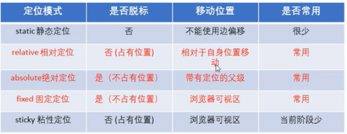

### position 定位

### static —— 静态定位，即没有定位

```html
<!doctype html>
<html lang="en">
    <head>
        <meta charset="UTF-8">
        <title>Document</title>
        <style>
            /*静态定位，无偏移*/
            div {
                position: static;
            }
        </style>
    </head>
    <body>
        <div class="p1">1</div>
    </body>
</html>
```

### relative —— 相对定位，元素的定位是相对其正常位置

```html
<!doctype html>
<html lang="en">
    <head>
        <meta charset="UTF-8">
        <title>Document</title>
        <style>
            /*相对定位元素的定位是相对其正常位置*/
            div {
                height: 10px;
                width: 10px;
                background-color: darkorange;
                position: relative;
                left: 10px;
            }
        </style>
    </head>
    <body>
        <div></div>
    </body>
</html>
```

### absolute —— 绝对定位 ，相对于最近的已定位父元素

```html
<!doctype html>
<html lang="en">
    <head>
        <meta charset="UTF-8">
        <title>Document</title>
        <style>
            div {
                height: 50px;
                width: 50px;
                background-color: darkorange;
                position: relative;
            }
            /*绝对定位相对于最近的已定位父元素*/
            .p1 {
                height: 10px;
                width: 10px;
                background-color: fuchsia;
                position: absolute;
                left: 10px;
                top: 10px;
            }
        </style>
    </head>
    <body>
        <div>
            <div class="p1"></div>
        </div>
    </body>
</html>
```

### fixed —— 固定定位，相对于浏览器窗口是固定位置

```html
<!doctype html>
<html lang="en">
    <head>
        <meta charset="UTF-8">
        <title>Document</title>
        <style>
            .p2 {
                height: 1000px;
                background-color: darkorange;
            }
            /*固定定位相对于浏览器窗口是固定位置*/
            .p1 {
                height: 50px;
                width: 50px;
                background-color: red;
                position: fixed;
                top: 20px;
                left: 20px;
            }
        </style>
    </head>
    <body>
        <div class="p2">
            <div class="p1"></div>
        </div>
    </body>
</html>
```

### sticky —— 粘性定位，基于用户的滚动位置来定位

```html
<!doctype html>
<html lang="en">
    <head>
        <meta charset="UTF-8">
        <title>Document</title>
        <style>
            .p2 {
                height: 1000px;
                background-color: darkorange;
            }
            /*粘性定位基于用户的滚动位置来定位*/
            .p1 {
                height: 50px;
                width: 50px;
                background-color: red;
                position: sticky;
                top: 0px;
            }
        </style>
    </head>
    <body>
        <div class="p2">
            <div class="p1"></div>
        </div>
    </body>
</html>
```

### z-index —— 指定元素定位的堆叠顺序

```html
<!doctype html>
<html lang="en">
    <head>
        <meta charset="UTF-8">
        <title>Document</title>
        <style>
            div {
                height: 50px;
                width: 50px;
                position: fixed;
                top: 0;
                left: 0;
            }
            /*定义元素叠放的顺序*/
            .p1 {
                background-color: red;
                z-index: 1;
            }
            .p2 {
                background-color: goldenrod;
            }
            .p3 {
                background-color: saddlebrown;
            }
        </style>
    </head>
    <body>
        <div class="p1"></div>
        <div class="p2"></div>
        <div class="p3"></div>
    </body>
</html>
```

### clip —— 指定一个绝对定位的元素，元素被剪裁成这种形状并显示

```html
<!doctype html>
<html lang="en">
    <head>
        <meta charset="UTF-8">
        <title>Document</title>
        <style>
            /*以上、右、下、左的顺序指定剪切范围*/
            img {
                position: absolute;
                top: 20px;
                left: 20px;
                clip: rect(0px ,60px ,200px,0px);
            }
        </style>
    </head>
    <body>
        
    </body>
</html>
```

# CSS 初始化

```css
/*清除所有标签内外边距*/
* {
    margin: 0;
    padding: 0;
}
/*将em 和 i 标签不倾斜*/
em , i {
    font-style: normal;
}
/*将列表前标志清除*/
li {
    list-style: none;
}
/*将图片居中解决图片在基线时下面会有空白间隙*/
img {
    vertical-align: middle;
}
/*当时鼠标经过按钮时光标变成小手*/
button {
    cursor: pointer;
}
/*取消所有链接下划线，字设定为 #666 色*/
a {
    color: #666;
    text-decoration: none;
}
/*鼠标经过链接时链接颜色变化*/
a:hover {
    color: red;
}
```


# CSS 光标

### CSS 光标样式图

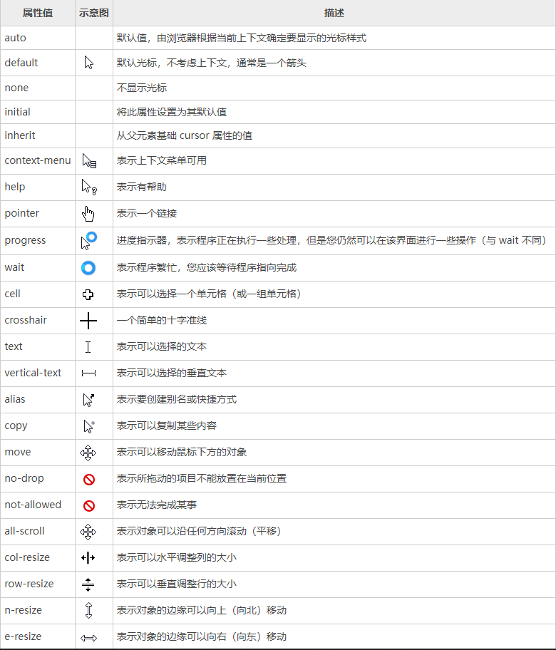

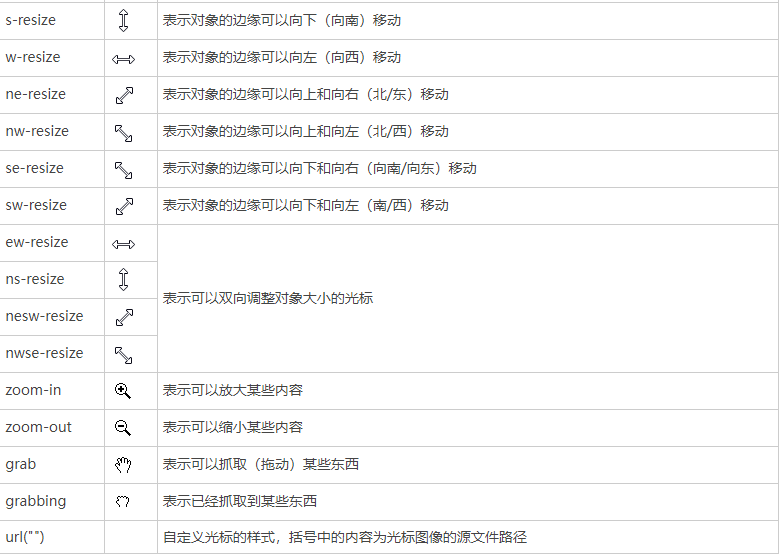

### cursor —— 定义鼠标指针放在元素边界范围内时所用的光标形状

```html
<!doctype html>
<html lang="en">
    <head>
        <meta charset="UTF-8">
        <title>Document</title>
        <style>
            div {
                border: 1px solid red;
                margin: 10px;
                height: 30px;
                width: 30px;
            }
            /*光标呈现为十字线*/
            .p1 {
                cursor: crosshair;
            }
            /*光标呈现为指示链接的指针（一只手）*/
            .p2 {
                cursor: pointer;
            }
            /*光标指示某对象可被移动*/
            .p3 {
                cursor: move;
            }
            /*此光标指示矩形框的边缘可被向左右移动*/
            .p4 {
                cursor: e-resize;
                cursor: w-resize;
            }
            /*此光标指示矩形框的边缘可左下和右上移动*/
            .p5 {
                cursor: ne-resize;
                cursor: sw-resize;
            }
            /*此光标指示矩形框的边缘可左上和右下移动*/
            .p6 {
                cursor: nw-resize;
                cursor: se-resize;
            }
            /*此光标指示矩形框的边缘可上下移动*/
            .p7 {
                cursor: n-resize;
                cursor: s-resize;
            }
            /*此光标指示文本*/
            .p8 {
                cursor: text;
            }
            /*此光标指示程序正忙（通常是一只表或沙漏）*/
            .p9 {
                cursor: wait;
            }
            /*此光标指示可用的帮助（通常是一个问号或一个气球）*/
            .p10 {
                cursor: help;
            }
            /*默认值 auto：浏览器默认光标*/
            /*默认值 default：默认光标（通常是箭头）*/
        </style>
    </head>
    <body>
        <div class="p1"></div>
        <div class="p2"></div>
        <div class="p3"></div>
        <div class="p4"></div>
        <div class="p5"></div>
        <div class="p6"></div>
        <div class="p7"></div>
        <div class="p8"></div>
        <div class="p9"></div>
        <div class="p10"></div>
    </body>
</html>
```

# CSS 溢出

### [CSS 溢出方法链接](https://www.runoob.com/cssref/pr-pos-overflow.html)

### overflow —— 指定如果内容溢出元素的框会发生什么

```html
<!doctype html>
<html lang="en">
    <head>
        <meta charset="UTF-8">
        <title>Document</title>
        <style>
            div {
                border: 1px solid red;
                margin: 10px;
                height: 30px;
                width: 30px;
            }
            /*内容会被修剪，并且其余内容是不可见的*/
            .p1 {
                overflow: hidden;
            }
            /*内容会被修剪，但是浏览器会显示滚动条以便查看其余的内容*/
            .p2 {
                overflow: scroll;
            }
            /*如果内容被修剪，则浏览器会显示滚动条以便查看其余的内容*/
            .p3 {
                overflow: auto;
            }
            /*默认值 visible：内容不会被修剪，会呈现在元素框之外*/
        </style>
    </head>
    <body>
        <div class="p1">111111111</div>
        <div class="p2">111111111</div>
        <div class="p3">111111111</div>
    </body>
</html>
```

### overflow-y —— 溢出了元素的内容区是否剪辑顶部/底部边缘内容

```html
<!doctype html>
<html lang="en">
    <head>
        <meta charset="UTF-8">
        <title>Document</title>
        <style>
            p {
                border: 1px solid red;
                margin: 10px;
                height: 30px;
                width: 30px;
            }
            /*裁剪内容 - 不提供滚动机制*/
            .p1 {
                overflow-y: hidden;
            }
            /*裁剪内容 - 提供滚动机制*/
            .p2 {
                overflow-y: scroll;
            }
            /*如果溢出框，则应该提供滚动机制*/
            .p3 {
                overflow-y: auto;
            }
            /*如果内容不适合内容框，则删除整个框*/
            .p4 {
                overflow-y: no-display;
            }
            /*如果内容不适合内容框，则隐藏整个内容*/
            .p5 {
                overflow-y: no-content;
            }
            /*默认值 visible：内容不会被修剪，会呈现在元素框之外*/
        </style>
    </head>
    <body>
        <p class="p1">111111111</p>
        <p class="p2">111111111</p>
        <p class="p3">111111111</p>
        <p class="p4">111111111</p>
        <p class="p5">111111111</p>
    </body>
</html>
```

### overflow-x —— 溢出了元素的内容区是否剪辑左/右边缘内容

```html
<!doctype html>
<html lang="en">
    <head>
        <meta charset="UTF-8">
        <title>Document</title>
        <style>
            p {
                border: 1px solid red;
                margin: 10px;
                height: 30px;
                width: 30px;
            }
            /*裁剪内容 - 不提供滚动机制*/
            .p1 {
                overflow-x: hidden;
            }
            /*裁剪内容 - 提供滚动机制*/
            .p2 {
                overflow-x: scroll;
            }
            /*如果溢出框，则应该提供滚动机制*/
            .p3 {
                overflow-x: auto;
            }
            /*如果内容不适合内容框，则删除整个框*/
            .p4 {
                overflow-x: no-display;
            }
            /*如果内容不适合内容框，则隐藏整个内容*/
            .p5 {
                overflow-x: no-content;
            }
            /*默认值 visible：内容不会被修剪，会呈现在元素框之外*/
        </style>
    </head>
    <body>
        <p class="p1">111111111</p>
        <p class="p2">111111111</p>
        <p class="p3">111111111</p>
        <p class="p4">111111111</p>
        <p class="p5">111111111</p>
    </body>
</html>
```

# CSS 文本效果

### text-overflow —— 指定文本溢出包含它的元素时应该如何显示

```html
<!doctype html>
<html lang="en">
    <head>
        <meta charset="UTF-8">
        <title>Document</title>
        <style>
            /*显示省略号来代表剪切的文本*/
            .q1 {
                width: 50px;
                background-color: violet;
                white-space: nowrap;
                overflow: hidden;
                text-overflow: ellipsis;
            }
            /*使用给定的文本来代表剪切的文本*/
            /*只在火狐内核浏览器显示*/
            .q2 {
                width: 50px;
                background-color: violet;
                white-space: nowrap;
                overflow: hidden;
                text-overflow: ">>";
            }
        </style>
    </head>
    <body>
        <div class="q1">666666666666</div>
        <div class="q2">666666666666</div>
    </body>
</html>
```

### word-wrap —— 允许长的内容可以自动换行

```html
<!doctype html>
<html lang="zh">
    <head>
        <meta charset="UTF-8">
        <title>666</title>
        <style>
            p {
                width: 100px;
                text-align: left;
                border: 1px solid red;
            }
            /*在长单词或 URL 地址内部进行换行*/
            .p1 {
                word-wrap: break-word;
            }
            /*默认值：允许的断字点换行*/
            .p2 {
                word-wrap: normal;
            }
        </style>
    </head>
    <body>
        <p class="p1">233366666666666666666666666666666</p>
        <p class="p2">233366 6666666666 66666666 666666666</p>
    </body>
</html>
```

### word-break —— 指定非CJK脚本的断行规则

```html
<!doctype html>
<html lang="zh">
    <head>
        <meta charset="UTF-8">
        <title>666</title>
        <style>
            p {
                width: 100px;
                text-align: left;
                border: 1px solid red;
            }
            /*允许在单词内换行*/
            .p1 {
                word-break: break-all;
            }
            /*只能在半角空格或连字符处换行*/
            .p2 {
                word-break: keep-all;
            }
        </style>
    </head>
    <body>
        <p class="p1">uuuuuuuuuuuuuuuuuuuuuuuuuuu</p>
        <p class="p2">233366 6666 666666 66666666 666666666</p>
    </body>
</html>
```

### text-align-last —— 规定如何对齐文本的最后一行

```html
<!doctype html>
<html lang="zh">
    <head>
        <meta charset="UTF-8">
        <title>666</title>
        <style>
            p {
                width: 100px;
                text-align: left;
                border: 1px solid red;
                word-wrap: break-word;
            }
            /*最后一行左对齐*/
            .p1 {
                text-align-last: left;
            }
            /*最后一行右对齐*/
            .p2 {
                text-align-last: right;
            }
            /*最后一行居中对齐*/
            .p3 {
                text-align-last: center;
            }
            /*最后一行两端对齐*/
            .p4 {
                text-align-last: justify;
            }
            /*默认值：auto*/
        </style>
    </head>
    <body>
        <p class="p1">uuuuuuuuuuuuuu</p>
        <p class="p2">uuuuuuuuuuuuuu</p>
        <p class="p3">uuuuuuuuuuuuuu</p>
        <p class="p4">uuuuuuuuuuuuuu</p>
    </body>
</html>
```

# css 字体图标

### [CSS 字体图标方法链接](https://www.php.cn/css-tutorial-411533.html)

```html
<!doctype html>
<html lang="en">
    <head>
        <meta charset="UTF-8">
        <title>Document</title>
        <style>
            /*字体图标引入声明*/
            @font-face {
                font-family: 'icomoon';
                src:  url('fonts/icomoon.eot?7thlra');
                src:  url('fonts/icomoon.eot?7thlra#iefix') format('embedded-opentype'),
                    url('fonts/icomoon.ttf?7thlra') format('truetype'),
                    url('fonts/icomoon.woff?7thlra') format('woff'),
                    url('fonts/icomoon.svg?7thlra#icomoon') format('svg');
                font-weight: normal;
                font-style: normal;
                font-display: block;
            }
            /*使用icomoom图标方块使用*/
            span {
                font-family: 'icomoon';
                font-size: 20px;
                color: darkorange;
            }
            /*使用伪类指定*/
            .p1::before {
                font-size: 20px;
                content: '\e91e';
                color: violet;
            }

        </style>
    </head>
    <body>
        <!--span里放了图标方块-->
        <span></span>
        <!--使用伪类指定-->
        <span class="p1"></span>
    </body>
</html>
```

# CSS 三角

### 等腰三角形

```html
<!doctype html>
<html lang="en">
    <head>
        <meta charset="UTF-8">
        <title>Document</title>
        <style>
            /*使用边框实现三角形*/
            div {
                width: 0;
                height: 0;
                border: 10px solid transparent;
                border-left-color: #e74c3c;
            }
        </style>
    </head>
    <body>
        <div></div>
    </body>
</html>
```

### 直角三角形

```html
<!doctype html>
<html lang="en">
    <head>
        <meta charset="UTF-8">
        <title>Document</title>
        <style>
            /*使用边框实现直角三角形*/
            div {
                width: 0;
                height: 0;
                border-top: 100px solid transparent;
                border-right: 50px solid red;
                border-bottom: 0px solid;
                border-left: 0px solid;
            }
        </style>
    </head>
    <body>
        <div></div>
    </body>
</html>
```

# CSS 用户界面

### resize —— 元素是否是由用户调整大小

```html
<!doctype html>
<html lang="en">
    <head>
        <meta charset="UTF-8">
        <title>Document</title>
        <style>
            /*用户不可跳转大小*/
            .p1 {
                resize: none;
            }
            /*用户可调整元素宽度*/
            .p2 {
                resize: horizontal;
            }
            /*用户可调整元素高度*/
            .p3 {
                resize: vertical;
            }
            /*默认值 both：用户可调整大小*/
        </style>
    </head>
    <body>
        <textarea name="" id="" cols="30" rows="10"></textarea>
        <textarea name="" id="" cols="30" rows="10" class="p1"></textarea>
        <textarea name="" id="" cols="30" rows="10" class="p2"></textarea>
        <textarea name="" id="" cols="30" rows="10" class="p3"></textarea>
    </body>
</html>
```

### appearance —— 使元素看上去像标准的用户界面元素

```html
<!doctype html>
<html lang="zh">
    <head>
        <meta charset="UTF-8">
        <title>666</title>
        <style>
            /*正常呈现元素*/
            .p1 {
                appearance: none;
            }
        </style>
    </head>
    <body>
        <input class="p1" type="button" value="请点击！">
    </body>
</html>
```

# CSS 伪类及伪元素

### :link —— 向未访问的链接添加特殊的样式

```html
<!doctype html>
<html lang="en">
    <head>
        <meta charset="UTF-8">
        <title>Document</title>
        <style>
            /*未访问的链接*/
            a:link {
                color: red;
                text-decoration: none;
            }
            /*必须以未访问、已访问、鼠标滑过、选中中的顺序定义*/
        </style>
    </head>
    <body>
        <a href="#">佩奇</a><br>
    </body>
</html>
```

### :visited —— 向访问过的链接添加特殊的样式

```html
<!doctype html>
<html lang="zh">
    <head>
        <meta charset="UTF-8">
        <title>666</title>
        <style>
            /*已访问的链接*/
            a:visited {
                color: gold;
                text-decoration: none;
            }
            /*必须以未访问、已访问、鼠标滑过、选中中的顺序定义*/
        </style>
    </head>
    <body>
        <a href="#">佩奇</a><br>
    </body>
</html>
```

### :hover —— 鼠标移到链接上时添加的特殊样式

```html
<!doctype html>
<html lang="zh">
    <head>
        <meta charset="UTF-8">
        <title>666</title>
        <style>
            /*鼠标移到链接*/
            a:hover {
                color: aqua;
                text-decoration: none;
            }
            /*必须以未访问、已访问、鼠标滑过、选中中的顺序定义*/
        </style>
    </head>
    <body>
        <a href="#">佩奇</a><br>
    </body>
</html>
```

### :active —— 向点击中的链接添加特殊的样式

```html
<!doctype html>
<html lang="zh">
    <head>
        <meta charset="UTF-8">
        <title>666</title>
        <style>
            /*点击中*/
            a:active {
                color: chocolate;
                text-decoration: none;
            }
            /*必须以未访问、已访问、鼠标滑过、选中中的顺序定义*/
        </style>
    </head>
    <body>
        <a href="#">佩奇</a><br>
    </body>
</html>
```

### :checked —— 匹配每个选中的输入元素

```html
<!doctype html>
<html lang="zh">
    <head>
        <meta charset="UTF-8">
        <title>666</title>
        <style>
            /*表单输入元素被选中时*/
            input:checked {
                width: 20px;
                height: 20px;
            }
        </style>
    </head>
    <body>
        <input type="radio" name="233">
        <input type="radio" name="233">
        <input type="checkbox">
    </body>
</html>
```

### :disabled —— 匹配每个禁用的的元素

```html
<!doctype html>
<html lang="zh">
    <head>
        <meta charset="UTF-8">
        <title>666</title>
        <style>
            /*选择所有被禁用的输入元素*/
            input:disabled {
                background-color: red;
            }
        </style>
    </head>
    <body>
        <input type="text">
        <input type="text">
        <input type="text" disabled="disabled">
    </body>
</html>
```

### :empty —— 选择每个没有任何子级的元素

```html
<!doctype html>
<html lang="zh">
    <head>
        <meta charset="UTF-8">
        <title>666</title>
        <style>
            p {
                width: 20px;
                height: 20px;
            }
            /*选择每个没有任何子级的元素*/
            p:empty {
                background-color: chartreuse;
            }
        </style>
    </head>
    <body>
        <p></p>
        <p>hhh</p>
        <p><a href="#"></a></p>
    </body>
</html>
```

### :enabled —— 匹配每个启用的的元素

```html
<!doctype html>
<html lang="zh">
    <head>
        <meta charset="UTF-8">
        <title>666</title>
        <style>
            /*匹配每个启用的的元素*/
            input:enabled {
                background-color: gold;
            }
        </style>
    </head>
    <body>
        <input type="text">
        <input type="text" disabled="disabled">
    </body>
</html>
```

### :first-of-type —— 匹配元素其父级是特定类型的第一个子元素

```html
<!doctype html>
<html lang="zh">
    <head>
        <meta charset="UTF-8">
        <title>666</title>
        <style>
            /*匹配元素其父级是特定类型的第一个子元素*/
            p:first-of-type {
                background-color: red;
            }
        </style>
    </head>
    <body>
        <p>1</p>
        <p>2</p>
        <div>
            <p>3</p>
            <p>4</p>
        </div>
    </body>
</html>
```

### :last-child —— 匹配父元素中最后一个子元素

```html
<!doctype html>
<html lang="zh">
    <head>
        <meta charset="UTF-8">
        <title>666</title>
        <style>
            /*匹配父元素中最后一个子元素*/
            p:last-child {
                background-color: goldenrod;
            }
        </style>
    </head>
    <body>
        <p>1</p>
        <div>
            <p>2</p>
            <p>3</p>
        </div>
        <p>4</p>
    </body>
</html>
```

### :last-of-type —— 匹配每个父级的最后一个子元素

```html
<!doctype html>
<html lang="zh">
    <head>
        <meta charset="UTF-8">
        <title>666</title>
        <style>
            /*匹配每个父级的最后一个子元素*/
            p:last-of-type {
                background-color: goldenrod;
            }
        </style>
    </head>
    <body>
        <p>1</p>
        <div>
            <p>2</p>
            <p>3</p>
        </div>
        <p>4</p>
    </body>
</html>
```

### :in-range —— 值在指定区间值时显示的样式

```html
<!doctype html>
<html lang="zh">
    <head>
        <meta charset="UTF-8">
        <title>666</title>
        <style>
            /*值在指定区间值时显示的样式*/
            input:in-range {
                background-color: violet;
            }
        </style>
    </head>
    <body>
        <input type="number" min="5" max="10">
    </body>
</html>
```

### :out-of-range —— 值在指定区间之外时显示的样式

```html
<!doctype html>
<html lang="zh">
    <head>
        <meta charset="UTF-8">
        <title>666</title>
        <style>
            /*值在指定区间之外时显示的样式*/
            input:out-of-range {
                color: red;
            }
        </style>
    </head>
    <body>
        <input type="number" min="5" max="10">
    </body>
</html>
```

### :invalid —— 值是非法时设置指定样式

```html
<!doctype html>
<html lang="zh">
    <head>
        <meta charset="UTF-8">
        <title>666</title>
        <style>
            /*值是非法时设置指定样式*/
            input:invalid {
                border: 1px solid red;
            }
        </style>
    </head>
    <body>
        <input type="email">
    </body>
</html>
```

### :nth-child() —— 匹配父元素中的第 n 个子元素

```html
<!doctype html>
<html lang="zh">
    <head>
        <meta charset="UTF-8">
        <title>666</title>
        <style>
            /*匹配父元素中的第 n 个子元素*/
            p:nth-child(2) {
                color: red;
            }
        </style>
    </head>
    <body>
        <p>1</p>
        <p>2</p>
        <div>
            <p>3</p>
            <p>4</p>
        </div>
    </body>
</html>
```

```html
<!doctype html>
<html lang="zh">
    <head>
        <meta charset="UTF-8">
        <title>666</title>
        <style>
            /*匹配关键字奇数*/
            p:nth-child(even) {
                color: pink;
            }
            /*匹配关键字偶数*/
            p:nth-child(odd) {
                color: darkorange;
            }
        </style>
    </head>
    <body>
        <p>1</p>
        <p>2</p>
        <div>
            <p>3</p>
            <p>4</p>
        </div>
    </body>
</html>
```

### :nth-last-child() —— 匹配父元素中的第 n 个子元素，倒叙

```html
<!doctype html>
<html lang="zh">
    <head>
        <meta charset="UTF-8">
        <title>666</title>
        <style>
            /* 匹配父元素中的第 n 个子元素，倒叙*/
            p:nth-last-child(3) {
                color: red;
            }
        </style>
    </head>
    <body>
        <p>1</p>
        <p>2</p>
    </body>
</html>
```

### :nth-of-type() —— 匹配同类型中的第n个同级兄弟元素

```html
<!doctype html>
<html lang="zh">
    <head>
        <meta charset="UTF-8">
        <title>666</title>
        <style>
            /*匹配同类型中的第n个同级兄弟元素*/
            p:nth-of-type(2) {
                color: red;
            }
        </style>
    </head>
    <body>
        <p>1</p>
        <a href="#">2</a>
        <p>3</p>
        <div>
            <p>4</p>
            <a href="#">5</a>
            <p>6</p>
        </div>
    </body>
</html>
```

### :only-of-type —— 任意一个元素，这个元素没有其他相同类型的兄弟元素

```html
<!doctype html>
<html lang="zh">
    <head>
        <meta charset="UTF-8">
        <title>666</title>
        <style>
            /*匹配同类型中的第n个同级兄弟元素*/
            a:only-of-type {
                color: red;
            }
        </style>
    </head>
    <body>
        <p>1</p>
        <a href="#">2</a>
        <p>3</p>
        <div>
            <p>4</p>
            <a href="#">5</a>
            <p>6</p>
        </div>
    </body>
</html>
```

### :only-child —— 匹配属于父元素中唯一子元素的元素

```html
<!doctype html>
<html lang="zh">
    <head>
        <meta charset="UTF-8">
        <title>666</title>
        <style>
            /*匹配同类型中的第n个同级兄弟元素*/
            p:only-child {
                color: red;
            }
        </style>
    </head>
    <body>
        <p>1</p>
        <p>2</p>
        <div>
            <p>3</p>
        </div>
    </body>
</html>
```

### :root —— 匹配文档的根元素

```html
<!doctype html>
<html lang="zh">
    <head>
        <meta charset="UTF-8">
        <title>666</title>
        <style>
            /*匹配文档的根元素*/
            :root {
                background-color: brown;
            }
        </style>
    </head>
    <body>
        <p>1</p>
        <p>2</p>
    </body>
</html>
```

### :focus —— 选择具有焦点的元素

```html
<!doctype html>
<html lang="en">
    <head>
        <meta charset="UTF-8">
        <title>Document</title>
        <style>
            /*获得焦点时的样式*/
            input:focus {
                background-color: pink;
            }
        </style>
    </head>
    <body>
        <input type="text">
        <input type="text">
        <input type="text">
    </body>
</html>
```

### :first-letter —— 指定元素第一个字母的样式

```html
<!doctype html>
<html lang="zh">
    <head>
        <meta charset="UTF-8">
        <title>666</title>
        <style>
            /*指定元素第一个字母的样式*/
            p:first-letter {
                color: red;
            }
        </style>
    </head>
    <body>
        <p>good guy</p>
        <p>好家伙</p>
    </body>
</html>
```

### :first-line —— 指定选择器第一行的样式

```html
<!doctype html>
<html lang="zh">
    <head>
        <meta charset="UTF-8">
        <title>666</title>
        <style>
            /*指定选择器第一行的样式*/
            p:first-line {
                color: red;
            }
        </style>
    </head>
    <body>
        <p>床前明月光，<br> 疑是地上霜。</p>
        <p>举头望明月，<br> 低头思故乡。</p>
    </body>
</html>
```

### :first-child —— 匹配其父元素中的第一个子元素

```html
<!doctype html>
<html lang="zh">
    <head>
        <meta charset="UTF-8">
        <title>666</title>
        <style>
            /*匹配其父元素中的第一个子元素*/
            p:first-child {
                color: red;
            }
        </style>
    </head>
    <body>
        <p>1</p>
        <p>2</p>
        <div>
            <p>3</p>
            <p>4</p>
        </div>
    </body>
</html>
```

### :before —— 向选定的元素前插入内容

```html
<!doctype html>
<html lang="zh">
    <head>
        <meta charset="UTF-8">
        <title>666</title>
        <style>
            /*向选定的元素前插入内容*/
            p:before {
                content: '床前明月光，';
            }
        </style>
    </head>
    <body>
        <p>疑是地上霜。</p>
    </body>
</html>
```

### :after —— 选定元素的最后子元素后面插入内容

```html
<!doctype html>
<html lang="zh">
    <head>
        <meta charset="UTF-8">
        <title>666</title>
        <style>
            /*选定元素的最后子元素后面插入内容*/
            p:after {
                content: '低头思故乡。';
            }
        </style>
    </head>
    <body>
        <p>举头望明月，</p>
    </body>
</html>
```

# CSS 2D转换

### Web 二维坐标系

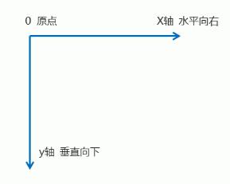

### transform：translate(x,y) —— 2D移动

```html
<!DOCTYPE html>
<html lang="zh">
    <head>
        <meta charset="UTF-8">
        <title>66666</title>
        <style>
            div {
                width: 200px;
                height: 200px;
                margin: 10px;
                background-color: coral;
            }
            /*移动X轴及Y轴*/
            .p1 {
                transform: translate(300px,100px);
            }
            /*仅移动X轴*/
            .p2 {
                transform: translateX(50px);
            }
            /*仅移动Y轴*/
            .p3 {
                transform: translateY(50px);
            }
        </style>
    </head>
    <body>
        <div class="p1">1</div>
        <div class="p2">2</div>
        <div class="p3">3</div>
    </body>
</html>
```

### transform：rotate(*angle*) —— 2D旋转

```html
<!DOCTYPE html>
<html lang="zh">
    <head>
        <meta charset="UTF-8">
        <title>66666</title>
        <style>
            img {
                width: 100px;
                margin: 50px;
            }
            /*顺时针旋转*/
            .p1 {
                transform: rotate(45deg);
            }
            /*逆时针旋转*/
            .p2 {
                transform: rotate(-45deg);
            }
        </style>
    </head>
    <body>
        
        
    </body>
</html>
```

### transform：scale(x,y) —— 2D缩放

```html
<!DOCTYPE html>
<html lang="zh">
    <head>
        <meta charset="UTF-8">
        <title>66666</title>
        <style>
            img {
                width: 100px;
                margin: 50px;
                transition: all 1s;
            }
            /*定义x，y倍数来进行缩放*/
            .p1:hover {
                transform: scale(2,0.5);
            }
            /*仅缩放x轴*/
            .p2:hover {
                transform: scaleX(2);
            }
            /*仅缩放y轴*/
            .p3:hover {
                transform: scaleY(0.2);
            }
        </style>
    </head>
    <body>
        
        
        
    </body>
</html>
```

### transform：2D —— 移动 旋转 缩放连写

```html
<!DOCTYPE html>
<html lang="zh">
    <head>
        <meta charset="UTF-8">
        <title>66666</title>
        <style>
            img {
                width: 100px;
                margin: 50px;
                transition: all 1s;
            }
            /*连写*/
            .p1:hover {
                transform: translate(100px,50px) rotate(45deg) scale(2,0.5);
            }
        </style>
    </head>
    <body>
        
    </body>
</html>
```

### transform：skew(x,y) —— 2D倾斜

```html
<!DOCTYPE html>
<html lang="zh">
    <head>
        <meta charset="UTF-8">
        <title>66666</title>
        <style>
            img {
                width: 200px;
                height: 200px;
                transition: all 1s linear;
            }
            /*定义沿着 X 和 Y 轴的 2D 倾斜转换*/
            .p1:hover {
                transform: skew(15deg,15deg);
            }
            /*定义沿着 X 轴的 2D 倾斜转换*/
            .p2:hover {
                transform: skewX(45deg);
            }
            /*定义沿着 Y 轴的 2D 倾斜转换*/
            .p3:hover {
                transform: skewY(45deg);
            }
        </style>
    </head>
    <body>
        
        
        
    </body>
</html>
```

# CSS 转换相关

### transform-origin —— 改变被转换元素的位置

```html
<!DOCTYPE html>
<html lang="zh">
    <head>
        <meta charset="UTF-8">
        <title>66666</title>
        <style>
            img {
                width: 100px;
                margin: 50px;
                transition: all 1s;
                transform-origin: left bottom;
            }
            /*改变元素中心*/
            .p1:hover {
                transform: rotate(45deg);
            }
        </style>
    </head>
    <body>
        
    </body>
</html>
```

### perspective(*n*) —— 为 3D 转换元素定义透视视图

```html
<!DOCTYPE html>
<html lang="zh">
    <head>
        <meta charset="UTF-8">
        <title>66666</title>
        <style>
            /*为3D的父元素加透视*/
            .p1 {
                perspective: 500px;
            }
            /*添加3D*/
            .p2 {
                width: 200px;
                height: 200px;
                margin: 10px;
                background-color: coral;
                transform: translate3d(100px,100px,50px);
            }
        </style>
    </head>
    <body>
        <div class="p1">
            <div class="p2">
            </div>
        </div>
    </body>
</html>
```

### transform-style —— 指定嵌套元素是怎样在三维空间中呈现

```html
<!DOCTYPE html>
<html lang="zh">
    <head>
        <meta charset="UTF-8">
        <title>66666</title>
        <style>
            /*主盒子添加三维空间呈现*/
            .p1 {
                margin: 100px auto;
                height: 300px;
                width: 300px;
                position: relative;
                perspective: 500px;
                transition: all 0.5s linear;
                transform-style: preserve-3d;
            }
            .p1 div {
                top: 0;
                left: 0;
                width: 100%;
                height: 100%;
                position: absolute;
                transition: all 0.5s linear;
            }
            /*1号子盒子*/
            .p2 {
                background-color: red;
            }
            /*2号子盒子*/
            .p3 {
                background-color: darkorange;
                transform: rotateX(60deg);
            }
            /*主盒子动作*/
            .p1:hover {
                transform: rotateY(100deg);
            }
        </style>
    </head>
    <body>
        <div class="p1">
            <div class="p2"></div>
            <div class="p3"></div>
        </div>
    </body>
</html>
```

# CSS 3D转换

### Web 三维坐标系

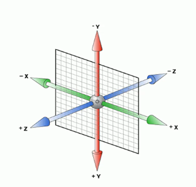

### transform：translate3d(*x*,*y*,*z*) —— 3D移动

```html
<!DOCTYPE html>
<html lang="zh">
    <head>
        <meta charset="UTF-8">
        <title>66666</title>
        <style>
            /*为3D的父元素加透视*/
            .p1 {
                perspective: 500px;
            }
            .p1 div {
                width: 200px;
                height: 200px;
                margin: 50px;
                background-color: coral;
            }
            /*添加 3D 移动*/
            .p2 {
                transform: translate3d(200px,0px,50px);
            }
            /*仅移动X轴*/
            .p3 {
                transform: translateX(300px);
            }
            /*仅移动Y轴*/
            .p4 {
                transform: translateY(-200px);
            }
            /*仅移动Z轴*/
            .p5 {
                transform: translateZ(-200px);
            }
        </style>
    </head>
    <body>
        <div class="p1">
            <div class="p2">1</div>
            <div class="p3">2</div>
            <div class="p4">3</div>
            <div class="p5">4</div>
        </div>
    </body>
</html>
```

### transform：rotate3d(*x*,*y*,*z*,*angle*) —— 3D 旋转

```html
<!DOCTYPE html>
<html lang="zh">
    <head>
        <meta charset="UTF-8">
        <title>66666</title>
        <style>
            body {
                perspective: 500px;
            }
            img {
                width: 100px;
                margin: 50px;
                transition: all 1s linear 0s;
            }
            /*沿 X 轴旋转*/
            .p1:hover {
                transform: rotateX(180deg);
            }
            /*沿 Y 轴旋转*/
            .p2:hover {
                transform: rotateY(180deg);
            }
            /*沿 Z 轴旋转*/
            .p3:hover {
                transform: rotateZ(180deg);
            }
            /*定义 X、Y、Z进行旋转*/
            .p4:hover {
                transform: rotate3d(2,1,1,180deg);
            }
        </style>
    </head>
    <body>
        
        
        
        
    </body>
</html>
```

### transform：scale3d(*x*,*y*,*z*) —— 3D缩放

```html
<!DOCTYPE html>
<html lang="zh">
    <head>
        <meta charset="UTF-8">
        <title>66666</title>
        <style>
            body {
                perspective: 500px;
            }
            img {
                width: 100px;
                margin: 50px;
                transition: all 1s;
            }
            /*定义x、y、Z倍数来进行缩放*/
            .p1:hover {
                transform: scale3d(2,2,2);
            }
            /*仅缩放x轴*/
            .p2:hover {
                transform: scaleX(2);
            }
            /*仅缩放y轴*/
            .p3:hover {
                transform: scaleY(0.2);
            }
            /*仅缩放Z轴*/
            .p4:hover {
                transform: scaleZ(0.2);
            }
        </style>
    </head>
    <body>
        
        
        
        
    </body>
</html>
```

# CSS 过渡

### transition-property —— 规定应用过渡的 CSS 属性的名称

### transition-duration —— 定义过渡效果花费的时间

```html
<!doctype html>
<html lang="zh">
    <head>
        <meta charset="UTF-8">
        <title>666</title>
        <style>
            div {
                /*过渡的 CSS 属性的名称*/
                transition-property:width;
                /*定义过渡效果花费的时间*/
                transition-duration: 3s;
                width: 50px;
                height: 50px;
                background-color: violet;
            }
            div:hover {
                width: 150px;
            }
        </style>
    </head>
    <body>
        <div></div>
    </body>
</html>
```

### transition-timing-function —— 规定过渡效果的时间曲线

```html
<!doctype html>
<html lang="zh">
    <head>
        <meta charset="UTF-8">
        <title>666</title>
        <style>
            div {
                transition-duration: 3s;
                width: 50px;
                height: 50px;
                background-color: violet;
                transition-property:width;
                margin: 20px;
            }
            div:hover {
                width: 200px;
            }
            /*默认值 规定慢速开始，然后变快，然后慢速结束的过渡效果*/
            .p1 {
                transition-timing-function: ease;
            }
            /*规定以相同速度开始至结束的过渡效果*/
            .p2 {
                transition-timing-function: linear;
            }
            /*规定以慢速开始的过渡效果*/
            .p3 {
                transition-timing-function: ease-in;
            }
            /*规定以慢速结束的过渡效果*/
            .p4 {
                transition-timing-function: ease-out;
            }
            /*规定以慢速开始和结束的过渡效果*/
            .p5 {
                transition-timing-function: ease-in-out;
            }
            /*定义自己的值，值为贝塞尔曲线*/
            .p6 {
                transition-timing-function: cubic-bezier(2,1,2,2);
            }
        </style>
    </head>
    <body>
        <div class="p1">1</div>
        <div class="p2">2</div>
        <div class="p3">3</div>
        <div class="p4">4</div>
        <div class="p5">5</div>
        <div class="p6">6</div>
    </body>
</html>
```

### transition-delay —— 指定何时将开始过渡效果

```html
<!doctype html>
<html lang="zh">
    <head>
        <meta charset="UTF-8">
        <title>666</title>
        <style>
            /*规定过渡效果何时开始*/
            div {
                transition-delay: 0.5s;
                transition-duration: 3s;
                width: 50px;
                height: 50px;
                background-color: violet;
                transition-property:width;
                margin: 20px;
                transition-timing-function: cubic-bezier(0,0,0.1,0.5);
            }
            div:hover {
                width: 200px;
            }
        </style>
    </head>
    <body>
        <div></div>
    </body>
</html>
```

### transition —— 过渡简写

```html
<!DOCTYPE html>
<html lang="zh">
    <head>
        <meta charset="UTF-8">
        <title>66666</title>
        <style>
            /*按照过渡属性名字、过渡时间、过渡时间曲线、过渡开始时间的顺序来定义*/
            img {
                width: 100px;
                margin: 50px;
                transition: all 1s linear 0s;
            }
            .p1:hover {
                transform: rotateX(180deg);
            }
        </style>
    </head>
    <body>
        
    </body>
</html>
```

# CSS 图像

### filter —— 图像滤镜

```html
<!doctype html>
<html lang="zh">
    <head>
        <meta charset="UTF-8">
        <title>666</title>
        <style>
            img {
                width: 100%;
            }
            /*blur：高斯模糊，值越大越模糊，单位(px)*/
            .p1 {
                filter: blur(5px);
            }
            /*brightness：线性乘数，调整图像明暗程度，单位(%)*/
            .p2 {
                filter: brightness(50%);
            }
            /*contrast：调整图像的对比度，单位(%)*/
            .p3 {
                filter: contrast(150%);
            }
            /*grayscale：转换为灰度图像，单位(%)*/
            .p4 {
                filter: grayscale(100%);
            }
            /*hue-rotate：图像应用色相旋转，单位(deg)*/
            .p5 {
                filter: hue-rotate(157deg);
            }
            /*invert：反转输入图像，单位(%)*/
            .p6 {
                filter: invert(100%);
            }
        </style>
    </head>
    <body>
        高斯模糊
        
        线性乘数 明暗调整
        
        图像对比度
        
        灰度图像
        
        色相旋转
        
        反转输入图像
        
    </body>
</html>
```

# CSS 函数

### attr( ) —— 返回选择元素的属性值

```html
<!doctype html>
<html lang="zh">
    <head>
        <meta charset="UTF-8">
        <title>666</title>
        <style>
            /*返回选择元素的属性值*/
            a:after {
                content: '(' attr(href) ')';
            }
        </style>
    </head>
    <body>
        <a href="http://baidu.com">百度的链接是：</a>
    </body>
</html>
```

### calc( ) —— 用于动态计算长度值

```html
<!doctype html>
<html lang="zh">
    <head>
        <meta charset="UTF-8">
        <title>666</title>
        <style>
            .p1 {
                width: 100%;
                height: 200px;
                background-color: pink;
            }
            /*动态计算长度值*/
            .p2 {
                width: calc(100% - 200px);
                height: 100px;
                background-color: red;
            }
        </style>
    </head>
    <body>
        <div class="p1">
            <div class="p2"></div>
        </div>
    </body>
</html>
```


# CSS 动画

### @keyframes —— 创建动画

```html
<!doctype html>
<html lang="zh">
    <head>
        <meta charset="UTF-8">
        <title>666</title>
        <style>
            div {
                width: 50px;
                height: 50px;
                background-color: greenyellow;
            }
            /*定义动作过程及样式变化*/
            @keyframes dong {
                0% {top:0px;}
                100% {top: 200px;}
            }
        </style>
    </head>
    <body>
        <div></div>
    </body>
</html>
```

### animation-name —— 为 @keyframes 动画指定一个名称

### animation-duration —— 动画完成一个周期所花费的时间

```html
<!doctype html>
<html lang="zh">
    <head>
        <meta charset="UTF-8">
        <title>666</title>
        <style>
            div {
                width: 50px;
                height: 50px;
                background-color: greenyellow;
                position:relative;
            }
            /*定义动作过程及样式变化*/
            @keyframes dong {
                0% {top:0px;}
                100% {top: 200px;}
            }
            div {
                /*设定动画的名称*/
                animation-name: dong;
                /*设定动画完成一个周期所花费的时间*/
                animation-duration: 2s;
            }
        </style>
    </head>
    <body>
        <div></div>
    </body>
</html>
```

### animation-iteration-count —— 定义动画应该播放多少次

```html
<!doctype html>
<html lang="zh">
    <head>
        <meta charset="UTF-8">
        <title>666</title>
        <style>
            div {
                width: 50px;
                height: 50px;
                background-color: greenyellow;
                position:relative;
            }
            /*定义动作过程及样式变化*/
            @keyframes dong {
                0% {left:0px;}
                100% {left: 200px;}
            }
            div {
                animation-name: dong;
                animation-duration: 2s;
            }
            /*定义动画应该播放多少次*/
            .p1 {
                animation-iteration-count: 2;
            }
            /*指定动画应该播放无限次*/
            .p2 {
                animation-iteration-count: infinite;
            }
        </style>
    </head>
    <body>
        <div class="p1"></div>
        <div class="p2"></div>
    </body>
</html>
```

### animation-timing-function —— 指定动画将如何完成一个周期

```html
<!doctype html>
<html lang="zh">
    <head>
        <meta charset="UTF-8">
        <title>666</title>
        <style>
            div {
                width: 50px;
                height: 50px;
                background-color: greenyellow;
                position:relative;
            }
            /*定义动作过程及样式变化*/
            @keyframes dong {
                0% {left:0px;}
                50% {left: 200px;}
                100% {left: 0px;}
            }
            div {
                animation-name: dong;
                animation-duration: 2s;
                animation-iteration-count: infinite;
            }
            /*默认值 动画以低速开始，然后加快，在结束前变慢*/
            .p1 {
                animation-timing-function: ease;
            }
            /*动画从头到尾的速度是相同的*/
            .p2 {
                animation-timing-function: linear;
            }
            /*动画以低速开始*/
            .p3 {
                animation-timing-function: ease-in;
            }
            /*动画以低速结束*/
            .p4 {
                animation-timing-function: ease-out;
            }
            /*动画以低速开始和结束*/
            .p5 {
                animation-timing-function: ease-in-out;
            }
            /*自定义贝塞尔曲线值*/
            .p6 {
                animation-timing-function: cubic-bezier(0,0,0.5,0.3);
            }
            /*自定义步长*/
            .p7 {
                animation-timing-function: steps(10);
            }
        </style>
    </head>
    <body>
        <div class="p1"></div>
        <div class="p2"></div>
        <div class="p3"></div>
        <div class="p4"></div>
        <div class="p5"></div>
        <div class="p6"></div>
        <div class="p7"></div>
    </body>
</html>
```

### animation-fill-mode —— 动画结束，将样式应用到元素上

```html
<!doctype html>
<html lang="zh">
    <head>
        <meta charset="UTF-8">
        <title>666</title>
        <style>
            div {
                width: 50px;
                height: 50px;
                background-color: greenyellow;
                position:relative;
            }
            /*定义动作过程及样式变化*/
            @keyframes dong {
                0% {left:0px;}
                100% {left: 200px;}
            }
            div {
                animation-name: dong;
                animation-duration: 2s;
                animation-iteration-count: 2;
            }
            /*动画完成样式应用*/
            .p1 {
                animation-fill-mode: forwards;
            }
        </style>
    </head>
    <body>
        <div class="p1"></div>
    </body>
</html>
```

### animation-delay —— 定义动画什么时候开始

```html
<!doctype html>
<html lang="zh">
    <head>
        <meta charset="UTF-8">
        <title>666</title>
        <style>
            div {
                width: 50px;
                height: 50px;
                background-color: greenyellow;
                position:relative;
            }
            /*定义动作过程及样式变化*/
            @keyframes dong {
                0% {left:0px;}
                100% {left: 200px;}
            }
            div {
                animation-name: dong;
                animation-duration: 2s;
                animation-iteration-count: 2;
            }
            /*定义动画什么时候开始*/
            .p1 {
                animation-delay: 0.8s;
            }
            /*可定义负数，跳过相应数*/
            .p2 {
                animation-delay: -0.2s;
            }
        </style>
    </head>
    <body>
        <div class="p1"></div>
        <div class="p2"></div>
    </body>
</html>
```

### animation-direction —— 定义动画是否在下一周期逆向地播放

```html
<!doctype html>
<html lang="zh">
    <head>
        <meta charset="UTF-8">
        <title>666</title>
        <style>
            div {
                width: 50px;
                height: 50px;
                background-color: greenyellow;
                position:relative;
            }
            /*定义动作过程及样式变化*/
            @keyframes dong {
                0% {left:0px;}
                100% {left: 200px;}
            }
            div {
                animation-name: dong;
                animation-duration: 2s;
                animation-iteration-count: infinite;
                animation-timing-function: linear;
            }
            /*默认值：normal 动画正常播放*/
            /*动画反向播放*/
            .p1 {
                animation-direction: reverse;
            }
            /*动画在奇数次正向播放，在偶数次反向播放*/
            .p2 {
                animation-direction: alternate;
            }
            /*动画在奇数次反向播放，在偶数次正向播放*/
            .p3 { 
                animation-direction:alternate-reverse;
            }
        </style>
    </head>
    <body>
        <div class="p1"></div>
        <div class="p2"></div>
        <div class="p3"></div>
    </body>
</html>
```

### animation-play-state —— 指定动画是否正在运行或已暂停

```html
<!doctype html>
<html lang="zh">
    <head>
        <meta charset="UTF-8">
        <title>666</title>
        <style>
            div {
                width: 50px;
                height: 50px;
                background-color: greenyellow;
                position:relative;
            }
            /*定义动作过程及样式变化*/
            @keyframes dong {
                0% {left:0px;}
                50% {left: 200px;}
                100% {left: 0px;}
            }
            div {
                animation-name: dong;
                animation-duration: 2s;
                animation-iteration-count: infinite;
                animation-timing-function: linear;
            }
            /*指定动画是否正在运行或已暂停*/
            div:hover {
                animation-play-state: paused;
            }
            /*paused:指定暂停动画*/
            /*running：指定运行动画*/
        </style>
    </head>
    <body>
        <div></div>
    </body>
</html>
```

### animation —— 简写所有动画属性的属性

```html
<!doctype html>
<html lang="zh">
    <head>
        <meta charset="UTF-8">
        <title>666</title>
        <style>
            div {
                width: 50px;
                height: 50px;
                background-color: greenyellow;
                position:relative;
            }
            /*定义动作过程及样式变化*/
            @keyframes dong {
                0% {left:0px;}
                50% {left: 200px;}
                100% {left: 0px;}
            }
            /*简写所有动画属性的属性*/
            /*以名称、动画时间、周期如何完成、动画启动延时、播放次数、动画是否反向、动画是否暂的顺序来定义*/
            div {
                animation: dong 2s infinite;
            }
        </style>
    </head>
    <body>
        <div></div>
    </body>
</html>
```

# CSS 浏览器私有前戳

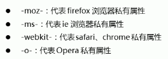

# CSS 移动端

# CSS 视口

### 布局视口

```apl
一般移动设备浏览器都默认设置了布局视口，iOS、Android都将这个视口分辨率设置为980px。
```

### 视觉视口

```apl
指用户能看到的网站的区域，可通过缩放操作，但不会影响布局视口
```

### 理想视口

```apl
为了使网站在移动端有最理想的浏览及阅读宽度为设定，需要手动添加 meta 视口标签通知浏览器操作。
```

### meta 视口标签

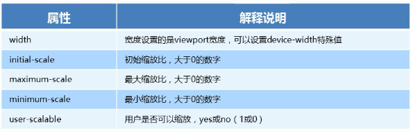

# CSS em

### em 使用

``` html
<!doctype html>
<html lang="zh">
    <head>
        <meta charset="UTF-8">
        <title>666666</title>
        <style>
            /*rm大小根据父元素字体大小来改变*/
            div {
                font-size: 16px;
            }
            p {
                width: 10em;
                height: 10em;
                background-color: pink;
            }
        </style>
    </head>
    <body>
        <div>
            <p></p>
        </div>
    </body>
</html>
```

# CSS rem

### rem 使用

```html
<!doctype html>
<html lang="zh">
    <head>
        <meta charset="UTF-8">
        <title>666666</title>
        <style>
            /*rem 是根据根元素html字体大小来定义的*/
            html {
                font-size: 12px;
            }

            p {
                width: 10rem;
                height: 10rem;
                background-color: pink;
            }
        </style>
    </head>
    <body>
        <div>
            <p></p>
        </div>
    </body>
</html>
```

# 媒体查询

```apl
@media mediatype and|not|only (media feature){
    css-Code
}
使用 @media 开头
mediatype 媒体类型
关键字 and|not|only
media feature 媒体特性 必须用小括号包裹
```

```html
<!doctype html>
<html lang="zh">
    <head>
        <meta charset="UTF-8">
        <title>666666</title>
        <style>
            /*屏幕小于等于设置值boby变色*/
            @media screen and (max-width: 800px) {
                body {
                    background-color: pink;
                }
            }
        </style>
    </head>
    <body>
    </body>
</html>
```

### 媒体关键字条件

```apl
not： not 运算符用于否定媒体查询，如果不满足这个条件则返回 true，否则返回 false
only：only 运算符仅在整个查询匹配时才用于应用样式，并且对于防止较早的浏览器应用所选样式很有用
and：and 操作符用于将多个媒体查询规则组合成单条媒体查询，当每个查询规则都为真时则该条媒体查询为真，它还用于将媒体功能与媒体类型结合在一起
```

### 媒体类型

```apl
all：用于所有设备
print：用于打印机和打印预览
screen：用于电脑屏幕，平板电脑，智能手机等
speech：应用于屏幕阅读器等发声设备
```

### 媒体特性

[媒体特性](https://www.runoob.com/cssref/css3-pr-mediaquery.html)

### 媒体切换

```apl
不同屏幕大小导入不同css
<link rel="stylesheet" href="css1.css" media="screen and (min-width:320px)">
<link rel="stylesheet" href="css2.css" media="screen and (min-width:640px)">
```

# viewport

### content

```html
<!doctype html>
<html lang="en">
    <head>
        <meta charset="UTF-8">
        <meta name="viewport"
              content="width=device-width,
                       user-scalable=no,
                       initial-scale=1.0,
                       maximum-scale=1.0,
                       minimum-scale=1.0">
        <!--宽度：设备的宽度-->
        <!--缩放：用户是否可以手动缩放-->
        <!--初始缩放比例：比例-->
        <!--最大缩放比例-->
        <!--最小缩放比例-->
        <meta http-equiv="X-UA-Compatible" content="ie=edge">
        <title>Document</title>
        <style>
            div {
                height: 50px;
                width: 50px;
                background-color: pink;
            }
        </style>
    </head>
    <body>
        <div></div>
    </body>
</html>
```

# flex 布局

```css
div {
    /*给父亲添加flex*/
    display: flex;
    width: 80%;
    height: 200px;
    background-color: pink;
}

div span {
    height: 50px;
    margin: 0 20px;
    background-color: red;
    /*控制子盒子*/
    flex: 1;
}
```

### flex - direction —— 规定灵活项目的方向

```css
div {
    display: flex;
    /*默认：从左到右排列*/
    flex-direction: row;
    /*从右到左排列*/
    flex-direction: row-reverse;
    /*从上到下排列*/
    flex-direction: column;
    /*从下到上排列*/
    flex-direction: column-reverse;
    width: 800px;
    height: 200px;
    background-color: pink;
}

div span {
    width: 50px;
    height: 50px;
    background-color: red;
}
```

### justify - content —— 用于设置或检索弹性盒子元素在主轴方向上的对齐方式

```css
div {
    display: flex;
    /*默认：从轴的起始位置开始排列*/
    justify-content: flex-start;
    /*从轴尾部开始排列*/
    justify-content: flex-end;
    /*居中排列*/
    justify-content: center;
    /*均匀排列每个元素，首个元素放置于起点，末尾元素放置于终点*/
    justify-content: space-between;
    /*均匀排列每个元素，每个元素之间的间隔相等*/
    justify-content: space-evenly;
    /*均匀排列每个元素，每个元素周围分配相同的空间*/
    justify-content: space-around;
    width: 800px;
    height: 200px;
    background-color: pink;
}

div span {
    width: 50px;
    height: 50px;
    background-color: red;
}
```

### flex - wrap —— 规定flex容器是单行或者多行，同时横轴的方向决定了新行堆叠的方向

```css
div {
    display: flex;
    /*默认：规定灵活的项目不拆行或不拆列*/
    flex-wrap: nowrap;
    /*规定灵活的项目在必要的时候拆行或拆列*/
    flex-wrap: wrap;
    /*规定灵活的项目在必要的时候拆行或拆列，但是以相反的顺序*/
    flex-wrap: wrap-reverse;
    width: 350px;
    height: 200px;
    background-color: pink;
}

div span {
    width: 100px;
    height: 50px;
    background-color: red;
}
```

### align - items —— 定义flex子项在flex容器的当前行的侧轴方向上的对齐方式

```css
div {
    display: flex;
    justify-content: center;
    flex-wrap: wrap;
    /*默认：元素被拉伸以适应容器*/
    align-items: stretch;
    /*元素位于容器的中心*/
    align-items: center;
    /*元素位于容器的开头*/
    align-items: flex-start;
    /*元素位于容器的结尾*/
    align-items: flex-end;
    /*元素位于容器的基线上*/
    align-items: baseline;
    width: 350px;
    height: 200px;
    background-color: pink;
}

div span {
    width: 100px;
    height: 50px;
    background-color: red;
}
```

### align - content —— 弹性容器内的各项没有占用交叉轴上所有可用的空间时对齐容器内的各项

```css
div {
    display: flex;
    /*justify-content: center;*/
    flex-wrap: wrap;
    /*默认：元素被拉伸以适应容器*/
    align-content: stretch;
    /*元素位于容器的中心*/
    align-content: center;
    /*元素位于容器的开头*/
    align-content: flex-start;
    /*元素位于容器的结尾*/
    align-content: flex-end;
    /*元素位于各行之间留有空白的容器内*/
    align-content: space-between;
    /*元素位于各行之前、之间、之后都留有空白的容器内*/
    align-content: space-around;
    width: 350px;
    height: 200px;
    background-color: pink;
}

div span {
    width: 100px;
    height: 50px;
    background-color: red;
}
```

### flex - flow —— 用于设置或检索弹性盒模型对象的子元素排列方式

```css
/*flex-direction 及 flex-wrap 复合写法*/
flex-flow: row wrap;
```

### order —— 设置或检索弹性盒模型对象的子元素出现的顺序

``` css
div {
    display: flex;
    width: 350px;
    height: 200px;
    background-color: pink;
}

.q1 {
    width: 50px;
    height: 50px;
    background-color: red;
}

.q2 {
    /*改变子元素排列顺序*/
    order: -1;
    flex: 1;
    height: 50px;
    background-color: bisque;
}

.q3 {
    width: 50px;
    height: 50px;
    background-color: aqua;
}
```

### flex —— 设置或检索弹性盒模型对象的子元素如何分配空间

```css
div {
    display: flex;
    width: 350px;
    height: 200px;
    background-color: pink;
}

.q1 {
    width: 50px;
    height: 50px;
    background-color: red;
}
/*占据份额*/
.q2 {
    flex: 1;
    height: 50px;
    background-color: bisque;
}

.q3 {
    width: 50px;
    height: 50px;
    background-color: aqua;
}
```

### align - self —— 定义flex子项单独在侧轴方向上的对齐方式

```css
div {
    display: flex;
    width: 350px;
    height: 200px;
    background-color: pink;
}

.q1 {
    width: 50px;
    height: 50px;
    background-color: red;
}

.q2 {
    flex: 1;
    /*元素被拉伸以适应容器*/
    align-self: stretch;
    /*元素位于容器的中心*/
    align-self: center;
    /*元素位于容器的开头*/
    align-self: flex-start;
    /*元素位于容器的结尾*/
    align-self: flex-end;
    /*元素位于容器的基线上*/
    align-self: baseline;
    height: 50px;
    background-color: bisque;
}

.q3 {
    width: 50px;
    height: 50px;
    background-color: aqua;
}
```


