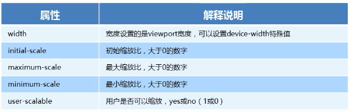
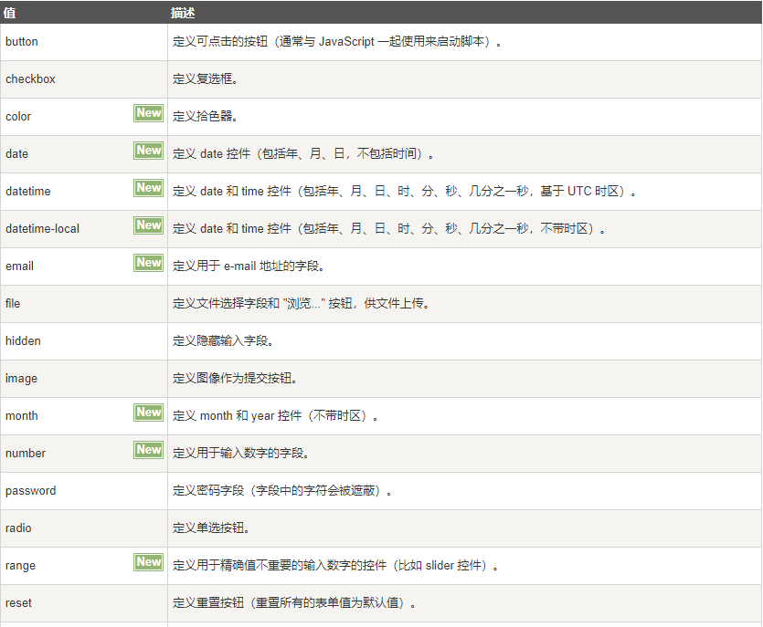
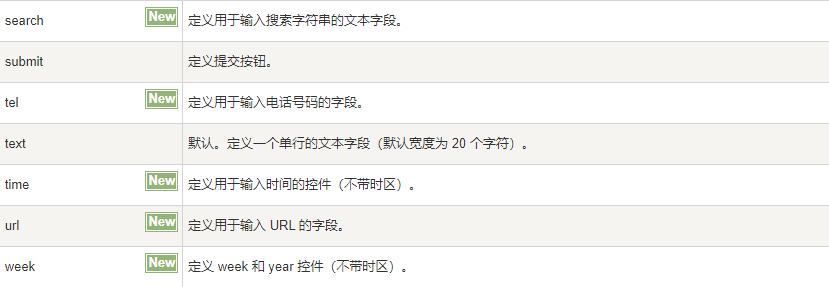

# HTML

### [HTML 链接](https://www.runoob.com/html/html-tutorial.html)

```HTML
<!DOCTYPE html>							# 声明为html文档
<html>									# 完整html页面起始
<head>									# 头部元素起始
<meta charset="utf-8">					# 定义网页编码格式
<title>菜鸟教程 (runoob.com) </title>	  # 描述文档的标题		 
</head>									# 头部元素结束
<body>									# 可见页面内容开始
 
<h1>我的第一个标题</h1>					# 定义标题
 
<p>我的第一个段落。</p>						# 定义段落
 
</body>									 # 可见页面内容结束
</html>									 # 完整html页面结束
```


# HTML标题	

### 通过h1 - h6 标签来定义

```HTML
<h1>这是一个标题</h1>
<h2>这是一个标题</h2>
<h3>这是一个标题</h3>
```

# HTML 水平线

### 在 HTML 页面中创建水平线

```HTML
<p>段落1</p>
<hr>
<p>段落2</p>
<hr>
<p>段落3</p>
```

# HTML 注释

### 将注释插入 HTML 代码中

```HTML
<!--注释 -->
```

# HTML段落

### 通过标签  p 来定义

```HTML
<p>这是一个段落。</p>
<p>这是另外一个段落。</p>
```

# HTML 格式化定义

### [文本格式化方法链接](https://www.runoob.com/html/html-formatting.html)

### 文本格式化标签

```HTML
<b>加粗文本</b><br><br>                     <!--加粗-->
<em>你好世界</em><br><br>                    <!--着重文本-->
<strong>定义加重语气</strong><br><br>         <!--加重语气-->
<small>定义小号字</small><br><br>            <!--小号字-->
<i>斜体文本</i><br><br>                     <!--斜体-->
<code>电脑自动输出</code><br><br>            <!--定义计算机代码-->
这是 <sub> 下标</sub> 和 <sup> 上标</sup><br><br>    <!--下标和上标-->
我是<s>删除线</s><br><br>                           <!--删除线-->
我是<u>下划线</u><br><br>                            <!--下划线-->
定义<ins>插入字</ins><br><br>                         <!--插入字-->	
```

# HTML 链接

### [链接方法链接](https://www.runoob.com/tags/tag-a.html)

### 通过标签 a 来定义

```html
<a href="https://www.runoob.com">这是一个链接</a>
<!--定义链接-->
<a href="#">空链接</a>
<!--空链接-->
```

### target —— 打开方式

```html
<a href="https://www.runoob.com" target="_self">这是一个链接</a>
<!--target 打开方式 _self 当前页面打开-->
<a href="https://www.runoob.com" target="_blank">这是一个链接</a>
<!--target 打开方式 _blank 新页面打开-->
```

### download —— 定义了下载链接的地址

```html
<a href="2.jpg" download="2.jpg"></a>
<!--指定文件名称-->
```

### 锚点链接

```HTML
<a href='#o' target="_self">这是一个锚点链接</a>
<!--通过设定ID来跳转到对应地方-->
<h3 id="o">跳到这来</h3>
```

# HTML 头部

### head —— 所有头部元素的容器

```html
<!doctype html>
<html lang="zh">
    <head>
    </head>
```

### meta —— 文档的元数据

```html
<!doctype html>
<html lang="zh">
    <head>
        <meta charset="UTF-8">
    </head>
```



### title —— 定义文档的标题

```html
<!doctype html>
<html lang="zh">
    <head>
        <meta charset="UTF-8">
        <title>哈哈哈哈</title>
    </head>
```

### link —— 定义文档与外部资源的关系

```html
<!doctype html>
<html lang="zh">
    <head>
        <meta charset="UTF-8">
        <title>哈哈哈哈</title>
        <link rel="stylesheet" href="HHHH.css">
    </head>
```

### style —— 定义 HTML 文档的样式信息

```html
<!doctype html>
<html lang="zh">
    <head>
        <meta charset="UTF-8">
        <title>哈哈哈哈</title>
        <style>

        </style>
    </head>
```

### script —— 用于定义客户端脚本

```html
<!doctype html>
<html lang="zh">
    <head>
        <meta charset="UTF-8">
        <title>哈哈哈哈</title>
        <script>

        </script>
    </head>
```

```html
<script src="myScript.js"></script>
```

# HTML 图像

### [img 图像属性链接](https://www.runoob.com/tags/tag-img.html)

### img —— 图像定义

```HTML

<!--路径,宽度,高度-->
```

### alt —— 规定图像的替代文本

```HTML

<!--图片异常显示不出来会显示alt文本-->
```

### title —— 鼠标放在图像上会显示文本

```HTML

<!--鼠标放在图像上会显示title文本-->
```

### berder —— 设定图片边框

```HTML

<!--berder设定图片边框-->
```

### loading —— 浏览器是应立即加载图像还是延迟加载图像

```html

<!--默认值：eager 图像立即加载-->

<!--lazy 图像延迟加载，只有鼠标滚动到该图片所在位置才会显示-->
```

# HTML 特殊字符

```HTML
讲&nbsp;&nbsp;&nbsp;&nbsp;究 <br>
<!--空格字符-->
&lt;&lt;讲究&gt;&gt; <br>
<!--小于号和大于号字符-->
讲&amp;&amp;&amp;&amp;究 <br>
<!--和号字符-->
&quot;&quot;讲究&quot;&quot; <br>
<!--引号字符-->
&apos;&apos;讲究&apos;&apos; <br>
<!--撇号字符-->
```

# HTML ID

```html
<a href="#1">锚点跳跃</a><br>
<a href="http://baidu.com" id="1">跳转到百度</a><br>
<p id="2">段落</p><br>

<!--设定ID-->
```

```HTML
<a href="#top">返回顶部</a>
<--返回顶部-->
```

# HTML 路径

+ 相对路径---同一级路径

```html

```

+ 相对路径---下一级路径

```html

```

+ 相对路径---上一级路径

```html

```

# HTML 换行

+ **通过标签</br>来定义**

```HTML
<p>这是第一个<br>段落。</p>
```

# HTML容器

+ **div------span**

```HTML
<div>这是一个大容器标签</div>        <!--大容器一行只能有一个-->
<span>这是小容器标签1</span>       <!--小容器数量无限制-->
<span>这是小容器标签2</span>
<!--div分区，span跨度跨距-->
```

# HTML 表格

### table —— 表格定义

```html
<table>
    <tr>
        <td>性别</td> <td>姓名</td> <td>年龄</td>
    </tr>
    <tr>
        <td>男</td> <td>刘佳辉</td> <td>24</td>
    </tr>
    <tr>
        <td>女</td> <td>毛羽</td> <td>23</td>
    </tr>
</table>
<!--table:表格标签定义表格-->
<!--tr:表格行标签定义行-->
<!--td:表格单元格标签定义单元格-->
```

### table —— 表格属性

```html
<table align="center" border="1" cellpadding="20" cellspacing="0" width="500">
<!--align:对齐方式  left:左对齐  canter:居中  right:右对齐-->
<!--border:定义是否有边框，1为有-->
<!--cellpadding:单元格文本到边框的距离，单位为像素-->
<!--cellspacing:单元格之间的距离，单位为像素-->
<!--width:列表宽度像素值或百分百-->
</table>
```

### th —— 表格中的表头单元格

```html
<tr>
    <th>性别</th> <th>姓名</th> <th>年龄</th>
</tr>
<!--th:表头单元格标签，表头单元格内文本会加粗并居中-->
```

### th - colspan —— 规定表头单元格可横跨的列数

```html
<table>
    <tr>
        <td colspan="3">222222222222233333333333333333</td>
    </tr>
    <tr>
        <td>男</td> <td>刘佳辉</td> <td>24</td>
    </tr>
    <tr>
        <td>女</td> <td>毛羽</td> <td>23</td>
    </tr>
</table>
```

### th - rowspan —— 规定表头单元格可横跨的行数

```html
<table>
    <tr>
        <td>1</td> <td>2</td> <td>3</td> <td rowspan="3">4</td>
    </tr>
    <tr>
        <td>男</td> <td>刘佳辉</td> <td>24</td>
    </tr>
    <tr>
        <td>女</td> <td>毛羽</td> <td>23</td>
    </tr>
</table>
```

# HTML 表格结构标签

+ **thead------tbody**

```html
<thead>
    ......
</thead>
<tbody>
    ......
</tbody>
<!--thead:表格头部区域标签-->
<!--tbody:表格主体区域-->
```

# HTML 表格合并单元格

```html
<tr>
    <td></td>
    <td colspan="2"></td>
    <!--colspan:跨列单元格-->
    <td rowspan="2"></td>
    <!--rowspan:跨行单元格-->
    <td></td>
    <td></td>
</tr>
<tr>
    <td></td>
    <td></td>
    <td></td>
    <td></td>
    <td></td>
</tr>
```

# HTML 列表

+ 无序列表

```html
<ul>
    <li>理论</li>
    <li>化学</li>
    <li>语文</li>
</ul>
<!--ul:定义无序列表-->
<!--li:列表列表项-->
```

+ 有序列表

```html
<ol>
    <li>语文</li>
    <li>数学</li>
    <li>英语</li>
</ol>
<!--ol:定义有序列表-->
<!--li:列表列表项-->
```

+ 自定义列表

```html
<dl>
    <dt>台晶宁波</dt>
    <dd>制作1部</dd>
    <dd>制作2部</dd>
    <dd>制作3部</dd>
</dl>
<!--dl:定义自定义列表-->
<!--dt:定义项目-->
<!--dd:项目项-->
```

# HTML 表单标签

### 表单域

```html
<form action="xxxxx" method="post" name="2333">
</form>
<!--action=url地址  method=提交方式 name=表单域名称-->
```

### input —— 输入表单域

### input  type 属性

```html
<form action="xxxxx" method="post" name="2333">
    用户名: <input type="text"> <br>
    <!--text：文本框-->
    密码： <input type="password"> <br>
    <!--password：隐藏密码框-->
    性别： 男 <input type="radio"> 女 <input type="radio"> 中 <input type="radio"> <br>
    <!--radio：单选按钮-->
    爱好： 吃饭 <input type="checkbox"> 睡觉 <input type="checkbox"> 打豆豆 <input type="checkbox"> <br>
    <!--checkbox：多选按钮-->
</form>
```

```html
<form action="xxxxx" method="post" name="2333">
    用户名: <input type="text" maxlength="6" name="name"> <br>
    <input type="submit" value="提交">
    <!--submit：提交按钮，将表单域元素值传输-->
    <input type="reset" value="重新填写">
    <!--reset：重置按钮，将表单域元素值全部恢复初始值-->
    <input type="button" value="发送验证信息"> <br>
    <!--button：普通按钮，搭配js 使用-->
    <input type="file" value="选择文件">
    <!--file：文件域，选择上传文件图像等等-->
</form>
```





### label —— 元素的标签

```html
<form>
    <label for="name"> 用户名： </label> <input type="text" id="name"> <br>
    <label for="mima"> 密码： </label> <input type="password" id="mima"> <br>
    性别：
    <label for="sex1">男</label> <input type="radio" name="sex" id="sex1">
    <label for="sex2">女</label> <input type="radio" name="sex" id="sex2"> 
    <label for="sex3">中性</label> <input type="radio" name="sex" id="sex3">
</form>
<!--label：for为指定id，点击标签也可激活对应表单元素-->
```

### select —— 下拉选项列表

```html
<select>
    <option selected>请选择</option>
    <option>地球</option>
    <option>水星</option>
    <option>谷神星</option>	
    <option>冥王星</option>
</select>
<!--select：定义下拉列表-->
<!--option：下拉列表选项-->
```

### textarea —— 定义文本域 (一个多行的输入控件)

```html
反馈：<br>
<textarea>
</textarea>
<!--textarea：定义文本域-->
```

### optgroup —— 把相关的选项组合在一起

```html
<!doctype html>
<html lang="zh">
    <head>
        <meta charset="UTF-8">
        <title>哈哈哈哈</title>
    </head>
    <body>
        <select>
            <optgroup label="20~30">
                <option value="">刘佳辉</option>
                <option value="">伍英贤</option>
            </optgroup>
            <optgroup label="30~50">
                <option value="">孙楠</option>
                <option value="">李浩勇</option>
            </optgroup>
        </select>
    </body>
</html>
```

### button —— 定义一个按钮

### [按钮属性链接](https://www.runoob.com/tags/tag-button.html)

```html
<!doctype html>
<html lang="zh">
    <head>
        <meta charset="UTF-8">
        <title>哈哈哈哈</title>
    </head>
    <body>
        <button type="button">点我!</button>
    </body>
</html>
```

# HTML 标签定义图形

### Canvas —— 图形容器，使用脚本来绘制图形

```html
<!doctype html>
<html lang="zh">
    <head>
        <meta charset="UTF-8">
        <title>哈哈哈哈</title>
        <style>
            canvas {
                border: 1px solid red;
            }
        </style>
    </head>
    <body>
        <!--创建一个画布，使用js绘画-->
        <canvas width="200" height="200">
        </canvas>
    </body>
</html>
```

# HTML 可缩放矢量图形

### SVG —— 定义为可缩放矢量图形

### [SVG 教程链接](https://www.runoob.com/svg/svg-tutorial.html)

# HMTL 音频

### [audio音频属性链接](https://www.runoob.com/tags/tag-audio.html)

### audio —— 定义音频

```html
<!doctype html>
<html lang="zh">
    <head>
        <meta charset="UTF-8">
        <title>哈哈哈哈</title>
    </head>
    <body>
        <audio src="333.mp3" autoplay="autoplay" controls="controls"></audio>
        </canvas>
    </body>
</html>
```

# HTML 视频

### [video视频属性链接](https://www.runoob.com/tags/tag-video.html)

### video —— 定义视频

```html
<!doctype html>
<html lang="zh">
    <head>
        <meta charset="UTF-8">
        <title>哈哈哈哈</title>
        <style>
            video {
                width: 100%;
            }
        </style>
    </head>
    <body>
        <video src="666.mp4" autoplay="autoplay" controls="controls"></video>
        </canvas>
    </body>
</html>
```

