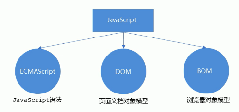
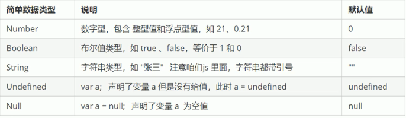
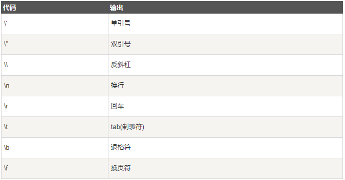

# JavaScript 

# JS 的组成



# JS 书写方式

### 行内式

```html
<!doctype html>
<html lang="zh">
    <head>
        <meta charset="UTF-8">
        <title>666666</title>
    </head>
    <body>
        <!--行内式JS-->
        <input type="button" value="刘佳辉" onclick="alert('王斌')">
    </body>
</html>
```

### 内嵌式

```html
<script>
    alert('沙漠骆驼')
</script>
```

### 外部式

```html
<!doctype html>
<html lang="zh">
    <head>
        <meta charset="UTF-8">
        <title>666666</title>
        <script src="233.js"></script>
    </head>
    <body>
    </body>
</html>
```

```js
alert('沙漠骆驼')
```

# JS 注释

```js
// 单行注释
/* 这个是
   多行注释
*/
```

# JS 变量

### var 变量声明赋值

```js
// 使用 var 声明
var age = 10;
```

```js
// 多重声明
var age = 2,
    name = 'nmd',
    a = 233;
```

```js
// 不声明即赋值会变成全局变量
age = 2;
```

### let 块级作用域变量

```js
let x = 2
// 块级作用变量
```

### const 常量

```js
const x = 3.14
// 声明常量不能更改
```

# JS 数据类型



### Number —— 数值类型

```js
// 创建数值类型变量
var a = 32,         // 整数
    b = 2.123,      // 浮动数
    c = 013,        // 八进制,以 0 开头来定义
    d = 0x1f;       // 十六进制，以 0x 开头来定义
// 输出变量值到控制台
console.log(a, b, c, d);
```

### String —— 字符串类型

```js
// 创建字符串类型变量
var a = '你好！',
    b = '222';
console.log(a);
```

```js
// 使用``反引号引入变量
var a = 23;
console.log(`我今年${a}岁了`);
```

### Boolean —— 布尔类型

```js
// 定义布尔类型变量
var a = false,
    b = true
console.log(a,b);
```

```js
// 布尔类型参加运算时
var a = false,
    b = true;
// false 为0
console.log(a + 0)
// true 为1
console.log(b + 0)
```

### Undefined —— 变量未定义类型

```js
// 仅定义变量未赋值及为 Undefined 意为未定义
var a;
console.log(a)
```

### Null —— 空值

```js
// 定义为空值
var a = null;
console.log(a)
// 可使用 null 来清空变量
```

### Array —— 数组

```js
// 定义数组，类似python列表
var a =[];
var a =new Array();
```

```js
// 访问数组元素，通过索引下标访问
var a = [1,2,3,4,5,6];
console.log(a[2])
```

### object —— 对象

```js
// 使用字面量创建对象
var a= {
    uname :'哈哈哈',
    age:12,
    sex:'男',
    hh:function (){
        console.log(1);
    }
}
console.log(a.age)
```

```js
var a= {
    uname :'哈哈哈',
    age:12,
    sex:'男',
    hh:function (){
        console.log(1);
    }
}
// 使用对象名['属性名']
console.log(a['sex'])
```

```js
var a= {
    uname :'哈哈哈',
    age:12,
    sex:'男',
    hh:function (){
        console.log(1);
    }
}
// 调用对象的方法
a.hh()
```

```js
// 使用Object创建对象
var a = new Object();
a.age = 12;
a.sa = '那么';
```

# JS 字面量

### 一般固定值称为字面量

### 数值（Number）字面量

```apl
# 可以是整数或者是小数，或者是科学计数(e)
3.14
1001
123e5
```

### 字符串（String）字面量

```apl
# 可以使用单引号或双引号
"John Doe"
'John Doe'
```

### 表达式字面量

```apl
5 + 6
5 * 10
```

### 数组 (Array) 字面量

```js
[]
```

# 数组解构

```js
// 提取数组的值赋值
let add = [1,2,3]
let [a,b,c] = add
console.log(a,b,c) 
```

# 对象解构

```js
// 提取对象的值赋值
let per = {uname:'lisi',age:30,sex:'男'}
let {uname,age,sex} = per
console.log(uname,age,sex)
```

```js
// 提取对象的值赋值
let per = {uname:'lisi',age:30,sex:'男'}
let {uname:name} = per
console.log(name)
```

# JS 转义符



# JS 数据类型转换

```js
// 转换数据类型
var a = 233;
console.log(a,typeof a)
a = a.toString()
console.log(a,typeof a)
```

```js
// 隐式转换
var a = 233;
console.log(a, typeof a)
a = a + ''
console.log(a, typeof a)
```

# JS 运算符

### 算数运算符

```js
// 加法运算
console.log(1 + 1);
// 减法运算
console.log(2 - 1);
// 乘法运算
console.log(2 * 2);
// 除法运算
console.log(10 / 2);
// 取模运算
console.log(3 % 2);

var a = 2;
// 前置自增，先自增再输出
console.log(++a);
// 后置自增，先输出再自增
console.log(a++);

var b = 2;
// 前置自减，先自减再输出
console.log(--b)
// 后置自减，先自减再输出
console.log(b--)
```

### 比较运算符

```js
// 等于
console.log(1 == 1);
console.log(1 == 2);
console.log(1 == '1');
// 绝对等于(值和类型均等于)
console.log(1 === 1);
console.log(1 === '1');
// 不等于
console.log(1 != 1);
console.log(1 != 2);
console.log(1 != '1');
// 绝对不等于(值和类型有一个不相等，或两个都不相等)
console.log(1 !== 1);
console.log(1 !== 2);
console.log(1 !== '1');
// 大于
console.log(1 > 1);
console.log(2 > 1);
// 大于等于
console.log(1 >= 1);
console.log(1 >= 2);
// 小于
console.log(1 < 1);
console.log(1 < 2);
// 小于等于
console.log(1 <= 1);
console.log(1 <= 2);
```

### 逻辑运算符

```js
var a = 2,
    b = 2;
// 逻辑与
console.log(a < 3 && b > 1);
console.log(a < 2 && b > 1);
console.log(a < 3 && b > 2);
// 逻辑或
console.log(a < 1 || b > 1);
console.log(a < 3 || b > 3);
console.log(a < 3 || b > 1);
console.log(a < 2 || b > 3);
// 逻辑非
console.log(!true)
console.log(!false)
```

### 逻辑运算中断

```js
// 逻辑与：逻辑运算为表达式时，第一个表达式为True是则直接返回第二个表达式，为False则第一个
console.log(123 && 456);
console.log(0 && 21);
// 逻辑或：如果第一个表示式为True则返回第一个表达式，为False则返回第二个
console.log(123 || 456);
console.log(0 || 213);
```

### 赋值运算符

```js
var a;
// 等于
console.log(a = 10);
// 加等于
console.log(a += 1);
// 减等于
console.log(a -= 1);
// 乘等于
console.log(a *= 2);
// 除等于
console.log(a /= 2);
// 取模等于
console.log(a % 4);
```

### 条件运算符

```js
// 变量 = (条件) ? 值1:值2
var a = Number(prompt('请输入年龄'))
var b = (a<18)? '年级有点小':'年级有点大'
alert(b)
```

### 位运算符

```js
// 按位与
console.log(5 & 1);
// 按位或
console.log(5 | 1);
// 按位取反
console.log(~5);
// 按位异或
console.log(5 ^ 1);
// 按位左移
console.log(5 << 1);
// 按位右移
console.log(5 >> 1);
```

# JS 流程控制

### if...else 分支

```js
var a = Number(prompt('请输入数值'));
if (a > 18) {
    alert('以成年')
} else {
    alert('未成年')
}
```

### if...else if...else 分支

```js
var a = Number(prompt('请输入数值'));
if (a > 18 && a < 50) {
    alert('以成年')
} else if (a > 50) {
    alert('过半了')
} else {
    alert('未成年')
}
```

### switch 分支

```js
var a = Number(prompt('请输入'))
switch (a) {
    case 1:
        alert('未成年')
        break
    case 2:
        alert('青壮年')
        break
    case 3:
        alert('后半生')
        break
    default:
        alert('你那的')
}
```

### for 循环

```js
for (初始化变量; 条件表达式; 操作表达式) {
    循环体
}
```

```js
for (var i = 0; i <= 100; i++) {
    console.log(`${i}`)
}
```

### for in 循环

```js
for (输出变量 in 受遍历变量){
    遍历输出
}
```

```js
var a = [1,2,3,4,1,31,3,131,31,2]
for (x in a){
    alert(x)
}
```

### while 循环

```js
var a = prompt('请输入循环次数');
var i = 0;
while (i <= a) {
    console.log(a);
    i++;
}
```

### do ... while 循环

```js
var a = prompt('请输入循环次数');
var i = 0;
do {
    alert(i);
    i++;
}while (i<a);
```

### break 跳出循环

```js
var a = Number(prompt('请输入'))
switch (a) {
    case 1:
        alert('未成年')
        break
    case 2:
        alert('青壮年')
        break
    case 3:
        alert('后半生')
        break
    default:
        alert('你那的')
}
```

### continue 跳过循环迭代

```js
for (var i =0 ;i <10;i++){
    if (i == 3){
        continue
    }
    alert(i)
}
```

# JS 函数

### 函数定义及调用

```js
var a = prompt('请输入循环次数');
// 函数定义
function age(num){
    for (var i=1;i<=num;i++){
        console.log(i)
    }
}
// 函数调用
age(a)
```

### 函数返回值

```js
function age(a, b) {
    return a * b;
}
var y = age(2,3)
console.log(y)
```

```js
function age(a, b) {
    return a * b;
}
console.log(age(2,2))
```

### 函数隐式参数

```js
function age() {
    console.log(arguments[2])
}
age(1,2,3,4)
```

### 函数相互调用

```js
function age() {
    console.log(1)
    age1()
}
function age1(){
    console.log(2)
}
age()
```

### 匿名函数

```js
// 定义匿名函数
var a = function (){
    console.log(1)
}
```

### 构造函数

```js
// 定义构造函数
function Fack(uname, age, sex, hhh) {
    this.uname = uname;
    this.age = age;
    this.sex = sex;
    this.sing = function (hhh) {
        console.log(hhh);
    }
}

// 调用赋值构造函数
var a = new Fack('刘德华', 18, '男');
var b = new Fack('周星驰', 21, '男');
console.log(a, b)
console.log(a.sex, b.uname, a.uname);
a.sing(21)
```

### 自调用函数

```js
// 定义
(function () {
    console.log(1)
})();
// 使用优先符包裹函数，再加优先符调用
```

### 表达式函数

```js
// 定义
function a(a, b) {
    return a * b
}
var b = a(2, 2) * 2
console.log(b)
```

### 箭头函数

```js
// 定义
const x = (a, b) => a * b;
console.log(x(2,2 ))
```

# JS 作用域

### 全局变量

```js
var a = 0;
function age(){
    console.log(a)
}
age()
```

### 局部变量

```js
function age(){
    var a = 0;
    console.log(a)
}
age()
// 在外边作用域调用局部变量会失败
console.log(a)
```

### 函数内定义全局变量

```js
function age() {
    // 去掉var来定义全局变量
    a = 0;
    console.log(a)
}
age()
console.log(a)
```

# JS 预解析

```apl
js预解析时会将所有的 var 和 函数 提示到当前作用域最前面
——————————————————————————————————————————————————
变量预解析：
将所有的变量声明提升，但是不赋值
函数预解析：
将所有函数声明提升，但是不调用
```

# JS 面向对象

### 类创建

```js
class Ace{
    
}
var x = new Ace()
```

### 类 — 构造函数 — constructor

```js
class Ace{
    // 构造函数
    constructor(uname) {
        this.uname = uname
    }
}
var x = new Ace('刘佳辉')
console.log(x.uname)
```

### 类 — 方法

```js
class Ace{
    constructor(uname) {
        this.uname = uname
    }
    // 添加方法
    HO(song){
        console.log(this.uname + '你好')
        console.log('你的作品是：' + song)
    }
}
var x = new Ace('刘佳辉')
x.HO('冰雨')
```

### 类 — 继承 —— extends

```js
class Ace{
    constructor(uname) {
        this.uname = uname
    }
    HO(song){
        console.log(this.uname + '你好')
        console.log('你的作品是：' + song)
    }
}
// 定义子类
class Bce extends Ace {
}
var a = new Bce('刘德华')
console.log(a.uname)
```

### 类 — 调用父类函数 — super

```js
class Ace{
    constructor(uname) {
        this.uname = uname
    }
    HO(song){
        console.log(this.uname + '你好')
        console.log('你的作品是：' + song)
    }
}
class Bce extends Ace {
    constructor(uname) {
        // 调用父类构造函数
        super(uname)
    }
}
var a = new Bce('刘德华')
a.HO('冰雨')
```

```js
class Ace{
    HO(){
        return '我是父类'
    }
}
class Bce extends Ace {
    HO() {
        console.log('我是子类')
    }
}
class Cce extends Ace{
    HO(){
        // 调用父类普通函数
        console.log(super.HO())
    }
}
var a = new Bce(),
    b = new Cce();
a.HO()
b.HO()
```

# JSON 

```apl
轻量级的文本数据交换格式
```

### 对象

```apl
对象可以包含多个 key/value（键/值）对
key 必须是字符串，value 可以是合法的 JSON 数据类型（字符串, 数字, 对象, 数组, 布尔值或 null）
```

```js
var a = {
    'name':'刘佳辉',
    'age':19,
    'sex':'男'
}
console.log(a.age)
```

### 数组

```js
var a = {
    'name':'刘佳辉',
    'age':19,
    'fenzhu':['刘佳辉','孙楠']
}
console.log(a.fenzhu[1])
```

### JSON.parse（）—— 将数据转换为 JavaScript 对象

```js
var b = JSON.parse('{"name":"刘佳辉","age":19,"fenzhu":["刘佳辉","孙楠"]}')
console.log(b)
```

### JSON.stringfy（）—— 将JavaScript对象转换为JSON数据 

```js
var a = {
    'name':'刘佳辉',
    'age':19,
    'fenzhu':['刘佳辉','孙楠']
}
var b = JSON.stringify(a)
console.log(b)
```

# 同步与异步

### promise

```apl
promise 三状态
pending：{待定}初始状态
fulfilled：{实现}操作成功
rejected：{拒绝}操作失败
```

### then —— 正常执行序列

```js
// resolve, reject形参有变化时就会触发then
var prom = new Promise(function (resolve, reject) {
    resolve('abc')
})
// resolve 变化then获取形参并执行
prom.then(function (res) {
    console.log(res)
})
// reject 变化则报错
var prod = new Promise(function (resolve, reject) {
    reject('abc')
})
prod.then(res => {
})
```

### catch —— 异常处理序列

```js
// resolve, reject形参有变化时就会触发then
var prom = new Promise(function (resolve, reject) {
    reject('abc')
})

prom.then(function (res) {
    console.log(res)
    // 异常处理序列
}).catch(res => {
    console.log(res)
})
```

### promise.all —— promise集合

```js
// 异步处理集合
let p1 = new Promise((resolve, reject) => {
    resolve('成功了')
})
let p2 = new Promise((resolve, reject) => {
    resolve('哈哈哈')
})
let p3 = Promise.reject('失败了')
// 成功返回结果数值
Promise.all([p1, p2]).then(res => {
    console.log(res)
}).catch(red => {
    console.log(red)
})
// 失败返回最先失败的值
Promise.all([p1, p2, p3]).then(res => {
    console.log(res)
}).catch(red => {
    console.log(red)
})
```

### promise.race —— promise 赛跑

```js
// 异步处理赛跑
let p1 = new Promise((resolve, reject) => {
    // 延时
    setTimeout(() => {
        resolve('成功了')
    }, 1000)
})
let p2 = new Promise((resolve, reject) => {
    setTimeout(() => {
        reject('失败了')
    }, 500)
})
// 返回第一个结果，不论成功与否
Promise.race([p1, p2]).then(res => {
    console.log(res)
}).catch(red => {
    console.log(red)
})
```

### async —— 包装为promise对象

```js
console.log(1)
// 与promise等效
async function f1() {
    return 'abc'
}
// 为pronise对象
console.log(f1())
console.log(3)
```

### await —— promise响应

```js
async function f1() {
    return 10
}

async function f2() {
    let a = await f1()
    // 阻塞后方代码
    console.log(a)
}
f2()
```


