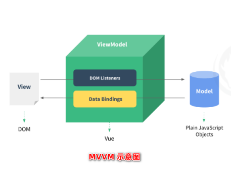
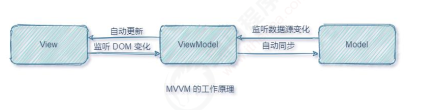
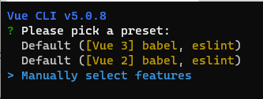
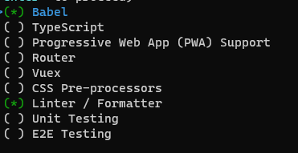
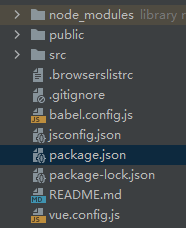
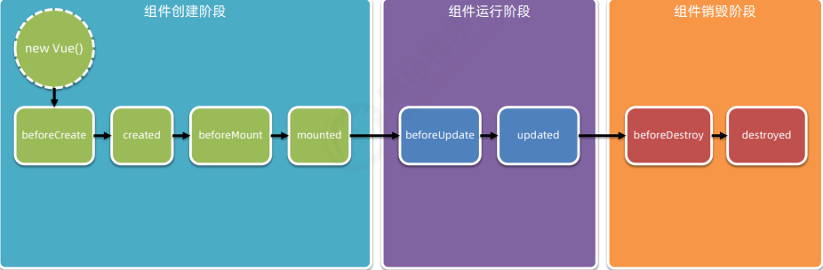

### Vue特性

```apl
数据驱动视图
双向数据绑定
```

### MVVM

```apl
MVVM 是 vue 实现数据驱动视图和双向数据绑定的核心原理
指的是 Model、View 和 ViewModel
```

```apl
Model 表示当前页面渲染时所依赖的数据源
View 表示当前页面所渲染的 DOM 结构
ViewModel 表示 vue 的实例，它是 MVVM 的核心
```



### MVVM 工作原理

```apl
当数据源发生变化时，会被 ViewModel 监听到，VM 会根据最新的数据源自动更新页面的结构
当表单元素的值发生变化时，也会被 VM 监听到，VM 会把变化过后最新的值自动同步到 Model 数据源中
```



### Vue实例化

```html
<div id="app">
    {{ m }}
</div>
<script src="js/vue2.js"></script>
<script>
    // 实例化
    var a = new Vue({
        // 连接选择器
        el:'#app',
        // 要渲染的数据
        data:{
            m:'Hello Vue!'
        }
    })
</script>
```

### 文本插值表达式

```html
<div id="app">
    <!--文本插值表达式-->
    {{ message }}
</div>
```

### 指令数据绑定

```html
<div id="app">
    <!--更新元素，覆盖原有元素-->
    <p v-text="m"></p> 
</div>
<script src="js/vue2.js"></script>
<script>
    var a = new Vue({
        el: '#app',
        data: {
            m: 'Hello Vue?'
        }
    })
</script>
```

```html
<div id="app">
    <!--更新元素，解析HTML元素-->
    <p v-html="m"></p>
</div>

<script src="js/vue2.js"></script>
<script>
    var a = new Vue({
        el: '#app',
        data: {
            m: '<a href="http://baidu.com">百度链接</a>'
        }
    })
</script>
```

### 指令属性绑定

```html
<div id="app">
<!--绑定属性-->
<input type="text" v-bind:placeholder="mm">
<!--简写-->
<input type="text" :placeholder="mm">
<!--拼接-->
<input type="text" :placeholder="'序列' + mi">
<!--动态属性名-->
<input type="text" :[dd]="mm">
</div>
<script src="js/vue2.js"></script>
<script>
var a = new Vue({
  el: '#app',
  data: {
    mm: '请输入!',
    mi: 3,
    dd: 'placeholder'
  }
})
</script>
```

### 事件绑定指令及修饰符

```html
<div id="app">
    <p> {{ mm }}</p>
    <!--绑定事件，自动函数名-->
    <button v-on:click="add">+1</button>
    <button v-on:click="bdd">-1</button>
    <!--简写 v-on-->
    <button @click="cdd">输出</button>
</div>
<script src="js/vue2.js"></script>
<script>
    var a = new Vue({
        el: '#app',
        data: {
            mm: 0
        },
        // 定义事件的处理函数
        methods: {
            add: function () {
                // 指向自身实例化对象
                this.mm++
            },
            // 简写
            bdd() {
                a.mm--
            },
            cdd() {
                console.log(this.mm)
            }
        }
    })
</script>
```

```html
<div id="app">
    <p> {{ mm }}</p>
    <!--传参-->
    <button v-on:click="add(2)">+</button>
    <!--动态传参-->
    <button v-on:click="bdd(mm)">+</button>
</div>
<script src="js/vue2.js"></script>
<script>
    var a = new Vue({
        el: '#app',
        data: {
            mm: 0
        },
        methods: {
            add(n) {
                this.mm += n
            },
            bdd(n) {
                this.mm += n
            }
        }
    })
</script>
```

```html
<div id="app">
    <p> {{ mm }}</p>
    <button @click="add">+N</button>
    <!--直接定义处理过程-->
    <button @click="mm--">-N</button>
</div>
<script src="js/vue2.js"></script>
<script>
    var a = new Vue({
        el: '#app',
        data: {
            mm: 0
        },
        methods: {
            add: function () {
                this.mm++
            }
        }
    })
</script>
```

```html
<div id="app">
    <p> {{ mm }}</p>
    <button @click="add">+N</button>
    <!--直接定义处理过程-->
    <button @click="mm--">-N</button>
    <!--默认传参event,但是会被传参覆盖-->
    <button @click="bdd">++</button>
    <!--自带event-->
    <button @click="cdd(1,$event)">--</button>
</div>
<script src="js/vue2.js"></script>
<script>
    var a = new Vue({
        el: '#app',
        data: {
            mm: 0
        },
        methods: {
            add() {
                this.mm++
            },
            // 默认传参 event
            bdd(e) {
                e.target.style.backgroundColor = 'red'
            },
            cdd(n, e) {
                console.log(n)
                console.log(e)
            }
        }
    })
</script>
```

```html
<div id="app">
    <!--事件修饰符:阻止默认行为-->
    <a href="http://baidu,com" @click.prevent="add">点</a>
    <hr>
    <div style="height: 50px;background-color: coral" @click="add">
        <!--阻止冒泡-->
        <button @click.stop="bdd">阻止冒泡</button>
    </div>
</div>
<script src="js/vue2.js"></script>
<script>
    var a = new Vue({
        el: '#app',
        methods: {
            add() {
                console.log('我是div')
            },
            bdd() {
                console.log('我是按钮我阻止冒泡')
            }
        }
    })
</script>
```

```html
<div id="app">
    <!--按键修饰符，特定按钮触发-->
    <input type="text" @keyup.esc="add">
</div>
<script src="js/vue2.js"></script>
<script>
    var a = new Vue({
        el: '#app',
        methods: {
            add() {
                console.log('返回')
            }
        }
    })
</script>
```

### 双向数据绑定指令

```html
<div id="app">
    <!--同步数据-->
    <p>{{ mm }}</p>
    <!--双向数据绑定-->
    <input type="text" v-model="mm">
    <hr>
    <!--同步-->
    <select v-model="di">
        <option value="">请选择</option>
        <option>刘佳辉</option>
        <option>孙楠</option>
        <option>李浩勇</option>
    </select>
    <p>选择了：{{ di }}{{ d }}</p>
    <hr>
    <!--清除输入空白-->
    <input type="text" v-model.trim="dd">
    <button @click="Ace">输出ID</button>
</div>
<script src="js/vue2.js"></script>
<script>
    var a = new Vue({
        el: '#app',
        data: {
            // 同步修改
            mm: '刘佳辉',
            di: '',
            d: '',
            dd: ''
        },
        methods: {
            Ace(e) {
                console.log(`ID:${this.dd}`)
            }
        }
    })
</script>
```

### 判断指令

```html
<div id="app">
    <!--为false删除元素-->
    <p v-if="fing">我是v-if控制的元素</p>
    <!--为false隐藏元素-->
    <p v-show="fing">我是v-show控制的元素</p>
    <button @click="Ace">切换</button>
    <hr>
    <!--分支判断-->
    <div v-if="fin == 'A'">优秀</div>
    <div v-else-if="fin == 'B'">良好</div>
    <div v-else-if="fin == 'C'">一般</div>
    <div v-else>差</div>
</div>
<script src="js/vue2.js"></script>
<script>
    var a = new Vue({
        el: '#app',
        data: {
            fing: true,
            fin: 'A'
        },
        methods: {
            Ace() {
                this.fing = !this.fing
                console.log(this.fing)
            }
        }
    })
</script>
```

```html
<div id="app">
    <table>
        <thead>
        <th>索引</th>
        <th>ID</th>
        <th>姓名</th>
        </thead>
        <tbody>
        <!--形参1为遍历到的对象，形参2为当前索引-->
        <!--in后为数组对象形式数据-->
        <tr v-for="(i,ind) in list" :key="i.id"> <!--使用for必须定义key，防止被自动移除-->
            <td>{{ ind }}</td>
            <td>{{ i.id }}</td>
            <td>{{ i.uname }}</td>
        </tr>
        </tbody>
    </table>
</div>
<script src="js/vue2.js"></script>
<script>
    var a = new Vue({
        el: '#app',
        data: {
            // 要渲染的数据，以数值对象的形式
            list: [
                {id: 1, uname: '张三'},
                {id: 2, uname: '李四'},
                {id: 3, uname: '王五'}
            ]
        },
        methods: {}
    })
</script>
```

### 指令基本用法

```html
<!doctype html>
<html lang="zh" xmlns:v-bind="http://www.w3.org/1999/xhtml">
    <head>
        <meta charset="UTF-8">
        <title>666666</title>
        <style>
            * {
                margin: 0;
                padding: 0;
            }

            body {
                padding: 10px;
            }

            .css1 {
                border: 1px solid black;
                padding: 10px 10px;
            }

            .css2 {
                border-top: none;
                border-bottom: none;
            }

            .css3 {
                background-color: rgba(225, 233, 238, 0.95);
                padding: 0 10px;
                border-radius: 10px 0 0 10px;
                display: inline-block;
                box-sizing: border-box;
            }

            .css4 {
                height: 32px;
                line-height: 32px;
                padding: 1px;
                box-sizing: border-box;
                position: relative;
            }

            .css5 {
                height: 100%;
                box-sizing: border-box;
                position: absolute;
                top: 1px;
                border: 1px solid black;
                border-left: none;
                padding-left: 4px;
            }

            .css6 {
                color: aliceblue;
                height: 100%;
                padding: 0 10px;
                position: absolute;
                left: 260px;
                background-color: rgba(0, 119, 255, 0.93);
                border: none;
                border-radius: 10px;
            }

            table, th, td {
                border: 1px solid black;
                border-collapse: collapse;
                box-sizing: border-box;
            }

            table {
                width: 100%;
                text-align: left;
            }

            th, td {
                padding: 4px 5px;
            }

            .q p {
                float: right;
                position: relative;
                top: -1px;
                right: 20px;
            }
        </style>
    </head>

    <body>
        <div id="app">
            <p class="css1">添加品牌</p>
            <div class="css1 css2">
                <div class="css4">
                    <span class="css3">品牌名称</span>
                    <input type="text" placeholder="请输入品牌名称" class="css5" v-model.lazy="tj">
                    <button class="css6" @click="tian">添加</button>
                </div>
            </div>
            <div>
                <table>
                    <thead>
                        <th>#</th>
                        <th>品牌名称</th>
                        <th>状态</th>
                        <th>创建时间</th>
                        <th>操作</th>
                    </thead>
                    <tbody>
                        <tr v-for="i in list" :key="i.id">
                            <td>{{ i.id }}</td>
                            <td>{{ i.uname }}</td>
                            <td>
                                <div class="q">
                                    <input type="checkbox" class="css7" v-model="i.fing">
                                    <p class="css7" v-if="i.fing">已启用</p>
                                    <p class="css7" v-else>已禁用</p>
                                </div>
                            </td>
                            <td>{{ i.time }}</td>
                            <td><a href="javascript:;" @click="re(i.id)">删除</a></td>
                        </tr>
                    </tbody>
                </table>

            </div>
        </div>


        <script src="js/vue2.js"></script>
        <script>
            var a = new Vue({
                el: '#app',
                data: {
                    // 要渲染的数据，以数值对象的形式
                    list: [
                        {id: 1, uname: '宝马', fing: false, time: new Date()},
                        {id: 2, uname: '奥迪', fing: false, time: new Date()},
                        {id: 3, uname: '劳斯莱斯', fing: false, time: new Date()}
                    ],
                    tj: '',
                    shu: 4
                },
                methods: {
                    // 删除按钮
                    re(id) {
                        this.list = this.list.filter(function (ti) {
                            return ti.id != id;
                        })
                    },
                    tian() {
                        if (this.tj != '') {
                            this.list.push({id: this.shu, uname: this.tj, fing: false, time: new Date()})
                            this.shu++
                        } else {
                            alert('未输入品牌名称')
                        }
                    }
                }
            })
        </script>


    </body>
</html>
```

### 过滤器

 ```html
 <div id="app">
     <!--使用管道符指定处理函数-->
     {{ mm | Abc }}
     <!--将处理过的返回值渲染-->
 </div>
 <div id="app1">
     <!--可调用多个过滤器-->
     {{ mm | Abc }}
 </div>
 <script src="js/vue2.js"></script>
 <script>
     // 定义全局过滤器函数
     // 参数1为过滤器名字，参数2为处理函数
     Vue.filter('Abc', function (val) {
         return val.toUpperCase()
     })
     var a = new Vue({
         el: '#app',
         data: {
             mm: 'hello vue！'
         },
         // 此为私有过滤器
         // 声明过滤器处理函数
         filters: {
             // 默认会将管道符前值当做形参获取
             Abc(val) {
                 // 过滤器函数必须有返回值
                 return val.toUpperCase()
             }
         }
     })
     var b = new Vue({
         el: '#app1',
         data: {
             mm: 'hello python'
         }
     })
 </script>
 ```

### 侦听器

```html
<div id="app">
    <input type="text" v-model="mm">
    <input type="text" v-model="ni">
    <input type="text" v-model="mi.io">
</div>
<script src="js/vue2.js"></script>
<script>
    var a = new Vue({
        el: '#app',
        data: {
            mm: '',
            ni: 'main',
            mi: {
                io: 'di'
            }
        },
        // 侦听属性
        watch: {
            // 形参1为新值，形参2为旧值
            mm(xi, jiu) {
                console.log('这个是新值：' + xi)
                console.log('这个是旧值：' + jiu)
            },
            // 以对象形式创建
            ni: {
                handler(xi, jiu) {
                    console.log(xi, jiu)
                },
                // 监听开始就触发一次
                immediate: true
            },
            mi: {
                handler(xi) {
                    console.log(xi)
                },
                // 对象内的属性变化也可触发
                deep: true
            },
            // 单独监听个别属性
            'mi.io'(xi) {
                console.log(xi)
            }
        }
    })
</script>
```

### 计算属性

```html
<div id="app">
    <input type="text" v-model="r">
    <input type="text" v-model="g">
    <input type="text" v-model="b">
    <input type="button" @click="Ace" value="输出RBG">
    <!--调用-->
    <div style="width: 200px;height: 200px" :style="{backgroundColor:rgb}">
        {{ rgb }}
    </div>
</div>

<script src="js/vue2.js"></script>
<script>
    var a = new Vue({
        el: '#app',
        data: {
            r: 255,
            g: 21,
            b: 21
        },
        methods: {
            Ace() {
                console.log(this.rgb)
            }
        },
        // 声明计算属性
        computed: {
            rgb() {
                return `rgb(${this.r},${this.g},${this.b})`
            }
        }
    })
</script>
```

### vue-cli 使用

```apl
vue -V		
可查看vue版本

vue create 名称  
创建项目

选择要创建的vue项目版本，或自定义功能
```



```apl
Babel:兼容性
TupeScript:微软脚本
Progressive Web App (PWA) Support:渐进式web框架
Router:路由
Vuex:vue状态管理模式
CSS Pre-processors: CSS 预处理器
Linter / Formatter: 代码严格模式
Unit Testing: 单元测试
E2E Testing: 集成测试
```



```apl
cd demo
进入项目

npm run serve
启动服务器，运行项目
```

### vue-cli 项目结构

```apl
node_modules：npm 加载的项目依赖模块
public：静态资源，全局配置文件
src/assets：内部静态文件存放目录
src/components：项目公共组件存放目录
src/router：配置路由
```



### vue 主入口

```js
// 导入 vue 包 定义Vue构造函数
import Vue from 'vue'
// 导入 app.vue 根组件
import App from './App.vue'

// vue 在启动时生成生产提示
Vue.config.productionTip = false

// 实例化Vue
new Vue({
  // 把 函数 指定的组件，渲染到html页面
  render: h => h(App),
  // 挂载到指定的位置
}).$mount('#app')
```

### vue 组件化开发

```apl
vue 组件由 3 部分构成
template -> 组件的模板结构
script -> 组件的 JavaScript 行为
style -> 组件的样式
```

```vue
<!--组件html结构-->
<template>
  <h1>App.vue 组件</h1>
</template>
<!--组件js代码-->
<script>
export default {
  // 属性由对象形式变为函数对象形式
  data(){
    return {
    }
  }
}
</script>
<!--组件CSS-->
<style>
</style>
```

### vue 组件结合

##### 私有组件

```vue
<template>
  <div>
    <h1>Holle vue</h1>
    <!--  以标签形式使用注册好的组件-->
    <left></left>
  </div>
</template>
<script>
// 导入组件
import left from '@/components/HelloWorld.vue'
export default {
  // 注册组件
  components:{
    left
  }
}
</script>
```

##### 全局组件

```js
import Vue from 'vue'
import App from './App.vue'
// 在主入口导入
import helloWorld from '@/components/HelloWorld'
// 注册全局
Vue.component('Myhello',helloWorld)

Vue.config.productionTip = false

new Vue({
  render: h => h(App),
}).$mount('#app')
```

### 自定义属性

```vue
<script>
export default {
  // 自定义属性，创建组件的时候赋值
  props: ['init'],
  // 只读值
  data() {
    return {
      com: this.init
    }
  }
}
</script>
```

```vue
<script>
export default {
  props: {
    init: {
      // 自定义属性，默认传入值的默认值
      default: 2,
      // 期望类型
      type: Number,
      // 是否必填
      required: true
    }
  },
  data() {
    return {
      com: this.init
    }
  }
}
</script>
```

### 样式独立

```vue
<!--添加scoped防止样式冲突-->
<style scoped>
</style>
```

### 样式穿透

```vue
<style scoped>
/*穿透样式*/
/deep/ p {
  color: red;
}
</style>
```

### 组件生命周期函数



```vue
<template>
  <div>
    <!--实例化-->
    <add v-if="fing"></add>
    <!--销毁切换按钮-->
    <button @click="fing = !fing">切换状态</button>
  </div>
</template>
<script>
export default {
  data() {
    return {
      fing: true
    }
  }
}
</script>
<style scoped>
</style>
```

```vue
<template>
  <div>
    <p>{{ com }}</p>
    <button @click="com++">+1</button>
  </div>
</template>
<script>
export default {
  props: {
    init: {
      default: 2
    },
  },
  data() {
    return {
      mm: 'Hello',
      com: 2
    }
  },
  methods: {
    Ace() {
      console.log(this.mm)
    }
  },
  // 组件创建阶段
  // 第一阶段：所有对象还未创建，无意义
  beforeCreate() {
    console.log(this.mm)
  },
  // 第二阶段：props、data、methods属性可调用
  created() {
    console.log(this.mm)
  },
  // 第三阶段：即将渲染HTML结构
  beforeMount() {
    let a = document.querySelector('p');
    console.log(a)
    // 此时为NULL
  },
  // 第四阶段：HTML结构以渲染
  mounted() {
    let a = document.querySelector('p');
    console.log(a)
    // 此时可操作 DOM
  },
  // 组件运行阶段
  // 第一阶段：数据变化准备开始重新渲染数据
  beforeUpdate() {
    let a = document.querySelector('p');
    console.log('渲染前的值' + a.innerHTML)
  },
  // 第二阶段：以完成数据的重新渲染
  updated() {
    console.log('重新渲染的值' + this.com)
  },
  // 组件销毁阶段
  // 第一阶段：即将销毁，还在工作状态
  beforeDestroy() {
    console.log('即将销毁，值为' + this.com)
  },
  // 第二阶段：组件以销毁，DOM以不存在
  destroyed() {
    console.log('以销毁')
  }
}
</script>
```


### 组件数据共享

##### 父子数据共享

```vue
<template>
  <div>
    <!--向子组件发生数据-->
    <add :init="23" @addd="Bce"></add>
    <!--@监听子组件自定义事件触发-->
    <!--接收子组件的值-->
    <p>{{ hhh }}</p>
  </div>
</template>
<script>
export default {
  data() {
    return {
      // 接收子组件的值
      hhh: 0
    }
  },
  methods: {
    // 子组件事件触发，获得子组件传参
    Bce(val) {
      this.hhh = val
    }
  }
}
</script>
```

```vue
<template>
  <div>
    <!--接收父组件数据，或默认数据，不能直接修改-->
    <p>{{ init }}</p>
    <p>{{ fing }}</p>
    <button @click="Ace">增加</button>
  </div>
</template>
<script>
export default {
  // 自定义属性接收父组件传递的值
  props: ['init'],
  data() {
    return {
      // 传向父组件的值
      fing: 1
    }
  },
  methods: {
    Ace() {
      this.fing++;
      // 定义自定义事件，并传参
      this.$emit('addd', this.fing)
    }
  }
}
</script>
```

##### 兄弟数据共享

```js
import Vue from 'vue'
// 中转对象
export default new Vue()
```

```vue
<template>
  <div>
    <p>我是add</p>
    <p>我发生的是{{ mm }}</p>
    <button @click="Ace">点击发生给兄弟值</button>
  </div>
</template>
<script>
// 导入中转对象
import Bus from '@/Bus'

export default {
  data() {
    return {
      mm: 0
    }
  },
  methods: {
    // 定义发生事件
    Ace() {
      this.mm++
      Bus.$emit('fa1', this.mm)
    }
  }
}
</script>
```

```vue
<template>
  <div>
    <p>我是dda</p>
    <p>我接收的值是{{ pp }}</p>
  </div>
</template>

<script>
// 导入中转对象
import Bus from '@/Bus'

export default {
  data() {
    return {
      pp: 0
    }
  },
  // 定义事件监控
  created() {
    Bus.$on('fa1', val => {
      this.pp = val
    })
  }
}
</script>
```

### ref 引用

```vue
<template>
  <div>
    <!--定义DOM引用-->
    <h1 ref="myh1">app根组件</h1>
    <hr>
    <button @click="Ace">输出this</button>
    <button @click="Bce">添加颜色</button>
  </div>
</template>
<script>
export default {
  methods: {
    Ace() {
      // refs 默认指向空
      console.log(this)
    },
    Bce() {
      // 输出指向 DOM 对象
      console.log(this.$refs.myh1)
      // 操作 DOM
      this.$refs.myh1.style.color = 'red'
    }
  }
}
</script>
```

### ref 组件间引用

```vue
<template>
  <div>
    <add ref="myadd"></add>
    <!--父组件的重置-->
    <button @click="Ace">父组件的重置</button>
  </div>
</template>
<script>
export default {
  methods: {
    Ace() {
      // 引用子组件实例
      this.$refs.myadd.mm = 0
    }
  }
}
</script>
```

```vue
<template>
  <div>
    <p>{{ mm }}</p>
    <button @click="mm++">+1</button>
    <button @click="mm = 0">子组件的重置</button>
  </div>
</template>
<script>

export default {
  data() {
    return {
      mm: 0
    }
  }
}
</script>
```

### 生命周期回调函数

```vue
<template>
  <div>
    <input type="text" v-if="fing" @blur="fing = !fing" ref="myin">
    <button v-else @click="Ace">显示输入框</button>
  </div>
</template>
<script>
export default {
  data() {
    return {
      fing: false
    }
  },
  methods: {
    Ace() {
      this.fing = !this.fing
      // 不能直接使用
      // this.$refs.myin.focus()
      this.$nextTick(() => {
        this.$refs.myin.focus()
      })
    }
  }
}
</script>
```

### 动态组件

```vue
<template>
  <div>
    <!--component:定义动态元素-->
    <component :is="hh"></component>
    <!--is:指定一个已注册的组件-->
    <!--并销毁原有的组件-->
    <button @click="hh = 'add'">展示app</button>
    <button @click="hh = 'bdd'">展示bdd</button>
  </div>
</template>
<script>

export default {
  data() {
    return {
      // 指定组件
      hh: 'add'
    }
  }
}
</script>
```

```vue
<!--动态组件缓冲-->
<keep-alive>
    <component :is="hh"></component>
<!--不会直接删除，组件数据也会保留-->
</keep-alive>
```

### 动态组件缓冲生命周期函数

```vue
<script>
export default {
  data() {
    return {
      com: 0
    }
  },

  activated() {
    console.log('组件激活了')
  },
  deactivated() {
    console.log('组件缓冲了')
  }
}
</script>
```

### 动态组件缓冲属性

```vue
<!--定义缓冲的对象-->
<keep-alive include="bdd,add">
    <component :is="hh"></component>
</keep-alive>
```

```vue
<!--定义排除缓冲的对象-->
<keep-alive exclude="add,bdd">
    <component :is="hh"></component>
</keep-alive>
<!--两属性不能同时使用-->
```

### 插槽

```vue
<template>
  <div>
    <h1>APP根组件</h1>
    <!--未定义插槽站位符-->
    <add><p>hhhh</p></add>
    <bdd>
      <!--定义了插槽占位符-->
      <template v-slot:add_chao>
        <!--使用slot指定插槽名称-->
        <!--如果使用name指定，必须使用template包裹-->
        <p>gggg</p>
      </template>
      <!--slot简写#-->
      <template #add1_chao>
        <p>aaaa</p>
      </template>
    </bdd>
  </div>
</template>
```

```vue
<template>
  <div>
    <p>我是B组件</p>
    <!--插槽占位符,插槽必须有name名称-->
    <slot name="add_chao"></slot>
    <!--如果指定了插槽但未定义内容则显示后背内容-->
    <slot name="add1_chao">这是xx插槽的默认内容</slot>
  </div>
</template>
```

### 具名插槽

```vue
<template>
  <add>
    <!--具名插槽-->
    <template v-slot:app1>
      <h3>静夜思</h3>
    </template>
    <template #app2>
      <div>
        <p>啊！大海！全是水！</p>
        <p>啊！辣椒！净辣嘴！</p>
      </div>
    </template>
    <template #app3>
      <p>作者：赵果果</p>
    </template>
  </add>
  <!---->
</template>
```

```vue
<template>
  <div>
    <div class="q1">
      <slot name="app1"></slot>
    </div>
    <div class="q2">
      <slot name="app2"></slot>
    </div>
    <div class="q3">
      <slot name="app3"></slot>
    </div>
  </div>
</template>
<script>
export default {}
</script>
<style scoped>
.q1 {
  background-color: aquamarine;
}

.q2 {
  background-color: antiquewhite;
}

.q3 {
  background-color: darkcyan;
}

div > div {
  height: 50px;
  color: red;
  text-align: center;
}
</style>
```

### 作用域插槽

```vue
<template>
  <add>
    <!--接收插槽的属性对象-->
    <template #app1="use">
      {{ use }}
    </template>
  </add>
</template>
```

```vue
<template>
  <div>
    <div class="q1">
      <!--可定义属性传给使用插槽的地方-->
      <slot name="app1" :us="us"></slot>
    </div>
  </div>
</template>
<script>
export default {
  data() {
    return {
      us: {
        uanme: 'zs',
        age: 23
      }
    }
  }
}
</script>
```

### 自定义指令

##### 私有自定义指令

```vue
<template>
  <!--使用自定义属性并接受传参-->
  <div>
    <div v-color="color">
      123123
    </div>
    <div v-colors="color">
      456456
    </div>
    <button @click="color='blue'">改变颜色</button>
  </div>
</template>
<script>
export default {
  data() {
    return {
      color: 'coral'
    }
  },
  // 私有自定义指令节点
  directives: {
    // 定义自定义指令
    color: {
      // 绑定DOM元素实例对象
      // bind：只会调用一次
      bind(el, data) {
        console.log(data)
        el.style.color = data.value
      },
      // 在DOM更新时调用
      update(el, data) {
        el.style.color = data.value
      }
    },
    // 在 bind 和 update功能相同时可简写
    colors(el, data) {
      el.style.color = data.value
    }
  }
}
</script>
```

##### 全局自定义指令

```js
// 定义全局自定义指令
Vue.directive('color', {
    bind(el, data) {
        el.style.color = data.value
    },
    update(el, data) {
        el.style.color = data.value
    }
})
// 定义全局自定义指令简写
Vue.directive('colors', function (el, data) {
    el.style.color = data.value
})
```

```vue
<template>
  <!--使用自定义属性并接受传参-->
  <div>
    <div v-color="color">
      123123
    </div>
    <div v-colors="color">
      456456
    </div>
    <button @click="color='blue'">改变颜色</button>
  </div>
</template>
<script>
export default {
  data() {
    return {
      color: 'coral'
    }
  }
}
</script>
```

### 路由

```apl
Hash 地址与组件之间的对应关系
```

##### 基础路由

```js
import Vue from 'vue'
import App from './App.vue'
import shuliang from '@/components/shuliang'
import kuang from '@/components/kuang'
import daohang from '@/components/daohang'

Vue.config.productionTip = false
Vue.component('A', shuliang)
Vue.component('B', kuang)
Vue.component('C', daohang)

new Vue({
    render: h => h(App),
}).$mount('#app')
```

```vue
<template>
  <div>
      <!--定义不同链接的哈希值-->
    <a href="#/A">主</a>
    <a href="#/B">副1</a>
    <a href="#/C">副2</a>
      <!--动态变化哈希-->
    <component :is="com"></component>
  </div>
</template>
<script>
export default {
  data() {
    return {
      com: 'A'
    }
  },
  created() {
      // 检测哈希值的变化
    window.onhashchange = () => {
        // 读取当前哈希值
      if (location.hash == '#/A') {
        this.com = 'A'
      } else if (location.hash == '#/B') {
        this.com = 'B'
      } else if (location.hash == '#/C') {
        this.com = 'C'
      } else {
        null
      }
    }
  }
}
</script>
<style scoped>
a {
  padding: 10px;
}
</style>
```

##### vue - router 路由库

+ main.js

```js
import Vue from 'vue'
import App from './App.vue'
// 导入main
import index from '@/router/index'

Vue.config.productionTip = false

new Vue({
    render: h => h(App),
    // 挂载
    router: index
}).$mount('#app')
```

+ index.js

```js
// 导入依赖包
import Vue from 'vue'
import VueRouter from 'vue-router'
// 导入组件
import shuliang from '@/components/shuliang'
import kuang from '@/components/kuang'
import daohang from '@/components/daohang'
// 将路由安装为Vue插件
Vue.use(VueRouter)
// 创建路由实例对象
const router = new VueRouter({
    // 定义哈希地址与组件的对应关系
    routes: [
        // 哈希地址：组件
        {path: '/A', component: shuliang},
        {path: '/B', component: kuang},
        {path: '/C', component: daohang},
    ]
})
// 共享路由实例对象
export default router
```

+ Add.vue

```vue
<template>
  <div>
    <a href="#/A">主</a>
    <a href="#/B">副1</a>
    <a href="#/C">副2</a>
    <hr>
    <!--router 路由占位符-->
    <router-view></router-view>
  </div>
</template>
```


