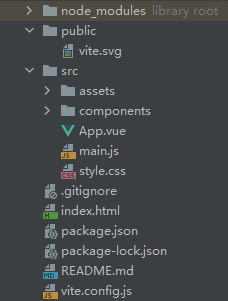

### vue 3 过滤器

```apl
vue 3 中浏览器已被移除弃用
```

### vite 使用

```apl
创建项目		   项目名称
npm init vite@latest main -- --template vue
————————————————————————————————————————————
进入项目目录
cd main
安装依赖
npm install
运行项目
npm run dev
```

### vite 项目结构

```apl
node_modules：npm 加载的项目依赖模块
public：静态资源目录
src/assets：内部静态文件存放目录
src/components：项目公共组件存放目录
src/router：配置路由
App.vue：项目根组件
style.css：全局样式表
index:项目页面
package.json:项目包管理
```



### vue 3 组合式 API

```apl
使用 setup
逻辑不再分开写
```

### vue 3 运行

+ main.js

```js
// 导入 createApp 函数实例化
import {createApp} from 'vue'
// 导入全局样式
import './style.css'
// 导入根组件
import App from './App.vue'
// 实例化应用实例
const app = createApp(App)
// 挂载组件
app.mount('#app')
```

+ App.vue —— reactive 响应式

```vue
<template>
  <!--可定义多个根组件了-->
  <h2>{{ com.count }}</h2>
  <button @click="add">++</button>
</template>
<script>
// 导入 reactive 来创建响应式对象
// 适用于 对象 数组 集合
import {reactive} from 'vue'

export default {
  // setup 是组合式API的特殊钩子函数
  setup() {
    // 使用常量及 reactive 函数来定义响应
    const com = reactive({count: 0})

    // 方法也定义到一起
    function add() {
      com.count++
    }

    // 将响应对象暴露到模板
    return {
      com,
      add
    }
  }
}
</script>
<style scoped>
</style>
```

+ App.vue —— ref 响应式

```vue
<template>
  <h2>{{ com.cont }}</h2>
  <h2>{{ com.bar }}</h2>
  <button @click="add">++</button>
</template>
<script setup>
// 导入 ref 实例对象
// 适用于 任意类型
import {ref} from 'vue'

const com = {
  // 使用 ref 创建响应式
  cont: ref(0),
  bar: ref(1)
}

function add() {
  // 使用 .value 改变值
  com.cont.value++
  com.bar.value++
}

</script>
<style scoped>
</style>
```

+ index.html

```html
<!DOCTYPE html>
<html lang="en">
  <head>
    <meta charset="UTF-8" />
    <link rel="icon" type="image/svg+xml" href="/vite.svg" />
    <meta name="viewport" content="width=device-width, initial-scale=1.0" />
    <title>666666</title>
  </head>
  <body>
    <!--容器-->
    <div id="app"></div>
    <!--导入主js-->
    <script type="module" src="/src/main.js"></script>
  </body>
</html>
```

### vue 3 根节点

```apl
vue 3 取消唯一根节点，可定义多个根节点
```

### vue 3 双向数据绑定

```apl
vue 3 更改为使用Proxy进行代理
```

### setup 语法糖

```vue
<template>
  <h2>{{ com.count }}</h2>
  <button @click="add">++</button>
</template>
<!--添加setup后无需手动暴露对象-->
<script setup>
import {reactive} from 'vue'

const com = reactive({count: 0})

function add() {
  com.count++
}

</script>
<style scoped>
</style>
```

### vue 3 全局组件注册

```js
import {createApp} from 'vue'
import './style.css'
import App from './App.vue'
// 导入组件
import m1 from './components/m1.vue'
// 实例化对象添加全局组件
const app = createApp(App)
// vue 3 中组件名称需添加 — 分隔，避免使用未来的HTML标签名命名
app.component('my-m1',m1)

app.mount('#app')
```

### vue 3  样式穿透

```vue
<style scoped>
:deep(div){
  color: red;
}
</style>
```

### vue 3 路由

```js
// 引入js
import {createRouter,createWebHashHistory} from 'vue-router'
// 引入组件
import Home from '/src/views/home.vue'


// 定义路由
const routes = [
    {path:'/',component:Home}
]

// 创建路由实例并定义路由配置
const router = createRouter({
    history:createWebHashHistory(),
    routes,
})
// 导出
export default router
```

```js
// 导入main
import router from './router/index.js'
const app = createApp(App)

app.mount('#app')
// 将路由安装为Vue插件
app.use(router)
// 挂载到主页面
app.mount('router')
```

# vue3

### vue3 基本结构

```vue
<template>
  <!--vue组件根节点-->
  <div>
    <!--插值表达式-->
    {{ i + 4 }}
  </div>
</template>

<script setup lang="ts">
// vue3 使用 setup语法糖
const i: number = 1;
</script>

<style scoped>

</style>
```

# vue3指令

### v-text

```vue
<template>
  <!--插入指定变量-->
  <div v-text="i">
  </div>
</template>

<script setup lang="ts">
const i: string = "我是一段文字"
</script>

<style scoped>

</style>
```

### v-html

```vue
<template>
  <!--插入指定html字符-->
  <div v-html="i">
  </div>
</template>

<script setup lang="ts">
const i: string = "<h1 style='color: rebeccapurple'>我是一段文字</h1>"
</script>

<style scoped>

</style>
```

### v-if

```vue
<template>
  <!--为true展示节点,false删除节点-->
  <div v-if="i">
    ture
  </div>
</template>

<script setup lang="ts">
const i: boolean = true
</script>

<style scoped>

</style>
```

### v-else

```vue
<template>
  <div v-if="i">
    ture
  </div>
  <div v-else>
    false
  </div>
</template>

<script setup lang="ts">
const i: boolean = false
</script>

<style scoped>

</style>
```

### v-else if

```vue
<template>
  <div v-if="i === 'A'">
    1
  </div>
  <div v-else-if="i === 'B'">
    2
  </div>
  <div v-else>
    3
  </div>
</template>

<script setup lang="ts">
const i: string = 'B'
</script>

<style scoped>

</style>
```

### v-show

```vue
<template>
  <!--为true展示节点,false隐藏节点-->
  <div v-if="i">
    ture
  </div>
</template>

<script setup lang="ts">
const i: boolean = false
</script>

<style scoped>

</style>
```

### v-on

```vue
<template>
  <!--触发指定时间-->
  <button v-on:click="bnt">点击我</button><br/>
  <!--简写-->
  <button @click="bnt">点击我</button><br/>
  <!--动态-->
  <button @[event].stop="bnt">点击我</button>
  <!--stop : 阻止冒泡-->
</template>

<script setup lang="ts">
// 动态修改事件
const event = 'click'
const bnt = () => {
  console.log("点击了")
}
</script>

<style scoped>

</style>
```

### v-bind

```vue
<template>
  <!--绑定属性-->
  <div v-bind:id="id">
    演示v-bind
  </div>
  <!--简化-->
  <div :class="['a']">
    简化
  </div>
</template>

<script setup lang="ts">
const id: string = '123'
</script>

<style scoped>
.a {
  color: pink;
}
</style>
```

### v-model

```vue
<template>
  <div>
    <!--数据绑定-->
    <input v-model="a" type="text">
    <div>{{ a }}</div>
  </div>
</template>

<script setup lang="ts">
import {ref} from "vue";
// 响应式
const a = ref('小白')
</script>

<style scoped>
</style>
```

### v-for

```vue
<template>
  <div>
    <!--遍历-->
    <div v-for="item in arr">
      {{ item }}
    </div>
    <!--索引-->
    <div :key="index" v-for="(item,index) in arr">
      <!--key防止内容重复自动优化-->
      {{ index }} - {{ item }}
    </div>
  </div>
</template>

<script setup lang="ts">
const arr: string[] = ['小满', '中满', '大满']
</script>

<style scoped>
</style>
```

### v-once

```vue
<template>
  <div v-once>
    v-once 中的值只会渲染一次
  </div>
</template>

<script setup lang="ts">
</script>

<style scoped>
</style>
```

### v-memo

```vue
 <template>
  <div v-memo="[]">
    v-memo 如果是空数组和v-once功能相同
  </div>
  <div v-for="item in arr" v-memo="[item === 2]">
    <!--条件成立跳过更新-->
    {{ item }}
  </div>
</template>

<script setup lang="ts">
const arr = [1, 2, 3]
</script>

<style scoped>
</style>
```

# ref - 响应

```vue
<template>
  <div>
    <div>{{ user }}</div>
    <button @click="bnt">
      点击修改
    </button>
  </div>
</template>

<script setup lang="ts">
// 响应
import {ref, isRef} from "vue";

type M = {
  // 定义类型
  name: string
  age: number
}
// 也可自动类型推导
const user = ref<M>({name: "小满", age: 23})
const bnt = () => {
  user.value.age = 33
  // 判断是否为ref对象
  console.log(isRef(user))
}

</script>

<style scoped>
</style>
```

# reactive - 响应

```vue
<template>
  <div>
    <form>
      <input v-model="form.name" type="text"/>
      <br>
      <input v-model="form.age" type="text"/>
    </form>
  </div>
</template>

<script setup lang="ts">
// 响应
import {reactive} from "vue";
// reactive 只支持引用类型

let form = reactive({name: "小满", age: 23})

</script>

<style scoped>
</style>
```

# to - 解构

### toRef

```vue
<template>
  <div>
    <h1>{{ man }}</h1>
    <h1>{{ age }}</h1>
    <button @click="bnt">
      点击
    </button>
  </div>
</template>

<script setup lang="ts">
import {reactive, toRef} from "vue";
// toRef 只修改响应式数据
const man = reactive({name: '小满', age: 23})
// 将响应式对象解构出独立项,单响应式不会失效
const age = toRef(man, "age")
const bnt = () => {
  age.value = 33
}

</script>

<style scoped>
</style>
```

### toRefs

```vue
<template>
  <div>
    <h1>{{ name }}</h1>
    <h1>{{ age }}</h1>
    <button @click="bnt">
      点击
    </button>
  </div>
</template>

<script setup lang="ts">
import {reactive, toRefs} from "vue";
// toRefs 将对象属性全部解构
const man = reactive({name: '小满', age: 23})
// 获取解构后的响应式项
const {name, age} = toRefs(man)

const bnt = () => {
  age.value = 33
}

</script>

<style scoped>
</style>
```

# computed - 计算属性

```vue
<template>
  <div>
    <input v-model="fist" type="text">
    <input v-model="last" type="text">
    <div>
      {{ name }}
    </div>
  </div>
</template>

<script setup lang="ts">
import {computed, ref} from "vue";

let fist = ref('')
let last = ref('')
// 计算属性
const name = computed(() => {
  return fist.value + '----' + last.value
})

</script>

<style scoped>
</style>
```

# watch 侦听器

```vue
<template>
  <div>
    <input v-model="message" type="text">
    <hr>
    <input v-model="message1.foo.bar.name" type="text">
  </div>
</template>

<script setup lang="ts">
import {computed, watch, ref} from "vue";


let message = ref("小满")
let message1 = ref({foo: {bar: {name: "大满"}}})

// 侦听数据源
watch(message, (newValue, oldValue) => {
  console.log(newValue)
})

watch(message1, (newValue, oldValue) => {
  console.log(newValue)
  // 开启深度监听
}, {deep: true})

</script>

<style scoped>
</style>
```

# watchEffect 高级侦听器

```vue
<template>
  <div>
    <input v-model="message" type="text">
    <hr>
    <input v-model="message1" type="text">
  </div>
</template>

<script setup lang="ts">
import { ref, watchEffect} from "vue";


let message = ref("飞机")
let message1 = ref("飞机座椅")

// 侦听数据源
watchEffect((oninvalid) => {
  // 运行前回调
  oninvalid(() => {
    console.log("before")
  })
  console.log(message.value)
  console.log(message1.value)
})

</script>

<style scoped>
</style>
```

# 组件

### 组件生命周期

```vue
<template>
  <div>
    我是组件
  </div>
</template>

<script setup>

import {onBeforeMount, onBeforeUnmount, onBeforeUpdate, onMounted, onUnmounted, onUpdated} from "vue";

onBeforeMount(() => {
  console.log('创建之前')
})

onMounted(() => {
  console.log('创建完成')
})

onBeforeUpdate(() => {
  console.log('更新之前')
})

onUpdated(() => {
  console.log('更新完成')
})

onBeforeUnmount(() => {
  console.log('销毁之前')
})
onUnmounted(() => {
  console.log('销毁完成')
})
</script>
<style scoped>
</style>
```

### 父子组件传值

```vue
<template>
  <div>
    <h2>我是父组件</h2>
    <hr>
    <!--父传值-->
    <A :title="name" @on-click="getName"></A>
    <!--接收-->
  </div>
</template>

<script setup lang="ts">
import A from "./A.vue";

let name = "小满"

const getName = (e) => {
  console.log(e)
}

</script>

<style scoped>
</style>
```

```vue
<template>
  <div>
    我是子组件
    {{ title }}
    <button @click="send">传值给父组件</button>
  </div>
</template>

<script setup>
// 子接收
defineProps({title: {type: String, default: "默认值"}})

// 子传值
const emit = defineEmits(['on-click'])
const send = () => {
  emit('on-click', '大满')
}


</script>

<style scoped lang="less">

</style>
```

### 全局组件

```js	
// 注册为全局组件
app.component('A', A)
```

### 递归组件

```
```

### 动态组件

```vue
<template>
  <div>
    <div v-for="item in data">
      <div @click="btn(item)">{{ item.name }}
      </div>
    </div>
    <component :is="comId"/>
  </div>
</template>

<script setup lang="ts">
import A1 from "./A1.vue";
import A2 from "./A2.vue";
import A3 from "./A3.vue";
import {reactive, markRaw, shallowRef} from "vue";

const comId = shallowRef(A1)

const data = reactive([{name: '组件1', com: markRaw(A1)}, {name: '组件2', com: markRaw(A2)}, {
  name: '组件2',
  com: markRaw(A3)
}])

const btn = (e) => {
  comId.value = e.com
}

</script>

<style scoped>
</style>
```

### 插槽

```vue
<template>
  <div>
    <A1 class="m-9">
      <template v-slot:h>
        <div>
          具名插槽插入
        </div>
      </template>
    </A1>
    <A2 class="m-9">
      <template v-slot>
        <div>
          匿名插槽插入
        </div>
      </template>
    </A2>
  </div>
</template>

<script setup lang="ts">

import A1 from "./A1.vue";
import A2 from "./A2.vue";
</script>

<style scoped>
</style>
```

```vue
<template>
  <div>
    我是组件1
    <!--具名插槽-->
    <slot name="h"></slot>
  </div>
</template>

<script setup>

</script>

<style scoped lang="less">

</style>
```

```vue
<template>
  <div>
    我是组件2
    <!--匿名插槽-->
    <slot/>
  </div>
</template>

<script setup>

</script>

<style scoped lang="less">

</style>
```

### 缓存组件

```vue
<template>
  <div>
    <!--包裹组件会缓存组件数据-->
    <keep-alive>
      <A1 v-if="fiag"></A1>
      <A2 v-else>
      </A2>
    </keep-alive>
    <button @click="bnt">点击</button>
  </div>
</template>

<script setup lang="ts">
import A1 from "./A1.vue";
import A2 from "./A2.vue";
import {ref} from "vue";

const fiag = ref(true)
const bnt = () => {
  fiag.value = !fiag.value
}

</script>

<style scoped>
</style>
```

### transition 动画组件

```vue
<template>
  <div>
    <button @click="flag = !flag">切换</button>
    <transition name="fade">
      <div v-if="flag" class="box"></div>
    </transition>
  </div>
</template>

<script setup lang="ts">
import {ref} from "vue";

const flag = ref(true)

</script>

<style scoped>
.box {
  width: 200px;
  height: 200px;
  background-color: darkorange;
}


.fade-enter-from {
  width: 0;
  height: 0;
}

.fade-enter-active {
  transition: all 1.5s ease;
}

.fade-enter-to {
  width: 200px;
  height: 200px;
}

.fade-leave-from {
  width: 200px;
  height: 200px;
}

.fade-leave-active {
  transition: all 1.5s ease;
}

.fade-leave-to {
  width: 0;
  height: 0;
}
</style>
```

### transition-group 过渡列表

```vue
<template>
  <div class="wraps">
    <button @click="add">add</button>
    <button @click="pop">pop</button>
    <transition-group leave-active-class="animate__animated animate__hinge"
                      enter-active-class="animate__animated animate__fadeInDown">
      <div class="item" v-for="item in list">
        {{ item }}
      </div>
    </transition-group>
  </div>
</template>

<script setup lang="ts">
import 'animate.css'
import {reactive, ref} from "vue";

const list = reactive([1, 2, 3, 4, 5])

const add = () => {
  list.push(list.length + 1)
}
const pop = () => {
  list.pop()
}

</script>

<style scoped>
.wraps {
  display: flex;
  flex-wrap: wrap;
  word-break: break-all;
  border: 1px solid #CCC;
}

.item {
  margin: 10px;
}
</style>
```

###

```vue
```


